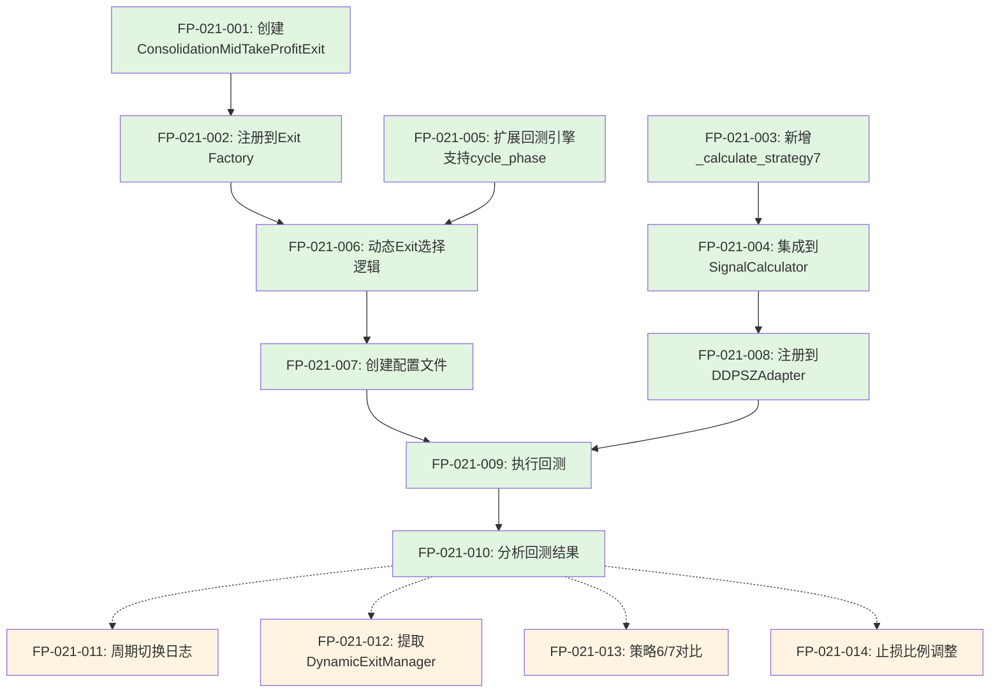

# 功能点清单 - 策略7：动态周期自适应策略

**迭代编号**: 021
**策略编号**: 策略7
**文档版本**: v1.0.0
**创建日期**: 2026-01-07
**状态**: P1 - 需求定义+澄清完成

---

## 一、功能点概览

本文档列出策略7（动态周期自适应策略）的所有功能点，按照实现优先级和依赖关系组织。

**核心价值**：根据市场周期实时变化，动态调整卖出策略，相比策略6的静态P95止盈，提供更灵活的风险收益管理。

**MVP功能点总数**：14个（10个P0核心功能 + 4个P1推迟功能）

**预计工作量**：
- P0核心功能：约10小时
- P1推迟功能：约3小时

---

## 二、功能点清单（按实现顺序）

### 阶段1：基础组件开发（P0）

#### FP-021-001: 创建ConsolidationMidTakeProfitExit类
**优先级**: P0
**类型**: 新建组件
**预计工时**: 1小时

**功能描述**：
实现上涨期止盈Exit Condition，检查`kline['high'] >= (P95 + inertia_mid) / 2`时触发止盈。

**验收标准**：
- [ ] 继承IExitCondition接口
- [ ] check方法实现：
  - 获取indicators中的p95和inertia_mid
  - 计算threshold = (p95 + inertia_mid) / 2
  - 检查kline['high'] >= threshold
  - 返回ExitSignal，price使用kline['close']
- [ ] get_priority返回5（与EmaReversionExit一致）
- [ ] 包含完整的文档注释和类型注解

**依赖关系**：无

**技术要点**：
- 文件路径：`strategy_adapter/exits/consolidation_mid_take_profit.py`
- 参数验证：确保p95和inertia_mid存在且非NaN
- 价格精度：使用Decimal类型

---

#### FP-021-002: 注册ConsolidationMidTakeProfitExit到Exit Factory
**优先级**: P0
**类型**: 扩展现有
**预计工时**: 0.5小时

**功能描述**：
在exit condition factory中注册新的exit类型`consolidation_mid_take_profit`。

**验收标准**：
- [ ] 在`strategy_adapter/exits/__init__.py`中导入ConsolidationMidTakeProfitExit
- [ ] 在exit_factory中添加`consolidation_mid_take_profit`类型映射
- [ ] 支持从配置文件中使用该类型

**依赖关系**：FP-021-001

**技术要点**：
- 类型名称：`consolidation_mid_take_profit`
- 遵循现有factory pattern

---

### 阶段2：信号生成逻辑（P0）

#### FP-021-003: 新增_calculate_strategy7方法
**优先级**: P0
**类型**: 扩展现有
**预计工时**: 1.5小时

**功能描述**：
在SignalCalculator中新增策略7的买入信号计算方法，检查`low <= P5`（无周期前置条件）。

**验收标准**：
- [ ] 方法签名：`_calculate_strategy7(kline, p5) -> Dict[str, Any]`
- [ ] 触发条件：`kline['low'] <= P5`
- [ ] 无周期前置条件（与策略6的区别）
- [ ] 返回格式与其他策略方法一致
- [ ] 包含reason和details字段
- [ ] 包含完整的文档注释

**依赖关系**：无

**技术要点**：
- 文件路径：`ddps_z/calculators/signal_calculator.py`
- 买入价格：使用kline['close']
- 跳过NaN值处理

**实现示例**：
```python
def _calculate_strategy7(
    self,
    kline: Dict,
    p5: float
) -> Dict[str, Any]:
    """
    计算策略7: 动态周期自适应策略买入信号

    触发条件:
        - K线low <= P5（无周期前置条件）
    """
    low = float(kline['low'])
    close = float(kline['close'])

    # 跳过无效数据
    if np.isnan(p5):
        return {
            'id': 'strategy_7',
            'name': '动态周期自适应',
            'triggered': False,
        }

    # 判断触发条件
    if low <= p5:
        return {
            'id': 'strategy_7',
            'name': '动态周期自适应',
            'triggered': True,
            'reason': f"价格触及P5支撑位 (${p5:,.2f})",
            'details': {
                'p5': p5,
                'current_low': low,
                'buy_price': close,
            }
        }

    return {
        'id': 'strategy_7',
        'name': '动态周期自适应',
        'triggered': False,
    }
```

---

#### FP-021-004: 集成策略7到SignalCalculator.calculate()
**优先级**: P0
**类型**: 扩展现有
**预计工时**: 1小时

**功能描述**：
在SignalCalculator.calculate()主循环中，集成策略7的信号生成逻辑。

**验收标准**：
- [ ] 在enabled_strategies包含7时，调用_calculate_strategy7
- [ ] 与其他策略的信号生成逻辑并行
- [ ] 支持策略7的long_signals输出
- [ ] 添加debug日志记录

**依赖关系**：FP-021-003

**技术要点**：
- 参考策略6的集成方式
- 确保信号格式一致

---

### 阶段3：动态Exit Condition支持（P0）

#### FP-021-005: 扩展回测引擎支持cycle_phase传递
**优先级**: P0
**类型**: 扩展现有
**预计工时**: 2小时

**功能描述**：
扩展回测引擎，在每根K线处理时，将当前cycle_phase传递到Exit Condition的check方法。

**验收标准**：
- [ ] 在BacktestEngine中计算cycle_phases（复用BetaCycleCalculator）
- [ ] 在check_exit_conditions时传递当前cycle_phase
- [ ] 修改IExitCondition接口，check方法支持cycle_phase参数（可选参数）
- [ ] 保持向后兼容：现有Exit Condition不受影响

**依赖关系**：无

**技术要点**：
- 文件路径：`strategy_adapter/core/backtest_engine.py`
- cycle_phases计算：在预处理阶段完成，避免重复计算
- 接口兼容性：使用可选参数`cycle_phase: Optional[str] = None`

**实现要点**：
```python
# 在BacktestEngine.run()中
cycle_phases = self._calculate_cycle_phases(klines, indicators)

# 在每根K线处理时
current_cycle_phase = cycle_phases[i] if i < len(cycle_phases) else None

# 传递给Exit Condition
for exit_condition in exit_conditions:
    signal = exit_condition.check(
        order=order,
        kline=kline,
        indicators=indicators,
        current_timestamp=timestamp,
        cycle_phase=current_cycle_phase  # 新增参数
    )
```

---

#### FP-021-006: 实现动态Exit Condition选择逻辑
**优先级**: P0
**类型**: 扩展现有
**预计工时**: 2小时

**功能描述**：
根据当前cycle_phase，动态选择对应的Exit Condition组合进行检查。

**验收标准**：
- [ ] 震荡期：使用P95TakeProfitExit + StopLossExit
- [ ] 下跌期：使用EmaReversionExit + StopLossExit
- [ ] 上涨期：使用ConsolidationMidTakeProfitExit + StopLossExit
- [ ] 按照priority顺序检查Exit Condition
- [ ] 添加周期切换日志（debug级别）

**依赖关系**：FP-021-001, FP-021-002, FP-021-005

**技术要点**：
- 实现位置：可在BacktestEngine中直接实现，或提取为独立的DynamicExitManager
- 优先级排序：确保止盈优先于止损

**实现方案A（推荐 - 在BacktestEngine中直接实现）**：
```python
def _get_exit_conditions(self, cycle_phase: str, base_exit_configs: List[Dict]):
    """根据周期状态动态选择Exit Condition"""
    if cycle_phase == 'consolidation':
        return [
            P95TakeProfitExit(),
            StopLossExit(percentage=5)
        ]
    elif cycle_phase in ['bear_warning', 'bear_strong']:
        return [
            EmaReversionExit(ema_period=25),
            StopLossExit(percentage=5)
        ]
    elif cycle_phase in ['bull_warning', 'bull_strong']:
        return [
            ConsolidationMidTakeProfitExit(),
            StopLossExit(percentage=5)
        ]
    else:
        # 默认使用止损
        return [StopLossExit(percentage=5)]
```

---

### 阶段4：策略配置与回测（P0）

#### FP-021-007: 创建strategy7配置文件
**优先级**: P0
**类型**: 新建配置
**预计工时**: 0.5小时

**功能描述**：
创建策略7的JSON配置文件，定义回测参数和Exit Condition配置。

**验收标准**：
- [ ] 文件路径：`strategy_adapter/configs/strategy7_adaptive_exit.json`
- [ ] 包含backtest_config：symbol, interval, start_date, end_date等
- [ ] 包含capital_management：初始资金、仓位管理等
- [ ] 包含strategy配置：启用策略7，定义Exit Condition
- [ ] Exit Condition支持动态配置（通过特殊标记表示动态逻辑）

**依赖关系**：FP-021-001, FP-021-002

**配置示例**：
```json
{
  "project_name": "策略7-动态周期自适应",
  "description": "根据市场周期实时切换止盈策略：震荡期P95止盈、下跌期EMA25回归、上涨期Mid止盈",
  "version": "1.0",
  "created_at": "2026-01-07",
  "iteration": "021",

  "backtest_config": {
    "symbol": "ETHUSDT",
    "interval": "4h",
    "market_type": "futures",
    "start_date": "2025-01-01",
    "end_date": "2026-01-07",
    "initial_cash": 10000,
    "commission_rate": 0.001
  },

  "capital_management": {
    "mode": "shared",
    "position_size_mode": "fixed",
    "position_size": 100,
    "max_positions": 10
  },

  "strategies": [
    {
      "id": "strategy_7",
      "name": "动态周期自适应",
      "type": "ddps-z",
      "enabled": true,
      "entry": {
        "strategy_id": 7,
        "description": "价格触及P5支撑位（任意周期）"
      },
      "exits": [
        {
          "type": "dynamic",
          "description": "根据周期动态选择Exit Condition",
          "consolidation": [
            {"type": "p95_take_profit", "params": {}},
            {"type": "stop_loss", "params": {"percentage": 5}}
          ],
          "bear": [
            {"type": "ema_reversion", "params": {"ema_period": 25}},
            {"type": "stop_loss", "params": {"percentage": 5}}
          ],
          "bull": [
            {"type": "consolidation_mid_take_profit", "params": {}},
            {"type": "stop_loss", "params": {"percentage": 5}}
          ]
        }
      ]
    }
  ]
}
```

---

#### FP-021-008: 注册策略7到DDPSZAdapter
**优先级**: P0
**类型**: 扩展现有
**预计工时**: 0.5小时

**功能描述**：
在DDPSZAdapter中添加对策略7的支持，允许策略7生成买入信号。

**验收标准**：
- [ ] 修改generate_buy_signals的guard clause，允许策略7通过
- [ ] 修改long_strategies过滤逻辑，包含策略7
- [ ] 添加策略7到文档注释

**依赖关系**：FP-021-004

**技术要点**：
- 文件路径：`strategy_adapter/adapters/ddpsz_adapter.py`
- 修改位置：Line 172（guard clause）、Line 204（策略过滤）

**修改示例**：
```python
# Line 172
if not any(s in self.enabled_strategies for s in [1, 2, 6, 7]):
    logger.debug(f"未启用做多策略(1,2,6,7)，跳过买入信号生成")
    return []

# Line 204
long_strategies = [s for s in self.enabled_strategies if s in [1, 2, 6, 7]]
```

---

#### FP-021-009: 执行策略7回测
**优先级**: P0
**类型**: 验证测试
**预计工时**: 1小时

**功能描述**：
执行策略7的历史回测，验证策略逻辑正确性和效果。

**验收标准**：
- [ ] 运行命令：`python manage.py run_strategy_backtest --config strategy7_adaptive_exit.json --save-to-db`
- [ ] 回测成功完成，无错误
- [ ] 生成买入信号（数量 > 0）
- [ ] 订单成功平仓
- [ ] 统计各周期下的订单分布
- [ ] 结果保存到数据库

**依赖关系**：FP-021-001~FP-021-008

**验证指标**：
- 总订单数 > 0
- 震荡期订单数
- 下跌期订单数
- 上涨期订单数
- 胜率
- 收益率

---

#### FP-021-010: 分析回测结果
**优先级**: P0
**类型**: 分析报告
**预计工时**: 1小时

**功能描述**：
分析回测结果，评估策略7的表现，特别是不同周期下的止盈效果。

**验收标准**：
- [ ] 整体统计：总订单数、胜率、收益率
- [ ] 周期分布：各周期下的订单数量和胜率
- [ ] 止盈方式分布：P95止盈、EMA回归、Mid止盈、止损的触发次数
- [ ] 与策略6对比：信号数量、收益率、胜率的差异

**依赖关系**：FP-021-009

**分析维度**：
1. **周期分布**：买入时周期 vs 卖出时周期（如果周期切换）
2. **止盈效果**：各种止盈方式的平均盈利率
3. **周期适应性**：策略在不同周期下的表现差异

---

### 阶段5：推迟功能（P1）

#### FP-021-011: 周期切换日志记录
**优先级**: P1（推迟）
**类型**: 增强功能
**预计工时**: 0.5小时

**功能描述**：
在持仓期间，记录周期状态的变化，便于分析周期切换对策略的影响。

**推迟理由**：不影响策略核心逻辑，可在验证阶段补充

**实现要点**：
- 在订单metadata中记录entry_cycle_phase
- 在每次检查Exit Condition时，记录current_cycle_phase
- 如果周期切换，记录日志

---

#### FP-021-012: 提取DynamicExitManager类
**优先级**: P1（推迟）
**类型**: 重构优化
**预计工时**: 1.5小时

**功能描述**：
将动态Exit Condition选择逻辑提取为独立的DynamicExitManager类，提高代码复用性。

**推迟理由**：MVP可以在回测引擎中直接实现，后续优化时再提取

**实现要点**：
- 创建`strategy_adapter/exits/dynamic_exit_manager.py`
- 封装周期判断和Exit Condition选择逻辑
- 支持配置驱动

---

#### FP-021-013: 策略6与策略7对比分析
**优先级**: P1（推迟）
**类型**: 分析报告
**预计工时**: 0.5小时

**功能描述**：
详细对比策略6（静态P95止盈）与策略7（动态周期自适应）的表现差异。

**推迟理由**：先验证策略7本身有效性，再进行对比分析

**对比维度**：
- 信号数量差异（策略7无周期限制，信号更多）
- 收益率对比
- 胜率对比
- 最大回撤对比
- 各周期下的表现对比

---

#### FP-021-014: 止损比例动态调整
**优先级**: P1（推迟）
**类型**: 增强功能
**预计工时**: 0.5小时

**功能描述**：
根据不同周期，使用不同的止损比例（例如：震荡期5%、下跌期3%、上涨期7%）。

**推迟理由**：MVP统一使用5%止损，参数调优可后续优化

---

## 三、功能点依赖关系图



**图例**：
- 绿色：P0核心功能（MVP必须完成）
- 黄色：P1推迟功能（后续优化）
- 实线：强依赖关系
- 虚线：弱依赖关系

---

## 四、实施建议

### 4.1 实施顺序

**第1天**：基础组件开发
- FP-021-001: 创建ConsolidationMidTakeProfitExit（1h）
- FP-021-002: 注册到Exit Factory（0.5h）
- FP-021-003: 新增_calculate_strategy7（1.5h）
- FP-021-004: 集成到SignalCalculator（1h）

**第2天**：动态Exit支持
- FP-021-005: 扩展回测引擎支持cycle_phase（2h）
- FP-021-006: 实现动态Exit选择逻辑（2h）

**第3天**：配置、回测与分析
- FP-021-007: 创建配置文件（0.5h）
- FP-021-008: 注册到DDPSZAdapter（0.5h）
- FP-021-009: 执行回测（1h）
- FP-021-010: 分析回测结果（1h）

**总计**：约10小时（P0功能）

### 4.2 风险与挑战

**技术风险**：
1. **回测引擎扩展复杂度**：需要确保cycle_phase传递不影响现有策略
   - 缓解措施：使用可选参数，保持向后兼容
2. **周期频繁切换**：可能导致策略不稳定
   - 缓解措施：通过回测验证，必要时添加周期切换阈值

**业务风险**：
1. **信号数量激增**：无周期限制可能导致信号过多
   - 缓解措施：通过回测评估，必要时调整P5阈值或添加过滤条件
2. **动态卖出效果不佳**：可能不如静态P95止盈
   - 缓解措施：与策略6对比分析，评估动态策略的价值

### 4.3 质量保证

**单元测试**：
- ConsolidationMidTakeProfitExit的check方法
- _calculate_strategy7的触发逻辑
- 动态Exit选择逻辑的周期判断

**集成测试**：
- 策略7的完整回测流程
- 周期切换时Exit Condition的正确切换
- 各周期下止盈逻辑的正确执行

**回归测试**：
- 确保策略1-6的回测结果不受影响
- 验证现有Exit Condition仍正常工作

---

## 五、进度跟踪

| 功能点ID | 功能点名称 | 优先级 | 状态 | 实际工时 | 备注 |
|---------|----------|--------|------|---------|------|
| FP-021-001 | 创建ConsolidationMidTakeProfitExit | P0 | 未开始 | - | - |
| FP-021-002 | 注册到Exit Factory | P0 | 未开始 | - | - |
| FP-021-003 | 新增_calculate_strategy7 | P0 | 未开始 | - | - |
| FP-021-004 | 集成到SignalCalculator | P0 | 未开始 | - | - |
| FP-021-005 | 扩展回测引擎支持cycle_phase | P0 | 未开始 | - | - |
| FP-021-006 | 实现动态Exit选择逻辑 | P0 | 未开始 | - | - |
| FP-021-007 | 创建配置文件 | P0 | 未开始 | - | - |
| FP-021-008 | 注册到DDPSZAdapter | P0 | 未开始 | - | - |
| FP-021-009 | 执行回测 | P0 | 未开始 | - | - |
| FP-021-010 | 分析回测结果 | P0 | 未开始 | - | - |
| FP-021-011 | 周期切换日志 | P1 | 推迟 | - | 后续优化 |
| FP-021-012 | 提取DynamicExitManager | P1 | 推迟 | - | 后续优化 |
| FP-021-013 | 策略6/7对比分析 | P1 | 推迟 | - | 回测完成后 |
| FP-021-014 | 止损比例调整 | P1 | 推迟 | - | 参数调优阶段 |

---

## 六、总结

策略7（动态周期自适应策略）是对策略6的重要增强，核心价值在于：

1. **全周期覆盖**：买入不受周期限制，捕捉更多交易机会
2. **动态止盈**：根据市场周期实时切换最优止盈策略
3. **风险控制**：每个周期都有对应的止损保护

MVP实施预计3天（10小时），重点是：
- 新建ConsolidationMidTakeProfitExit（上涨期止盈）
- 扩展回测引擎支持cycle_phase传递
- 实现动态Exit Condition选择逻辑

通过回测验证策略有效性后，可进一步优化参数和提取通用组件。

---

**文档状态**: ✅ 功能点清单完成
**下一步**: 开始实施FP-021-001（创建ConsolidationMidTakeProfitExit）
