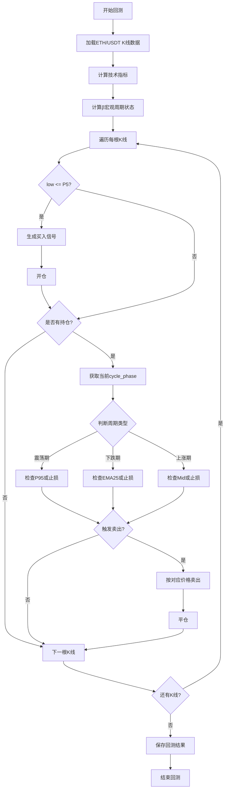

# 产品需求文档 (PRD) - 策略7：动态周期自适应策略

**项目名称**: DDPS-Z量化交易系统
**迭代编号**: 021
**策略编号**: 策略7
**文档版本**: v1.0.0
**创建日期**: 2026-01-07
**生命周期阶段**: P1 - 需求定义+澄清

---

## 第一部分：需求原始输入

### 1.1 需求背景

在策略6（震荡区间突破策略）的基础上，用户希望开发一个更智能的策略，能够根据市场周期的实时变化，动态调整卖出策略。策略6仅适用于震荡期，而策略7旨在覆盖全周期场景，在不同市场阶段采用最优的止盈逻辑。

### 1.2 用户原始描述

```
Good，现在我需要实现策略7:

买入：kline['low'] <= P5

卖出策略：
震荡期间：
P95止盈 或 5%止损（5%可设置）

下跌期间：
Ema25止盈，或5%止损（5%可设置）

上涨期间：
high >= (p95+mid)/2 止盈，或5%止损

请实现此策略并建立配置文件，回测2025-01-01至今的eth/usdt交易对。
```

### 1.3 核心目标

- **主要目标**：实现全周期覆盖的动态自适应策略，根据市场周期实时切换最优止盈逻辑
- **次要目标**：对比验证动态卖出策略相比静态策略（策略6）的优势
- **验证目标**：通过2025年ETH/USDT历史数据验证策略有效性

### 1.4 验收标准

1. ✅ 买入触发条件：K线最低价触及P5阈值（任意周期）
2. ✅ 震荡期卖出：K线最高价触及P95阈值，使用收盘价成交；或亏损达到-5%止损
3. ✅ 下跌期卖出：K线触及EMA25（low <= EMA25 <= high），使用EMA价格成交；或-5%止损
4. ✅ 上涨期卖出：K线最高价触及`(P95+inertia_mid)/2`阈值，使用收盘价成交；或-5%止损
5. ✅ 周期判断：持仓期间每根K线实时获取cycle_phase，动态切换卖出条件
6. ✅ 回测时间范围：2025-01-01 至 2026-01-07
7. ✅ 回测交易对：ETH/USDT
8. ✅ 回测结果可保存到数据库并通过Web界面查看

---

## 第二部分：功能规格框架

### 模块一：功能定义与拆解

#### 2.1 买入信号生成

**功能描述**：
监控K线最低价是否触及P5阈值，无周期前置条件，任意市场阶段均可触发买入。

**触发条件**：
- 主条件：`kline['low'] <= P5`
- 无周期前置条件（与策略6的区别）

**成交价格**：
- 使用K线收盘价（`kline['close']`）作为买入成交价

**业务规则**：
- P5阈值来自现有的偏离率百分位数计算
- 每根K线仅生成一次买入信号（如果满足条件）
- 买入信号包含时间戳、K线索引、成交价格等信息

**用户故事**：
> 作为交易策略，当价格触及P5支撑位时（无论当前市场周期），我需要生成买入信号，以便在低位建仓，然后根据市场周期动态调整卖出策略。

**与策略6的对比**：
- **策略6**：仅震荡期买入（`consolidation AND low <= P5`）
- **策略7**：任意周期买入（`low <= P5`）
- **差异原因**：策略7通过动态卖出保护，可以覆盖更多交易机会

#### 2.2 周期状态实时追踪

**功能描述**：
持仓期间，每根K线实时获取当前市场周期状态（consolidation/bull/bear），作为动态选择卖出条件的依据。

**周期分类**：
- **震荡期**：`consolidation`
- **上涨期**：`bull_warning`, `bull_strong`
- **下跌期**：`bear_warning`, `bear_strong`

**技术实现**：
- 复用BetaCycleCalculator，逐K线计算cycle_phase
- 在回测引擎中传递当前cycle_phase到Exit Condition检查逻辑

**业务规则**：
- 实时获取，而非买入时固定
- 周期状态可在持仓期间动态变化
- 每次卖出条件检查时使用最新的cycle_phase

**用户故事**：
> 作为交易订单，我需要实时知道当前市场处于什么周期阶段，以便选择最合适的卖出策略。如果市场从震荡期进入上涨期，我应该立即切换到上涨期止盈逻辑。

#### 2.3 震荡期卖出策略

**功能描述**：
当持仓期间市场处于震荡期（`consolidation`）时，使用P95目标位止盈或5%止损。

**触发条件**：
- 周期状态：`cycle_phase == 'consolidation'`
- 止盈条件：`kline['high'] >= P95`
- 止损条件：亏损率 >= 5%

**成交价格**：
- P95止盈：使用K线收盘价（`kline['close']`）
- 止损：使用K线收盘价（`kline['close']`）

**业务规则**：
- 复用P95TakeProfitExit（priority=9）
- 复用StopLossExit（percentage=5, priority=10）
- P95止盈优先级高于止损

**用户故事**：
> 作为持仓订单，当市场处于震荡期时，我的目标是捕捉震荡区间收益，因此应该在价格触及P95压力位时止盈，或在亏损达到5%时止损。

#### 2.4 下跌期卖出策略

**功能描述**：
当持仓期间市场处于下跌期（`bear_warning`, `bear_strong`）时，使用EMA25回归止盈或5%止损。

**触发条件**：
- 周期状态：`cycle_phase in ['bear_warning', 'bear_strong']`
- 止盈条件：`kline['low'] <= EMA25 <= kline['high']`
- 止损条件：亏损率 >= 5%

**成交价格**：
- EMA25回归止盈：使用EMA25值
- 止损：使用K线收盘价（`kline['close']`）

**业务规则**：
- 复用EmaReversionExit（ema_period=25, priority=5）
- 复用StopLossExit（percentage=5, priority=10）
- EMA25回归优先级高于止损

**用户故事**：
> 作为持仓订单，当市场进入下跌期时，我需要快速止盈离场，避免下跌趋势导致的亏损。EMA25回归是下跌期的合理止盈点，能够及时锁定收益。

#### 2.5 上涨期卖出策略

**功能描述**：
当持仓期间市场处于上涨期（`bull_warning`, `bull_strong`）时，使用`(P95+inertia_mid)/2`中值止盈或5%止损。

**触发条件**：
- 周期状态：`cycle_phase in ['bull_warning', 'bull_strong']`
- 止盈条件：`kline['high'] >= (P95 + inertia_mid) / 2`
- 止损条件：亏损率 >= 5%

**成交价格**：
- 中值止盈：使用K线收盘价（`kline['close']`）
- 止损：使用K线收盘价（`kline['close']`）

**业务规则**：
- 新建ConsolidationMidTakeProfitExit（priority=5）
- 复用StopLossExit（percentage=5, priority=10）
- 中值止盈优先级高于止损

**用户故事**：
> 作为持仓订单，当市场进入上涨期时，我希望享受上涨趋势的收益，因此止盈点应该设置得相对较高（P95与inertia_mid的中值），在趋势末期及时止盈。

#### 2.6 动态Exit Condition管理

**功能描述**：
根据当前市场周期状态，动态选择并应用对应的Exit Condition组合。

**实现逻辑**：
```python
# 伪代码
if current_cycle_phase == 'consolidation':
    exit_conditions = [
        P95TakeProfitExit(priority=9),
        StopLossExit(percentage=5, priority=10)
    ]
elif current_cycle_phase in ['bear_warning', 'bear_strong']:
    exit_conditions = [
        EmaReversionExit(ema_period=25, priority=5),
        StopLossExit(percentage=5, priority=10)
    ]
elif current_cycle_phase in ['bull_warning', 'bull_strong']:
    exit_conditions = [
        ConsolidationMidTakeProfitExit(priority=5),
        StopLossExit(percentage=5, priority=10)
    ]
```

**技术挑战**：
- 需要扩展回测引擎，支持在每根K线传递cycle_phase到Exit Condition
- 需要确保Exit Condition优先级正确执行

**用户故事**：
> 作为策略执行引擎，我需要根据市场周期的实时变化，灵活切换卖出条件，确保在不同市场环境下都能使用最优的止盈策略。

#### 2.7 策略配置管理

**功能描述**：
提供JSON配置文件，定义策略参数、出场条件、回测设置等。

**配置内容**：
- 策略ID和名称
- 启用的策略编号（仅策略7）
- 出场条件配置（动态Exit Condition组合）
- 回测参数（初始资金、手续费、滑点等）
- 数据源配置（交易对、时间范围、K线周期）

**配置文件路径**：
- `strategy_adapter/configs/strategy7_adaptive_exit.json`

**用户故事**：
> 作为开发者，我需要通过配置文件灵活调整策略参数和回测设置，而无需修改代码。

#### 2.8 回测验证

**功能描述**：
使用策略适配器系统对策略7进行历史数据回测，评估动态卖出策略的表现。

**回测参数**：
- 交易对：ETH/USDT
- 时间范围：2025-01-01 00:00:00 至 2026-01-07 23:59:59
- K线周期：4小时
- 初始资金：10000 USDT
- 手续费率：0.1%
- 滑点：0.05%

**回测指标**：
- 信号数量（买入信号总数）
- 已平仓订单数量
- 胜率（盈利订单数 / 总订单数）
- 平均盈亏率
- 最大盈利/最大亏损
- 最终权益
- 总收益率
- **周期分布统计**：各周期下的订单数量和表现

**用户故事**：
> 作为产品经理，我需要看到策略7在2025年ETH行情中的回测表现，特别是动态卖出策略在不同市场周期下的表现差异，以评估策略是否值得实盘应用。

### 模块二：交互流程与规则

#### 2.9 策略执行流程



#### 2.10 信号生成规则

**买入信号生成**：
1. 主条件检查：`kline['low'] <= P5`
2. 无周期前置条件，任意周期均可触发
3. 生成买入信号
4. 信号包含：timestamp, kline_index, price, direction='long', strategy='strategy_7'

**卖出信号生成**（动态逻辑）：
1. 检查是否有持仓订单
2. 获取当前K线的`cycle_phase`
3. 根据周期状态选择Exit Condition：
   - **震荡期**：检查P95止盈 或 5%止损
   - **下跌期**：检查EMA25回归 或 5%止损
   - **上涨期**：检查Mid止盈 或 5%止损
4. 按照Exit Condition优先级依次检查
5. 任一条件满足时，生成卖出信号并平仓

**订单管理规则**：
- 同一时刻只持有一个订单
- 订单包含：open_price, open_time, direction, quantity, strategy_id
- 平仓后计算盈亏并记录

### 模块三：范围边界

#### In-Scope（包含范围）

✅ **核心功能**：
- 买入信号生成（P5触发，无周期限制）
- 周期状态实时追踪（逐K线获取cycle_phase）
- 动态卖出条件选择（根据周期切换Exit Condition）
- 震荡期卖出（P95止盈 + 5%止损）
- 下跌期卖出（EMA25回归 + 5%止损）
- 上涨期卖出（Mid止盈 + 5%止损）
- 策略配置文件
- 回测验证（ETH/USDT 2025-01-01至今）

✅ **复用现有组件**：
- BetaCycleCalculator：周期状态识别
- P5/P95计算：买入/卖出阈值
- P95TakeProfitExit：震荡期止盈
- EmaReversionExit：下跌期止盈
- StopLossExit：全周期止损
- InertiaCalculator：上涨期mid值计算
- Backtest系统：回测执行和结果保存

✅ **新增组件**：
- ConsolidationMidTakeProfitExit：上涨期止盈
- DynamicExitManager（可选）：动态Exit Condition管理

✅ **文档和配置**：
- PRD文档
- 功能点清单
- 策略配置JSON
- 回测结果报告

#### Out-of-Scope（不包含范围）

❌ **延期功能**：
- 止损比例的动态调整（不同周期使用不同止损比例）
- 多时间周期联合判断
- 仓位管理和资金分配优化
- 实盘交易集成
- 其他交易对的回测验证
- Web界面的策略配置功能

❌ **明确排除**：
- 策略6与策略7的组合运行（买入逻辑相同，会产生信号冲突）
- 买入条件的周期限制（已决策为无限制）
- 买入时固定周期状态（已决策为实时获取）

---

## 第三部分：AI分析与建议

### 3.1 现有能力分析报告

#### 现有功能清单

| 功能名称 | 模块 | 与新需求关联 | 复用可能性 | 备注 |
|---------|------|-------------|-----------|------|
| P5支撑位检测 | DeviationRateCalculator | 买入触发 | 高 - 直接复用 | `kline['low'] <= P5` |
| β宏观周期识别 | BetaCycleCalculator | 周期判断 | 高 - 直接复用 | 逐K线计算cycle_phase |
| P95止盈 | P95TakeProfitExit | 震荡期卖出 | 高 - 直接复用 | 刚实现的exit condition |
| EMA25回归止盈 | EmaReversionExit | 下跌期卖出 | 高 - 直接复用 | 已存在，priority=5 |
| 5%止损 | StopLossExit | 全周期止损 | 高 - 直接复用 | Bug-024已修复 |
| inertia_mid计算 | InertiaCalculator | 上涨期止盈阈值 | 高 - 直接复用 | 策略2/4/6已使用 |
| SignalCalculator框架 | SignalCalculator | 策略集成 | 高 - 扩展复用 | 新增_calculate_strategy7方法 |
| 回测系统 | BacktestEngine | 策略验证 | 高 - 直接复用 | 已支持配置化回测 |

#### 复用建议

**可直接复用（无需修改）**：
- BetaCycleCalculator：用于逐K线计算cycle_phase
- P5计算逻辑：用于买入阈值
- P95TakeProfitExit：用于震荡期止盈
- EmaReversionExit(25)：用于下跌期止盈
- StopLossExit(5)：用于全周期止损
- InertiaCalculator：用于上涨期mid值
- 回测系统：用于策略验证和结果保存

**可扩展复用**：
- SignalCalculator：新增`_calculate_strategy7`方法，检查`low <= P5`（无周期前置条件）
- 回测引擎：需要扩展以支持在每根K线传递cycle_phase到Exit Condition

**需全新开发**：
- ConsolidationMidTakeProfitExit：上涨期止盈逻辑
  ```python
  threshold = (P95 + inertia_mid) / 2
  if kline['high'] >= threshold:
      return ExitSignal(price=kline['close'], ...)
  ```
- DynamicExitManager（可选）：根据cycle_phase动态选择Exit Condition组合

#### 一致性建议

**风格参考**：
- 信号计算方法命名：`_calculate_strategy7`
- 配置文件命名：`strategy7_adaptive_exit.json`
- Exit Condition命名：`ConsolidationMidTakeProfitExit`
- 返回值结构：遵循现有策略的格式

**交互模式**：
- 买入触发：与策略1-6保持一致的判断逻辑
- 动态卖出：扩展现有Exit Condition框架，支持cycle_phase参数传递

**注意事项**：
- **与策略6的冲突**：策略7买入逻辑更宽松（无周期限制），信号会包含策略6的所有信号，因此两者不应同时运行
- **周期状态传递**：需要在回测引擎中扩展，确保cycle_phase能传递到Exit Condition的check方法

#### 集成路径建议

**优先集成方式**：
1. 在SignalCalculator中新增`_calculate_strategy7`方法
2. 在回测引擎中扩展，支持传递cycle_phase到Exit Condition
3. 创建ConsolidationMidTakeProfitExit类
4. 在配置文件中定义动态Exit Condition组合

**扩展策略**：
- **方案A（推荐）**：在回测引擎中传递cycle_phase，Exit Condition根据cycle_phase动态判断
- **方案B**：创建DynamicExitManager包装类，管理Exit Condition的动态切换

### 3.2 建议的MVP功能点清单

#### 📊 核心信号逻辑

- **[P0]** 买入信号生成：新增`_calculate_strategy7`方法，检查`low <= P5`（无周期前置条件）
- **[P0]** 周期状态追踪：每根K线实时获取`cycle_phase`状态
- **[P0]** 动态Exit Condition选择：根据当前周期状态选择对应的止盈条件
- **[P1]** 周期切换日志：记录持仓期间周期状态的变化（建议推迟 - 理由：不影响策略核心逻辑，可在验证阶段补充）

#### 🔧 Exit Condition实现

**震荡期卖出**：
- **[P0]** 复用P95TakeProfitExit（priority=9）
- **[P0]** 复用StopLossExit（percentage=5, priority=10）

**下跌期卖出**：
- **[P0]** 复用EmaReversionExit（ema_period=25, priority=5）
- **[P0]** 复用StopLossExit（percentage=5, priority=10）

**上涨期卖出**：
- **[P0]** 新建ConsolidationMidTakeProfitExit（`high >= (P95+mid)/2`, priority=5）
- **[P0]** 复用StopLossExit（percentage=5, priority=10）

#### ⚙️ 策略集成

- **[P0]** SignalCalculator扩展：新增`_calculate_strategy7`方法
- **[P0]** 回测引擎扩展：支持传递cycle_phase到Exit Condition
- **[P0]** 策略配置文件：创建`strategy7_adaptive_exit.json`
- **[P0]** 策略注册：在strategy_factory中注册strategy_7
- **[P1]** Exit Condition包装：创建DynamicExitManager管理动态切换（建议推迟 - 理由：可以在回测引擎中直接实现，后续优化时再提取）

#### 📈 回测验证

- **[P0]** 回测执行：ETH/USDT 2025-01-01至今，4h周期
- **[P0]** 结果保存：`--save-to-db`保存到数据库
- **[P0]** 结果查看：Web界面查看订单和统计指标
- **[P0]** 周期分布统计：统计各周期下的订单数量和表现
- **[P1]** 对比分析：与策略6对比（静态P95 vs 动态周期自适应）（建议推迟 - 理由：先验证策略7本身有效性）

#### 📝 文档交付

- **[P0]** PRD文档：包含需求、功能规格、MVP清单
- **[P0]** 功能点清单：结构化的功能点列表，便于跟踪实现状态
- **[P1]** 回测分析报告：详细分析策略表现和周期分布（建议推迟 - 理由：在回测完成后补充）

### 3.3 最终决策确认

#### 决策点 1：买入触发的周期前置条件
✅ **确认选择**：方案B - 任意周期买入（`low <= P5`）
- 理由：用户明确需求"任何low <= p5时使用close买入"
- 影响：信号数量增加，需要通过动态卖出保护来控制风险

#### 决策点 2：上涨期止盈的mid定义
✅ **确认选择**：方案A - 使用inertia_mid
- 公式：`(P95 + inertia_mid) / 2`
- 理由：与现有策略术语一致，动态跟踪趋势变化

#### 决策点 3：周期状态的判断时机
✅ **确认选择**：方案B - 实时获取周期状态
- 实现：每根K线实时获取`cycle_phase`，动态切换卖出条件
- 理由：符合"动态自适应"策略定位，是核心价值所在

### 3.4 需求澄清会话记录

#### 日期: 2026-01-07

**问题 1**：买入触发是否需要周期前置条件？
**用户答案**：使用方案B，任何`low <= P5`时使用close买入（无周期限制）

**问题 2**：上涨期止盈中的`mid`是什么？
**用户答案**：接受推荐方案A，使用`inertia_mid`

**问题 3**：周期状态的判断时机？
**用户答案**：接受推荐方案B，实时获取周期状态，动态切换卖出条件

### 3.5 覆盖度状态表

| 类别 | 状态 | 备注 |
|------|------|------|
| 功能范围与边界 | Clear ✅ | 动态周期自适应策略，买入P5，卖出根据周期动态调整 |
| 数据模型与实体 | Clear ✅ | 复用现有Order、Signal、BacktestResult模型 |
| 交互与UX流程 | Clear ✅ | 策略执行流程明确，动态切换逻辑清晰 |
| 非功能属性 | Clear ✅ | 性能复用现有回测系统，安全性无特殊要求 |
| 集成与外部依赖 | Clear ✅ | 依赖BetaCycleCalculator、P5/P95、EMA、InertiaCalculator |
| 边界情况与失败处理 | Clear ✅ | 每个周期都有止损保护，周期切换逻辑明确 |
| 约束与权衡 | Clear ✅ | MVP使用现有indicator默认参数，推迟参数优化 |
| 术语一致性 | Clear ✅ | 使用DDPS-Z术语体系（P5/P95/β宏观周期/inertia_mid） |
| 完整性信号 | Clear ✅ | 所有核心功能已定义，MVP范围明确 |
| 待办项/占位符 | Clear ✅ | 决策点已明确，用户已确认选择 |

### 3.6 遗留问题清单

- [ ] **动态Exit Condition实现方式**：MVP在回测引擎中直接实现，后续可提取为DynamicExitManager
- [ ] **周期切换频率统计**：回测完成后分析周期切换对策略表现的影响
- [ ] **与策略6的对比分析**：验证动态卖出相比静态P95的优势
- [ ] **实盘参数调优**：如果策略7表现良好，需进一步优化参数以适配实盘环境

---

## 附录：关键术语表

| 术语 | 定义 |
|------|------|
| **周期状态（cycle_phase）** | β宏观周期状态机定义的市场阶段：consolidation/bull/bear |
| **震荡期（consolidation）** | 市场横盘整理阶段，无明显上涨或下跌趋势 |
| **上涨期（bull）** | bull_warning或bull_strong，市场处于上涨趋势 |
| **下跌期（bear）** | bear_warning或bear_strong，市场处于下跌趋势 |
| **P5阈值** | 偏离率分布的第5百分位数，作为支撑位指标 |
| **P95阈值** | 偏离率分布的第95百分位数，作为压力位指标 |
| **inertia_mid** | 惯性预测中值，基于β斜率预测的未来价格中值 |
| **EMA25回归** | 价格回归到EMA25线，作为趋势反转信号 |
| **动态自适应** | 根据市场周期实时变化，动态调整策略参数或逻辑 |

---

## 修订历史

| 版本 | 日期 | 修订内容 | 修订人 |
|------|------|---------|--------|
| v1.0.0 | 2026-01-07 | 初始版本，完成P1阶段需求定义+澄清 | PowerBy Product Manager |

---

**状态**: ✅ P1阶段完成，等待进入P3-P4架构设计阶段
**下一步**: 直接进入实现阶段（P6），或调用 `powerby-architect` skill 进行技术调研和架构设计
