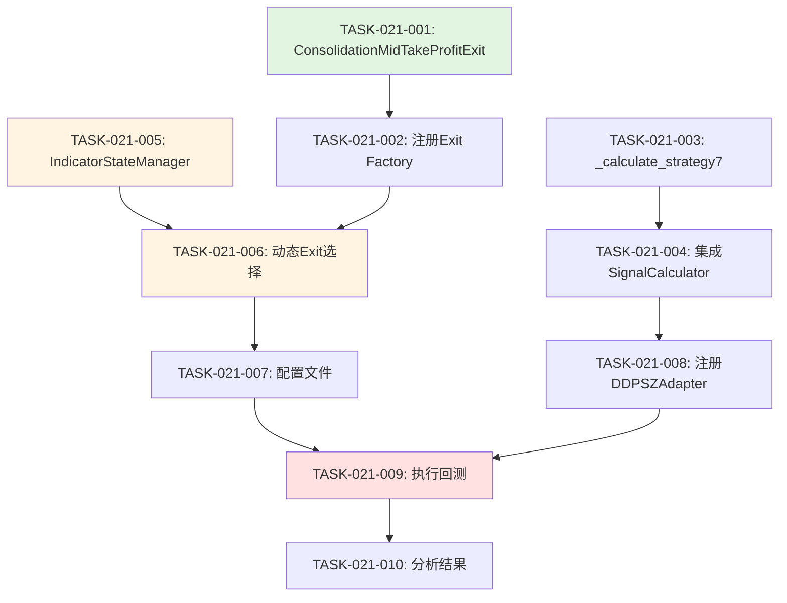

# 开发任务计划 - 策略7：动态周期自适应策略

**迭代编号**: 021
**策略编号**: 策略7
**文档版本**: v1.0.0
**创建日期**: 2026-01-07
**生命周期阶段**: P5 - 开发规划
**关联文档**:
- PRD: `docs/iterations/021-adaptive-exit-strategy/prd.md`
- 架构设计: `docs/iterations/021-adaptive-exit-strategy/architecture.md`
- 功能点清单: `docs/iterations/021-adaptive-exit-strategy/function-points.md`

---

## 任务概览

### 总体目标
实现策略7（动态周期自适应策略）的完整功能，包括：
1. 新增上涨期止盈Exit Condition
2. 扩展SignalCalculator支持策略7买入信号
3. 实现IndicatorStateManager避免未来函数
4. 实现动态Exit选择机制
5. 完成回测验证和结果分析

### 工作量估算
- **总工作量**: 约10小时（P0功能）
- **实施周期**: 4天
- **平均任务数**: 3-4个任务/天

### 任务依赖关系图



---

## 第1天：基础组件开发（4小时）

### TASK-021-001: 创建ConsolidationMidTakeProfitExit类

**功能点**: FP-021-001
**优先级**: P0
**预计工时**: 1小时
**依赖项**: 无

#### 任务描述
实现上涨期止盈Exit Condition，触发条件为`kline['high'] >= (P95 + inertia_mid) / 2`。

#### 实施步骤
1. 创建文件：`strategy_adapter/exits/consolidation_mid_take_profit.py`
2. 实现ConsolidationMidTakeProfitExit类
   - 继承IExitCondition接口
   - 实现check方法
   - 实现get_priority方法（返回5）
3. 添加完整的文档注释和类型注解
4. 实现参数验证和边界检查

#### 验收标准
- [ ] 类实现完整，符合IExitCondition接口
- [ ] check方法逻辑正确：
  - 正确提取p95和inertia_mid
  - 正确计算threshold = (p95 + inertia_mid) / 2
  - 正确判断触发条件：high >= threshold
  - 使用close价格成交
- [ ] get_priority返回5
- [ ] 包含完整文档注释（功能、参数、返回值、异常）
- [ ] 使用Decimal类型处理价格

#### 技术要点
- 参考P95TakeProfitExit的实现模式
- 确保price使用Decimal类型
- 添加KeyError异常处理（缺少必要指标时）
- 添加NaN值检查

#### 代码位置
- 文件：`strategy_adapter/exits/consolidation_mid_take_profit.py`
- 参考：`strategy_adapter/exits/p95_take_profit.py`

---

### TASK-021-002: 注册ConsolidationMidTakeProfitExit到Exit Factory

**功能点**: FP-021-002
**优先级**: P0
**预计工时**: 0.5小时
**依赖项**: TASK-021-001

#### 任务描述
在exit condition factory中注册新的exit类型`consolidation_mid_take_profit`。

#### 实施步骤
1. 修改`strategy_adapter/exits/__init__.py`
   - 导入ConsolidationMidTakeProfitExit
   - 添加到__all__列表
2. 如果存在exit_factory，添加类型映射
3. 更新文档注释

#### 验收标准
- [ ] ConsolidationMidTakeProfitExit已导入
- [ ] 可以通过import正常使用
- [ ] 文档注释已更新

#### 技术要点
- 遵循现有factory pattern
- 类型名称：`consolidation_mid_take_profit`

#### 代码位置
- 文件：`strategy_adapter/exits/__init__.py`

---

### TASK-021-003: 新增_calculate_strategy7方法

**功能点**: FP-021-003
**优先级**: P0
**预计工时**: 1.5小时
**依赖项**: 无

#### 任务描述
在SignalCalculator中新增策略7的买入信号计算方法，检查`low <= P5`（无周期前置条件）。

#### 实施步骤
1. 打开文件：`ddps_z/calculators/signal_calculator.py`
2. 新增`_calculate_strategy7`方法
   - 参数：kline, p5
   - 触发条件：low <= p5（无周期前置条件）
   - 返回格式：与其他策略方法一致
3. 添加完整的文档注释
4. 处理NaN值和边界情况

#### 验收标准
- [ ] 方法签名正确：`_calculate_strategy7(self, kline, p5) -> Dict[str, Any]`
- [ ] 触发逻辑正确：low <= p5
- [ ] 无周期前置条件（与策略6的区别）
- [ ] 返回格式包含：id, name, triggered, reason, details
- [ ] NaN值处理正确
- [ ] 文档注释完整

#### 技术要点
- 参考_calculate_strategy6的实现
- 关键差异：策略6有cycle_phase前置条件，策略7无
- 买入价格使用kline['close']

#### 代码位置
- 文件：`ddps_z/calculators/signal_calculator.py`
- 参考方法：`_calculate_strategy6`（Line 465-520）

---

### TASK-021-004: 集成策略7到SignalCalculator.calculate()

**功能点**: FP-021-004
**优先级**: P0
**预计工时**: 1小时
**依赖项**: TASK-021-003

#### 任务描述
在SignalCalculator.calculate()主循环中，集成策略7的信号生成逻辑。

#### 实施步骤
1. 在calculate()方法中添加策略7判断
   - 检查`7 in enabled_strategies`
   - 调用_calculate_strategy7
2. 更新long_triggered判断逻辑
   - 添加strategy7_result检查
3. 更新strategies列表
   - 添加strategy7_result到列表
4. 添加debug日志记录

#### 验收标准
- [ ] 当7 in enabled_strategies时，调用_calculate_strategy7
- [ ] long_triggered包含strategy7_result判断
- [ ] strategies列表包含strategy7_result
- [ ] 信号格式与其他策略一致
- [ ] 添加debug日志

#### 技术要点
- 参考策略6的集成方式（Line 674-684）
- 确保信号格式一致
- 保持代码结构清晰

#### 代码位置
- 文件：`ddps_z/calculators/signal_calculator.py`
- 修改位置：calculate()方法（Line 522-776）

---

## 第2天：动态Exit支持（4小时）

### TASK-021-005: 创建IndicatorStateManager类

**功能点**: FP-021-005
**优先级**: P0
**预计工时**: 2小时
**依赖项**: 无

#### 任务描述
创建IndicatorStateManager类，实现无状态的指标增量计算，避免未来函数。

#### 实施步骤
1. 创建文件：`strategy_adapter/core/indicator_state_manager.py`
2. 实现IndicatorStateManager类
   - 初始化各Calculator实例
   - 实现calculate_indicators方法
3. 实现增量计算逻辑
   - 提取价格序列
   - 计算EMA25序列
   - 计算P5/P95
   - 计算beta
   - 计算inertia_mid
   - 计算cycle_phase
4. 添加完整的文档注释

#### 验收标准
- [ ] IndicatorStateManager类实现完整
- [ ] calculate_indicators方法正确
  - 输入：historical_klines（完整历史）
  - 输出：当前K线的指标字典
  - 包含：ema25, p5, p95, beta, inertia_mid, cycle_phase
- [ ] 无状态设计：每次从头计算
- [ ] 仅使用历史+当前数据（无未来函数）
- [ ] 文档注释完整

#### 技术要点
- 参考架构文档第2.1节的设计
- 使用现有Calculator：EMA, Deviation, Inertia, BetaCycle
- 确保计算顺序正确（beta依赖EMA，cycle_phase依赖beta）
- 处理NaN值和边界情况

#### 代码位置
- 新文件：`strategy_adapter/core/indicator_state_manager.py`
- 参考：架构文档第2.1节

---

### TASK-021-006: 实现动态Exit Condition选择逻辑

**功能点**: FP-021-006
**优先级**: P0
**预计工时**: 2小时
**依赖项**: TASK-021-001, TASK-021-002, TASK-021-005

#### 任务描述
在BacktestEngine中实现动态Exit Condition选择机制，根据cycle_phase动态选择Exit组合。

#### 实施步骤
1. 打开文件：`strategy_adapter/core/backtest_engine.py`
2. 添加`_get_exit_conditions`方法
   - 参数：cycle_phase
   - 返回：Exit Condition列表
   - 实现3种周期的映射逻辑
3. 修改`_check_exit_conditions`方法
   - 集成IndicatorStateManager
   - 获取当前cycle_phase
   - 调用_get_exit_conditions
   - 按priority检查Exit Condition
4. 添加周期切换日志（debug级别）

#### 验收标准
- [ ] _get_exit_conditions方法实现正确
  - consolidation → P95Exit + StopLoss
  - bear → EMAExit + StopLoss
  - bull → MidExit + StopLoss
  - 未知 → StopLoss
- [ ] Exit Condition按priority排序
- [ ] 集成IndicatorStateManager
- [ ] 添加周期切换日志
- [ ] 保持向后兼容（现有策略不受影响）

#### 技术要点
- 参考架构文档第2.2节的设计
- 内置条件逻辑（非工厂模式）
- 确保priority排序正确（数字越小优先级越高）
- 添加cycle_phase参数传递

#### 代码位置
- 文件：`strategy_adapter/core/backtest_engine.py`
- 新增方法：_get_exit_conditions
- 修改方法：_check_exit_conditions

---

## 第3天：配置、回测与集成（2小时）

### TASK-021-007: 创建strategy7配置文件

**功能点**: FP-021-007
**优先级**: P0
**预计工时**: 0.5小时
**依赖项**: TASK-021-001, TASK-021-002

#### 任务描述
创建策略7的JSON配置文件，定义回测参数和策略配置。

#### 实施步骤
1. 创建文件：`strategy_adapter/configs/strategy7_adaptive_exit.json`
2. 填写配置内容
   - backtest_config：symbol, interval, start_date, end_date
   - capital_management：初始资金、仓位管理
   - strategy配置：启用策略7，定义Exit规则说明
3. 添加注释说明动态Exit逻辑

#### 验收标准
- [ ] 配置文件格式正确（JSON）
- [ ] backtest_config完整
  - symbol: ETHUSDT
  - interval: 4h
  - start_date: 2025-01-01
  - end_date: 2026-01-07
- [ ] strategy配置正确
  - id: strategy_7
  - enabled: true
  - exits字段说明动态规则
- [ ] 包含文档注释

#### 技术要点
- 参考strategy6_consolidation_range.json
- Exit配置仅作文档说明（实际逻辑在BacktestEngine中）

#### 代码位置
- 新文件：`strategy_adapter/configs/strategy7_adaptive_exit.json`
- 参考：`strategy_adapter/configs/strategy6_consolidation_range.json`

---

### TASK-021-008: 注册策略7到DDPSZAdapter

**功能点**: FP-021-008
**优先级**: P0
**预计工时**: 0.5小时
**依赖项**: TASK-021-004

#### 任务描述
在DDPSZAdapter中添加对策略7的支持，允许策略7生成买入信号。

#### 实施步骤
1. 修改`strategy_adapter/adapters/ddpsz_adapter.py`
2. 更新Line 172的guard clause
   - 修改策略列表：[1, 2, 6] → [1, 2, 6, 7]
3. 更新Line 204的策略过滤逻辑
   - 修改long_strategies过滤
4. 更新文档注释
   - 添加策略7说明

#### 验收标准
- [ ] guard clause包含策略7
- [ ] long_strategies过滤包含策略7
- [ ] 文档注释已更新
- [ ] debug日志信息正确

#### 技术要点
- 修改位置明确：Line 172, Line 204
- 保持代码风格一致

#### 代码位置
- 文件：`strategy_adapter/adapters/ddpsz_adapter.py`
- 修改位置：Line 172（guard clause）、Line 204（策略过滤）

---

### TASK-021-009: 执行策略7回测

**功能点**: FP-021-009
**优先级**: P0
**预计工时**: 1小时
**依赖项**: TASK-021-001~TASK-021-008

#### 任务描述
执行策略7的历史回测，验证策略逻辑正确性和效果。

#### 实施步骤
1. 运行回测命令
   ```bash
   python manage.py run_strategy_backtest \
     --config strategy_adapter/configs/strategy7_adaptive_exit.json \
     --save-to-db
   ```
2. 观察回测日志
   - 检查买入信号数量
   - 检查订单平仓情况
   - 检查周期切换日志
3. 验证数据库保存
   - 检查BacktestResult记录
   - 检查Order记录
4. 记录回测结果

#### 验收标准
- [ ] 回测成功完成，无错误
- [ ] 生成买入信号数量 > 0
- [ ] 所有订单已平仓
- [ ] 结果保存到数据库
- [ ] 周期切换日志记录清晰
- [ ] 各周期订单分布统计

#### 技术要点
- 观察日志输出，确认动态Exit逻辑正确
- 检查是否有异常或警告
- 验证订单的平仓价格合理

#### 验证指标
- 总订单数
- 震荡期订单数
- 下跌期订单数
- 上涨期订单数
- 胜率
- 收益率

---

## 第4天：结果分析与验证（1小时）

### TASK-021-010: 分析回测结果

**功能点**: FP-021-010
**优先级**: P0
**预计工时**: 1小时
**依赖项**: TASK-021-009

#### 任务描述
分析回测结果，评估策略7的表现，特别是不同周期下的止盈效果。

#### 实施步骤
1. 查询回测结果数据
   - 使用Django Admin或数据库查询
2. 统计分析
   - 整体统计：总订单数、胜率、收益率
   - 周期分布：各周期订单数量和胜率
   - 止盈方式分布：P95、EMA25、Mid、止损的触发次数
3. 与策略6对比
   - 信号数量对比
   - 收益率对比
   - 胜率对比
4. 撰写分析报告

#### 验收标准
- [ ] 整体统计完成
  - 总订单数
  - 胜率
  - 收益率
  - 最大盈利/最大亏损
- [ ] 周期分布分析完成
  - 各周期订单数量
  - 各周期胜率
- [ ] 止盈方式统计完成
  - P95止盈次数
  - EMA25回归次数
  - Mid止盈次数
  - 止损次数
- [ ] 与策略6对比分析
- [ ] 分析报告撰写完成

#### 技术要点
- 可以编写临时分析脚本
- 使用Django ORM或SQL查询
- 可视化数据（可选）

#### 分析维度
1. **周期分布**：买入时周期 vs 卖出时周期
2. **止盈效果**：各种止盈方式的平均盈利率
3. **周期适应性**：策略在不同周期下的表现差异
4. **与策略6对比**：动态vs静态止盈的效果差异

#### 输出文档
- 可选：`docs/iterations/021-adaptive-exit-strategy/backtest-analysis.md`

---

## 任务进度追踪表

| 任务ID | 任务名称 | 优先级 | 工时 | 依赖 | 状态 | 负责人 | 完成日期 |
|--------|---------|--------|------|------|------|--------|---------|
| TASK-021-001 | ConsolidationMidTakeProfitExit | P0 | 1h | 无 | 未开始 | - | - |
| TASK-021-002 | 注册Exit Factory | P0 | 0.5h | 001 | 未开始 | - | - |
| TASK-021-003 | _calculate_strategy7 | P0 | 1.5h | 无 | 未开始 | - | - |
| TASK-021-004 | 集成SignalCalculator | P0 | 1h | 003 | 未开始 | - | - |
| TASK-021-005 | IndicatorStateManager | P0 | 2h | 无 | 未开始 | - | - |
| TASK-021-006 | 动态Exit选择 | P0 | 2h | 001,002,005 | 未开始 | - | - |
| TASK-021-007 | 配置文件 | P0 | 0.5h | 001,002 | 未开始 | - | - |
| TASK-021-008 | 注册DDPSZAdapter | P0 | 0.5h | 004 | 未开始 | - | - |
| TASK-021-009 | 执行回测 | P0 | 1h | 001-008 | 未开始 | - | - |
| TASK-021-010 | 分析结果 | P0 | 1h | 009 | 未开始 | - | - |

**总计**: 10小时（P0功能）

---

## 质量保障计划

### 单元测试要求

**每个任务的测试覆盖**：

1. **TASK-021-001**: ConsolidationMidTakeProfitExit单元测试
   - 测试文件：`ddps_z/tests/test_consolidation_mid_take_profit.py`
   - 测试用例：7个（参考架构文档5.1节）

2. **TASK-021-003**: _calculate_strategy7单元测试
   - 测试文件：`ddps_z/tests/test_signal_calculator_strategy7.py`
   - 测试用例：5个

3. **TASK-021-005**: IndicatorStateManager单元测试
   - 测试文件：`strategy_adapter/tests/test_indicator_state_manager.py`
   - 测试用例：5个

4. **TASK-021-006**: 动态Exit选择单元测试
   - 测试文件：`strategy_adapter/tests/test_dynamic_exit_selection.py`
   - 测试用例：5个

### 集成测试要求

**TASK-021-009**: 端到端回测测试
- 策略7完整回测流程
- 生成买入信号数量 > 0
- 所有订单已平仓
- 震荡期订单使用P95止盈
- 下跌期订单使用EMA25回归
- 上涨期订单使用Mid止盈
- 所有订单都有止损保护

### 未来函数验证

**关键验证点**：
- 每根K线的指标值仅依赖历史
- 修改未来K线不影响历史指标
- 逐K线回测 vs 批量回测结果一致

### 回归测试要求

**确保不影响现有策略**：
- 策略1回测结果与历史一致
- 策略2回测结果与历史一致
- 策略6回测结果与历史一致
- 所有现有单元测试通过

---

## 风险与缓解措施

| 风险 | 影响 | 概率 | 缓解措施 | 负责任务 |
|------|------|------|---------|---------|
| IndicatorStateManager性能不佳 | 回测时间过长 | 中 | 1. 先验证正确性<br>2. 性能分析<br>3. 必要时优化 | TASK-021-005 |
| 周期频繁切换 | 策略不稳定 | 中 | 1. 统计周期切换频率<br>2. 添加防抖动机制 | TASK-021-010 |
| 未来函数检测失败 | 回测结果失真 | 低 | 1. 单元测试验证<br>2. 人工审查逻辑 | TASK-021-005 |
| Exit优先级冲突 | 平仓逻辑错误 | 低 | 1. 单元测试覆盖<br>2. 日志验证 | TASK-021-006 |

---

## 实施建议

### 开发顺序优化

**第1天优先级**：
1. TASK-021-001（1h）→ 立即开始，无依赖
2. TASK-021-003（1.5h）→ 与001并行，无依赖
3. TASK-021-002（0.5h）→ 依赖001
4. TASK-021-004（1h）→ 依赖003

**第2天优先级**：
1. TASK-021-005（2h）→ 立即开始，无依赖
2. TASK-021-006（2h）→ 依赖001,002,005

**第3天优先级**：
1. TASK-021-007（0.5h）→ 依赖001,002
2. TASK-021-008（0.5h）→ 依赖004
3. TASK-021-009（1h）→ 依赖001-008

**第4天优先级**：
1. TASK-021-010（1h）→ 依赖009

### 每日检查清单

**第1天结束检查**：
- [ ] ConsolidationMidTakeProfitExit类实现完成
- [ ] _calculate_strategy7方法实现完成
- [ ] 相关单元测试通过
- [ ] 代码已提交

**第2天结束检查**：
- [ ] IndicatorStateManager类实现完成
- [ ] 动态Exit选择逻辑实现完成
- [ ] 单元测试通过
- [ ] 无未来函数（手工验证）
- [ ] 代码已提交

**第3天结束检查**：
- [ ] 配置文件创建完成
- [ ] DDPSZAdapter集成完成
- [ ] 回测成功执行
- [ ] 结果保存到数据库
- [ ] 代码已提交

**第4天结束检查**：
- [ ] 回测结果分析完成
- [ ] 与策略6对比分析完成
- [ ] 所有文档更新完成
- [ ] 所有任务标记为完成

---

## 文档更新清单

**需要更新的文档**：

1. **架构文档** ✅
   - 已完成：`docs/iterations/021-adaptive-exit-strategy/architecture.md`

2. **任务计划** ✅
   - 当前文档：`docs/iterations/021-adaptive-exit-strategy/tasks.md`

3. **验收清单**
   - 待创建：`docs/iterations/021-adaptive-exit-strategy/checklists/acceptance.md`

4. **回测分析报告**（可选）
   - 可选：`docs/iterations/021-adaptive-exit-strategy/backtest-analysis.md`
   - 完成时机：TASK-021-010完成后

---

## 附录：快速参考

### 关键代码位置

| 组件 | 文件路径 | 关键方法/类 |
|------|---------|-----------|
| ConsolidationMidTakeProfitExit | `strategy_adapter/exits/consolidation_mid_take_profit.py` | ConsolidationMidTakeProfitExit |
| IndicatorStateManager | `strategy_adapter/core/indicator_state_manager.py` | IndicatorStateManager |
| SignalCalculator | `ddps_z/calculators/signal_calculator.py` | _calculate_strategy7 |
| DDPSZAdapter | `strategy_adapter/adapters/ddpsz_adapter.py` | generate_buy_signals |
| BacktestEngine | `strategy_adapter/core/backtest_engine.py` | _get_exit_conditions |

### 命令速查

**运行回测**：
```bash
python manage.py run_strategy_backtest \
  --config strategy_adapter/configs/strategy7_adaptive_exit.json \
  --save-to-db
```

**运行单元测试**：
```bash
# 运行所有测试
python manage.py test

# 运行特定测试
python manage.py test ddps_z.tests.test_consolidation_mid_take_profit
python manage.py test strategy_adapter.tests.test_indicator_state_manager
```

**查看回测结果**：
```bash
# Django Admin
python manage.py runserver
# 访问: http://localhost:8000/admin/

# 数据库查询
python manage.py dbshell
SELECT * FROM backtest_results WHERE strategy_name = '策略7';
```

---

## 修订历史

| 版本 | 日期 | 修订内容 | 修订人 |
|------|------|---------|--------|
| v1.0.0 | 2026-01-07 | 初始版本，完成P5阶段任务规划 | PowerBy Engineer |

---

**文档状态**: ✅ P5阶段完成
**下一步**: 使用 `powerby-implement` 进入P6阶段（开发实施）
