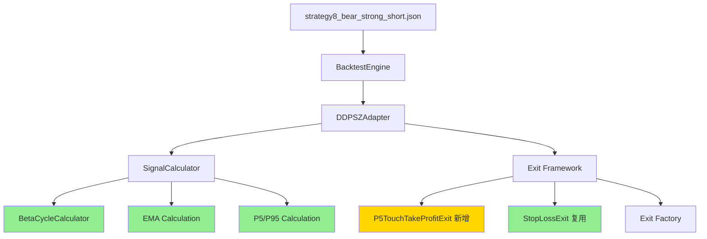
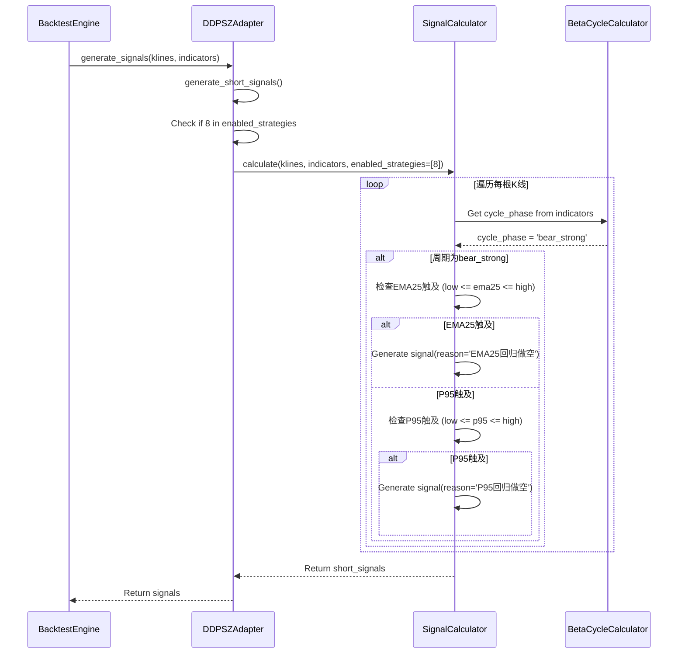
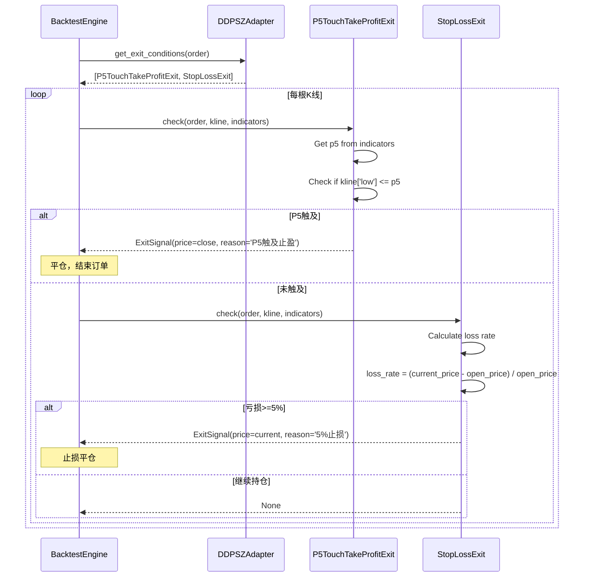
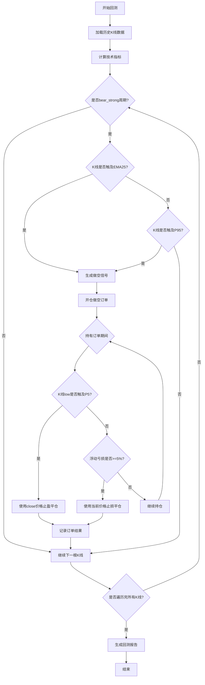

# 架构设计文档

**项目名称**: 策略8-强势下跌区间做空策略
**迭代编号**: 022
**文档版本**: v1.0.0
**创建日期**: 2026-01-08
**生命周期阶段**: P4 - 架构快速设计
**快速流程**: ✅ 增量扩展

---

## 一、架构概览

### 1.1 系统架构图



**图例**：
- 🟡 黄色：新增组件
- 🟢 绿色：复用现有组件

### 1.2 核心价值

在强势下跌周期中，捕捉价格回归EMA25或P95的做空机会，使用P5触及止盈和5%止损控制风险。

### 1.3 架构兼容性

**兼容性评分**：95% ✅

**复用组件**：
- ✅ BetaCycleCalculator（周期识别）
- ✅ StopLossExit（5%止损）
- ✅ BacktestEngine（回测引擎）
- ✅ DDPSZAdapter（策略适配器）
- ✅ SignalCalculator（信号计算器）

**新增组件**：
- 🆕 P5TouchTakeProfitExit（P5触及止盈）

**修改组件**：
- 🔧 DDPSZAdapter（扩展支持策略8）
- 🔧 SignalCalculator（新增策略8逻辑）
- 🔧 exits/__init__.py（注册P5止盈）
- 🔧 project_loader.py（添加valid_types）

---

## 二、组件设计

### 2.1 新增组件：P5TouchTakeProfitExit

#### 组件定义

**文件路径**：`strategy_adapter/exits/p5_touch_take_profit.py`

**类定义**：
```python
from typing import Optional, Dict, Any
from datetime import datetime
from decimal import Decimal
import pandas as pd
from strategy_adapter.exits.base import IExitCondition, ExitSignal
from strategy_adapter.models import Order


class P5TouchTakeProfitExit(IExitCondition):
    """
    P5触及止盈Exit条件（策略8专用）

    当K线low触及或低于P5支撑位时，使用当根K线close价格平仓止盈。
    主要用于做空订单的止盈。

    设计对标：P95TakeProfitExit
    逻辑镜像：检查low <= P5（而非high >= P95）
    成交价格：使用close（与P95保持一致）
    """

    def __init__(self):
        """
        初始化P5触及止盈Exit条件

        无需参数，P5值从indicators中动态获取
        """
        pass

    def check(
        self,
        order: Order,
        kline: Dict,
        indicators: Dict[str, Any],
        current_timestamp: datetime
    ) -> Optional[ExitSignal]:
        """
        检查是否触发P5止盈条件

        Args:
            order: 订单对象
            kline: 当前K线数据（包含open, high, low, close等）
            indicators: 技术指标字典（包含p5等）
            current_timestamp: 当前时间戳

        Returns:
            ExitSignal: 如果触发止盈，返回平仓信号
            None: 如果未触发，返回None

        触发条件：
            - kline['low'] <= indicators['p5']

        平仓价格：
            - kline['close']（使用当根K线close，而非low）

        Raises:
            ValueError: 如果p5为NaN或不存在
        """
        # 获取P5值
        p5_value = indicators.get('p5')

        # Guard Clause: P5值必须存在且不为NaN
        if p5_value is None or pd.isna(p5_value):
            return None

        # 转换为Decimal确保精度
        p5_price = Decimal(str(p5_value))
        low = Decimal(str(kline['low']))
        close = Decimal(str(kline['close']))

        # 检查触发条件：low <= P5
        if low <= p5_price:
            return ExitSignal(
                timestamp=current_timestamp,
                price=close,  # 使用close，而非low
                reason=f"P5触及止盈（P5={p5_price:.2f}）",
                exit_type=self.get_type()
            )

        return None

    def get_type(self) -> str:
        """
        获取Exit条件类型

        Returns:
            str: Exit类型标识 "p5_touch_take_profit"
        """
        return "p5_touch_take_profit"

    def get_priority(self) -> int:
        """
        获取Exit条件优先级

        Returns:
            int: 优先级值（9，与P95TakeProfitExit相同）

        优先级说明：
            - 9: 高优先级止盈（P5/P95触及）
            - 8: 动态Exit选择器
            - 5: 一般止损
        """
        return 9
```

#### 设计对比

| 维度 | P95TakeProfitExit | P5TouchTakeProfitExit |
|------|-------------------|----------------------|
| **触发条件** | `kline['high'] >= P95` | `kline['low'] <= P5` |
| **适用方向** | 做多（long） | 做空（short） |
| **成交价格** | `kline['close']` | `kline['close']` |
| **优先级** | 9 | 9 |
| **复杂度** | 低 | 低 |

#### 单元测试设计

**文件路径**：`strategy_adapter/tests/test_p5_touch_take_profit.py`

```python
import unittest
from decimal import Decimal
from datetime import datetime
from strategy_adapter.exits.p5_touch_take_profit import P5TouchTakeProfitExit


class TestP5TouchTakeProfitExit(unittest.TestCase):
    def setUp(self):
        self.exit_condition = P5TouchTakeProfitExit()
        self.order = self._create_mock_order()

    def test_p5_touched_triggers_exit(self):
        """测试：K线low触及P5时触发止盈"""
        kline = {'low': 100.0, 'close': 105.0}
        indicators = {'p5': 110.0}

        signal = self.exit_condition.check(
            self.order, kline, indicators, datetime.now()
        )

        self.assertIsNotNone(signal)
        self.assertEqual(signal.price, Decimal('105.0'))  # 使用close
        self.assertIn('P5触及止盈', signal.reason)

    def test_p5_not_touched_no_exit(self):
        """测试：K线low未触及P5时不触发"""
        kline = {'low': 120.0, 'close': 125.0}
        indicators = {'p5': 110.0}

        signal = self.exit_condition.check(
            self.order, kline, indicators, datetime.now()
        )

        self.assertIsNone(signal)

    def test_p5_nan_no_exit(self):
        """测试：P5为NaN时不触发"""
        kline = {'low': 100.0, 'close': 105.0}
        indicators = {'p5': float('nan')}

        signal = self.exit_condition.check(
            self.order, kline, indicators, datetime.now()
        )

        self.assertIsNone(signal)
```

---

### 2.2 修改组件：DDPSZAdapter

#### 修改点1：扩展做空策略检查（Line 477）

**文件路径**：`strategy_adapter/adapters/ddpsz_adapter.py`

**修改前**：
```python
# Line 477
if not any(s in self.enabled_strategies for s in [3, 4]):
    logger.debug("未启用做空策略(3,4)，跳过做空信号生成")
    return []
```

**修改后**：
```python
# Line 477
if not any(s in self.enabled_strategies for s in [3, 4, 8]):
    logger.debug("未启用做空策略(3,4,8)，跳过做空信号生成")
    return []
```

**修改理由**：
- 扩展做空策略支持，包含策略8
- 修改影响面：仅一行代码
- 向后兼容：不影响策略3、4

#### 修改点2：扩展做空策略过滤（Line 506）

**修改前**：
```python
# Line 506
short_strategies = [s for s in self.enabled_strategies if s in [3, 4]]
```

**修改后**：
```python
# Line 506
short_strategies = [s for s in self.enabled_strategies if s in [3, 4, 8]]
```

**修改理由**：
- 过滤做空策略列表，包含策略8
- 确保策略8信号被正确处理

#### 修改点3：模块文档更新

**添加策略8描述**：
```python
"""
DDPSZAdapter - DDPS-Z策略适配器

支持的策略：
- 策略1: P5买入 + EMA回归卖出
- 策略2: 多周期P5买入 + EMA回归卖出
- 策略3: EMA斜率做空
- 策略4: 惯性上涨做空
- 策略5: 牛市周期EMA回调买入
- 策略6: 震荡区间Mid止盈
- 策略7: 动态周期自适应Exit
- 策略8: 强势下跌区间做空（新增）
    - Entry: bear_strong周期 + EMA25/P95触及
    - Exit: P5触及止盈 + 5%止损
"""
```

---

### 2.3 修改组件：SignalCalculator

#### 新增策略8信号生成逻辑

**文件路径**：`ddps_z/calculators/signal_calculator.py`

**插入位置**：在现有策略逻辑之后（约Line 650后）

**新增代码**：
```python
# 策略8: 强势下跌区间做空
if 8 in enabled_strategies:
    # 获取周期阶段
    cycle_phase = cycle_phases[i] if i < len(cycle_phases) else None

    # Guard Clause: 必须是bear_strong周期
    if cycle_phase != 'bear_strong':
        continue

    # 获取指标值
    ema25 = ema_series[i]
    p95 = p95_series[i] if p95_series is not None else None

    # 检查EMA25触及（优先检查）
    if not pd.isna(ema25) and low <= ema25 <= high:
        signal = {
            'timestamp': timestamp,
            'price': float(close),
            'reason': 'EMA25回归做空',
            'strategy_id': 8,
            'direction': 'short'
        }
        short_signals.append(signal)
        logger.debug(
            f"[策略8] 生成EMA25回归做空信号: "
            f"timestamp={timestamp}, price={close:.2f}, ema25={ema25:.2f}"
        )

    # 检查P95触及（独立判断，与EMA25二选一）
    elif p95 is not None and not pd.isna(p95) and low <= p95 <= high:
        signal = {
            'timestamp': timestamp,
            'price': float(close),
            'reason': 'P95回归做空',
            'strategy_id': 8,
            'direction': 'short'
        }
        short_signals.append(signal)
        logger.debug(
            f"[策略8] 生成P95回归做空信号: "
            f"timestamp={timestamp}, price={close:.2f}, p95={p95:.2f}"
        )
```

**逻辑说明**：
1. **周期检查**：必须是bear_strong阶段
2. **触及条件**：EMA25或P95（满足其一即可，优先EMA25）
3. **信号生成**：包含timestamp、price、reason、strategy_id、direction
4. **日志记录**：便于调试和验证

#### 函数签名扩展（需求）

**当前签名**：
```python
def calculate(
    self,
    klines: List[Dict],
    ema_series: np.ndarray,
    p5_series: np.ndarray,
    beta_series: np.ndarray,
    inertia_mid_series: np.ndarray,
    p95_series: Optional[np.ndarray] = None,
    enabled_strategies: List[int] = None
) -> Dict[str, List[Dict]]:
```

**新增依赖**：
- `cycle_phase_series`：从indicators中获取（已由BetaCycleCalculator计算）
- 无需修改签名，cycle_phase_series应该已经在indicators中

**验证点**：
- 确认indicators字典包含`cycle_phase` Series
- 确认BetaCycleCalculator的输出格式

---

### 2.4 修改组件：Exit工厂

#### 文件修改：`strategy_adapter/exits/__init__.py`

**修改点1：添加Import**

```python
# 新增import
from strategy_adapter.exits.p5_touch_take_profit import P5TouchTakeProfitExit
```

**修改点2：注册Exit类型**

```python
def create_exit_condition(config: ExitConfig) -> IExitCondition:
    """
    创建Exit条件实例

    Args:
        config: Exit配置对象

    Returns:
        IExitCondition: Exit条件实例

    Raises:
        ValueError: 未知的Exit类型
    """
    exit_type = config.type
    params = config.params

    if exit_type == "ema_reversion":
        return EmaReversionExit(ema_period=params.get("ema_period", 25))
    elif exit_type == "stop_loss":
        return StopLossExit(percentage=params.get("percentage", 5.0))
    elif exit_type == "take_profit":
        return TakeProfitExit(percentage=params.get("percentage", 10.0))
    elif exit_type == "p95_take_profit":
        return P95TakeProfitExit()
    elif exit_type == "consolidation_mid_take_profit":
        return ConsolidationMidTakeProfitExit()
    elif exit_type == "dynamic_exit_selector":
        return DynamicExitSelectorExit(
            stop_loss_percentage=params.get("stop_loss_percentage", 5.0)
        )
    elif exit_type == "p5_touch_take_profit":  # 新增
        return P5TouchTakeProfitExit()
    else:
        raise ValueError(f"未知的卖出条件类型: {exit_type}")
```

**修改点3：导出列表**

```python
__all__ = [
    'IExitCondition',
    'ExitSignal',
    'create_exit_condition',
    'EmaReversionExit',
    'StopLossExit',
    'TakeProfitExit',
    'P95TakeProfitExit',
    'ConsolidationMidTakeProfitExit',
    'DynamicExitSelectorExit',
    'P5TouchTakeProfitExit',  # 新增
]
```

---

### 2.5 修改组件：ProjectLoader

#### 文件修改：`strategy_adapter/core/project_loader.py`

**修改点：添加valid_types（Line 212-219）**

```python
# Line 212-219
valid_types = {
    'ema_reversion',
    'stop_loss',
    'take_profit',
    'p95_take_profit',
    'consolidation_mid_take_profit',
    'dynamic_exit_selector',
    'p5_touch_take_profit',  # 策略8: P5触及止盈
}
```

**修改理由**：
- 确保配置文件验证通过
- 允许在配置文件中使用`p5_touch_take_profit`类型

---

## 三、数据流设计

### 3.1 Entry信号生成流程



**关键步骤**：
1. BacktestEngine调用DDPSZAdapter生成信号
2. DDPSZAdapter调用SignalCalculator计算
3. SignalCalculator遍历K线，检查周期和触及条件
4. 生成做空信号（EMA25或P95）

**数据流向**：
- **输入**：klines (K线数据)、indicators (包含cycle_phase, ema25, p95)
- **输出**：short_signals (做空信号列表)

---

### 3.2 Exit检查流程



**关键步骤**：
1. BacktestEngine获取订单的Exit条件列表
2. 遍历每根K线，检查P5触及止盈（优先级9）
3. 如未触发止盈，检查5%止损（优先级5）
4. 生成平仓信号并执行

**优先级说明**：
- **P5TouchTakeProfitExit（优先级9）**：优先检查止盈
- **StopLossExit（优先级5）**：次优先检查止损

---

### 3.3 完整交易流程



---

## 四、配置文件设计

### 4.1 配置文件结构

**文件路径**：`strategy_adapter/configs/strategy8_bear_strong_short.json`

```json
{
  "project_name": "策略8-强势下跌区间做空",
  "description": "在强势下跌周期中，捕捉价格回归EMA25或P95的做空机会，使用P5触及止盈和5%止损",
  "version": "1.0",
  "created_at": "2026-01-08",
  "iteration": "022",

  "backtest_config": {
    "symbol": "ETHUSDT",
    "interval": "4h",
    "market_type": "futures",
    "start_date": "2025-01-01",
    "end_date": "2026-01-08",
    "initial_cash": 10000,
    "commission_rate": 0.001
  },

  "capital_management": {
    "mode": "shared",
    "position_size_mode": "fixed",
    "position_size": 100,
    "max_positions": 10
  },

  "strategies": [
    {
      "id": "strategy_8",
      "name": "强势下跌区间做空",
      "type": "ddps-z",
      "enabled": true,
      "entry": {
        "strategy_id": 8,
        "cycle_phase": "bear_strong",
        "description": "强势下跌周期内，K线触及EMA25或P95时做空"
      },
      "exits": [
        {
          "type": "p5_touch_take_profit",
          "params": {},
          "description": "K线low触及P5支撑位，使用当根close止盈"
        },
        {
          "type": "stop_loss",
          "params": {
            "percentage": 5.0
          },
          "description": "5%止损"
        }
      ]
    }
  ]
}
```

### 4.2 配置项说明

#### Backtest配置

| 配置项 | 值 | 说明 |
|-------|-----|------|
| symbol | ETHUSDT | 交易对 |
| interval | 4h | K线周期 |
| market_type | futures | 市场类型（期货） |
| start_date | 2025-01-01 | 回测起始日期 |
| end_date | 2026-01-08 | 回测结束日期 |
| initial_cash | 10000 | 初始资金（USDT） |
| commission_rate | 0.001 | 手续费率（0.1%） |

#### Capital Management配置

| 配置项 | 值 | 说明 |
|-------|-----|------|
| mode | shared | 资金共享模式 |
| position_size_mode | fixed | 固定仓位模式 |
| position_size | 100 | 每单100 USDT |
| max_positions | 10 | 最大持仓数 |

#### Entry配置

| 配置项 | 值 | 说明 |
|-------|-----|------|
| strategy_id | 8 | 策略编号 |
| cycle_phase | bear_strong | 周期阶段限制 |
| description | - | 策略描述 |

#### Exit配置

**Exit 1: P5触及止盈**

| 配置项 | 值 | 说明 |
|-------|-----|------|
| type | p5_touch_take_profit | Exit类型 |
| params | {} | 无参数（P5从indicators获取） |
| description | - | Exit描述 |

**Exit 2: 5%止损**

| 配置项 | 值 | 说明 |
|-------|-----|------|
| type | stop_loss | Exit类型 |
| params.percentage | 5.0 | 止损百分比（5%） |
| description | - | Exit描述 |

---

## 五、接口契约

### 5.1 SignalCalculator接口

#### 输入契约

```python
def calculate(
    self,
    klines: List[Dict],           # K线数据列表
    ema_series: np.ndarray,        # EMA序列
    p5_series: np.ndarray,         # P5序列
    beta_series: np.ndarray,       # Beta序列
    inertia_mid_series: np.ndarray,# 惯性中值序列
    p95_series: Optional[np.ndarray] = None,  # P95序列
    enabled_strategies: List[int] = None       # 启用策略列表
) -> Dict[str, List[Dict]]:
```

**输入参数**：
- `klines`: K线数据，包含timestamp, open, high, low, close, volume
- `ema_series`: EMA25序列（numpy数组）
- `p5_series`: P5支撑位序列
- `beta_series`: Beta斜率序列
- `inertia_mid_series`: 惯性中值序列
- `p95_series`: P95阻力位序列（可选）
- `enabled_strategies`: 启用的策略ID列表（如[8]）

**输出契约**：
```python
{
    'long_signals': [
        {
            'timestamp': datetime,
            'price': float,
            'reason': str,
            'strategy_id': int,
            'direction': 'long'
        }
    ],
    'short_signals': [
        {
            'timestamp': datetime,
            'price': float,
            'reason': str,  # 'EMA25回归做空' 或 'P95回归做空'
            'strategy_id': 8,
            'direction': 'short'
        }
    ]
}
```

#### 前置条件

1. **cycle_phase必须存在**：indicators字典中必须包含`cycle_phase` Series
2. **EMA25必须计算**：ema_series不能为空或NaN
3. **P95可选**：p95_series可以为None（仅检查EMA25）

#### 后置条件

1. **信号有效性**：所有生成的信号都包含必需字段
2. **策略ID正确**：strategy_id=8
3. **方向正确**：direction='short'

---

### 5.2 P5TouchTakeProfitExit接口

#### 输入契约

```python
def check(
    self,
    order: Order,                  # 订单对象
    kline: Dict,                   # 当前K线
    indicators: Dict[str, Any],    # 技术指标
    current_timestamp: datetime    # 当前时间戳
) -> Optional[ExitSignal]:
```

**输入参数**：
- `order`: 订单对象（包含open_price, direction等）
- `kline`: 当前K线（包含low, close等）
- `indicators`: 技术指标字典（包含p5）
- `current_timestamp`: 当前时间戳

**输出契约**：
```python
# 触发时
ExitSignal(
    timestamp=datetime,
    price=Decimal,      # kline['close']
    reason=str,         # "P5触及止盈（P5=xxx.xx）"
    exit_type='p5_touch_take_profit'
)

# 未触发时
None
```

#### 前置条件

1. **P5必须存在**：indicators['p5']不能为None或NaN
2. **K线有效**：kline['low']和kline['close']必须存在
3. **订单有效**：order必须是持仓中的做空订单

#### 后置条件

1. **价格正确**：如果触发，price必须为kline['close']（不是low）
2. **理由清晰**：reason包含具体的P5值
3. **类型正确**：exit_type='p5_touch_take_profit'

---

## 六、架构决策记录

### 决策1：P5TouchTakeProfitExit的实现方式

**问题**：P5TouchTakeProfitExit应该独立实现，还是复用TakeProfitExit？

**选项**：
- **选项A**：独立实现P5TouchTakeProfitExit类（推荐）
- **选项B**：扩展TakeProfitExit，添加P5触及逻辑

**最终决策**：选项A

**决策理由**：
1. P5触及止盈的逻辑与固定百分比止盈完全不同（触及条件 vs 百分比）
2. 独立实现更符合单一职责原则
3. 与P95TakeProfitExit保持设计一致性
4. 易于维护和测试

**决策影响**：需要新增一个文件，但代码更清晰

---

### 决策2：策略8信号生成位置

**问题**：策略8的做空信号应该在SignalCalculator中生成，还是在DDPSZAdapter中生成？

**选项**：
- **选项A**：在SignalCalculator中生成（推荐）
- **选项B**：在DDPSZAdapter中生成

**最终决策**：选项A

**决策理由**：
1. 与策略3、4的做空逻辑保持一致
2. SignalCalculator统一管理所有策略信号生成
3. 便于复用bear_strong周期判断逻辑
4. 测试更集中

**决策影响**：需要修改SignalCalculator，但架构更统一

---

### 决策3：P5止盈的成交价格选择

**问题**：P5触及止盈应该使用low价格还是close价格成交？

**选项**：
- **选项A**：使用close价格（推荐）
- **选项B**：使用low价格

**最终决策**：选项A

**决策理由**：
1. 与P95TakeProfitExit保持一致（使用close）
2. 更符合实际交易逻辑（避免理想化假设）
3. 与BUG-024修复保持一致（止损和止盈均使用close）
4. 接受合理的1-2%滑点

**决策影响**：止盈收益略低于理想值，但更真实

---

## 七、技术约束与假设

### 7.1 技术约束

| 约束项 | 约束内容 | 影响 |
|--------|---------|------|
| **数据源** | 仅支持Binance历史K线数据 | 回测数据来源单一 |
| **时间周期** | 仅支持4h周期 | 无法验证其他周期表现 |
| **仓位管理** | 固定100 USDT仓位 | 无法测试动态仓位 |
| **Exit条件** | 每个订单仅支持1个P5止盈 + 1个止损 | 无法组合多种Exit |
| **周期识别** | 依赖BetaCycleCalculator | 周期识别延迟1-2根K线 |

### 7.2 技术假设

| 假设项 | 假设内容 | 风险 |
|--------|---------|------|
| **P5计算准确性** | P5指标计算公式正确 | 低风险（已验证） |
| **周期识别准确性** | Beta周期计算可靠识别bear_strong | 低风险（已验证） |
| **历史数据完整性** | 2025年数据无缺失K线 | 低风险（Binance数据质量高） |
| **做空手续费** | 与做多手续费一致（0.1%） | 低风险（符合实际） |
| **滑点假设** | 使用close价格成交，忽略盘中滑点 | 中风险（可接受） |

---

## 八、风险评估与缓解

### 8.1 中风险项

#### 风险1: P5触及止盈的slippage

**描述**：使用close价格而非low价格平仓，可能错过最优价格

**概率**：中等（50%）

**影响**：中等（止盈收益略低于理想值，约1-2%滑点）

**缓解措施**：
1. 使用close价格符合实际交易逻辑，避免理想化假设
2. 回测阶段观察实际slippage数据
3. 如果slippage超过3%，可考虑使用(low + close) / 2作为成交价

**触发条件**：P5触及后价格快速反弹

**监控指标**：平均slippage = (close - low) / close * 100%

---

#### 风险2: SignalCalculator策略8逻辑复杂度

**描述**：需要在SignalCalculator中添加策略8的周期检查和触及判断逻辑

**概率**：低（30%）

**影响**：低（实现复杂度略高，可能需要2-3小时调试）

**缓解措施**：
1. 参考策略3、策略4的做空逻辑实现
2. 编写单元测试覆盖边界情况
3. 使用logging输出调试信息

**触发条件**：cycle_phase_series未正确传递或NaN处理不当

**监控指标**：单元测试覆盖率 >= 80%

---

### 8.2 低风险项

#### 风险3: bear_strong周期稀缺导致信号数量不足

**描述**：历史数据中bear_strong周期可能较少，回测样本量不足

**概率**：低（20%）

**影响**：低（回测结果可信度降低，但不影响实现）

**缓解措施**：
1. 选择包含多次下跌周期的时间范围（2025年数据）
2. 如果信号数<10，扩大回测时间范围（如2024-2026）
3. 分析bear_strong周期的信号密度

**触发条件**：2025年ETH未经历强势下跌周期

**监控指标**：策略8信号数量 >= 10

---

#### 风险4: StopLossExit做空场景兼容性

**描述**：虽然StopLossExit已支持做空，但需要验证计算逻辑正确性

**概率**：低（10%）

**影响**：低（如有问题，修复成本低）

**缓解措施**：
1. 代码审查：确认direction='short'的处理逻辑
2. 单元测试：覆盖做空场景的止损触发
3. 回测验证：观察实际止损触发情况

**触发条件**：做空止损计算公式错误

**监控指标**：做空订单的止损触发率 >= 5%

---

## 九、性能影响评估

### 9.1 性能影响

| 维度 | 影响评估 | 说明 |
|------|---------|------|
| **SignalCalculator性能** | 影响极小（<1%） | 新增策略8逻辑，仅增加少量条件判断 |
| **Exit检查性能** | 影响极小（<1%） | P5TouchTakeProfitExit逻辑简单 |
| **回测总时间** | 影响极小（<2%） | 策略8信号数量有限 |
| **数据库存储** | 影响极小 | 新增策略8回测结果 |

### 9.2 代码质量影响

| 维度 | 影响评估 | 说明 |
|------|---------|------|
| **代码复杂度** | 保持不变 | 复用现有模式，无新复杂度 |
| **测试覆盖率** | 轻微提升 | 新增P5TouchTakeProfitExit单元测试 |
| **文档完整性** | 提升 | 新增策略8文档 |
| **技术债务** | 无新增 | 严格遵循现有规范 |

### 9.3 用户影响

| 维度 | 影响评估 | 说明 |
|------|---------|------|
| **现有策略** | 无影响 | 策略8独立运行，不影响策略1-7 |
| **回测系统** | 无影响 | 向下兼容现有配置文件 |
| **数据库** | 无影响 | 新增数据，不修改现有表结构 |

---

## 十、实施建议

### 10.1 实施优先级

**建议实施顺序**：

1. **阶段1: 基础组件开发** (4-6小时)
   - 创建P5TouchTakeProfitExit类
   - 修改Exit工厂注册
   - 修改ProjectLoader添加valid_types
   - 单元测试P5TouchTakeProfitExit

2. **阶段2: 信号生成扩展** (2-3小时)
   - 修改DDPSZAdapter支持策略8
   - 修改SignalCalculator添加策略8逻辑
   - 单元测试SignalCalculator策略8

3. **阶段3: 配置与回测** (2-3小时)
   - 创建strategy8_bear_strong_short.json配置
   - 执行回测验证
   - 分析回测结果

4. **阶段4: 文档更新** (1小时)
   - 更新PRD和架构文档
   - 更新代码注释和API文档

**总计**：**9-13小时** (约1.5-2天)

---

### 10.2 质量保证建议

1. **单元测试覆盖率**: ≥ 80%
   - P5TouchTakeProfitExit: 100%覆盖
   - SignalCalculator策略8逻辑: 90%覆盖

2. **集成测试**:
   - 端到端回测测试
   - Exit条件组合测试（P5止盈 + 5%止损）

3. **代码审查重点**:
   - 周期判断逻辑（bear_strong）
   - P5触及条件（low <= p5）
   - 做空止损计算（direction='short'）

---

## 十一、架构总结

### ✅ Q-Gate 4检查

- [x] 组件设计已完成
- [x] 数据流已明确
- [x] 关键决策已做出
- [x] 架构图已绘制
- [x] 接口契约已定义
- [x] 风险评估已完成

**Q-Gate 4状态**: ✅ **通过**

---

**文档状态**: ✅ 架构设计完成，可进入P5任务规划阶段

**架构兼容性**: 95%

**实施建议**: 预计1.5-2天完成开发，符合快速流程要求
