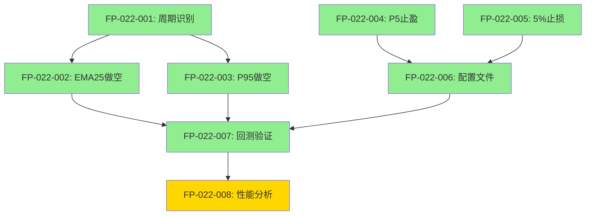

# 功能点清单

**项目名称**: 策略8-强势下跌区间做空策略
**迭代编号**: 022
**文档版本**: v1.0.0
**创建日期**: 2026-01-08
**生命周期阶段**: P1 - 需求定义+澄清
**快速流程**: ✅ 增量扩展

---

## 功能点统计

| 优先级 | 功能点数量 | 完成状态 |
|--------|-----------|---------|
| P0 (Must Have) | 7 | 0/7 |
| P1 (Should Have) | 0 | 0/0 |
| P2 (Could Have) | 1 | 0/1 |
| **总计** | **8** | **0/8** |

---

## P0 核心功能点（Must Have）

### FP-022-001: 强势下跌周期识别

**功能描述**:
识别市场处于强势下跌阶段（bear_strong），作为策略8做空的前置条件。

**用户故事**:
作为量化策略，我需要识别强势下跌周期，以便在该阶段执行做空策略，提高胜率。

**验收标准**:
- [ ] Beta周期计算器能够准确识别bear_strong阶段
- [ ] 策略8仅在bear_strong阶段生成做空信号
- [ ] 其他周期阶段不触发策略8信号

**优先级**: P0 (MVP必备)

**依赖关系**:
- 依赖: BetaCycleCalculator（已实现于迭代018）
- 被依赖: FP-022-002, FP-022-003

**技术约束**:
- 复用现有Beta周期计算逻辑
- 确保cycle_phase字段包含在indicators中

**边界条件**:
- 非bear_strong阶段（bull_strong, bull_weak, bear_weak, consolidation）不触发策略8
- 周期识别延迟不超过1根K线

**风险点**:
- **低风险**: 周期识别延迟可能导致信号滞后1-2根K线
- **缓解**: Beta周期计算器已验证可靠，延迟在可接受范围内

**状态**: ⬜ 未开始

---

### FP-022-002: EMA25回归做空信号

**功能描述**:
当K线从下方回归EMA25时生成做空信号，捕捉价格反弹后继续下跌的机会。

**用户故事**:
作为做空策略，我需要在价格反弹至EMA25时开仓做空，利用EMA25作为阻力位的特性。

**验收标准**:
- [ ] 检测条件: K线从下方触及EMA25（low <= ema25 <= high）
- [ ] 周期条件: 当前周期为bear_strong
- [ ] 信号生成: 生成做空信号，包含timestamp、price、strategy_id=8、reason='EMA25回归做空'
- [ ] 单元测试: 覆盖EMA25触及和未触及的边界情况

**优先级**: P0 (MVP必备)

**依赖关系**:
- 依赖: EMA25指标计算、FP-022-001（周期识别）
- 被依赖: FP-022-007（回测验证）

**技术约束**:
- 复用DDPSZAdapter的做空信号生成框架
- 策略ID固定为8

**边界条件**:
- K线必须从下方接触EMA25，而非从上方穿越
- EMA25为NaN时跳过信号生成

**风险点**:
- **中风险**: 可能误判EMA25回归（K线上下影线触及但未真正反转）
- **缓解**: 使用严格的触及条件（low <= ema25 <= high）

**状态**: ⬜ 未开始

---

### FP-022-003: P95回归做空信号

**功能描述**:
当K线从下方回归P95阻力位时生成做空信号，捕捉价格触及高阻力位后回落的机会。

**用户故事**:
作为做空策略，我需要在价格反弹至P95阻力位时开仓做空，利用P95的强阻力特性。

**验收标准**:
- [ ] 检测条件: K线从下方触及P95（low <= p95 <= high）
- [ ] 周期条件: 当前周期为bear_strong
- [ ] 信号生成: 生成做空信号，包含timestamp、price、strategy_id=8、reason='P95回归做空'
- [ ] 逻辑独立: 与FP-022-002独立，满足其一即可触发

**优先级**: P0 (MVP必备)

**依赖关系**:
- 依赖: P95指标计算、FP-022-001（周期识别）
- 被依赖: FP-022-007（回测验证）

**技术约束**:
- 复用现有P95计算逻辑
- EMA25和P95触及条件为"或"关系，非"且"关系

**边界条件**:
- K线必须触及P95阻力位（low <= p95 <= high）
- P95为NaN时跳过信号生成

**风险点**:
- **低风险**: P95计算准确性依赖历史数据窗口
- **缓解**: P95计算已在多个策略中验证可靠

**状态**: ⬜ 未开始

---

### FP-022-004: P5触及止盈Exit

**功能描述**:
当K线low触及或低于P5支撑位时，使用当根K线close价格平仓止盈，锁定做空利润。

**用户故事**:
作为做空订单，我需要在价格下跌至P5支撑位时止盈平仓，避免价格在支撑位反弹导致利润回吐。

**验收标准**:
- [ ] 检测条件: K线low <= P5
- [ ] 平仓价格: 使用当根K线的close价格（非low价格）
- [ ] 信号生成: 生成平仓信号（cover_signal），包含timestamp、price、order_id、reason='P5触及止盈'
- [ ] 单元测试: 覆盖P5触及和未触及的边界情况

**优先级**: P0 (MVP必备)

**依赖关系**:
- 依赖: P5指标计算、持有做空仓位
- 被依赖: FP-022-007（回测验证）

**技术约束**:
- 需要新增P5TouchTakeProfitExit类
- 实现IExitCondition接口
- 注册到Exit工厂（exits/__init__.py）

**边界条件**:
- 必须是K线low触及P5，而非close
- P5为NaN时跳过检查
- 只检查做空订单（direction='short'）

**风险点**:
- **中风险**: 平仓价格slippage（使用close而非low可能错过最优平仓价）
- **缓解**: 使用close价格更符合实际交易逻辑，避免理想化假设

**状态**: ⬜ 未开始

---

### FP-022-005: 5%止损Exit

**功能描述**:
当做空订单浮动亏损达到5%时强制平仓止损，控制最大回撤风险。

**用户故事**:
作为风控机制，我需要在亏损达到5%时自动止损，防止单笔亏损过大影响整体收益。

**验收标准**:
- [ ] 计算公式: (current_price - open_price) / open_price >= 0.05
- [ ] 平仓触发: 亏损达到5%时立即平仓
- [ ] 平仓价格: 使用当前价格（current_price）
- [ ] 兼容性验证: 确保StopLossExit正确处理做空场景

**优先级**: P0 (MVP必备)

**依赖关系**:
- 依赖: StopLossExit（已实现），持有做空仓位
- 被依赖: FP-022-007（回测验证）

**技术约束**:
- 复用现有StopLossExit
- 验证做空场景的亏损计算逻辑（价格上涨=亏损）

**边界条件**:
- 止损触发后立即平仓，不等待下一根K线
- 只检查做空订单（direction='short'）

**风险点**:
- **低风险**: 市场gap可能导致实际止损超过5%
- **缓解**: 加密货币市场gap较少，4h周期gap概率更低

**状态**: ⬜ 未开始

---

### FP-022-006: 策略8配置文件

**功能描述**:
创建策略8的JSON配置文件，定义Entry和Exit条件，支持回测系统加载。

**用户故事**:
作为回测系统，我需要加载策略8的配置文件，以便执行回测并验证策略性能。

**验收标准**:
- [ ] 文件路径: `strategy_adapter/configs/strategy8_bear_strong_short.json`
- [ ] 配置内容完整: 包含project_name、backtest_config、strategies等
- [ ] Entry条件: strategy_id=8, cycle_phase=bear_strong
- [ ] Exit条件: p5_touch_take_profit + stop_loss(5%)
- [ ] 配置验证: project_loader.py能正确解析

**优先级**: P0 (MVP必备)

**依赖关系**:
- 依赖: FP-022-004（P5触及止盈Exit已实现）
- 被依赖: FP-022-007（回测验证）

**技术约束**:
- 遵循现有配置文件格式
- Exit type: "p5_touch_take_profit"需要在project_loader.py的valid_types中注册

**边界条件**:
- 配置文件为JSON格式
- 所有必填字段完整

**风险点**:
- **低风险**: 配置文件格式错误
- **缓解**: 参考现有策略配置文件模板

**状态**: ⬜ 未开始

---

### FP-022-007: 回测验证

**功能描述**:
使用2025-01-01至2026-01-08的ETHUSDT 4h数据执行回测，验证策略8的性能指标。

**用户故事**:
作为策略研发团队，我需要验证策略8的胜率、收益率、最大回撤等指标，评估策略可行性。

**验收标准**:
- [ ] 回测命令: `python manage.py run_strategy_backtest --config strategy8_bear_strong_short.json --save-to-db`
- [ ] 回测时间范围: 2025-01-01 至 2026-01-08
- [ ] 交易对: ETHUSDT, 4h周期
- [ ] 结果保存: 回测结果保存到数据库
- [ ] 性能指标: 胜率≥50%, 净利润>0, 最大回撤≤20%

**优先级**: P0 (MVP必备)

**依赖关系**:
- 依赖: FP-022-001~006（所有P0功能点）
- 被依赖: FP-022-008（性能分析）

**技术约束**:
- 使用现有BacktestEngine
- 数据源: Binance历史K线数据

**边界条件**:
- 回测期间必须包含bear_strong周期，否则无信号
- 数据完整性要求: 无缺失K线

**风险点**:
- **中风险**: 历史数据中bear_strong周期较少，信号数量可能不足
- **缓解**: 选择2025年数据（包含多次下跌周期）

**状态**: ⬜ 未开始

---

## P2 增强功能点（Could Have）

### FP-022-008: 策略8性能分析

**功能描述**:
对比策略8与策略3、策略4的性能差异，分析不同周期阶段的策略表现，生成优化建议。

**用户故事**:
作为策略优化团队，我需要分析策略8的优劣势，以便在后续迭代中进行针对性优化。

**验收标准**:
- [ ] 性能对比: 策略8 vs 策略3 vs 策略4（胜率、收益、回撤）
- [ ] 周期分析: bear_strong周期内策略8的详细表现
- [ ] 优化建议: 基于回测结果提出至少3条优化建议
- [ ] 报告输出: 生成markdown格式的分析报告

**优先级**: P2 (Could Have，可推迟)

**依赖关系**:
- 依赖: FP-022-007（回测验证完成）
- 被依赖: 无

**技术约束**:
- 使用Python脚本分析回测数据库结果
- 可视化工具: matplotlib或mermaid

**边界条件**:
- 对比分析仅限于做空策略（策略3、4、8）
- 时间范围一致（2025-01-01至2026-01-08）

**风险点**:
- **低风险**: 分析结果的主观性
- **缓解**: 使用客观的量化指标（胜率、夏普比率等）

**状态**: ⬜ 未开始

---

## 功能点依赖关系图

**图例**:
- 🟢 绿色: P0核心功能
- 🟡 黄色: P2增强功能

---

## 修订与决策记录

### 修订历史

| 日期 | 版本 | 修订内容 | 修订人 |
|------|------|---------|--------|
| 2026-01-08 | v1.0.0 | 初始版本，包含7个P0功能点和1个P2功能点 | AI Product Manager |

### 关键决策记录

**决策1: EMA25和P95回归条件**
- **问题**: 是"或"关系还是"且"关系？
- **决策**: 采用"或"关系（满足其一即可）
- **理由**: 提供更高的策略灵活性和信号覆盖率
- **日期**: 2026-01-08

**决策2: P5触及止盈的价格选择**
- **问题**: 使用当根close还是下一根close？
- **决策**: 使用当根K线close价格
- **理由**: 避免滑点风险，执行逻辑简单清晰
- **日期**: 2026-01-08

**决策3: Entry条件的完整性**
- **问题**: 是否需要额外过滤条件（Beta值、惯性中值等）？
- **决策**: 仅需"bear_strong周期 + K线触及EMA25/P95"
- **理由**: MVP原则，保持策略简洁，后续可根据回测结果优化
- **日期**: 2026-01-08

---

**文档状态**: ✅ 功能点定义完成，共8个功能点（7个P0，1个P2）
