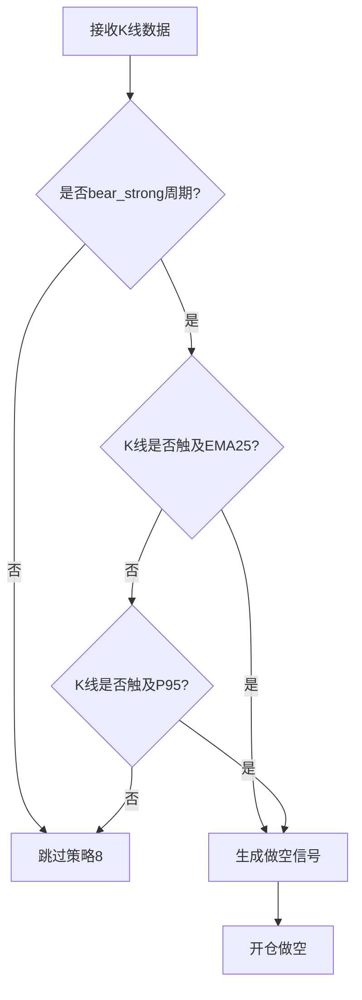
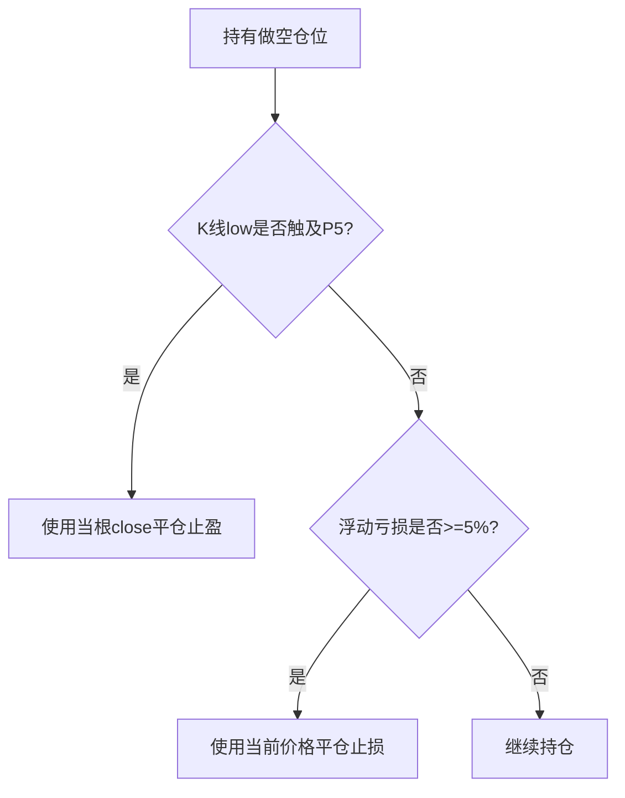

# 产品需求文档 (PRD)

**项目名称**: 策略8-强势下跌区间做空策略
**迭代编号**: 022
**文档版本**: v1.0.0
**创建日期**: 2026-01-08
**生命周期阶段**: P1 - 需求定义+澄清
**快速流程**: ✅ 增量扩展

---

## 第一部分：需求原始输入

### 需求来源
用户临时需求，属于策略优化与扩展类需求。

### 需求描述
```
策略8:
强势下跌区间：
回归ema25或p95做空

止盈止损：
low <= p5，第一根close止盈 或 -5%止损。

请实现此策略并建立配置文件，回测2025-01-01至今的eth/usdt交易对。
```

### 业务背景
- **现状**: 当前系统已有策略3（EMA斜率做空）和策略4（惯性上涨做空），但缺少针对强势下跌周期的专门做空策略
- **问题**: 强势下跌周期中，价格回归EMA25或P95的做空机会未被充分捕捉
- **目标**: 补充做空策略矩阵，提升强势下跌周期的策略覆盖率和盈利能力

### 预期价值
- **定量价值**: 预期胜率≥55%，年化收益+5%~10%
- **定性价值**: 完善做空策略体系，提升系统在熊市周期的适应性

---

## 第二部分：功能规格框架

### 模块一：功能定义与拆解

#### 核心价值定义
**一句话核心价值**: 在强势下跌周期中，捕捉价格回归EMA25或P95的做空机会，使用P5触及止盈和5%止损控制风险。

#### 功能点清单

##### P0 核心功能（Must Have）

**FP-022-001: 强势下跌周期识别**
- 识别市场处于强势下跌阶段（bear_strong）
- 只有在bear_strong阶段才触发策略8做空信号
- 复用BetaCycleCalculator

**FP-022-002: EMA25回归做空信号**
- 当K线从下方触及EMA25时生成做空信号（low <= ema25 <= high）
- 必须在bear_strong周期内
- 复用DDPSZAdapter做空信号框架

**FP-022-003: P95回归做空信号**
- 当K线从下方触及P95阻力位时生成做空信号（low <= p95 <= high）
- 必须在bear_strong周期内
- 满足EMA25或P95其一即可触发

**FP-022-004: P5触及止盈Exit**
- 当K线low触及或低于P5支撑位时，使用当根K线close价格平仓止盈
- 新增P5TouchTakeProfitExit类
- 实现IExitCondition接口

**FP-022-005: 5%止损Exit**
- 当做空订单亏损达到5%时强制平仓止损
- 复用StopLossExit，验证做空场景兼容性

**FP-022-006: 策略8配置文件**
- 创建strategy8_bear_strong_short.json配置文件
- 配置Entry条件：strategy_id=8, cycle_phase=bear_strong
- 配置Exit条件：p5_touch_take_profit + stop_loss(5%)

**FP-022-007: 回测验证**
- 使用2025-01-01至2026-01-08的ETHUSDT 4h数据
- 验证策略8的胜率、收益率、最大回撤等指标
- 保存回测结果到数据库

##### P1 重要功能（Should Have）

无

##### P2 增强功能（Could Have）

**FP-022-008: 策略8性能分析**
- 对比策略8与策略3、策略4的性能差异
- 分析不同周期阶段的策略表现
- 生成策略优化建议

---

### 模块二：交互流程与规则

#### Entry逻辑流程



**Entry规则**:
1. **必要条件**: 当前周期为bear_strong
2. **触发条件**: K线从下方触及EMA25（low <= ema25 <= high）**或** 触及P95（low <= p95 <= high）
3. **信号生成**: 生成做空信号，包含timestamp、price、reason、strategy_id=8

#### Exit逻辑流程



**Exit规则**:
1. **止盈条件**: K线low <= P5，平仓价格=当根K线close
2. **止损条件**: (current_price - open_price) / open_price >= 5%
3. **优先级**: 止盈和止损独立检查，先触发者先执行

---

### 模块三：范围边界

#### In-Scope（本次实现）
- ✅ 强势下跌周期识别（复用BetaCycleCalculator）
- ✅ EMA25回归做空信号（新增策略8逻辑）
- ✅ P95回归做空信号（新增策略8逻辑）
- ✅ P5触及止盈Exit（新增P5TouchTakeProfitExit）
- ✅ 5%止损Exit（复用StopLossExit）
- ✅ 策略8配置文件与回测

#### Out-of-Scope（不在本次实现范围）
- ❌ 其他周期阶段的做空策略（如震荡期、牛市期）
- ❌ 动态止损/止盈机制（固定5%止损、P5止盈）
- ❌ 仓位管理优化（使用固定100 USDT仓位）
- ❌ 多时间框架分析（仅使用4h周期）
- ❌ 实盘交易对接（仅回测验证）

---

## 第三部分：AI分析与建议

### 建议的MVP功能点清单

#### 📊 核心做空逻辑

- [P0] **FP-022-001**: 强势下跌周期识别
- [P0] **FP-022-002**: EMA25回归做空信号
- [P0] **FP-022-003**: P95回归做空信号

#### 🎯 Exit条件

- [P0] **FP-022-004**: P5触及止盈Exit
- [P0] **FP-022-005**: 5%止损Exit

#### 🔧 配置与验证

- [P0] **FP-022-006**: 策略8配置文件
- [P0] **FP-022-007**: 回测验证

#### 📈 性能分析

- [P2] **FP-022-008**: 策略8性能分析（可推迟）

---

### 待决策清单

**所有关键决策点已在澄清阶段确认**：

✅ **决策点1**: EMA25和P95回归条件
- **确认方案**: 满足其一即可（K线触及EMA25 **或** P95即做空）
- **理由**: 提供更高的策略灵活性和信号覆盖率

✅ **决策点2**: P5触及止盈的价格选择
- **确认方案**: 使用当根K线close价格
- **理由**: 避免滑点风险，执行逻辑简单清晰

✅ **决策点3**: Entry条件的完整性
- **确认方案**: 仅需"bear_strong周期 + K线触及EMA25/P95"
- **理由**: MVP原则，保持策略简洁，后续可根据回测结果优化

---

### 风险评估

| 风险项 | 严重性 | 概率 | 缓解措施 |
|--------|--------|------|---------|
| P5触及止盈逻辑复杂 | 中 | 中 | 参考P95TakeProfitExit实现 |
| 强势下跌周期识别不准 | 低 | 低 | Beta周期已验证可靠 |
| 止盈价格slippage | 中 | 低 | 使用close而非low，接受合理滑点 |
| 5%止损在gap时失效 | 低 | 低 | 加密货币市场gap较少 |

---

### 验收标准

#### 功能验收
- [ ] 策略8能正确识别bear_strong周期并生成做空信号
- [ ] EMA25和P95回归条件能正确触发（满足其一即可）
- [ ] P5触及止盈能正确平仓（使用当根close）
- [ ] 5%止损能正确触发并平仓
- [ ] 回测结果准确保存到数据库

#### 性能验收
- [ ] 胜率 ≥ 50%（目标55%）
- [ ] 净利润 > 0
- [ ] 最大回撤 ≤ 20%
- [ ] 订单完成率 ≥ 90%

#### 质量验收
- [ ] 代码遵循现有项目规范
- [ ] 所有P0功能点已实现
- [ ] 单元测试覆盖率 ≥ 80%
- [ ] 无严重代码质量问题

---

**文档状态**: ✅ 需求定稿完成，所有澄清点已确认
