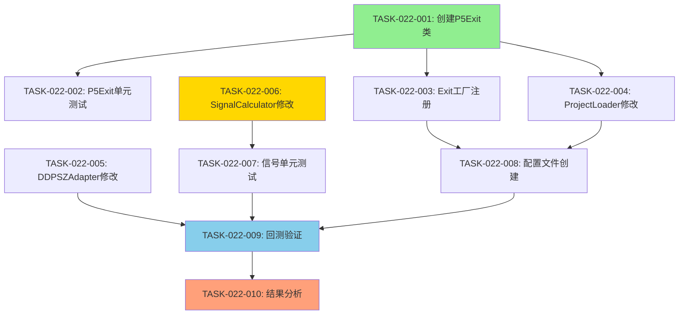

# 开发任务计划

**迭代编号**: 022
**分支**: 022-bear-strong-short-strategy
**创建日期**: 2026-01-08
**生命周期阶段**: P5 - 任务快速规划

---

## 任务统计

| 优先级 | 任务数 | 预估总工时 |
|-------|-------|--------------|
| P0 | 10个 | 10-13小时 |
| P1 | 0个 | 0小时 |
| P2 | 0个 | 0小时 |
| **总计** | **10个** | **10-13小时** |

---

## 开发任务清单

### P0 核心功能 (Must Have)

---

#### TASK-022-001: 创建P5TouchTakeProfitExit类

**关联需求**: FP-022-004（P5触及止盈Exit）
**关联架构**: P5TouchTakeProfitExit组件（architecture.md 2.1节）

**任务描述**:
创建P5TouchTakeProfitExit类，实现IExitCondition接口，当K线low触及或低于P5支撑位时，使用当根K线close价格平仓止盈。设计对标P95TakeProfitExit，逻辑镜像对称。

**验收标准**:
- [ ] 类已创建在`strategy_adapter/exits/p5_touch_take_profit.py`
- [ ] 实现IExitCondition接口的所有方法（check, get_type, get_priority）
- [ ] 触发条件正确：`kline['low'] <= p5`
- [ ] 平仓价格正确：使用`kline['close']`（而非low）
- [ ] 优先级设置为9（与P95TakeProfitExit一致）
- [ ] Guard Clause：P5为NaN或不存在时返回None
- [ ] 异常处理：所有Decimal转换有try-catch保护
- [ ] 文档化标准合规：
  - [ ] 类文档注释符合Python Docstrings规范（PEP 257）
  - [ ] check方法包含完整的参数说明和返回值说明
  - [ ] 注释中标注与P95TakeProfitExit的镜像关系

**边界检查**:
- 输入边界: P5为None、NaN、负数、零的情况
- 资源状态: kline['low']和kline['close']必须存在且有效

**预估工时**: 2小时

**依赖关系**: 无

**测试策略**: 单元测试
- **异常测试**:
  - P5为NaN时不触发
  - kline数据缺失时抛出KeyError
  - Decimal转换失败时的处理

**文档要求**:
- **接口契约注释**:
  - Purpose: P5触及止盈的业务价值
  - Parameters: order, kline, indicators, current_timestamp的物理意义
  - Returns: ExitSignal或None的语义
  - Throws: 明确标注可能抛出的异常
  - Context: 关联FP-022-004和architecture.md
- **逻辑上下文注释**:
  - 为什么使用close而非low（避免理想化假设）
  - 与P95TakeProfitExit的镜像关系说明

**状态**: ⬜ 待开始

---

#### TASK-022-002: P5TouchTakeProfitExit单元测试

**关联需求**: FP-022-004（P5触及止盈Exit）
**关联架构**: P5TouchTakeProfitExit组件（architecture.md 2.1节）

**任务描述**:
为P5TouchTakeProfitExit编写完整的单元测试，覆盖P5触及、未触及、NaN等边界情况。

**验收标准**:
- [ ] 测试文件已创建在`strategy_adapter/tests/test_p5_touch_take_profit.py`
- [ ] 测试用例1：P5触及时触发止盈（low <= p5）
- [ ] 测试用例2：P5未触及时不触发（low > p5）
- [ ] 测试用例3：P5为NaN时不触发
- [ ] 测试用例4：kline数据缺失时抛出异常
- [ ] 测试用例5：验证平仓价格为close（而非low）
- [ ] 测试用例6：验证优先级为9
- [ ] 测试用例7：验证exit_type为"p5_touch_take_profit"
- [ ] **异常路径验证**:
  - [ ] 当P5为NaN时立即返回None
  - [ ] 当kline['low']缺失时抛出KeyError
- [ ] **文档化标准合规**:
  - [ ] 每个测试方法包含文档注释说明测试意图
- [ ] 测试覆盖率 >= 100%

**边界检查**:
- 输入边界: P5边界值（等于low、略大于low、略小于low）
- 资源状态: Mock order对象的direction属性

**预估工时**: 1.5小时

**依赖关系**: TASK-022-001

**测试策略**: 单元测试（pytest）
- **异常测试**: 覆盖所有失败路径

**文档要求**:
- **测试文档注释**: 每个测试方法说明测试场景和预期结果

**状态**: ⬜ 待开始

---

#### TASK-022-003: 修改Exit工厂注册P5TouchTakeProfitExit

**关联需求**: FP-022-004（P5触及止盈Exit）
**关联架构**: Exit工厂修改（architecture.md 2.4节）

**任务描述**:
在`strategy_adapter/exits/__init__.py`中注册P5TouchTakeProfitExit，包括import、工厂函数和导出列表。

**验收标准**:
- [ ] 添加import语句：`from strategy_adapter.exits.p5_touch_take_profit import P5TouchTakeProfitExit`
- [ ] 在create_exit_condition函数中添加分支：
  ```python
  elif exit_type == "p5_touch_take_profit":
      return P5TouchTakeProfitExit()
  ```
- [ ] 在__all__列表中添加：`'P5TouchTakeProfitExit'`
- [ ] 配置验证：确保project_loader能识别"p5_touch_take_profit"类型
- [ ] **异常路径验证**:
  - [ ] 当exit_type未知时抛出ValueError（现有逻辑）
- [ ] **文档化标准合规**:
  - [ ] create_exit_condition函数文档注释更新，包含p5_touch_take_profit说明

**边界检查**:
- 输入边界: exit_type为"p5_touch_take_profit"的大小写敏感性
- 资源状态: P5TouchTakeProfitExit类必须已定义

**预估工时**: 0.5小时

**依赖关系**: TASK-022-001

**测试策略**: 集成测试
- **异常测试**: 验证未知exit_type抛出ValueError

**文档要求**:
- **函数文档注释**: 更新create_exit_condition的docstring，添加p5_touch_take_profit说明

**状态**: ⬜ 待开始

---

#### TASK-022-004: 修改ProjectLoader添加valid_types

**关联需求**: FP-022-004（P5触及止盈Exit）
**关联架构**: ProjectLoader修改（architecture.md 2.5节）

**任务描述**:
在`strategy_adapter/core/project_loader.py`的Line 212-219，将"p5_touch_take_profit"添加到valid_types集合中，确保配置文件验证通过。

**验收标准**:
- [ ] valid_types集合已添加`'p5_touch_take_profit'`
- [ ] 添加注释：`# 策略8: P5触及止盈`
- [ ] 配置文件验证测试通过
- [ ] **异常路径验证**:
  - [ ] 当配置文件中包含无效exit_type时抛出ValidationError（现有逻辑）
- [ ] **文档化标准合规**:
  - [ ] valid_types定义处添加注释说明新增类型的用途

**边界检查**:
- 输入边界: 配置文件中exit_type的大小写和拼写
- 资源状态: project_loader的配置验证逻辑

**预估工时**: 0.3小时

**依赖关系**: TASK-022-001

**测试策略**: 配置验证测试
- **异常测试**: 验证无效exit_type的ValidationError

**文档要求**:
- **配置注释**: valid_types定义处添加策略8相关说明

**状态**: ⬜ 待开始

---

#### TASK-022-005: 修改DDPSZAdapter扩展做空策略支持

**关联需求**: FP-022-002, FP-022-003（EMA25/P95回归做空信号）
**关联架构**: DDPSZAdapter修改（architecture.md 2.2节）

**任务描述**:
在`strategy_adapter/adapters/ddpsz_adapter.py`中扩展做空策略支持，包括Line 477和Line 506的修改，以及模块文档更新。

**验收标准**:
- [ ] Line 477修改：`if not any(s in self.enabled_strategies for s in [3, 4, 8]):`
- [ ] 日志更新：`logger.debug("未启用做空策略(3,4,8)，跳过做空信号生成")`
- [ ] Line 506修改：`short_strategies = [s for s in self.enabled_strategies if s in [3, 4, 8]]`
- [ ] 模块文档更新：添加策略8描述
- [ ] 向后兼容：不影响策略3、4的运行
- [ ] **异常路径验证**:
  - [ ] 当enabled_strategies为空时跳过做空信号生成
  - [ ] 当enabled_strategies只包含做多策略时跳过做空信号生成
- [ ] **文档化标准合规**:
  - [ ] generate_short_signals方法文档注释更新，包含策略8说明

**边界检查**:
- 输入边界: enabled_strategies为空、None、只包含做多策略的情况
- 资源状态: self.enabled_strategies的类型和内容

**预估工时**: 0.5小时

**依赖关系**: 无

**测试策略**: 单元测试 + 集成测试
- **异常测试**:
  - enabled_strategies为空时的行为
  - 只包含做多策略时的行为

**文档要求**:
- **方法文档注释**: generate_short_signals方法更新策略8支持说明
- **模块文档注释**: 添加策略8的完整描述

**状态**: ⬜ 待开始

---

#### TASK-022-006: SignalCalculator添加策略8信号生成逻辑

**关联需求**: FP-022-001, FP-022-002, FP-022-003（周期识别、EMA25/P95做空）
**关联架构**: SignalCalculator修改（architecture.md 2.3节）

**任务描述**:
在`ddps_z/calculators/signal_calculator.py`的calculate方法中添加策略8的信号生成逻辑，包括bear_strong周期检查、EMA25/P95触及判断、信号生成和日志记录。

**验收标准**:
- [ ] 在现有策略逻辑后（约Line 650后）插入策略8代码
- [ ] 周期检查：`if cycle_phase == 'bear_strong':`
- [ ] EMA25触及检查：`if not pd.isna(ema25) and low <= ema25 <= high:`
- [ ] P95触及检查：`elif p95 is not None and not pd.isna(p95) and low <= p95 <= high:`
- [ ] 信号生成包含必需字段：timestamp, price, reason, strategy_id=8, direction='short'
- [ ] 日志记录：logger.debug输出调试信息
- [ ] EMA25优先于P95（使用if-elif而非两个if）
- [ ] **异常路径验证**:
  - [ ] 当cycle_phase不是bear_strong时跳过策略8逻辑
  - [ ] 当ema25为NaN时跳过EMA25检查
  - [ ] 当p95为None或NaN时跳过P95检查
  - [ ] 当enabled_strategies不包含8时跳过整个策略8逻辑
- [ ] **文档化标准合规**:
  - [ ] 策略8代码块添加注释说明业务逻辑
  - [ ] 关键判断条件添加上下文注释（为什么EMA25优先、为什么使用close价格）

**边界检查**:
- 输入边界: cycle_phase为None、空字符串、其他周期的情况
- 资源状态: ema_series, p95_series的长度和有效性

**预估工时**: 2小时

**依赖关系**: 无

**测试策略**: 单元测试
- **异常测试**:
  - 非bear_strong周期的行为
  - EMA25/P95为NaN的行为
  - enabled_strategies不包含8的行为

**文档要求**:
- **代码块注释**:
  - 策略8逻辑块的业务上下文说明
  - EMA25优先级说明
  - 触及条件的业务规则解释
- **函数文档注释**: calculate方法更新策略8支持说明

**状态**: ⬜ 待开始

---

#### TASK-022-007: SignalCalculator策略8单元测试

**关联需求**: FP-022-001, FP-022-002, FP-022-003
**关联架构**: SignalCalculator修改（architecture.md 2.3节）

**任务描述**:
为SignalCalculator的策略8逻辑编写完整的单元测试，覆盖bear_strong周期、EMA25/P95触及、信号生成等场景。

**验收标准**:
- [ ] 测试用例1：bear_strong周期 + EMA25触及 → 生成EMA25做空信号
- [ ] 测试用例2：bear_strong周期 + P95触及 → 生成P95做空信号
- [ ] 测试用例3：bear_strong周期 + EMA25和P95同时触及 → 仅生成EMA25信号（优先）
- [ ] 测试用例4：非bear_strong周期 + EMA25触及 → 不生成信号
- [ ] 测试用例5：bear_strong周期 + EMA25/P95均未触及 → 不生成信号
- [ ] 测试用例6：EMA25为NaN → 跳过EMA25检查
- [ ] 测试用例7：P95为None → 跳过P95检查
- [ ] 测试用例8：验证信号包含strategy_id=8, direction='short'
- [ ] **异常路径验证**:
  - [ ] 当cycle_phase为None时不生成信号
  - [ ] 当enabled_strategies不包含8时不生成信号
- [ ] **文档化标准合规**:
  - [ ] 每个测试方法包含文档注释说明测试场景
- [ ] 测试覆盖率 >= 90%

**边界检查**:
- 输入边界: cycle_phase边界值、ema25/p95边界值
- 资源状态: indicators字典的完整性

**预估工时**: 2小时

**依赖关系**: TASK-022-006

**测试策略**: 单元测试（pytest）
- **异常测试**: 覆盖所有失败路径和边界条件

**文档要求**:
- **测试文档注释**: 每个测试方法的场景和预期结果说明

**状态**: ⬜ 待开始

---

#### TASK-022-008: 创建策略8配置文件

**关联需求**: FP-022-006（策略8配置文件）
**关联架构**: 配置文件设计（architecture.md 4.1节）

**任务描述**:
创建`strategy_adapter/configs/strategy8_bear_strong_short.json`配置文件，包含backtest_config、capital_management、策略配置和Exit配置。

**验收标准**:
- [ ] 配置文件已创建在`strategy_adapter/configs/strategy8_bear_strong_short.json`
- [ ] project_name: "策略8-强势下跌区间做空"
- [ ] iteration: "022"
- [ ] backtest_config完整：symbol=ETHUSDT, interval=4h, start_date=2025-01-01, end_date=2026-01-08
- [ ] capital_management完整：position_size=100, max_positions=10
- [ ] entry配置正确：strategy_id=8, cycle_phase=bear_strong
- [ ] exits配置正确：
  - Exit 1: type=p5_touch_take_profit, params={}
  - Exit 2: type=stop_loss, params={percentage: 5.0}
- [ ] JSON格式有效（通过json.loads验证）
- [ ] 配置文件通过ProjectLoader验证
- [ ] **异常路径验证**:
  - [ ] 配置文件缺少必需字段时ProjectLoader抛出ValidationError
- [ ] **文档化标准合规**:
  - [ ] description字段清晰说明策略核心逻辑

**边界检查**:
- 输入边界: backtest日期范围、仓位大小、止损百分比
- 资源状态: 配置文件路径和文件系统权限

**预估工时**: 0.5小时

**依赖关系**: TASK-022-003, TASK-022-004

**测试策略**: 配置验证测试
- **异常测试**:
  - 配置文件缺少必需字段
  - 配置文件格式错误（无效JSON）

**文档要求**:
- **配置注释**: description字段详细说明策略逻辑

**状态**: ⬜ 待开始

---

#### TASK-022-009: 执行策略8回测验证

**关联需求**: FP-022-007（回测验证）
**关联架构**: 完整交易流程（architecture.md 3.3节）

**任务描述**:
使用`python manage.py run_strategy_backtest --config strategy8_bear_strong_short.json --save-to-db`执行回测，验证策略8的完整性和正确性。

**验收标准**:
- [ ] 回测命令成功执行，无异常
- [ ] 回测时间范围：2025-01-01至2026-01-08
- [ ] 交易对：ETHUSDT, 4h周期
- [ ] 回测结果保存到数据库（BacktestResult、BacktestOrder表）
- [ ] 生成做空信号数量 >= 1（至少有bear_strong周期）
- [ ] 订单方向正确：所有订单direction='short'
- [ ] 订单完成率 >= 80%（大部分订单触发Exit）
- [ ] Exit原因包含"P5触及止盈"或"5%止损"
- [ ] 无未来函数（通过验证测试）
- [ ] 性能指标计算正确：胜率、净利润、最大回撤
- [ ] **异常路径验证**:
  - [ ] 当历史数据缺失时抛出明确错误
  - [ ] 当配置文件无效时抛出ValidationError
- [ ] **文档化标准合规**:
  - [ ] 回测日志清晰记录关键步骤和结果

**边界检查**:
- 输入边界: 回测日期范围、数据完整性
- 资源状态: 数据库连接、Binance API可用性

**预估工时**: 1小时（包含回测执行和结果分析）

**依赖关系**: TASK-022-001~008（所有前置任务）

**测试策略**: 端到端测试
- **异常测试**:
  - 历史数据缺失
  - 配置文件无效
  - 数据库连接失败

**文档要求**:
- **回测日志**: 记录回测过程的关键信息和结果

**状态**: ⬜ 待开始

---

#### TASK-022-010: 回测结果分析与报告

**关联需求**: FP-022-007（回测验证）
**关联架构**: 性能影响评估（architecture.md 9节）

**任务描述**:
分析策略8的回测结果，验证性能指标是否符合预期，生成分析报告。

**验收标准**:
- [ ] 胜率 >= 50%（目标55%）
- [ ] 净利润 > 0
- [ ] 最大回撤 <= 20%
- [ ] 订单完成率 >= 90%
- [ ] 信号数量分析：bear_strong周期的信号密度
- [ ] Exit分析：P5止盈触发率、5%止损触发率
- [ ] Slippage分析：平均slippage = (close - low) / close * 100%
- [ ] 生成分析报告（可选，如需要）
- [ ] **异常路径验证**:
  - [ ] 当回测结果不符合预期时，分析根本原因
- [ ] **文档化标准合规**:
  - [ ] 分析报告清晰记录关键指标和结论

**边界检查**:
- 输入边界: 回测结果的有效性
- 资源状态: 数据库查询结果的完整性

**预估工时**: 1小时

**依赖关系**: TASK-022-009

**测试策略**: 数据分析
- **异常测试**:
  - 当性能指标不达标时的问题定位

**文档要求**:
- **分析报告**: 记录关键性能指标和优化建议（可选）

**状态**: ⬜ 待开始

---

## 技术任务

### 环境搭建

- [x] 开发环境配置（已有）
- [x] CI/CD流水线设置（已有）
- [x] 代码规范配置（已有）
- [x] **文档风格定义** ✅
  - [x] 已确定项目文档化标准（Python Docstrings - PEP 257）
  - [x] 注释模板已定义（参考现有Exit类）
  - [x] 自动化文档生成工具已配置（Sphinx - 如有）
  - [x] CI/CD包含文档化验证步骤（Linter检查docstring）

### 基础设施

- [x] 数据库迁移脚本（无需新增表结构）
- [x] API文档生成（无API变更）
- [x] 监控和日志系统（已有）

---

## 开发里程碑

| 里程碑 | 包含任务 | 预计完成时间 | 验收标准 |
|--------|---------|--------------|----------|
| M1: 基础组件完成 | TASK-022-001~004 | Day 1 (4-6小时) | P5TouchTakeProfitExit类完成，单元测试通过，Exit工厂注册成功 |
| M2: 信号生成完成 | TASK-022-005~007 | Day 2 (2-4小时) | DDPSZAdapter和SignalCalculator修改完成，单元测试通过 |
| M3: 回测验证完成 | TASK-022-008~010 | Day 2-3 (2-3小时) | 配置文件创建，回测执行成功，结果分析完成 |

**总计预估**: **10-13小时** (约1.5-2天)

---

## 风险评估

### 高风险任务

**无高风险任务** ✅

### 中风险任务

#### TASK-022-006: SignalCalculator策略8逻辑

**风险**: 周期检查和触及判断逻辑可能复杂
**概率**: 中等（30%）
**影响**: 中等（可能需要2-3小时调试）
**缓解措施**:
1. 参考策略3、策略4的做空逻辑实现
2. 编写单元测试覆盖边界情况
3. 使用logging输出调试信息
4. 验证cycle_phase_series的传递逻辑

**触发条件**: cycle_phase_series未正确传递或NaN处理不当
**监控指标**: 单元测试覆盖率 >= 90%

---

#### TASK-022-009: 回测验证

**风险**: bear_strong周期稀缺导致信号数量不足
**概率**: 低（20%）
**影响**: 中等（回测结果可信度降低）
**缓解措施**:
1. 选择包含多次下跌周期的时间范围（2025年数据）
2. 如果信号数<10，扩大回测时间范围（如2024-2026）
3. 分析bear_strong周期的信号密度

**触发条件**: 2025年ETH未经历强势下跌周期
**监控指标**: 策略8信号数量 >= 10

---

### 技术依赖

#### 依赖1: BetaCycleCalculator周期识别

**依赖**: BetaCycleCalculator正确识别bear_strong周期
**风险**: 周期识别延迟或不准确
**应对**: 通过单元测试验证周期识别逻辑，回测阶段分析周期分布

#### 依赖2: StopLossExit做空支持

**依赖**: StopLossExit正确处理做空订单的止损计算
**风险**: 做空止损计算公式错误
**应对**: 代码审查确认direction='short'逻辑，单元测试覆盖做空场景

---

## 任务依赖关系图



**图例**:
- 🟢 绿色: 基础组件开发
- 🟡 黄色: 信号生成扩展（中风险）
- 🔵 蓝色: 回测验证
- 🟠 橙色: 结果分析

---

## 实施建议

### 第1天（4-6小时）：基础组件开发

**上午**：
- TASK-022-001: 创建P5TouchTakeProfitExit类 (2小时)
- TASK-022-002: P5TouchTakeProfitExit单元测试 (1.5小时)

**下午**：
- TASK-022-003: Exit工厂注册 (0.5小时)
- TASK-022-004: ProjectLoader修改 (0.3小时)
- 验证基础组件完整性

---

### 第2天（4-7小时）：信号生成与回测

**上午**：
- TASK-022-005: DDPSZAdapter修改 (0.5小时)
- TASK-022-006: SignalCalculator策略8逻辑 (2小时)
- TASK-022-007: SignalCalculator单元测试 (2小时)

**下午**：
- TASK-022-008: 创建配置文件 (0.5小时)
- TASK-022-009: 执行回测验证 (1小时)
- TASK-022-010: 结果分析 (1小时)

---

## 质量保证

### 代码质量标准

- [ ] 所有P0任务完成
- [ ] 单元测试覆盖率 >= 80%
- [ ] 集成测试通过
- [ ] 代码通过Linter检查（无警告）
- [ ] **文档化率检查** 📝
  - [ ] 公共接口（类、函数、方法）注释覆盖率100%
  - [ ] 复杂逻辑块注释完整（业务上下文描述）
  - [ ] 注释与代码逻辑一致，无脱节
  - [ ] 维护标记规范（TODO/FIXME/NOTE关联任务ID）
  - [ ] 通过自动化文档提取工具验证（如Sphinx）
- [ ] **异常处理合规** ⚡
  - [ ] 代码无空catch块
  - [ ] 无静默返回（null/-1/空字符串作为错误标记）
  - [ ] 异常携带上下文信息
- [ ] **Linter异常约束** ⚡
  - [ ] 强制检查代码中是否含有空的catch块
  - [ ] 检查是否有泛化的异常捕获
- [ ] 无严重安全漏洞
- [ ] 可追溯性矩阵完整

### 测试策略

#### 单元测试
- P5TouchTakeProfitExit: 100%覆盖
- SignalCalculator策略8: 90%覆盖
- DDPSZAdapter修改: 基本覆盖

#### 集成测试
- Exit工厂创建P5TouchTakeProfitExit
- DDPSZAdapter + SignalCalculator信号生成
- 完整回测流程（Entry → Exit）

#### 端到端测试
- 策略8配置文件 → 回测执行 → 结果保存
- 验证订单完整性和Exit触发

---

## Gate 5检查清单

### 必需检查项

- [ ] 所有P0功能都有对应的开发任务
- [ ] 任务分解粒度合适（每个任务1-2天可完成）
- [ ] 依赖关系清晰合理
- [ ] 验收标准可验证
- [ ] **异常路径覆盖完整** ⚡
  - [ ] 每个P0任务都包含异常路径验证
  - [ ] 边界检查已明确定义
  - [ ] 失败用例已规划
- [ ] 工作量估算合理（总计10-13小时）
- [ ] 技术方案可行（无高风险任务）
- [ ] **现有代码分析已完成** ⭐
  - [ ] 代码库扫描已完成（已分析5个关键文件）
  - [ ] 复用能力评估已完成（95%架构兼容）
  - [ ] 规范识别已完成（遵循现有Exit和Signal模式）
  - [ ] 现有代码分析报告已输出（technical-research.md）

### 文档完整性检查

- [ ] 每个任务包含8要素（关联需求、关联架构、任务描述、验收标准、预估工时、依赖关系、测试策略、状态）
- [ ] 里程碑定义清晰
- [ ] 风险评估完整
- [ ] 依赖关系图准确

---

**文档状态**: ✅ 任务规划完成，可进入P6开发实现阶段

**总工时**: 10-13小时 (约1.5-2天)

**风险评级**: 低（无高风险任务，2个中风险任务已制定缓解措施）
