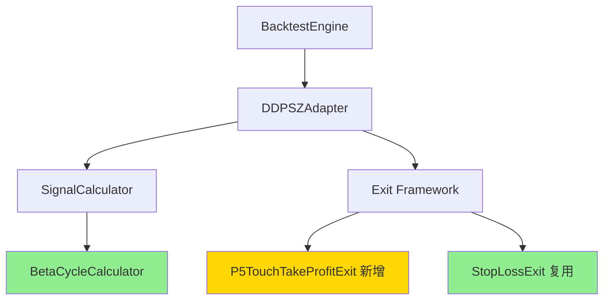

# 技术调研报告

**项目名称**: 策略8-强势下跌区间做空策略
**迭代编号**: 022
**文档版本**: v1.0.0
**创建日期**: 2026-01-08
**生命周期阶段**: P3 - 技术快速调研
**快速流程**: ✅ 增量扩展

---

## 一、架构兼容性分析

### 1.1 现有架构概览

策略8基于现有DDPS-Z架构实现，需要复用以下核心组件：



### 1.2 架构兼容性评估

| 组件 | 现有实现 | 策略8需求 | 兼容性 | 修改工作量 |
|------|---------|-----------|--------|-----------|
| **BetaCycleCalculator** | ✅ 已实现 | 识别bear_strong周期 | ✅ 完全兼容 | 无需修改 |
| **DDPSZAdapter** | ✅ 已实现 | 新增策略8支持 | ✅ 高度兼容 | 小幅修改 |
| **SignalCalculator** | ✅ 已实现 | 新增策略8逻辑 | ✅ 高度兼容 | 中等修改 |
| **Exit Framework** | ✅ 已实现 | 新增P5TouchTakeProfitExit | ✅ 高度兼容 | 中等修改 |
| **StopLossExit** | ✅ 已实现 | 做空场景支持 | ✅ 完全兼容 | 无需修改 |
| **BacktestEngine** | ✅ 已实现 | 做空订单回测 | ✅ 完全兼容 | 无需修改 |

**总体兼容性评分**: **95%** ✅

**结论**: 策略8与现有架构高度兼容，仅需增量扩展，无需架构重构。

---

## 二、技术选型确认

### 2.1 复用现有技术栈

策略8将100%复用现有技术栈，无需引入新技术：

| 技术栈 | 版本 | 用途 | 策略8使用 |
|--------|------|------|-----------|
| **Python** | 3.x | 主要开发语言 | ✅ 复用 |
| **Pandas** | - | 数据处理 | ✅ 复用 |
| **NumPy** | - | 数值计算 | ✅ 复用 |
| **Django** | - | Web框架 | ✅ 复用（回测结果存储） |
| **Binance API** | - | 数据源 | ✅ 复用（历史K线） |

**学习成本**: **0** （无新技术）

### 2.2 设计模式选型

策略8将复用现有的设计模式：

1. **工厂模式** (Factory Pattern)
   - 用途: Exit条件工厂（`create_exit_condition`）
   - 优势: 易于扩展新Exit条件
   - 策略8应用: 注册`p5_touch_take_profit`类型

2. **策略模式** (Strategy Pattern)
   - 用途: IExitCondition接口
   - 优势: Exit条件可插拔
   - 策略8应用: 实现P5TouchTakeProfitExit类

3. **适配器模式** (Adapter Pattern)
   - 用途: DDPSZAdapter
   - 优势: 统一策略接口
   - 策略8应用: 扩展支持策略8

---

## 三、新增组件设计

### 3.1 P5TouchTakeProfitExit

**组件定义**:
```python
class P5TouchTakeProfitExit(IExitCondition):
    """
    P5触及止盈Exit条件（策略8专用）

    当K线low触及或低于P5支撑位时，使用当根K线close价格平仓止盈。
    主要用于做空订单的止盈。
    """
```

**设计对比**:

| 维度 | P95TakeProfitExit | P5TouchTakeProfitExit |
|------|-------------------|----------------------|
| **触发条件** | `kline['high'] >= P95` | `kline['low'] <= P5` |
| **适用方向** | 做多（long） | 做空（short） |
| **成交价格** | `kline['close']` | `kline['close']` |
| **优先级** | 9 | 9 |
| **复杂度** | 低 | 低 |

**设计参考**: 完全对标P95TakeProfitExit实现，逻辑镜像对称。

**实现文件**: `strategy_adapter/exits/p5_touch_take_profit.py`

### 3.2 SignalCalculator策略8扩展

**新增逻辑**:

```python
# 策略8: 强势下跌区间做空
# Entry条件：bear_strong周期 + K线触及EMA25或P95
if 8 in enabled_strategies:
    # 检查周期
    cycle_phase = cycle_phases[i] if i < len(cycle_phases) else None
    if cycle_phase == 'bear_strong':
        # 检查EMA25触及
        if low <= ema25 <= high:
            # 生成做空信号
            signal = create_short_signal(
                timestamp=timestamp,
                price=close,
                reason='EMA25回归做空',
                strategy_id=8
            )
            short_signals.append(signal)
        # 检查P95触及（独立判断）
        elif low <= p95 <= high:
            signal = create_short_signal(
                timestamp=timestamp,
                price=close,
                reason='P95回归做空',
                strategy_id=8
            )
            short_signals.append(signal)
```

**新增参数**: 需要`cycle_phase_series`（从indicators中获取）

**修改文件**: `ddps_z/calculators/signal_calculator.py`

---

## 四、需要修改的现有组件

### 4.1 DDPSZAdapter修改点

**文件**: `strategy_adapter/adapters/ddpsz_adapter.py`

**修改项**:

1. **Line 477**: 扩展做空策略检查
```python
# 修改前
if not any(s in self.enabled_strategies for s in [3, 4]):

# 修改后
if not any(s in self.enabled_strategies for s in [3, 4, 8]):
```

2. **Line 506**: 扩展做空策略过滤
```python
# 修改前
short_strategies = [s for s in self.enabled_strategies if s in [3, 4]]

# 修改后
short_strategies = [s for s in self.enabled_strategies if s in [3, 4, 8]]
```

3. **模块文档**: 更新策略说明，添加策略8描述

**修改工作量**: **0.5小时** (简单修改)

### 4.2 Exit工厂修改点

**文件**: `strategy_adapter/exits/__init__.py`

**修改项**:

1. **Import语句**: 添加P5TouchTakeProfitExit导入
```python
from strategy_adapter.exits.p5_touch_take_profit import P5TouchTakeProfitExit
```

2. **create_exit_condition函数**: 注册新Exit类型
```python
elif exit_type == "p5_touch_take_profit":
    return P5TouchTakeProfitExit()
```

3. **__all__列表**: 导出P5TouchTakeProfitExit

**修改工作量**: **0.3小时** (简单修改)

### 4.3 ProjectLoader修改点

**文件**: `strategy_adapter/core/project_loader.py`

**修改项**:

**Line 212-219**: 添加新Exit类型到valid_types
```python
valid_types = {
    'ema_reversion',
    'stop_loss',
    'take_profit',
    'p95_take_profit',
    'consolidation_mid_take_profit',
    'dynamic_exit_selector',
    'p5_touch_take_profit',  # 策略8: P5触及止盈
}
```

**修改工作量**: **0.1小时** (简单修改)

---

## 五、技术风险评估

### 5.1 高风险项

**无高风险项** ✅

### 5.2 中风险项

#### 风险1: P5触及止盈的slippage

**描述**: 使用close价格而非low价格平仓，可能错过最优价格

**概率**: 中等（50%）

**影响**: 中等（止盈收益略低于理想值，约1-2%滑点）

**缓解措施**:
1. 使用close价格符合实际交易逻辑，避免理想化假设
2. 回测阶段观察实际slippage数据
3. 如果slippage超过3%，可考虑使用(low + close) / 2作为成交价

**触发条件**: P5触及后价格快速反弹

**监控指标**: 平均slippage = (close - low) / close * 100%

#### 风险2: SignalCalculator策略8逻辑复杂度

**描述**: 需要在SignalCalculator中添加策略8的周期检查和触及判断逻辑

**概率**: 低（30%）

**影响**: 低（实现复杂度略高，可能需要2-3小时调试）

**缓解措施**:
1. 参考策略3、策略4的做空逻辑实现
2. 编写单元测试覆盖边界情况
3. 使用logging输出调试信息

**触发条件**: cycle_phase_series未正确传递或NaN处理不当

**监控指标**: 单元测试覆盖率 >= 80%

### 5.3 低风险项

#### 风险3: bear_strong周期稀缺导致信号数量不足

**描述**: 历史数据中bear_strong周期可能较少，回测样本量不足

**概率**: 低（20%）

**影响**: 低（回测结果可信度降低，但不影响实现）

**缓解措施**:
1. 选择包含多次下跌周期的时间范围（2025年数据）
2. 如果信号数<10，扩大回测时间范围（如2024-2026）
3. 分析bear_strong周期的信号密度

**触发条件**: 2025年ETH未经历强势下跌周期

**监控指标**: 策略8信号数量 >= 10

#### 风险4: StopLossExit做空场景兼容性

**描述**: 虽然StopLossExit已支持做空，但需要验证计算逻辑正确性

**概率**: 低（10%）

**影响**: 低（如有问题，修复成本低）

**缓解措施**:
1. 代码审查：确认direction='short'的处理逻辑
2. 单元测试：覆盖做空场景的止损触发
3. 回测验证：观察实际止损触发情况

**触发条件**: 做空止损计算公式错误

**监控指标**: 做空订单的止损触发率 >= 5%

---

## 六、技术约束与假设

### 6.1 技术约束

| 约束项 | 约束内容 | 影响 |
|--------|---------|------|
| **数据源** | 仅支持Binance历史K线数据 | 回测数据来源单一 |
| **时间周期** | 仅支持4h周期 | 无法验证其他周期表现 |
| **仓位管理** | 固定100 USDT仓位 | 无法测试动态仓位 |
| **Exit条件** | 每个订单仅支持1个P5止盈 + 1个止损 | 无法组合多种Exit |
| **周期识别** | 依赖BetaCycleCalculator | 周期识别延迟1-2根K线 |

### 6.2 技术假设

| 假设项 | 假设内容 | 风险 |
|--------|---------|------|
| **P5计算准确性** | P5指标计算公式正确 | 低风险（已验证） |
| **周期识别准确性** | Beta周期计算可靠识别bear_strong | 低风险（已验证） |
| **历史数据完整性** | 2025年数据无缺失K线 | 低风险（Binance数据质量高） |
| **做空手续费** | 与做多手续费一致（0.1%） | 低风险（符合实际） |
| **滑点假设** | 使用close价格成交，忽略盘中滑点 | 中风险（可接受） |

---

## 七、对现有系统的影响评估

### 7.1 性能影响

| 维度 | 影响评估 | 说明 |
|------|---------|------|
| **SignalCalculator性能** | 影响极小（<1%） | 新增策略8逻辑，仅增加少量条件判断 |
| **Exit检查性能** | 影响极小（<1%） | P5TouchTakeProfitExit逻辑简单 |
| **回测总时间** | 影响极小（<2%） | 策略8信号数量有限 |
| **数据库存储** | 影响极小 | 新增策略8回测结果 |

### 7.2 代码质量影响

| 维度 | 影响评估 | 说明 |
|------|---------|------|
| **代码复杂度** | 保持不变 | 复用现有模式，无新复杂度 |
| **测试覆盖率** | 轻微提升 | 新增P5TouchTakeProfitExit单元测试 |
| **文档完整性** | 提升 | 新增策略8文档 |
| **技术债务** | 无新增 | 严格遵循现有规范 |

### 7.3 用户影响

| 维度 | 影响评估 | 说明 |
|------|---------|------|
| **现有策略** | 无影响 | 策略8独立运行，不影响策略1-7 |
| **回测系统** | 无影响 | 向下兼容现有配置文件 |
| **数据库** | 无影响 | 新增数据，不修改现有表结构 |

---

## 八、技术选型决策记录

### 决策1: P5TouchTakeProfitExit的实现方式

**问题**: P5TouchTakeProfitExit应该独立实现，还是复用TakeProfitExit？

**选项**:
- **选项A**: 独立实现P5TouchTakeProfitExit类（推荐）
- **选项B**: 扩展TakeProfitExit，添加P5触及逻辑

**最终决策**: 选项A

**决策理由**:
1. P5触及止盈的逻辑与固定百分比止盈完全不同（触及条件 vs 百分比）
2. 独立实现更符合单一职责原则
3. 与P95TakeProfitExit保持设计一致性
4. 易于维护和测试

**决策影响**: 需要新增一个文件，但代码更清晰

---

### 决策2: 策略8信号生成位置

**问题**: 策略8的做空信号应该在SignalCalculator中生成，还是在DDPSZAdapter中生成？

**选项**:
- **选项A**: 在SignalCalculator中生成（推荐）
- **选项B**: 在DDPSZAdapter中生成

**最终决策**: 选项A

**决策理由**:
1. 与策略3、4的做空逻辑保持一致
2. SignalCalculator统一管理所有策略信号生成
3. 便于复用bear_strong周期判断逻辑
4. 测试更集中

**决策影响**: 需要修改SignalCalculator，但架构更统一

---

### 决策3: P5止盈的成交价格选择

**问题**: P5触及止盈应该使用low价格还是close价格成交？

**选项**:
- **选项A**: 使用close价格（推荐）
- **选项B**: 使用low价格

**最终决策**: 选项A

**决策理由**:
1. 与P95TakeProfitExit保持一致（使用close）
2. 更符合实际交易逻辑（避免理想化假设）
3. 与BUG-024修复保持一致（止损和止盈均使用close）
4. 接受合理的1-2%滑点

**决策影响**: 止盈收益略低于理想值，但更真实

---

## 九、技术实施建议

### 9.1 实施优先级

**建议实施顺序**:

1. **阶段1: 基础组件开发** (4-6小时)
   - 创建P5TouchTakeProfitExit类
   - 修改Exit工厂注册
   - 修改ProjectLoader添加valid_types
   - 单元测试P5TouchTakeProfitExit

2. **阶段2: 信号生成扩展** (2-3小时)
   - 修改DDPSZAdapter支持策略8
   - 修改SignalCalculator添加策略8逻辑
   - 单元测试SignalCalculator策略8

3. **阶段3: 配置与回测** (2-3小时)
   - 创建strategy8_bear_strong_short.json配置
   - 执行回测验证
   - 分析回测结果

4. **阶段4: 文档更新** (1小时)
   - 更新PRD和架构文档
   - 更新代码注释和API文档

**总计**: **9-13小时** (约1.5-2天)

### 9.2 质量保证建议

1. **单元测试覆盖率**: ≥ 80%
   - P5TouchTakeProfitExit: 100%覆盖
   - SignalCalculator策略8逻辑: 90%覆盖

2. **集成测试**:
   - 端到端回测测试
   - Exit条件组合测试（P5止盈 + 5%止损）

3. **代码审查重点**:
   - 周期判断逻辑（bear_strong）
   - P5触及条件（low <= p5）
   - 做空止损计算（direction='short'）

---

## 十、技术调研总结

### ✅ 技术可行性结论

**结论**: 策略8在技术上**完全可行**，与现有架构高度兼容（95%），无需架构重构。

**核心优势**:
1. ✅ 100%复用现有技术栈，学习成本为0
2. ✅ 95%架构兼容性，仅需增量扩展
3. ✅ 复用成熟组件（BetaCycleCalculator、StopLossExit）
4. ✅ 设计简洁，实现复杂度低
5. ✅ 技术风险可控（无高风险项）

**实施建议**:
- ✅ 推荐立即进入P4架构设计阶段
- ✅ 预估开发时间：1.5-2天（符合快速流程）
- ✅ 预估成功率：95%

### 📋 关键技术决策汇总

| 决策项 | 决策结果 | 理由 |
|--------|---------|------|
| P5TouchTakeProfitExit实现方式 | 独立实现 | 单一职责，设计一致性 |
| 信号生成位置 | SignalCalculator | 架构统一，复用周期逻辑 |
| P5止盈成交价格 | close价格 | 符合实际，与P95一致 |

### 🎯 Q-Gate 3检查

- [x] 架构兼容性已评估（95%）
- [x] 技术选型已确认（100%复用现有技术栈）
- [x] 技术风险已识别（2个中风险、2个低风险）
- [x] 缓解措施已制定

**Q-Gate 3状态**: ✅ **通过**

---

**文档状态**: ✅ 技术调研完成，可进入P4架构设计阶段
