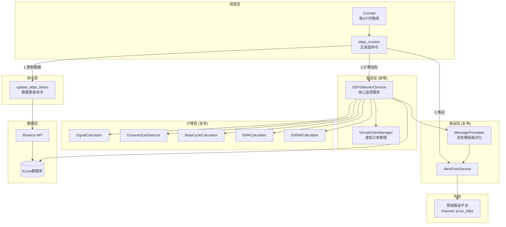
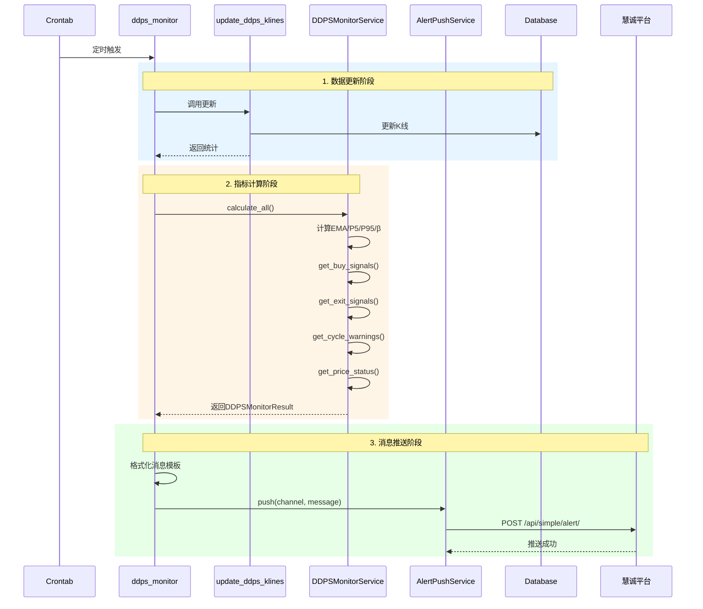

# 架构设计: DDPS价格监控服务

## 文档信息

| 属性 | 值 |
|------|-----|
| 迭代编号 | 023 |
| 版本 | 1.0 |
| 状态 | 设计完成 |
| 创建日期 | 2026-01-08 |

## 1. 系统架构图



## 2. 数据流图



## 3. 目录结构

```
ddps_z/
├── services/
│   ├── __init__.py
│   └── ddps_monitor_service.py  # 新增：核心监控服务
├── management/
│   └── commands/
│       ├── update_ddps_klines.py  # 新增：数据更新命令
│       └── ddps_monitor.py        # 新增：主调度命令
└── models/
    └── virtual_order.py           # 新增：虚拟订单数据类

listing_monitor_project/
└── settings.py                    # 修改：添加DDPS_MONITOR_CONFIG
```

## 4. 核心接口设计

### 4.1 数据类

```python
# ddps_z/models/virtual_order.py

from dataclasses import dataclass
from decimal import Decimal
from typing import Optional

@dataclass
class VirtualOrder:
    """虚拟订单（内存管理）"""
    id: str
    symbol: str
    open_price: Decimal
    open_timestamp: int
    quantity: Decimal
    cycle_phase_at_open: str
    status: str = 'open'  # open / closed
    close_price: Optional[Decimal] = None
    close_timestamp: Optional[int] = None
    exit_type: Optional[str] = None
    profit_loss: Optional[Decimal] = None
    profit_loss_rate: Optional[Decimal] = None
```

```python
# ddps_z/services/ddps_monitor_service.py

from dataclasses import dataclass
from decimal import Decimal
from typing import List

@dataclass
class PriceStatus:
    """价格状态"""
    symbol: str
    current_price: Decimal
    cycle_phase: str        # bull_strong/bull_warning/consolidation/bear_warning/bear_strong
    p5: Decimal
    p95: Decimal
    ema25: Decimal
    inertia_mid: Decimal
    probability: int        # 0-100 概率位置

@dataclass
class BuySignal:
    """买入信号"""
    symbol: str
    price: Decimal
    cycle_phase: str
    p5: Decimal
    trigger_condition: str  # e.g., "价格<=P5"

@dataclass
class ExitSignal:
    """卖出信号"""
    order_id: str
    symbol: str
    open_price: Decimal
    exit_price: Decimal
    exit_type: str          # ema_reversion/consolidation_mid/p95_take_profit
    profit_rate: Decimal
    cycle_phase: str

@dataclass
class CycleWarning:
    """周期预警"""
    bull_warning: List[str]   # 上涨预警交易对
    bull_strong: List[str]    # 上涨强势交易对
    bear_warning: List[str]   # 下跌预警交易对
    bear_strong: List[str]    # 下跌强势交易对

@dataclass
class DDPSMonitorResult:
    """监控结果汇总"""
    buy_signals: List[BuySignal]
    exit_signals: List[ExitSignal]
    cycle_warnings: CycleWarning
    price_status: List[PriceStatus]
    update_stats: dict  # 更新统计
```

### 4.2 核心服务

```python
# ddps_z/services/ddps_monitor_service.py

class DDPSMonitorService:
    """DDPS价格监控核心服务"""

    def __init__(self, symbols: List[str], strategy_id: int = 7):
        """
        初始化监控服务

        Args:
            symbols: 交易对列表，如['ETHUSDT', 'BTCUSDT']
            strategy_id: 策略ID，默认7（动态周期自适应）
        """
        self.symbols = symbols
        self.strategy_id = strategy_id
        self._orders: List[VirtualOrder] = []  # 内存订单管理

    def calculate_all(self) -> DDPSMonitorResult:
        """计算所有交易对的完整指标"""
        pass

    def get_buy_signals(self) -> List[BuySignal]:
        """获取满足买入条件的信号（价格<=P5）"""
        pass

    def get_exit_signals(self) -> List[ExitSignal]:
        """检查订单的卖出条件"""
        pass

    def get_cycle_warnings(self) -> CycleWarning:
        """获取周期预警信息"""
        pass

    def get_price_status(self) -> List[PriceStatus]:
        """获取所有交易对的价格状态"""
        pass

    def add_order(self, order: VirtualOrder) -> None:
        """添加虚拟订单"""
        pass

    def get_open_orders(self) -> List[VirtualOrder]:
        """获取未平仓订单"""
        pass

    def close_order(self, order_id: str, close_price: Decimal,
                    close_timestamp: int, exit_type: str) -> None:
        """平仓订单"""
        pass
```

### 4.3 Django Commands

```python
# ddps_z/management/commands/update_ddps_klines.py

class Command(BaseCommand):
    help = '更新DDPS监控交易对的K线数据'

    def add_arguments(self, parser):
        parser.add_argument('--symbols', type=str, help='交易对列表，逗号分隔')
        parser.add_argument('--interval', type=str, default='4h', help='K线周期')

    def handle(self, *args, **options):
        # 复用 update_klines 命令
        pass
```

```python
# ddps_z/management/commands/ddps_monitor.py

class Command(BaseCommand):
    help = 'DDPS价格监控主调度命令'

    def add_arguments(self, parser):
        parser.add_argument('--full', action='store_true', help='完整流程：更新+计算+推送')
        parser.add_argument('--skip-update', action='store_true', help='跳过数据更新')
        parser.add_argument('--no-push', action='store_true', help='跳过推送')
        parser.add_argument('--symbols', type=str, help='自定义交易对列表')

    def handle(self, *args, **options):
        # 1. 数据更新（除非--skip-update）
        # 2. 计算指标
        # 3. 推送消息（除非--no-push）
        pass
```

## 5. 配置设计

```python
# listing_monitor_project/settings.py

DDPS_MONITOR_CONFIG = {
    'default_symbols': ['ETHUSDT', 'BTCUSDT', 'HYPEUSDT', 'BNBUSDT', 'SOLUSDT', 'SUIUSDT'],
    'default_strategy': 7,
    'push_channel': 'price_ddps',
    'push_token': '6020867bc6334c609d4f348c22f90f14',
    'interval': '4h',
    'market_type': 'futures',
}
```

## 6. 推送消息模板

```
🔔 DDPS价格监控报告
时间: {datetime}

📈 买入信号 ({buy_count}个):
{buy_signals_list}

📉 卖出信号 ({exit_count}个):
{exit_signals_list}

🔴 上涨周期: {bull_symbols}
🔵 下跌周期: {bear_symbols}

📊 价格状态:
{price_status_table}
```

## 7. 架构决策记录

| 决策点 | 决策 | 理由 |
|--------|------|------|
| 服务位置 | ddps_z/services/ | 与DDPS计算器内聚 |
| 订单管理 | 内存管理（List） | MVP简单优先，后续P1可扩展 |
| 消息模板 | f-string拼接 | 格式固定，简单直接 |
| 数据更新 | 复用update_klines | 避免重复实现 |
| 配置位置 | settings.py | Django标准，集中管理 |

## 8. 复用组件清单

| 组件 | 来源模块 | 用途 |
|------|----------|------|
| SignalCalculator | ddps_z.calculators | 买入信号检测 |
| DynamicExitSelector | strategy_adapter.exits | 卖出条件检测 |
| BetaCycleCalculator | ddps_z.calculators | β周期计算 |
| EMACalculator | ddps_z.calculators | EMA25计算 |
| EWMACalculator | ddps_z.calculators | 标准差计算 |
| AlertPushService | monitor.services | 推送服务 |
| update_klines | backtest.commands | K线更新 |

## 9. 性能目标

| 指标 | 目标 |
|------|------|
| 6交易对完整计算 | < 10秒 |
| 推送延迟 | < 5秒 |
| 内存占用 | < 100MB |
