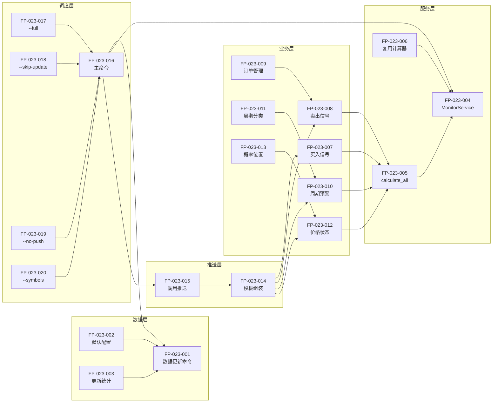

# 功能点清单: DDPS价格监控服务

## 迭代信息
- **迭代编号**: 023
- **迭代名称**: DDPS价格监控服务
- **文档版本**: 1.0
- **创建日期**: 2026-01-08

## 功能点统计

| 优先级 | 数量 | 说明 |
|--------|------|------|
| P0 (MVP) | 15 | 最小可行产品 |
| P1 (延迟) | 5 | 后续迭代实现 |
| 总计 | 20 | - |

---

## P0 功能点 (MVP必须实现)

### 模块1: 数据更新服务

| ID | 功能点 | 描述 | 验收标准 |
|----|--------|------|----------|
| FP-023-001 | update_ddps_klines命令 | 创建独立的数据更新Django Command | 命令可独立运行，支持--symbols参数 |
| FP-023-002 | 默认交易对配置 | 支持settings.py配置默认交易对列表 | 不指定--symbols时使用默认列表 |
| FP-023-003 | 批量更新统计 | 返回更新成功/失败的交易对数量 | 输出统计信息到日志 |

### 模块2: DDPS监控服务 (核心)

| ID | 功能点 | 描述 | 验收标准 |
|----|--------|------|----------|
| FP-023-004 | DDPSMonitorService类 | 创建核心监控服务类 | 可被多个命令复用 |
| FP-023-005 | calculate_all方法 | 计算所有交易对的完整DDPS指标 | 返回DDPSMonitorResult对象 |
| FP-023-006 | 复用现有计算器 | 集成SignalCalculator/EMACalculator等 | 计算结果与详情页一致 |

### 模块3: 策略信号检测

| ID | 功能点 | 描述 | 验收标准 |
|----|--------|------|----------|
| FP-023-007 | get_buy_signals方法 | 检测满足买入条件的交易对 | 返回买入信号列表 |
| FP-023-008 | get_exit_signals方法 | 检查订单的卖出条件 | 支持策略7的三种止盈条件 |
| FP-023-009 | 虚拟订单管理 | 内存管理订单状态 | 订单可新增/查询/平仓 |

### 模块4: 周期预警

| ID | 功能点 | 描述 | 验收标准 |
|----|--------|------|----------|
| FP-023-010 | get_cycle_warnings方法 | 获取周期预警信息 | 返回上涨/下跌预警交易对列表 |
| FP-023-011 | 周期状态分类 | 区分bull_warning/bull_strong/bear_warning/bear_strong | 分类正确，与β周期计算一致 |

### 模块5: 价格状态

| ID | 功能点 | 描述 | 验收标准 |
|----|--------|------|----------|
| FP-023-012 | get_price_status方法 | 获取所有交易对的价格状态 | 返回PriceStatus列表 |
| FP-023-013 | 概率位置计算 | 计算当前价格的概率位置(P0-P100) | 基于Z-Score正态分布映射 |

### 模块6: 推送整合

| ID | 功能点 | 描述 | 验收标准 |
|----|--------|------|----------|
| FP-023-014 | 推送模板组装 | 整合所有数据为推送消息 | 消息格式清晰可读 |
| FP-023-015 | 调用AlertPushService | 推送到price_ddps channel | 推送成功，慧诚平台收到 |

### 模块7: 主调度脚本

| ID | 功能点 | 描述 | 验收标准 |
|----|--------|------|----------|
| FP-023-016 | ddps_monitor主命令 | 统一调度所有子功能 | 命令可配置运行模式 |
| FP-023-017 | --full参数 | 完整流程：更新+计算+推送 | 流程完整执行 |
| FP-023-018 | --skip-update参数 | 跳过数据更新 | 仅执行计算+推送 |
| FP-023-019 | --no-push参数 | 跳过推送 | 仅执行更新+计算 |
| FP-023-020 | --symbols参数 | ���定义交易对列表 | 覆盖默认配置 |

---

## P1 功能点 (延迟实现)

| ID | 功能点 | 描述 | 延迟原因 |
|----|--------|------|----------|
| FP-P1-001 | 订单持久化 | 将虚拟订单存储到数据库 | MVP使用内存即可 |
| FP-P1-002 | 推送历史记录 | 保存推送历史到数据库 | MVP不需要历史查询 |
| FP-P1-003 | 推送失败重试 | 自动重试失败的推送 | MVP容忍偶发失败 |
| FP-P1-004 | Web仪表板 | 监控状态Web界面 | 推送已满足需求 |
| FP-P1-005 | 多策略支持 | 支持同时监控多个策略 | MVP仅策略7 |

---

## 功能点依赖关系

---

## 核心决策点

| 决策点 | 决策 | 理由 |
|--------|------|------|
| 订单存储 | 内存管理 | MVP阶段无需持久化，简化实现 |
| 策略选择 | 默认策略7 | 最新优化的策略，无止损设计 |
| 推送方式 | 同步推送 | 简单可靠，失败直接记录日志 |
| 交易对配置 | settings.py | 集中管理，便于修改 |
| 数据更新 | 复用update_klines | 避免重复实现，保持一致性 |
