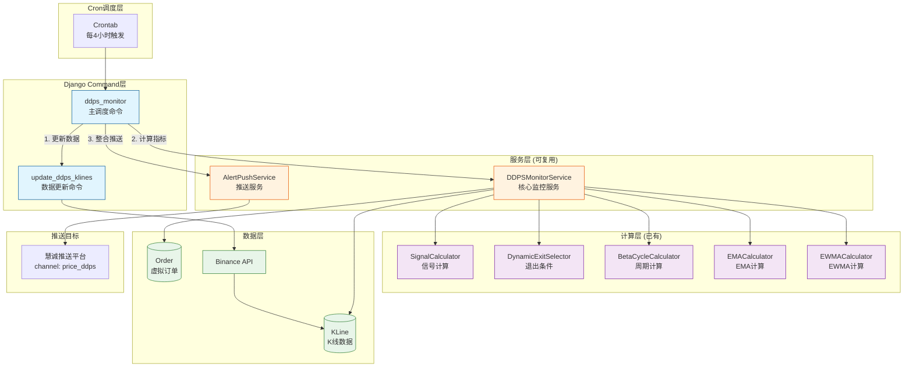
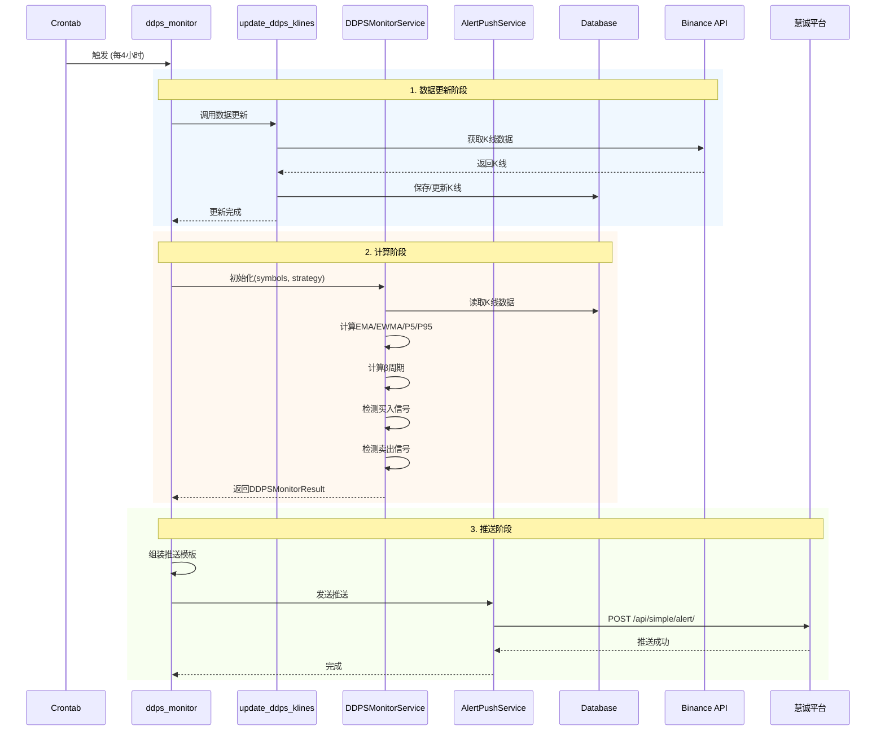

# PRD: DDPS价格监控服务

## 文档信息

| 属性 | 值 |
|------|-----|
| 迭代编号 | 023 |
| 版本 | 1.0 |
| 状态 | 需求定义中 |
| 创建日期 | 2026-01-08 |
| 关联迭代 | 009(DDPS-Z), 010(惯性扇面), 017(多策略回测), 018(β周期), 021(策略7) |

## 1. 背景与目标

### 1.1 背景

当前DDPS-Z系统主要提供回测功能和Web端可视化，缺乏**实时监控和主动推送**能力。用户需要：
- 定时获取多个交易对的价格状态
- 自动检测是否满足策略买入/卖出条件
- 被动接收市场周期预警信息

### 1.2 核心价值

**一句话描述**：构建DDPS价格监控服务，定时推送交易信号和市场状态，支持策略订单追踪。

### 1.3 目标用户

- 量化交易者：需要定时接收买卖信号
- 技术分析师：需要周期预警和价格分布

## 2. 需求范围

### 2.1 核心需求（P0 - MVP）

| ID | 功能 | 描述 | 优先级 |
|----|------|------|--------|
| REQ-001 | 数据更新服务 | 定时更新指定交易对K线数据（独立可复用） | P0 |
| REQ-002 | DDPS监控服务 | 计算交易对的DDPS指标和策略信号（核心服务层） | P0 |
| REQ-003 | 策略信号检测 | 检测买入/卖出条件，管理虚拟订单 | P0 |
| REQ-004 | 周期预警 | 列出上涨/下跌预警周期的交易对 | P0 |
| REQ-005 | 价格状态 | 列出每个交易对的现价、周期、P5/P95、概率范围 | P0 |
| REQ-006 | 推送整合 | 整合所有数据并推送到指定channel | P0 |
| REQ-007 | 主调度脚本 | 统一调用所有子脚本完成监控流程 | P0 |

### 2.2 延迟需求（P1）

| ID | 功能 | 描述 |
|----|------|------|
| REQ-P1-001 | 订单持久化 | 将虚拟订单存储到数据库 |
| REQ-P1-002 | 历史推送记录 | 保存推送历史供查询 |
| REQ-P1-003 | 推送失败重试 | 自动重试失败的推送 |

## 3. 功能详情

### 3.1 数据更新服务（REQ-001）

**描述**：独立的K线数据更新命令，可被cron调度或其他服务复用。

**命令设计**：
```bash
# 更新指定交易对列表
python manage.py update_ddps_klines --symbols ETH,BTC,HYPE,BNB,SOL,SUI --interval 4h

# 使用默认交易对
python manage.py update_ddps_klines --interval 4h
```

**关键决策**：
- 复用现有 `update_klines` 命令逻辑
- 支持配置文件指定默认交易对列表
- 返回更新统计（成功/失败数量）

### 3.2 DDPS监控服务（REQ-002）

**描述**：核心服务层，提供DDPS指标计算和信号检测能力，可被多个命令复用。

**服务接口设计**：
```python
class DDPSMonitorService:
    def __init__(self, symbols: List[str], strategy_id: int = 7):
        """初始化监控服务"""

    def calculate_all(self) -> DDPSMonitorResult:
        """计算所有交易对的指标和信号"""

    def get_buy_signals(self) -> List[BuySignal]:
        """获取满足买入条件的信号"""

    def get_exit_signals(self, orders: List[Order]) -> List[ExitSignal]:
        """检查订单的卖出条件"""

    def get_cycle_warnings(self) -> CycleWarningResult:
        """获取周期预警信息"""

    def get_price_status(self) -> List[PriceStatus]:
        """获取所有交易对的价格状态"""
```

**返回数据结构**：
```python
@dataclass
class PriceStatus:
    symbol: str           # 交易对
    current_price: Decimal  # 现价
    cycle_phase: str      # 周期阶段
    p5: Decimal          # P5价格
    p95: Decimal         # P95价格
    ema25: Decimal       # EMA25
    inertia_mid: Decimal # 惯性中值
    inertia_upper: Decimal # 惯性上界
    inertia_lower: Decimal # 惯性下界
    probability: int     # 当前价格概率位置 (0-100)
    beta: float          # β斜率
```

### 3.3 策略信号检测（REQ-003）

**功能**：
1. 检测买入信号（默认策略7）
2. 记录虚拟订单（内存管理）
3. 检查未平仓订单的卖出条件
4. 输出满足卖出条件的订单列表

**买入信号输出**：
```
📈 买入信号:
- HYPE @ 25.34 (震荡期, P5=24.85, 触发条件: 价格<=P5)
```

**卖出信号输出**：
```
📉 卖出信号:
- 订单#001 HYPE: 止盈触发 @ 26.50 (开仓25.34, +4.58%, 震荡期(P95+EMA25)/2止盈)
```

### 3.4 周期预警（REQ-004）

**功能**：列出处于上涨预警、下跌预警周期的交易对。

**输出格式**：
```
🔴 上涨周期预警: BTC, ETH
🔵 下跌周期预警: SOL, SUI
```

### 3.5 价格状态（REQ-005）

**功能**：列出每个交易对的完整价格状态。

**输出格式**：
```
📊 价格状态:
┌─────────┬──────────┬────────────┬────────────┬────────────┬──────────┐
│ Symbol  │ 现价     │ 周期       │ P5         │ P95        │ 概率位置 │
├─────────┼──────────┼────────────┼────────────┼────────────┼──────────┤
│ BTC     │ 97,500   │ 震荡期     │ 95,000     │ 102,000    │ P45      │
│ ETH     │ 3,450    │ 上涨强势   │ 3,200      │ 3,800      │ P60      │
│ HYPE    │ 25.34    │ 震荡期     │ 24.85      │ 26.50      │ P32      │
└─────────┴──────────┴────────────┴────────────┴────────────┴──────────┘
```

### 3.6 推送整合（REQ-006）

**功能**：将所有计算结果整合为推送消息。

**推送配置**：
- 使用现有 `AlertPushService`
- Channel: `price_ddps`
- Token: 使用项目配置

**推送模板**：
```
🔔 DDPS价格监控报告
时间: 2026-01-08 12:00

📈 买入信号 (1个):
- HYPE @ 25.34 (震荡期)

📉 卖出信号 (0个):
无

🔴 上涨周期: BTC, ETH
🔵 下跌周期: SOL, SUI

📊 价格状态:
BTC: 97,500 (P45, 震荡期)
ETH: 3,450 (P60, 上涨强势)
HYPE: 25.34 (P32, 震荡期)
...
```

### 3.7 主调度脚本（REQ-007）

**命令设计**：
```bash
# 完整监控流程（更新数据 + 计算 + 推送）
python manage.py ddps_monitor --full

# 仅计算和推送（不更新数据）
python manage.py ddps_monitor --skip-update

# 仅计算（不推送）
python manage.py ddps_monitor --no-push

# 自定义交易对
python manage.py ddps_monitor --symbols ETH,BTC,HYPE

# 自定义策略
python manage.py ddps_monitor --strategy 7
```

## 4. 配置项

### 4.1 默认交易对配置

在 `settings.py` 中添加：
```python
DDPS_MONITOR_CONFIG = {
    'default_symbols': ['ETHUSDT', 'BTCUSDT', 'HYPEUSDT', 'BNBUSDT', 'SOLUSDT', 'SUIUSDT'],
    'default_strategy': 7,
    'push_channel': 'price_ddps',
    'push_token': '6020867bc6334c609d4f348c22f90f14',
    'interval': '4h',
    'market_type': 'futures',
}
```

### 4.2 Cron调度配置

```crontab
# 每4小时执行一次完整监控
0 */4 * * * cd /path/to/project && python manage.py ddps_monitor --full
```

## 5. 技术约束

### 5.1 复用现有组件

| 组件 | 来源 | 用途 |
|------|------|------|
| `update_klines` | backtest | 数据更新 |
| `SignalCalculator` | ddps_z | 信号计算 |
| `DynamicExitSelector` | strategy_adapter | 卖出条件 |
| `BetaCycleCalculator` | ddps_z | 周期计算 |
| `AlertPushService` | monitor | 推送服务 |

### 5.2 性能要求

| 指标 | 目标 |
|------|------|
| 6交易对完整计算 | < 10秒 |
| 推送延迟 | < 5秒 |
| 内存占用 | < 100MB |

## 6. 验收标准

### 6.1 功能验收

- [ ] 数据更新命令可独立运行
- [ ] DDPS监控服务可被多命令复用
- [ ] 策略信号检测正确（对比回测结果）
- [ ] 周期预警输出正确
- [ ] 价格状态计算正确
- [ ] 推送消息格式正确
- [ ] 主调度脚本可配置

### 6.2 集成验收

- [ ] 可配置到cron定时执行
- [ ] 推送到price_ddps channel成功
- [ ] 日志记录完整

## 7. 风险评估

| 风险 | 影响 | 缓解措施 |
|------|------|----------|
| API限流 | 数据更新失败 | 延迟控制，重试机制 |
| 推送失败 | 信息丢失 | 日志记录，后续可加重试 |
| 计算耗时 | 超时 | 异步处理（P1优化） |

## 附录

### A. 架构图



### B. 数据流图


