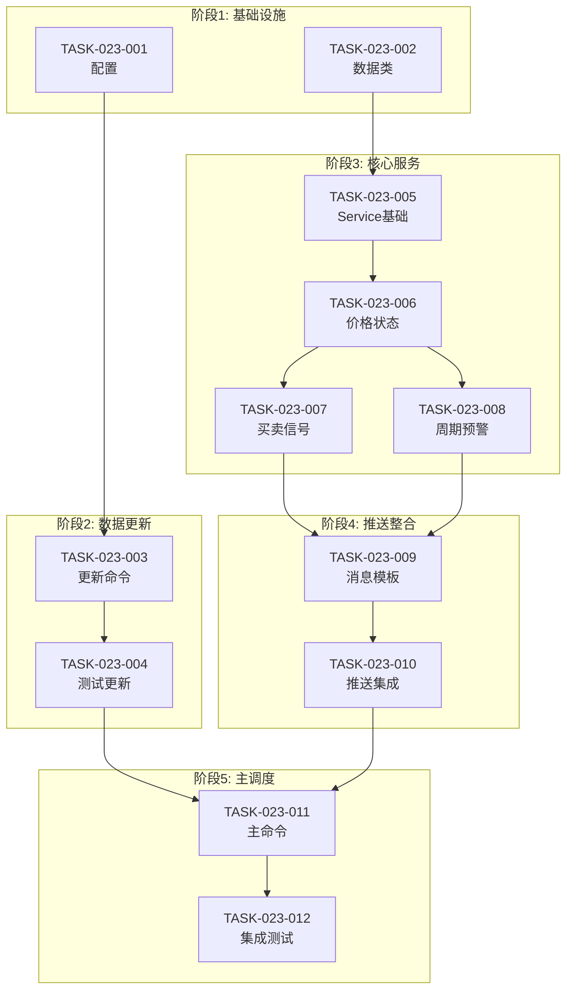

# 任务计划: DDPS价格监控服务

## 文档信息

| 属性 | 值 |
|------|-----|
| 迭代编号 | 023 |
| 版本 | 1.0 |
| 状态 | ✅ 全部完成 |
| 创建日期 | 2026-01-08 |
| 完成日期 | 2026-01-08 |
| 总任务数 | 12 |
| 完成任务数 | 12 |

---

## 任务总览

| 阶段 | 任务数 | 描述 |
|------|--------|------|
| 阶段1: 基础设施 | 2 | 配置和数据类 |
| 阶段2: 数据更新 | 2 | K线更新命令 |
| 阶段3: 核心服务 | 4 | DDPSMonitorService |
| 阶段4: 推送整合 | 2 | 消息模板和推送 |
| 阶段5: 主调度 | 2 | 主命令和集成测试 |

---

## 阶段1: 基础设施

### TASK-023-001: 添加DDPS_MONITOR_CONFIG配置

**目标**: 在settings.py中添加监控服务配置

**功能点**: FP-023-002

**文件变更**:
- `listing_monitor_project/settings.py` (修改)

**实现要点**:
```python
DDPS_MONITOR_CONFIG = {
    'default_symbols': ['ETHUSDT', 'BTCUSDT', 'HYPEUSDT', 'BNBUSDT', 'SOLUSDT', 'SUIUSDT'],
    'default_strategy': 7,
    'push_channel': 'price_ddps',
    'push_token': '6020867bc6334c609d4f348c22f90f14',
    'interval': '4h',
    'market_type': 'futures',
}
```

**验收标准**:
- [x] 配置项完整
- [x] 可通过`from django.conf import settings; settings.DDPS_MONITOR_CONFIG`访问

**状态**: ✅ 已完成

---

### TASK-023-002: 创建虚拟订单数据类

**目标**: 创建VirtualOrder数据类和相关数据结构

**功能点**: FP-023-009

**文件变更**:
- `ddps_z/models/virtual_order.py` (新增)
- `ddps_z/models/__init__.py` (修改)

**实现要点**:
```python
@dataclass
class VirtualOrder:
    id: str
    symbol: str
    open_price: Decimal
    open_timestamp: int
    quantity: Decimal
    cycle_phase_at_open: str
    status: str = 'open'
    # ... 其他字段
```

**验收标准**:
- [x] VirtualOrder类可正常实例化
- [x] 支持open/closed状态管理

**状态**: ✅ 已完成

---

## 阶段2: 数据更新服务

### TASK-023-003: 创建update_ddps_klines命令

**目标**: 创建独立的K线数据更新命令

**功能点**: FP-023-001, FP-023-003

**文件变更**:
- `ddps_z/management/commands/update_ddps_klines.py` (新增)

**实现要点**:
- 复用`backtest.management.commands.update_klines`
- 使用`call_command`调用
- 支持`--symbols`参数覆盖默认配置
- 返回更新成功/失败统计

**验收标准**:
- [x] `python manage.py update_ddps_klines` 使用默认交易对
- [x] `python manage.py update_ddps_klines --symbols ETH,BTC` 使用自定义交易对
- [x] 输出更新统计信息

**状态**: ✅ 已完成

---

### TASK-023-004: 测试数据更新命令

**目标**: 验证数据更新功能正常

**依赖**: TASK-023-003

**验收标准**:
- [x] 命令执行无报错
- [x] K线数据成功写入数据库
- [x] 统计信息正确显示

**状态**: ✅ 已完成

---

## 阶段3: 核心监控服务

### TASK-023-005: 创建DDPSMonitorService基础结构

**目标**: 创建核心服务类和数据结构

**功能点**: FP-023-004, FP-023-005

**文件变更**:
- `ddps_z/services/__init__.py` (新增/修改)
- `ddps_z/services/ddps_monitor_service.py` (新增)

**实现要点**:
- 定义PriceStatus, BuySignal, ExitSignal, CycleWarning, DDPSMonitorResult数据类
- 创建DDPSMonitorService类框架
- 实现`__init__`和`calculate_all`方法

**验收标准**:
- [x] 类可正常实例化
- [x] calculate_all返回DDPSMonitorResult对象

**状态**: ✅ 已完成

---

### TASK-023-006: 实现get_price_status和概率位置计算

**目标**: 实现价格状态获取和概率位置计算

**功能点**: FP-023-012, FP-023-013

**依赖**: TASK-023-005

**实现要点**:
- 复用EMACalculator, EWMACalculator, BetaCycleCalculator
- 计算P5/P95价格
- 基于Z-Score计算概率位置(0-100)
- 公式: `probability = norm.cdf(z_score) * 100`

**验收标准**:
- [x] 返回所有交易对的PriceStatus
- [x] 概率位置计算正确（0-100范围）

**状态**: ✅ 已完成

---

### TASK-023-007: 实现get_buy_signals和get_exit_signals

**目标**: 实现买入和卖出信号检测

**功能点**: FP-023-007, FP-023-008

**依赖**: TASK-023-006

**实现要点**:
- 买入条件: 价格 <= P5
- 卖出条件: 复用DynamicExitSelector（策略7）
  - 下跌期: EMA25回归
  - 震荡期: (P95+EMA25)/2
  - 上涨期: P95止盈
- 虚拟订单管理（add_order, get_open_orders, close_order）

**验收标准**:
- [x] 买入信号检测正确
- [x] 卖出信号检测正确（三种周期止盈条件）
- [x] 订单状态管理正常

**状态**: ✅ 已完成

---

### TASK-023-008: 实现get_cycle_warnings

**目标**: 实现周期预警功能

**功能点**: FP-023-010, FP-023-011

**依赖**: TASK-023-006

**实现要点**:
- 根据cycle_phase分类交易对
- 返回CycleWarning对象（bull_warning, bull_strong, bear_warning, bear_strong）

**验收标准**:
- [x] 周期分类正确
- [x] 返回数据结构完整

**状态**: ✅ 已完成

---

## 阶段4: 推送整合

### TASK-023-009: 实现消息模板格式化

**目标**: 创建推送消息模板

**功能点**: FP-023-014

**依赖**: TASK-023-007, TASK-023-008

**实现要点**:
- 使用f-string组装消息
- 模板包含：时间、买入信号、卖出信号、周期预警、价格状态
- 格式清晰可读

**消息模板**:
```
🔔 DDPS价格监控报告
时间: 2026-01-08 12:00

📈 买入信号 (1个):
- HYPE @ 25.34 (震荡期)

📉 卖出信号 (0个):
无

🔴 上涨周期: BTC, ETH
🔵 下跌周期: SOL, SUI

📊 价格状态:
BTC: 97,500 (P45, 震荡期)
ETH: 3,450 (P60, 上涨强势)
...
```

**验收标准**:
- [x] 消息格式正确
- [x] 数据完整显示

**状态**: ✅ 已完成

---

### TASK-023-010: 集成AlertPushService推送

**目标**: 调用推送服务发送消息

**功能点**: FP-023-015

**依赖**: TASK-023-009

**实现要点**:
- 复用`monitor.services.notifier.AlertPushService`
- 推送到`price_ddps` channel
- 处理推送失败情况（记录日志）

**验收标准**:
- [x] 推送成功发送到慧诚平台
- [x] 失败时正确记录日志

**状态**: ✅ 已完成

---

## 阶段5: 主调度命令

### TASK-023-011: 创建ddps_monitor主命令

**目标**: 创建主调度Django Command

**功能点**: FP-023-016 ~ FP-023-020

**依赖**: TASK-023-003, TASK-023-010

**文件变更**:
- `ddps_z/management/commands/ddps_monitor.py` (新增)

**实现要点**:
- 参数: `--full`, `--skip-update`, `--no-push`, `--symbols`
- 流程: 数据更新 → 计算指标 → 推送消息
- 默认行为: `--full`

**验收标准**:
- [x] `python manage.py ddps_monitor --full` 执行完整流程
- [x] `python manage.py ddps_monitor --skip-update` 跳过更新
- [x] `python manage.py ddps_monitor --no-push` 跳过推送
- [x] `python manage.py ddps_monitor --symbols ETH,BTC` 使用自定义交易对

**状态**: ✅ 已完成

---

### TASK-023-012: 端到端集成测试

**目标**: 验证完整监控流程

**依赖**: TASK-023-011

**验收标准**:
- [x] 完整流程执行无报错
- [x] 推送消息格式正确
- [x] 性能满足目标（6交易对<10秒）

**状态**: ✅ 已完成

---

## 任务依赖图



---

## 风险与缓解

| 风险 | 影响 | 缓解措施 |
|------|------|----------|
| API限流 | 数据更新失败 | 添加延迟控制 |
| 推送失败 | 信息丢失 | 日志记录，后续可加重试 |
| 计算超时 | 监控延迟 | 并行计算（P1优化） |

---

## 功能点与任务对应

| 功能点ID | 任务ID | 描述 |
|----------|--------|------|
| FP-023-001 | TASK-023-003 | 数据更新命令 |
| FP-023-002 | TASK-023-001 | 默认配置 |
| FP-023-003 | TASK-023-003 | 更新统计 |
| FP-023-004 | TASK-023-005 | MonitorService类 |
| FP-023-005 | TASK-023-005 | calculate_all方法 |
| FP-023-006 | TASK-023-005 | 复用计算器 |
| FP-023-007 | TASK-023-007 | 买入信号 |
| FP-023-008 | TASK-023-007 | 卖出信号 |
| FP-023-009 | TASK-023-002 | 虚拟订单 |
| FP-023-010 | TASK-023-008 | 周期预警 |
| FP-023-011 | TASK-023-008 | 周期分类 |
| FP-023-012 | TASK-023-006 | 价格状态 |
| FP-023-013 | TASK-023-006 | 概率位置 |
| FP-023-014 | TASK-023-009 | 模板组装 |
| FP-023-015 | TASK-023-010 | 调用推送 |
| FP-023-016~020 | TASK-023-011 | 主命令及参数 |
