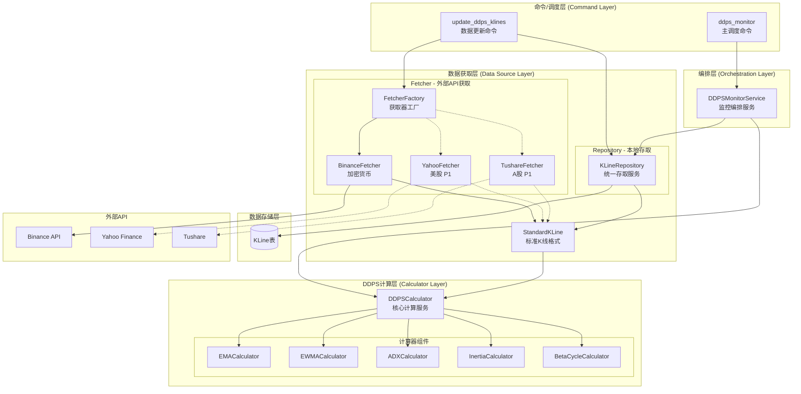
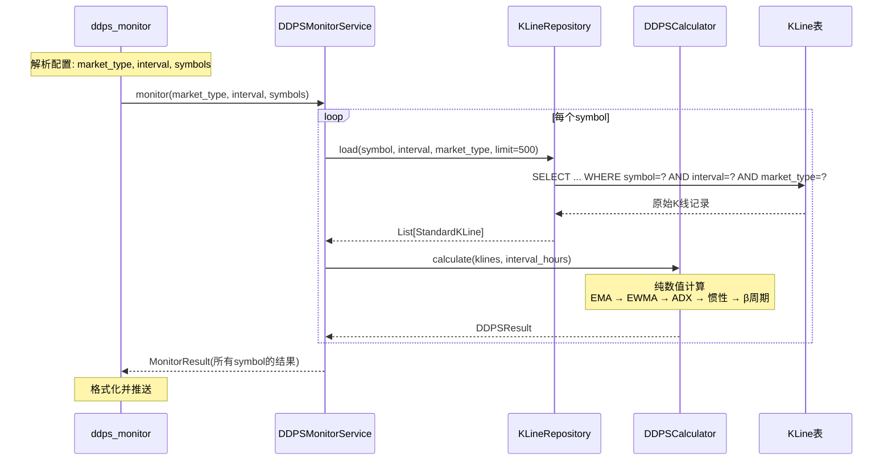

# 架构设计: DDPS多市场多周期支持

## 文档信息

| 属性 | 值 |
|------|-----|
| 迭代编号 | 024 |
| 版本 | 1.0 |
| 创建日期 | 2026-01-09 |
| 状态 | 已确认 |
| 关联PRD | prd.md |
| 关联功能点 | function-points.md |

---

## 1. 设计目标

### 1.1 核心理念

**数据获取层与计算层解耦**：
- **数据获取层**：负责从不同市场/周期获取数据，整理成**标准K线格式**
- **DDPS计算层**：只接收标准K线列表，**不关心数据来源**，进行纯数值计算

### 1.2 设计原则

| 原则 | 说明 |
|------|------|
| 单一职责 | Fetcher负责获取，Repository负责存取，Calculator负责计算 |
| 接口隔离 | 不同职责使用不同接口，不强制实现不需要的方法 |
| 依赖倒置 | 高层模块依赖抽象接口，不依赖具体实现 |
| 开闭原则 | 新增市场只需实现Fetcher，无需修改计算层 |

---

## 2. 系统架构

### 2.1 整体架构图



### 2.2 数据流图



---

## 3. 核心组件设计

### 3.1 标准K线格式

```python
from dataclasses import dataclass

@dataclass
class StandardKLine:
    """
    标准K线数据结构 - 与数据源无关

    所有数据源获取的K线都转换为此格式，
    DDPS计算层只接受此格式的数据。
    """
    timestamp: int      # 开盘时间，毫秒时间戳
    open: float         # 开盘价
    high: float         # 最高价
    low: float          # 最低价
    close: float        # 收盘价
    volume: float       # 成交量
```

### 3.2 数据获取层

#### 3.2.1 Fetcher接口（外部API获取）

```python
from abc import ABC, abstractmethod
from typing import List

class KLineFetcher(ABC):
    """
    K线获取器抽象接口

    职责：从外部API获取K线数据，转换为标准格式
    """

    @abstractmethod
    def fetch(
        self,
        symbol: str,
        interval: str,
        limit: int = 500,
        start_time: int = None,
        end_time: int = None
    ) -> List[StandardKLine]:
        """
        从外部API获取K线数据

        Args:
            symbol: 交易对/股票代码
            interval: K线周期 (1m, 5m, 1h, 4h, 1d等)
            limit: 获取数量
            start_time: 开始时间戳（毫秒）
            end_time: 结束时间戳（毫秒）

        Returns:
            标准K线列表，按时间正序排列
        """
        pass

    @abstractmethod
    def get_market_type(self) -> str:
        """返回市场类型标识"""
        pass

    @abstractmethod
    def get_supported_intervals(self) -> List[str]:
        """返回支持的K线周期列表"""
        pass

    @abstractmethod
    def normalize_symbol(self, symbol: str) -> str:
        """标准化交易对格式"""
        pass
```

#### 3.2.2 Fetcher实现

```python
class BinanceFetcher(KLineFetcher):
    """
    Binance K线获取器

    支持现货(spot)和合约(futures)两种市场
    """

    def __init__(self, market: str = 'futures'):
        """
        Args:
            market: 'spot' 或 'futures'
        """
        self.market = market

    def fetch(self, symbol, interval, limit=500, start_time=None, end_time=None):
        # 复用现有 binance_kline_service 逻辑
        if self.market == 'futures':
            raw_klines = fetch_futures_klines(symbol, interval, limit, start_time, end_time)
        else:
            raw_klines = fetch_klines(symbol, interval, limit, start_time, end_time)

        # 转换为标准格式
        return [self._to_standard(k) for k in raw_klines]

    def _to_standard(self, kline_data) -> StandardKLine:
        return StandardKLine(
            timestamp=int(kline_data.open_time.timestamp() * 1000),
            open=float(kline_data.open),
            high=float(kline_data.high),
            low=float(kline_data.low),
            close=float(kline_data.close),
            volume=float(kline_data.volume)
        )

    def get_market_type(self) -> str:
        return f'crypto_{self.market}'  # crypto_spot 或 crypto_futures

    def get_supported_intervals(self) -> List[str]:
        return ['1m', '5m', '15m', '30m', '1h', '4h', '1d', '1w']

    def normalize_symbol(self, symbol: str) -> str:
        return symbol.upper().replace('/', '')
```

#### 3.2.3 Fetcher工厂

```python
class FetcherFactory:
    """Fetcher工厂 - 根据市场类型创建对应的Fetcher"""

    _fetchers = {
        'crypto_spot': lambda: BinanceFetcher(market='spot'),
        'crypto_futures': lambda: BinanceFetcher(market='futures'),
        # P1预留
        # 'us_stock': lambda: YahooFetcher(),
        # 'a_stock': lambda: TushareFetcher(),
    }

    @classmethod
    def get_fetcher(cls, market_type: str) -> KLineFetcher:
        """
        获取指定市场类型的Fetcher

        Args:
            market_type: 市场类型 (crypto_spot, crypto_futures, us_stock, a_stock)

        Returns:
            对应的KLineFetcher实例

        Raises:
            ValueError: 不支持的市场类型
        """
        if market_type not in cls._fetchers:
            raise ValueError(f"不支持的市场类型: {market_type}")
        return cls._fetchers[market_type]()

    @classmethod
    def register(cls, market_type: str, factory_func):
        """注册新的Fetcher"""
        cls._fetchers[market_type] = factory_func
```

#### 3.2.4 Repository（本地存取）

```python
class KLineRepository:
    """
    K线数据仓库 - 统一的本地存取服务

    职责：
    - 从数据库加载K线并转换为标准格式
    - 将标准K线保存到数据库
    """

    def load(
        self,
        symbol: str,
        interval: str,
        market_type: str,
        limit: int = 500
    ) -> List[StandardKLine]:
        """
        从数据库加载K线数据

        Args:
            symbol: 交易对
            interval: K线周期
            market_type: 市场类型
            limit: 加载数量

        Returns:
            标准K线列表，按时间正序排列
        """
        queryset = KLine.objects.filter(
            symbol=symbol,
            interval=interval,
            market_type=market_type
        ).order_by('-open_time')[:limit]

        klines = [self._to_standard(k) for k in queryset]
        klines.reverse()  # 转为时间正序
        return klines

    def save(
        self,
        klines: List[StandardKLine],
        symbol: str,
        interval: str,
        market_type: str
    ) -> int:
        """
        保存标准K线到数据库

        Returns:
            新增记录数
        """
        new_count = 0
        for kline in klines:
            open_time = datetime.fromtimestamp(kline.timestamp / 1000, tz=timezone.utc)

            _, created = KLine.objects.get_or_create(
                symbol=symbol,
                interval=interval,
                market_type=market_type,
                open_time=open_time,
                defaults={
                    'open_price': kline.open,
                    'high_price': kline.high,
                    'low_price': kline.low,
                    'close_price': kline.close,
                    'volume': kline.volume,
                    'close_time': open_time + self._interval_to_delta(interval),
                }
            )
            if created:
                new_count += 1

        return new_count

    def _to_standard(self, kline: KLine) -> StandardKLine:
        return StandardKLine(
            timestamp=int(kline.open_time.timestamp() * 1000),
            open=float(kline.open_price),
            high=float(kline.high_price),
            low=float(kline.low_price),
            close=float(kline.close_price),
            volume=float(kline.volume)
        )

    def _interval_to_delta(self, interval: str) -> timedelta:
        mapping = {
            '1m': timedelta(minutes=1),
            '5m': timedelta(minutes=5),
            '15m': timedelta(minutes=15),
            '30m': timedelta(minutes=30),
            '1h': timedelta(hours=1),
            '4h': timedelta(hours=4),
            '1d': timedelta(days=1),
            '1w': timedelta(weeks=1),
        }
        return mapping.get(interval, timedelta(hours=4))
```

### 3.3 DDPS计算层

#### 3.3.1 DDPSCalculator（核心计算服务）

```python
from dataclasses import dataclass
from typing import List, Optional
import numpy as np

@dataclass
class DDPSResult:
    """DDPS计算结果"""
    # 基础指标
    current_price: float
    ema25: float
    p5: float
    p95: float
    ewma_std: float
    probability: int          # 0-100

    # 惯性扇面
    inertia_mid: float
    inertia_upper: float
    inertia_lower: float
    beta: float

    # β宏观周期
    cycle_phase: str          # consolidation, bull_warning, bull_strong, bear_warning, bear_strong
    cycle_duration_bars: int
    cycle_duration_hours: float

    # 序列数据（可选，用于图表）
    ema_series: Optional[np.ndarray] = None
    p5_series: Optional[np.ndarray] = None
    p95_series: Optional[np.ndarray] = None


class DDPSCalculator:
    """
    DDPS核心计算服务

    职责：接收标准K线列表，计算DDPS全部指标
    特点：不关心数据来源，只做纯数值计算
    """

    def __init__(
        self,
        ema_period: int = 25,
        ewma_window: int = 50,
        adx_period: int = 14,
        inertia_base_period: int = 5
    ):
        """
        初始化计算器

        Args:
            ema_period: EMA周期，默认25
            ewma_window: EWMA窗口，默认50
            adx_period: ADX周期，默认14
            inertia_base_period: 惯性基础周期，默认5
        """
        self._ema_calc = EMACalculator(period=ema_period)
        self._ewma_calc = EWMACalculator(window_n=ewma_window)
        self._adx_calc = ADXCalculator(period=adx_period)
        self._inertia_calc = InertiaCalculator(base_period=inertia_base_period)
        self._cycle_calc = BetaCycleCalculator()

    def calculate(
        self,
        klines: List[StandardKLine],
        interval_hours: float = 4.0,
        include_series: bool = False
    ) -> Optional[DDPSResult]:
        """
        计算DDPS指标

        Args:
            klines: 标准K线列表（需要>=180根）
            interval_hours: K线周期小时数（仅用于统计显示）
            include_series: 是否包含序列数据

        Returns:
            DDPSResult，数据不足返回None
        """
        if len(klines) < 180:
            return None

        # 提取价格序列
        prices = np.array([k.close for k in klines])
        highs = np.array([k.high for k in klines])
        lows = np.array([k.low for k in klines])
        timestamps = np.array([k.timestamp for k in klines])

        # 1. 计算EMA
        ema_array = self._ema_calc.calculate_ema_series(prices)

        # 2. 计算偏离率和EWMA标准差
        deviation = self._ema_calc.calculate_deviation_series(prices)
        ewma_mean, ewma_std_series = self._ewma_calc.calculate_ewma_stats(deviation)

        # 3. 计算P5和P95
        z_p5, z_p95 = -1.645, 1.645
        p5_array = ema_array * (1 + z_p5 * ewma_std_series)
        p95_array = ema_array * (1 + z_p95 * ewma_std_series)

        # 4. 计算ADX
        adx_result = self._adx_calc.calculate(highs, lows, prices)
        adx_series = adx_result['adx']

        # 5. 计算惯性扇面
        fan_result = self._inertia_calc.calculate_historical_fan_series(
            timestamps=timestamps / 1000,  # 转为秒
            ema_series=ema_array,
            sigma_series=ewma_std_series,
            adx_series=adx_series
        )
        beta_array = np.array(fan_result['beta'])

        # 6. 计算β宏观周期
        beta_list = [b if not np.isnan(b) else None for b in beta_array]
        cycle_phases, current_cycle = self._cycle_calc.calculate(
            beta_list=beta_list,
            timestamps=timestamps.tolist(),
            prices=prices.tolist(),
            interval_hours=interval_hours
        )

        # 7. 计算概率位置
        current_price = prices[-1]
        current_ema = ema_array[-1]
        current_std = ewma_std_series[-1]
        probability = self._calculate_probability(current_price, current_ema, current_std)

        # 构建结果
        result = DDPSResult(
            current_price=current_price,
            ema25=current_ema,
            p5=p5_array[-1],
            p95=p95_array[-1],
            ewma_std=current_std,
            probability=probability,
            inertia_mid=fan_result['mid'][-1],
            inertia_upper=fan_result['upper'][-1],
            inertia_lower=fan_result['lower'][-1],
            beta=beta_array[-1] if not np.isnan(beta_array[-1]) else 0,
            cycle_phase=cycle_phases[-1] if cycle_phases else 'consolidation',
            cycle_duration_bars=current_cycle.get('duration_bars', 0),
            cycle_duration_hours=current_cycle.get('duration_hours', 0),
        )

        if include_series:
            result.ema_series = ema_array
            result.p5_series = p5_array
            result.p95_series = p95_array

        return result

    def _calculate_probability(self, price: float, ema: float, std: float) -> int:
        """计算价格概率位置（0-100）"""
        if ema == 0 or std == 0:
            return 50

        from scipy.stats import norm
        deviation = (price - ema) / ema
        z_score = deviation / std
        probability = norm.cdf(z_score) * 100
        return int(min(100, max(0, probability)))
```

### 3.4 编排层

#### 3.4.1 DDPSMonitorService（监控编排服务）

```python
class DDPSMonitorService:
    """
    DDPS监控编排服务

    职责：组合数据获取、计算、推送的完整流程
    """

    def __init__(
        self,
        repository: KLineRepository = None,
        calculator: DDPSCalculator = None
    ):
        self.repository = repository or KLineRepository()
        self.calculator = calculator or DDPSCalculator()

    def monitor(
        self,
        symbols: List[str],
        interval: str,
        market_type: str,
        strategy_id: int = 7
    ) -> DDPSMonitorResult:
        """
        执行监控流程

        Args:
            symbols: 交易对列表
            interval: K线周期
            market_type: 市场类型
            strategy_id: 策略ID

        Returns:
            DDPSMonitorResult
        """
        interval_hours = self._get_interval_hours(interval)
        results = {}

        for symbol in symbols:
            # 1. 从Repository加载标准K线
            klines = self.repository.load(
                symbol=symbol,
                interval=interval,
                market_type=market_type,
                limit=500
            )

            if len(klines) < 180:
                continue

            # 2. 调用Calculator计算
            ddps_result = self.calculator.calculate(
                klines=klines,
                interval_hours=interval_hours
            )

            if ddps_result:
                results[symbol] = ddps_result

        # 3. 汇总结果
        return self._build_monitor_result(results, strategy_id)

    def _get_interval_hours(self, interval: str) -> float:
        mapping = {
            '1m': 1/60, '5m': 5/60, '15m': 0.25, '30m': 0.5,
            '1h': 1, '4h': 4, '1d': 24, '1w': 168
        }
        return mapping.get(interval, 4.0)

    def _build_monitor_result(self, results: dict, strategy_id: int) -> DDPSMonitorResult:
        """汇总计算结果为监控结果"""
        # ... 实现买入信号检测、卖出信号检测、周期预警等
        pass
```

---

## 4. 配置设计

### 4.1 新配置结构

```python
# settings.py

DDPS_MONITOR_CONFIG = {
    # 默认配置
    'default_market': 'crypto_futures',
    'default_interval': '4h',

    # 市场配置
    'markets': {
        'crypto_futures': {
            'fetcher': 'binance',
            'symbols': ['ETHUSDT', 'BTCUSDT', 'BNBUSDT', 'SOLUSDT', 'SUIUSDT', 'HYPEUSDT'],
            'intervals': ['1h', '4h', '1d'],
        },
        'crypto_spot': {
            'fetcher': 'binance',
            'symbols': ['BTC/USDT', 'ETH/USDT'],
            'intervals': ['4h', '1d'],
        },
        # P1预留
        'us_stock': {
            'fetcher': 'yahoo',
            'symbols': ['AAPL', 'GOOGL', 'MSFT'],
            'intervals': ['1d'],
        },
        'a_stock': {
            'fetcher': 'tushare',
            'symbols': ['000001.SZ', '600000.SH'],
            'intervals': ['1d'],
        },
    },

    # 周期转换映射
    'interval_hours': {
        '1m': 1/60,
        '5m': 5/60,
        '15m': 0.25,
        '30m': 0.5,
        '1h': 1,
        '4h': 4,
        '1d': 24,
        '1w': 168,
    },

    # 推送配置
    'push_channel': 'price_ddps',
    'push_token': '...',
}
```

### 4.2 配置解析器

```python
class DDPSConfigParser:
    """DDPS配置解析器"""

    @staticmethod
    def get_market_config(market_type: str) -> dict:
        """获取指定市场的配置"""
        config = settings.DDPS_MONITOR_CONFIG
        return config.get('markets', {}).get(market_type, {})

    @staticmethod
    def get_interval_hours(interval: str) -> float:
        """获取周期对应的小时数"""
        config = settings.DDPS_MONITOR_CONFIG
        return config.get('interval_hours', {}).get(interval, 4.0)

    @staticmethod
    def get_default_market() -> str:
        return settings.DDPS_MONITOR_CONFIG.get('default_market', 'crypto_futures')

    @staticmethod
    def get_default_interval() -> str:
        return settings.DDPS_MONITOR_CONFIG.get('default_interval', '4h')
```

---

## 5. 组件与需求映射

| 组件 | 负责实现的功能点 |
|------|------------------|
| `StandardKLine` | FP-024-001, FP-024-002 - 标准数据结构定义 |
| `KLineFetcher` | FP-024-005 - 数据源抽象接口 |
| `BinanceFetcher` | FP-024-006 - Binance数据源实现 |
| `FetcherFactory` | FP-024-007 - 数据源工厂 |
| `KLineRepository` | FP-024-003, FP-024-004 - KLine存取和向后兼容 |
| `DDPSCalculator` | FP-024-009, FP-024-010 - 周期参数化和Cycle适配 |
| `DDPSMonitorService` | FP-024-011 - 市场类型参数化 |
| `DDPSConfigParser` | FP-024-013, FP-024-014 - 配置格式和解析 |
| 命令行扩展 | FP-024-015 - --market/--interval参数 |

---

## 6. 关键决策记录

### 6.1 DDPSMonitorService重构策略

**决策**：拆分为 `DDPSCalculator` + `DDPSMonitorService`

**理由**：
- 职责单一：计算归计算，编排归编排
- `DDPSCalculator` 可被其他场景复用（回测、API服务）
- `DDPSMonitorService` 作为高层编排，职责清晰

### 6.2 数据源接口职责

**决策**：分离 `KLineFetcher` + `KLineRepository`

**理由**：
- Fetcher专注于API适配，不同市场只需实现Fetcher
- Repository统一实现，存取逻辑不需要重复
- 符合接口隔离原则

### 6.3 interval_hours传递方式

**决策**：作为 `DDPSCalculator.calculate()` 的显式参数

**理由**：
- K线数据结构保持最简（OHLCV + timestamp）
- `interval_hours` 仅用于显示统计，作为可选参数更清晰
- 计算层保持纯净，不依赖外部配置

---

## 7. 文件结构

```
ddps_z/
├── models.py                    # 数据模型（StandardKLine, DDPSResult等）
├── calculators/
│   ├── __init__.py
│   ├── ema_calculator.py        # [已有] EMA计算
│   ├── ewma_calculator.py       # [已有] EWMA计算
│   ├── adx_calculator.py        # [已有] ADX计算
│   ├── inertia_calculator.py    # [已有] 惯性计算
│   ├── beta_cycle_calculator.py # [已有] β周期计算
│   └── ddps_calculator.py       # [新增] DDPS核心计算服务
├── datasources/
│   ├── __init__.py
│   ├── base.py                  # [新增] KLineFetcher抽象接口
│   ├── binance_fetcher.py       # [新增] Binance数据获取
│   ├── fetcher_factory.py       # [新增] Fetcher工厂
│   └── repository.py            # [新增] KLine存取仓库
├── services/
│   ├── __init__.py
│   ├── ddps_monitor_service.py  # [重构] 监控编排服务
│   └── config_parser.py         # [新增] 配置解析器
└── management/commands/
    ├── ddps_monitor.py          # [改造] 主调度命令
    └── update_ddps_klines.py    # [改造] 数据更新命令
```

---

## 8. 向后兼容

### 8.1 market_type兼容映射

| 旧值 | 新值 |
|------|------|
| `spot` | `crypto_spot` |
| `futures` | `crypto_futures` |

### 8.2 API兼容

现有API接口保持不变，新增参数为可选：
- `--market`: 新增，默认 `crypto_futures`
- `--interval`: 已存在，默认 `4h`

### 8.3 配置兼容

配置解析器自动识别新旧格式，旧格式自动转换为新格式。
