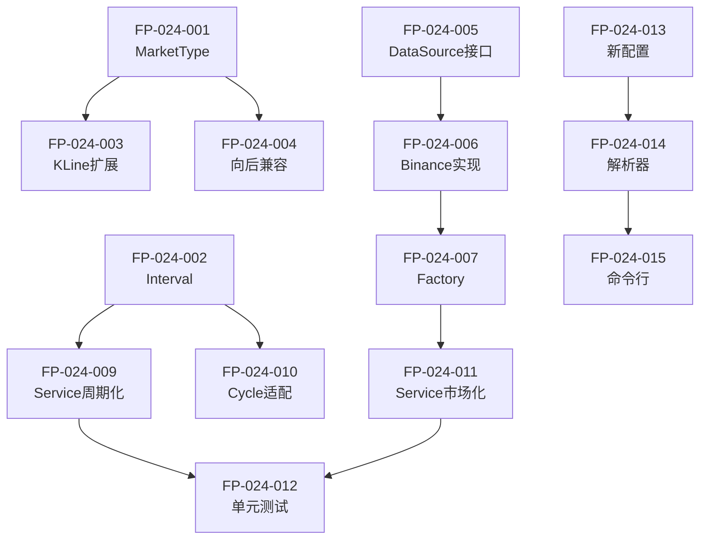

# 功能点清单: DDPS多市场多周期支持

## 文档信息

| 属性 | 值 |
|------|-----|
| 迭代编号 | 024 |
| 版本 | 1.0 |
| 创建日期 | 2026-01-09 |
| 功能点总数 | 15 |

---

## 功能点概览

| 模块 | 功能点数 | MVP | P1 |
|------|----------|-----|-----|
| 类型定义 | 4 | 4 | 0 |
| 数据源抽象 | 4 | 2 | 2 |
| 服务层改造 | 4 | 4 | 0 |
| 配置扩展 | 3 | 3 | 0 |

---

## 模块1: 类型定义

### FP-024-001: MarketType枚举定义

| 属性 | 值 |
|------|-----|
| 优先级 | P0 |
| 复杂度 | 低 |
| 预估工作量 | 0.5h |

**描述**: 定义市场类型枚举类

**验收标准**:
- [ ] 包含 crypto_spot, crypto_futures, us_stock, a_stock, hk_stock
- [ ] 提供CHOICES列表供Django模型使用
- [ ] 提供 is_crypto(), is_stock() 辅助方法

---

### FP-024-002: Interval周期枚举定义

| 属性 | 值 |
|------|-----|
| 优先级 | P0 |
| 复杂度 | 低 |
| 预估工作量 | 0.5h |

**描述**: 定义标准K线周期枚举

**验收标准**:
- [ ] 包含 1m, 5m, 15m, 30m, 1h, 4h, 1d, 1w
- [ ] 提供 to_hours(interval) 转换方法
- [ ] 提供 to_minutes(interval) 转换方法
- [ ] 提供 CHOICES 列表

---

### FP-024-003: KLine模型market_type扩展

| 属性 | 值 |
|------|-----|
| 优先级 | P0 |
| 复杂度 | 低 |
| 预估工作量 | 1h |

**描述**: 扩展KLine模型的market_type字段

**验收标准**:
- [ ] MARKET_TYPE_CHOICES包含新市场类型
- [ ] 提供数据迁移脚本（spot→crypto_spot, futures→crypto_futures）
- [ ] 向后兼容旧值

---

### FP-024-004: 向后兼容映射

| 属性 | 值 |
|------|-----|
| 优先级 | P0 |
| 复杂度 | 低 |
| 预估工作量 | 0.5h |

**描述**: 实现旧market_type值到新值的映射

**验收标准**:
- [ ] 'spot' 自动映射为 'crypto_spot'
- [ ] 'futures' 自动映射为 'crypto_futures'
- [ ] 查询时透明处理

---

## 模块2: 数据源抽象

### FP-024-005: KLineDataSource接口定义

| 属性 | 值 |
|------|-----|
| 优先级 | P0 |
| 复杂度 | 中 |
| 预估工作量 | 1h |

**描述**: 定义K线数据源抽象接口

**接口方法**:
```python
class KLineDataSource(ABC):
    @abstractmethod
    def fetch_klines(symbol, interval, limit) -> List[dict]

    @abstractmethod
    def get_supported_intervals() -> List[str]

    @abstractmethod
    def normalize_symbol(symbol) -> str

    @abstractmethod
    def get_market_type() -> str
```

**验收标准**:
- [ ] 接口定义完整
- [ ] 包含类型注解
- [ ] 包含文档字符串

---

### FP-024-006: BinanceDataSource实现

| 属性 | 值 |
|------|-----|
| 优先级 | P0 |
| 复杂度 | 中 |
| 预估工作量 | 1h |

**描述**: 重构现有Binance数据获取为DataSource实现

**验收标准**:
- [ ] 实现KLineDataSource接口
- [ ] 支持spot和futures两种类型
- [ ] 复用现有DataFetcher逻辑

---

### FP-024-007: DataSourceFactory工厂类

| 属性 | 值 |
|------|-----|
| 优先级 | P0 |
| 复杂度 | 低 |
| 预估工作量 | 0.5h |

**描述**: 根据market_type创建对应DataSource

**验收标准**:
- [ ] get_data_source(market_type) 返回正确��例
- [ ] 支持注册自定义数据源
- [ ] 未知类型抛出明确异常

---

### FP-024-008: 股票数据源接口预留（P1）

| 属性 | 值 |
|------|-----|
| 优先级 | P1 |
| 复杂度 | 中 |
| 预估工作量 | 2h |

**描述**: 预留Yahoo Finance/Tushare等股票数据源接口

**验收标准**:
- [ ] 定义StockDataSource基类
- [ ] 包含交易日历处理接口
- [ ] 暂不实现具体逻辑

---

## 模块3: 服务层改造

### FP-024-009: DDPSMonitorService周期参数化

| 属性 | 值 |
|------|-----|
| 优先级 | P0 |
| 复杂度 | 中 |
| 预估工作量 | 1.5h |

**描述**: DDPSMonitorService支持任意周期

**改造点**:
- __init__ 接受 interval 参数
- 内部计算使用 Interval.to_hours() 转换
- 移除硬编码的 '4h'

**验收标准**:
- [ ] 支持传入任意interval
- [ ] 默认值仍为'4h'
- [ ] 计算结果与周期匹配

---

### FP-024-010: BetaCycleCalculator周期适配

| 属性 | 值 |
|------|-----|
| 优先级 | P0 |
| 复杂度 | 中 |
| 预估工作量 | 1h |

**描述**: BetaCycleCalculator支持任意周期

**改造点**:
- calculate() 接受 interval 参数
- 自动转换为 interval_hours
- 周期阈值按比例调整

**验收标准**:
- [ ] 1h周期计算正确
- [ ] 1d周期计算正确
- [ ] 周期阈值按比例缩放

---

### FP-024-011: DDPSMonitorService市场类型参数化

| 属性 | 值 |
|------|-----|
| 优先级 | P0 |
| 复杂度 | 中 |
| 预估工作量 | 1h |

**描述**: DDPSMonitorService支持任意市场类型

**改造点**:
- __init__ 接受 market_type 参数
- 使用DataSourceFactory获取数据源
- 移除硬编码的 'futures'

**验收标准**:
- [ ] 支持传入任意market_type
- [ ] 默认值仍为'crypto_futures'
- [ ] 数据获取使用正确数据源

---

### FP-024-012: 服务层单元测试

| 属性 | 值 |
|------|-----|
| 优先级 | P0 |
| 复杂度 | 中 |
| 预估工作量 | 1.5h |

**描述**: 为改造后的服务层编写单元测试

**验收标准**:
- [ ] 测试不同interval的计算
- [ ] 测试不同market_type的数据获取
- [ ] 测试向后兼容性

---

## 模块4: 配置扩展

### FP-024-013: 新配置格式定义

| 属性 | 值 |
|------|-----|
| 优先级 | P0 |
| 复杂度 | 低 |
| 预估工作量 | 0.5h |

**描述**: 定义新的DDPS_MONITOR_CONFIG格式

**验收标准**:
- [ ] 支持多市场配置
- [ ] 每个市场独立symbols列表
- [ ] 每个市场独立intervals列表

---

### FP-024-014: 配置解析器

| 属性 | 值 |
|------|-----|
| 优先级 | P0 |
| 复杂度 | 中 |
| 预估工作量 | 1h |

**描述**: 解析新旧两种配置格式

**验收标准**:
- [ ] 自动识别配置格式版本
- [ ] 旧格式自动转换为新格式
- [ ] 提供 get_market_config(market_type) 方法

---

### FP-024-015: 命令行参数扩展

| 属性 | 值 |
|------|-----|
| 优先级 | P0 |
| 复杂度 | 低 |
| 预估工作量 | 0.5h |

**描述**: ddps_monitor命令支持--market参数

**验收标准**:
- [ ] --market 参数指定市场类型
- [ ] --interval 参数已存在，确保正常工作
- [ ] 帮助文档完整

---

## 依赖关系



---

## 工作量估算

| 优先级 | 功能点数 | 预估工时 |
|--------|----------|----------|
| P0 | 13 | 11.5h |
| P1 | 2 | 2h |
| **总计** | **15** | **13.5h** |
