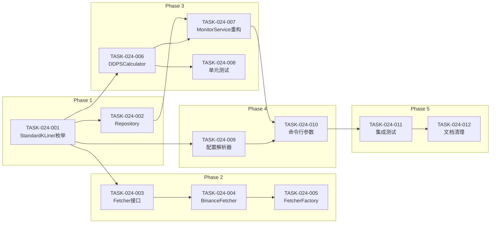

# 任务计划: DDPS多市场多周期支持

## 文档信息

| 属性 | 值 |
|------|-----|
| 迭代编号 | 024 |
| 版本 | 1.0 |
| 创建日期 | 2026-01-09 |
| 总任务数 | 12 |
| 预估工时 | 11.5h |

---

## 任务概览

| 阶段 | 任务数 | 预估工时 | 状态 |
|------|--------|----------|------|
| Phase 1: 基础类型定义 | 2 | 1.5h | 待开始 |
| Phase 2: 数据源抽象层 | 3 | 3h | 待开始 |
| Phase 3: DDPS计算层重构 | 3 | 3.5h | 待开始 |
| Phase 4: 配置与命令层 | 2 | 2h | 待开始 |
| Phase 5: 集成测试与验收 | 2 | 1.5h | 待开始 |

---

## Phase 1: 基础类型定义

### TASK-024-001: 定义StandardKLine和类型枚举

| 属性 | 值 |
|------|-----|
| 优先级 | P0 |
| 预估工时 | 1h |
| 依赖任务 | 无 |
| 关联功能点 | FP-024-001, FP-024-002 |

**目标**: 创建标准K线格式和类型枚举

**实现步骤**:
1. 创建 `ddps_z/models/standard_kline.py`
2. 定义 `StandardKLine` dataclass
3. 定义 `MarketType` 枚举类
4. 定义 `Interval` 枚举类（含 `to_hours()` 方法）

**交付物**:
```
ddps_z/models/standard_kline.py
├── StandardKLine (dataclass)
├── MarketType (枚举)
└── Interval (枚举)
```

**验收标准**:
- [ ] StandardKLine 包含 timestamp, open, high, low, close, volume
- [ ] MarketType 包含 crypto_spot, crypto_futures, us_stock, a_stock, hk_stock
- [ ] Interval.to_hours('4h') 返回 4.0
- [ ] Interval.to_hours('1d') 返回 24.0

**状态**: `[ ] 待开始`

---

### TASK-024-002: 创建KLineRepository存取服务

| 属性 | 值 |
|------|-----|
| 优先级 | P0 |
| 预估工时 | 0.5h |
| 依赖任务 | TASK-024-001 |
| 关联功能点 | FP-024-003, FP-024-004 |

**目标**: 创建统一的K线数据库存取服务

**实现步骤**:
1. 创建 `ddps_z/datasources/repository.py`
2. 实现 `load()` 方法：从DB加载并转换为StandardKLine
3. 实现 `save()` 方法：将StandardKLine保存到DB
4. 实现向后兼容映射（spot→crypto_spot）

**交付物**:
```
ddps_z/datasources/repository.py
└── KLineRepository
    ├── load(symbol, interval, market_type, limit) -> List[StandardKLine]
    ├── save(klines, symbol, interval, market_type) -> int
    └── _normalize_market_type(market_type) -> str  # 向后兼容
```

**验收标准**:
- [ ] load() 返回按时间正序的StandardKLine列表
- [ ] save() 返回新增记录数
- [ ] 传入 'futures' 自动映射为 'crypto_futures'
- [ ] 传入 'spot' 自动映射为 'crypto_spot'

**状态**: `[ ] 待开始`

---

## Phase 2: 数据源抽象层

### TASK-024-003: 定义KLineFetcher抽象接口

| 属性 | 值 |
|------|-----|
| 优先级 | P0 |
| 预估工时 | 0.5h |
| 依赖任务 | TASK-024-001 |
| 关联功能点 | FP-024-005 |

**目标**: 定义K线数据获取的抽象接口

**实现步骤**:
1. 创建 `ddps_z/datasources/base.py`
2. 定义 `KLineFetcher` 抽象基类
3. 定义所有抽象方法和类型注解

**交付物**:
```
ddps_z/datasources/base.py
└── KLineFetcher (ABC)
    ├── fetch(symbol, interval, limit, start_time, end_time) -> List[StandardKLine]
    ├── get_market_type() -> str
    ├── get_supported_intervals() -> List[str]
    └── normalize_symbol(symbol) -> str
```

**验收标准**:
- [ ] 接口定义完整，包含所有必要方法
- [ ] 所有方法包含类型注解
- [ ] 所有方法包含docstring说明

**状态**: `[ ] 待开始`

---

### TASK-024-004: 实现BinanceFetcher

| 属性 | 值 |
|------|-----|
| 优先级 | P0 |
| 预估工时 | 1.5h |
| 依赖任务 | TASK-024-003 |
| 关联功能点 | FP-024-006 |

**目标**: 实现Binance数据源（复用现有逻辑）

**实现步骤**:
1. 创建 `ddps_z/datasources/binance_fetcher.py`
2. 实现 `BinanceFetcher` 类
3. 复用 `vp_squeeze.services.binance_kline_service` 的获取逻辑
4. 实现数据格式转换（KLineData → StandardKLine）
5. 支持 spot 和 futures 两种模式

**交付物**:
```
ddps_z/datasources/binance_fetcher.py
└── BinanceFetcher(KLineFetcher)
    ├── __init__(market='futures')
    ├── fetch(...) -> List[StandardKLine]
    ├── get_market_type() -> str  # 返回 crypto_spot 或 crypto_futures
    ├── get_supported_intervals() -> List[str]
    ├── normalize_symbol(symbol) -> str
    └── _to_standard(kline_data) -> StandardKLine
```

**验收标准**:
- [ ] fetch() 成功获取Binance K线数据
- [ ] 支持 market='spot' 和 market='futures'
- [ ] 返回的StandardKLine格式正确
- [ ] normalize_symbol('eth') 返回 'ETHUSDT'

**状态**: `[ ] 待开始`

---

### TASK-024-005: 实现FetcherFactory工厂

| 属性 | 值 |
|------|-----|
| 优先级 | P0 |
| 预估工时 | 1h |
| 依赖任务 | TASK-024-004 |
| 关联功能点 | FP-024-007 |

**目标**: 创建数据源工厂和模块初始化

**实现步骤**:
1. 创建 `ddps_z/datasources/fetcher_factory.py`
2. 实现 `FetcherFactory` 类
3. 实现 `register()` 方法支持扩展
4. 创建 `ddps_z/datasources/__init__.py` 导出所有组件

**交付物**:
```
ddps_z/datasources/
├── __init__.py
├── base.py
├── binance_fetcher.py
├── fetcher_factory.py
└── repository.py
```

**验收标准**:
- [ ] `FetcherFactory.get_fetcher('crypto_futures')` 返回 BinanceFetcher(market='futures')
- [ ] `FetcherFactory.get_fetcher('crypto_spot')` 返回 BinanceFetcher(market='spot')
- [ ] 未知market_type抛出 ValueError
- [ ] 支持 `register()` 注册新数据源

**状态**: `[ ] 待开始`

---

## Phase 3: DDPS计算层重构

### TASK-024-006: 实现DDPSCalculator核心计算服务

| 属性 | 值 |
|------|-----|
| 优先级 | P0 |
| 预估工时 | 2h |
| 依赖任务 | TASK-024-001 |
| 关联功能点 | FP-024-009, FP-024-010 |

**目标**: 创建纯计算服务，只接收标准K线

**实现步骤**:
1. 创建 `ddps_z/calculators/ddps_calculator.py`
2. 定义 `DDPSResult` dataclass
3. 实现 `DDPSCalculator` 类
4. 实现 `calculate()` 方法（复用现有计算器）
5. 移除所有数据库依赖

**交付物**:
```
ddps_z/calculators/ddps_calculator.py
├── DDPSResult (dataclass)
│   ├── current_price, ema25, p5, p95, ewma_std, probability
│   ├── inertia_mid, inertia_upper, inertia_lower, beta
│   └── cycle_phase, cycle_duration_bars, cycle_duration_hours
└── DDPSCalculator
    ├── __init__(ema_period, ewma_window, adx_period, inertia_base_period)
    ├── calculate(klines, interval_hours) -> DDPSResult
    └── _calculate_probability(price, ema, std) -> int
```

**验收标准**:
- [ ] calculate() 只接收 List[StandardKLine]，不访问数据库
- [ ] interval_hours 参数正确传递给 BetaCycleCalculator
- [ ] 返回完整的 DDPSResult
- [ ] 数据不足(<180根)时返回 None

**状态**: `[ ] 待开始`

---

### TASK-024-007: 重构DDPSMonitorService为编排服务

| 属性 | 值 |
|------|-----|
| 优先级 | P0 |
| 预估工时 | 1h |
| 依赖任务 | TASK-024-002, TASK-024-006 |
| 关联功能点 | FP-024-011 |

**目标**: 重构为高层编排服务，组合Repository和Calculator

**实现步骤**:
1. 修改 `ddps_z/services/ddps_monitor_service.py`
2. 移除 `_load_klines()` 方法，改用 Repository
3. 移除 `_calculate_symbol_indicators()`，改用 Calculator
4. 保留信号检测和消息格式化逻辑

**改造前后对比**:
```python
# 改造前
def __init__(self, symbols, strategy_id=7, interval='4h', market_type='futures'):
    # 内部直接查询数据库

# 改造后
def __init__(self, repository=None, calculator=None):
    self.repository = repository or KLineRepository()
    self.calculator = calculator or DDPSCalculator()

def monitor(self, symbols, interval, market_type, strategy_id=7):
    # 调用repository.load() 和 calculator.calculate()
```

**验收标准**:
- [ ] 不再直接依赖 KLine.objects
- [ ] 通过 Repository 加载数据
- [ ] 通过 Calculator 计算指标
- [ ] 信号检测逻辑保持不变

**状态**: `[ ] 待开始`

---

### TASK-024-008: DDPSCalculator单元测试

| 属性 | 值 |
|------|-----|
| 优先级 | P0 |
| 预估工时 | 0.5h |
| 依赖任务 | TASK-024-006 |
| 关联功能点 | FP-024-012 |

**目标**: 为DDPSCalculator编写单元测试

**实现步骤**:
1. 创建 `ddps_z/tests/test_ddps_calculator.py`
2. 编写测试用例：不同interval的计算
3. 编写测试用例：数据不足的处理
4. 编写测试用例：结果准确性验证

**测试用例**:
```python
def test_calculate_with_4h_interval()
def test_calculate_with_1h_interval()
def test_calculate_with_1d_interval()
def test_calculate_insufficient_data()
def test_calculate_result_accuracy()
```

**验收标准**:
- [ ] 测试覆盖不同interval场景
- [ ] 测试覆盖边界条件
- [ ] 所有测试通过

**状态**: `[ ] 待开始`

---

## Phase 4: 配置与命令层

### TASK-024-009: 扩展配置格式和解析器

| 属性 | 值 |
|------|-----|
| 优先级 | P0 |
| 预估工时 | 1h |
| 依赖任务 | TASK-024-001 |
| 关联功能点 | FP-024-013, FP-024-014 |

**目标**: 实现新的多市场配置格式

**实现步骤**:
1. 创建 `ddps_z/services/config_parser.py`
2. 实现 `DDPSConfigParser` 类
3. 更新 `settings.py` 中的 DDPS_MONITOR_CONFIG

**交付物**:
```
ddps_z/services/config_parser.py
└── DDPSConfigParser
    ├── get_market_config(market_type) -> dict
    ├── get_interval_hours(interval) -> float
    ├── get_default_market() -> str
    ├── get_default_interval() -> str
    └── get_all_markets() -> List[str]
```

**验收标准**:
- [ ] 新配置格式支持多市场
- [ ] get_interval_hours('4h') 返回 4.0
- [ ] get_market_config('crypto_futures') 返回正确配置
- [ ] 向后兼容旧配置格式

**状态**: `[ ] 待开始`

---

### TASK-024-010: 改造命令行参数

| 属性 | 值 |
|------|-----|
| 优先级 | P0 |
| 预估工时 | 1h |
| 依赖任务 | TASK-024-007, TASK-024-009 |
| 关联功能点 | FP-024-015 |

**目标**: ddps_monitor命令支持--market参数

**实现步骤**:
1. 修改 `ddps_z/management/commands/ddps_monitor.py`
2. 添加 `--market` 参数
3. 确保 `--interval` 参数正常工作
4. 更新帮助文档

**新增参数**:
```python
parser.add_argument(
    '--market',
    type=str,
    default='crypto_futures',
    choices=['crypto_spot', 'crypto_futures', 'us_stock', 'a_stock'],
    help='市场类型'
)
```

**验收标准**:
- [ ] `--market crypto_spot` 正确切换市场
- [ ] `--interval 1h` 正确切换周期
- [ ] 帮助文档显示新参数
- [ ] 默认值与配置一致

**状态**: `[ ] 待开始`

---

## Phase 5: 集成测试与验收

### TASK-024-011: 端到端集成测试

| 属性 | 值 |
|------|-----|
| 优先级 | P0 |
| 预估工时 | 1h |
| 依赖任务 | TASK-024-010 |
| 关联功能点 | 所有 |

**目标**: 验证完整流程工作正常

**测试场景**:
1. `ddps_monitor --full` 使用默认配置
2. `ddps_monitor --market crypto_spot --interval 1h`
3. `ddps_monitor --market crypto_futures --interval 1d`
4. 验证推送消息格式正确

**验收标准**:
- [ ] 默认配置（crypto_futures, 4h）工作正常
- [ ] 切换到 crypto_spot 工作正常
- [ ] 切换到 1h/1d 周期工作正常
- [ ] 推送消息包含正确的市场和周期信息

**状态**: `[ ] 待开始`

---

### TASK-024-012: 文档更新和代码清理

| 属性 | 值 |
|------|-----|
| 优先级 | P0 |
| 预估工时 | 0.5h |
| 依赖任务 | TASK-024-011 |
| 关联功能点 | 无 |

**目标**: 更新文档，清理遗留代码

**实现步骤**:
1. 更新 `ddps_z/calculators/__init__.py` 导出新组件
2. 更新 `ddps_z/services/__init__.py` 导出新组件
3. 删除不再使用的代码（如旧的_load_klines）
4. 更新README或使用说明

**验收标准**:
- [ ] 所有新组件正确导出
- [ ] 无遗留的废弃代码
- [ ] 导入路径简洁清晰

**状态**: `[ ] 待开始`

---

## 依赖关系图



---

## 工作量汇总

| 阶段 | 任务 | 工时 |
|------|------|------|
| Phase 1 | TASK-024-001, 002 | 1.5h |
| Phase 2 | TASK-024-003, 004, 005 | 3h |
| Phase 3 | TASK-024-006, 007, 008 | 3.5h |
| Phase 4 | TASK-024-009, 010 | 2h |
| Phase 5 | TASK-024-011, 012 | 1.5h |
| **总计** | **12个任务** | **11.5h** |

---

## 风险评估

| 风险 | 概率 | 影响 | 缓解措施 |
|------|------|------|----------|
| 现有计算器有隐藏依赖 | 低 | 中 | 已分析确认无外部依赖 |
| 向后兼容问题 | 中 | 中 | 添加market_type映射层 |
| 性能下降 | 低 | 低 | 保持相同的计算逻辑 |
