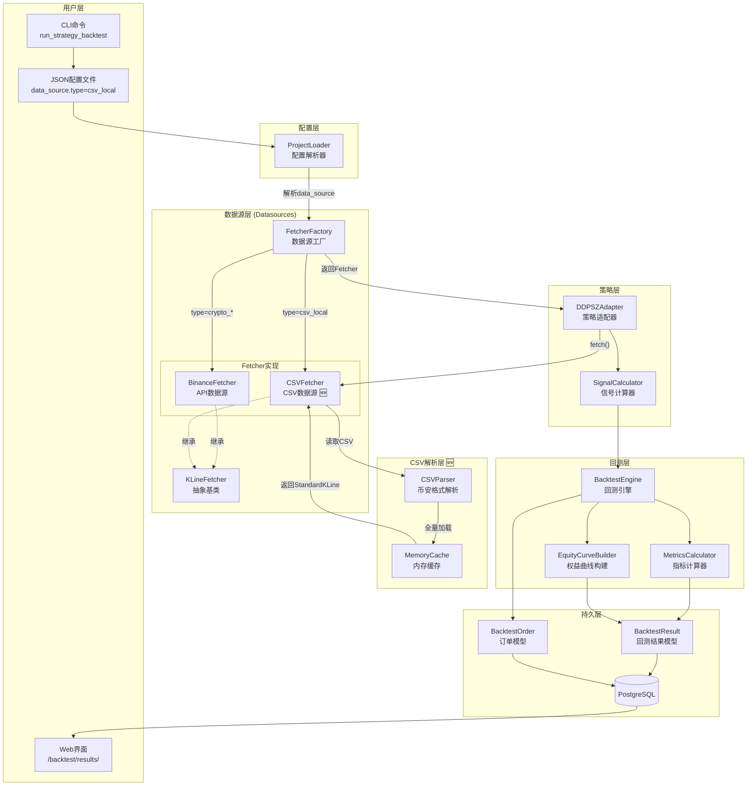
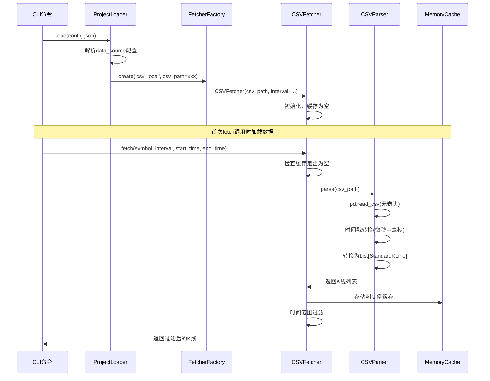
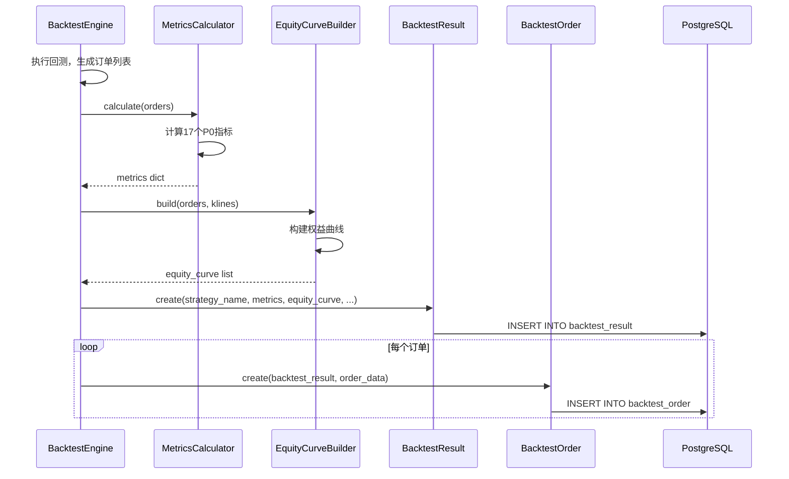

# 架构设计文档: CSV数据源K线获取服务

**迭代编号**: 025
**版本**: 1.0
**创建日期**: 2026-01-09
**状态**: 架构设计完成

---

## 1. 需求解读与目标对齐

### 1.1 核心业务目标

解决Binance API无法获取1秒级K线数据的限制，使系统能够使用本地CSV格式的历史K线数据（268万行1s数据、4.5万行1m数据）进行高频策略回测，并确保回测结果可持久化到数据库、通过Web界面查看完整的回测表现。

### 1.2 关键用户流程

```
┌─────────────────────────────────────────────────────────────────────────┐
│                        CSV数据源回测完整流程                              │
├─────────────────────────────────────────────────────────────────────────┤
│                                                                         │
│  1. 准备数据                                                             │
│     用户准备CSV格式K线文件（币安标准12列格式，如ETHUSDT-1s-2025-12.csv）   │
│                              ↓                                          │
│  2. 创建配置                                                             │
│     用户编写回测配置JSON，指定data_source.type="csv_local"和csv_path     │
│                              ↓                                          │
│  3. 执行回测                                                             │
│     运行: python manage.py run_strategy_backtest --config xxx.json      │
│                              ↓                                          │
│  4. 数据加载                                                             │
│     CSVFetcher全量加载CSV到内存，转换时间戳（微秒→毫秒），过滤时间范围      │
│                              ↓                                          │
│  5. 策略执行                                                             │
│     DDPSZAdapter使用CSV数据执行回测，计算信号和订单                       │
│                              ↓                                          │
│  6. 结果持久化                                                           │
│     使用--save-to-db参数，存储BacktestResult和BacktestOrder到数据库      │
│                              ↓                                          │
│  7. 结果查看                                                             │
│     通过/backtest/results/页面查看权益曲线、量化指标、订单列表            │
│                                                                         │
└─────────────────────────────────────────────────────────────────────────┘
```

### 1.3 功能模块概览

| 模块 | 功能点 | 核心职责 |
|------|--------|----------|
| CSV解析器 | FP-001~004 | 读取CSV、解析币安格式、时间戳转换 |
| CSVFetcher | FP-005~010 | 实现KLineFetcher接口、全量加载、时间过滤 |
| 工厂集成 | FP-011~012 | 注册csv_local类型、参数传递 |
| 回测命令集成 | FP-013~014 | JSON配置支持、DDPS适配器集成 |
| 回测结果持久化 | FP-015~018 | --save-to-db、BacktestResult/Order存储 |
| Web界面查看 | FP-019~022 | 结果列表、详情页、订单、权益曲线 |

---

## 2. 核心架构设计

### 2.1 系统架构图



### 2.2 概念解读

本架构采用**工厂模式 + 策略模式**的组合设计，通过新增`CSVFetcher`组件无缝扩展现有数据源体系。核心理念是：**最小化修改，最大化复用**——CSV数据源作为新的Fetcher实现接入，对上层回测引擎和策略层完全透明。

### 2.3 组件职责

| 组件 | 类型 | 位置 | 职责 |
|------|------|------|------|
| **CSVFetcher** | 🆕 新增 | `ddps_z/datasources/csv_fetcher.py` | 继承KLineFetcher，实现CSV文件的读取和StandardKLine转换 |
| **CSVParser** | 🆕 新增 | `ddps_z/datasources/csv_parser.py` | 解析币安12列CSV格式，处理时间戳转换（微秒→毫秒） |
| **FetcherFactory** | 现有扩展 | `ddps_z/datasources/fetcher_factory.py` | 注册csv_local类型，扩展create方法支持kwargs |
| **ProjectLoader** | 现有扩展 | `strategy_adapter/core/project_loader.py` | 解析data_source配置，传递csv_path参数 |
| **DDPSZAdapter** | 现有不变 | `strategy_adapter/adapters/ddpsz_adapter.py` | 通过Fetcher接口获取数据，无需感知数据源类型 |
| **BacktestResult** | 现有不变 | `strategy_adapter/models/db_models.py` | 存储回测配置、权益曲线、量化指标 |
| **BacktestOrder** | 现有不变 | `strategy_adapter/models/db_models.py` | 存储订单详情（买卖时间、价格、盈亏） |

---

## 3. 组件与需求映射

### 3.1 映射关系表

| 组件 | 负责实现的功能点 |
|------|------------------|
| **CSVParser** | FP-001 CSV文件读取<br>FP-002 币安格式解析<br>FP-003 时间戳转换<br>FP-004 无表头支持 |
| **CSVFetcher** | FP-005 KLineFetcher继承<br>FP-006 fetch方法实现<br>FP-007 全量加载策略<br>FP-008 时间范围过滤<br>FP-009 supports_interval<br>FP-010 market_type属性 |
| **FetcherFactory** | FP-011 FetcherFactory注册<br>FP-012 配置参数传递 |
| **ProjectLoader** | FP-013 JSON配置支持 |
| **DDPSZAdapter** | FP-014 DDPS适配器支持（无代码修改） |
| **BacktestEngine** | FP-015 --save-to-db兼容<br>FP-016 BacktestResult存储<br>FP-017 BacktestOrder存储<br>FP-018 量化指标计算 |
| **Web Views** | FP-019 结果列表展示<br>FP-020 结果详情页<br>FP-021 订单列表展示<br>FP-022 权益曲线图表（复用现有视图） |

### 3.2 新增文件清单

| 文件路径 | 职责 |
|----------|------|
| `ddps_z/datasources/csv_fetcher.py` | CSVFetcher实现 |
| `ddps_z/datasources/csv_parser.py` | CSV解析器实现 |

### 3.3 修改文件清单

| 文件路径 | 修改内容 |
|----------|----------|
| `ddps_z/datasources/fetcher_factory.py` | 扩展create方法支持kwargs，注册csv_local |
| `ddps_z/datasources/__init__.py` | 导出CSVFetcher |
| `strategy_adapter/core/project_loader.py` | 支持data_source配置解析 |

---

## 4. 详细设计

### 4.1 CSVParser类设计

```python
class CSVParser:
    """
    CSV文件解析器

    负责解析币安标准12列K线CSV格式，转换为StandardKLine列表。

    CSV格式（无表头）:
    [0] open_time (微秒)
    [1] open
    [2] high
    [3] low
    [4] close
    [5] volume
    [6] close_time
    [7] quote_volume
    [8] trades
    [9] taker_buy_volume
    [10] taker_buy_quote_volume
    [11] ignore
    """

    COLUMN_MAPPING = {
        'timestamp': 0,
        'open': 1,
        'high': 2,
        'low': 3,
        'close': 4,
        'volume': 5
    }

    def __init__(self, timestamp_unit: str = 'microseconds'):
        """
        Args:
            timestamp_unit: 时间戳单位 ('microseconds', 'milliseconds', 'seconds')
        """
        self.timestamp_unit = timestamp_unit
        self._divisor = self._get_divisor()

    def _get_divisor(self) -> int:
        """获取时间戳转换除数"""
        divisors = {
            'microseconds': 1000,  # 微秒 → 毫秒
            'milliseconds': 1,     # 毫秒 → 毫秒
            'seconds': 0.001       # 秒 → 毫秒 (乘法)
        }
        return divisors.get(self.timestamp_unit, 1000)

    def parse(self, csv_path: str) -> List[StandardKLine]:
        """解析CSV文件，返回StandardKLine列表"""
        pass
```

### 4.2 CSVFetcher类设计

```python
class CSVFetcher(KLineFetcher):
    """
    CSV文件K线数据获取器

    实现KLineFetcher接口，从本地CSV文件加载K线数据。
    采用实例级缓存，首次调用时全量加载到内存。
    """

    SUPPORTED_INTERVALS = ['1s', '1m']

    def __init__(
        self,
        csv_path: str,
        interval: str = '1s',
        market_type: str = 'csv_local',
        timestamp_unit: str = 'microseconds'
    ):
        """
        Args:
            csv_path: CSV文件绝对路径
            interval: K线周期 ('1s', '1m')
            market_type: 市场类型标识
            timestamp_unit: 时间戳单位
        """
        self._csv_path = csv_path
        self._interval = interval
        self._market_type = market_type
        self._timestamp_unit = timestamp_unit
        self._cache: Optional[List[StandardKLine]] = None
        self._parser = CSVParser(timestamp_unit=timestamp_unit)

    @property
    def market_type(self) -> str:
        return self._market_type

    def fetch(
        self,
        symbol: str,
        interval: str,
        limit: int = 500,
        start_time: Optional[int] = None,
        end_time: Optional[int] = None
    ) -> List[StandardKLine]:
        """从CSV加载K线数据"""
        # 1. 确保数据已加载到缓存
        if self._cache is None:
            self._cache = self._parser.parse(self._csv_path)

        # 2. 时间范围过滤
        result = self._filter_by_time(start_time, end_time)

        # 3. 应用limit
        if limit and len(result) > limit:
            result = result[-limit:]

        return result

    def _filter_by_time(
        self,
        start_time: Optional[int],
        end_time: Optional[int]
    ) -> List[StandardKLine]:
        """按时间范围过滤"""
        pass

    def supports_interval(self, interval: str) -> bool:
        return interval in self.SUPPORTED_INTERVALS
```

### 4.3 FetcherFactory扩展

```python
class FetcherFactory:
    """扩展后的工厂类"""

    _registry: Dict[str, Type[KLineFetcher]] = {
        MarketType.CRYPTO_SPOT.value: BinanceFetcher,
        MarketType.CRYPTO_FUTURES.value: BinanceFetcher,
        'csv_local': CSVFetcher,  # 新增
    }

    @classmethod
    def create(cls, market_type: str, **kwargs) -> KLineFetcher:
        """
        创建Fetcher实例

        Args:
            market_type: 市场类型
            **kwargs: 传递给Fetcher构造函数的参数
        """
        fetcher_class = cls._registry.get(market_type)

        if fetcher_class is None:
            raise ValueError(f"不支持的市场类型: {market_type}")

        # 传递kwargs给构造函数
        return fetcher_class(**kwargs)
```

### 4.4 JSON配置格式

```json
{
  "project_name": "csv_backtest_ethusdt_1s",
  "description": "使用1秒K线CSV数据进行DDPS-Z策略回测",

  "data_source": {
    "type": "csv_local",
    "csv_path": "/path/to/ETHUSDT-1s-2025-12.csv",
    "interval": "1s",
    "timestamp_unit": "microseconds"
  },

  "backtest": {
    "symbol": "ETHUSDT",
    "interval": "1s",
    "start_date": "2025-12-01",
    "end_date": "2025-12-31"
  },

  "capital_management": {
    "initial_cash": 10000,
    "position_size": 100,
    "commission_rate": 0.001
  },

  "strategies": [
    {
      "id": "strategy_1",
      "type": "ddps_z",
      "enabled_strategies": [1, 2],
      "exits": ["ema_regression"]
    }
  ]
}
```

---

## 5. 数据流设计

### 5.1 CSV数据加载流程



### 5.2 回测结果持久化流程



---

## 6. 关键技术决策

### 6.1 决策点一：CSVFetcher工厂注册方式

| 方案 | 描述 | 优点 | 缺点 |
|------|------|------|------|
| A. 静态注册 | 在_registry字典直接添加 | 简单直接 | 参数传递不便 |
| B. 动态注册 | 使用时调用register() | 按需加载 | 逻辑分散 |
| **C. 扩展create** ✅ | create方法支持kwargs | 统一优雅，向后兼容 | 需修改签名 |

**最终决策**: 方案C - 扩展create方法支持kwargs

**理由**: 保持工厂模式统一性，支持CSVFetcher个性化参数，对现有代码影响最小。

### 6.2 决策点二：CSV数据缓存策略

| 方案 | 描述 | 优点 | 缺点 |
|------|------|------|------|
| **A. 实例级缓存** ✅ | 每个实例独立缓存 | 实现简单，互不影响 | 重复加载 |
| B. 类级缓存 | 所有实例共享缓存 | 内存效率高 | 缓存管理复杂 |

**最终决策**: 方案A - 实例级缓存

**理由**: 回测场景单次执行，不存在重复加载问题；实现简单，符合MVP原则。

### 6.3 决策点三：时间戳单位检测方式

| 方案 | 描述 | 优点 | 缺点 |
|------|------|------|------|
| A. 固定假设 | 统一假设为微秒 | 实现简单 | 不灵活 |
| B. 自动检测 | 根据数值范围判断 | 灵活 | 边界情况复杂 |
| **C. 配置指定** ✅ | JSON配置timestamp_unit | 明确可控，无歧义 | 增加配置项 |

**最终决策**: 方案C - 配置指定

**理由**: 显式优于隐式，用户可明确指定时间戳单位；默认值`microseconds`满足当前需求。

---

## 7. 接口规范

### 7.1 CSVFetcher接口

```python
class CSVFetcher(KLineFetcher):
    """
    CSV数据源Fetcher

    继承自KLineFetcher，实现从本地CSV文件加载K线数据。
    """

    def __init__(
        self,
        csv_path: str,
        interval: str = '1s',
        market_type: str = 'csv_local',
        timestamp_unit: str = 'microseconds'
    ) -> None:
        """
        初始化CSVFetcher

        Args:
            csv_path: CSV文件绝对路径（必填）
            interval: K线周期，支持 '1s', '1m'（默认'1s'）
            market_type: 市场类型标识（默认'csv_local'）
            timestamp_unit: 时间戳单位（默认'microseconds'）

        Raises:
            FileNotFoundError: CSV文件不存在
            ValueError: 不支持的interval
        """
        pass

    @property
    def market_type(self) -> str:
        """返回 'csv_local'"""
        pass

    def fetch(
        self,
        symbol: str,
        interval: str,
        limit: int = 500,
        start_time: Optional[int] = None,
        end_time: Optional[int] = None
    ) -> List[StandardKLine]:
        """
        从CSV加载K线数据

        Args:
            symbol: 交易对（CSV场景下仅用于日志）
            interval: K线周期
            limit: 返回数量限制
            start_time: 起始时间戳（毫秒）
            end_time: 结束时间戳（毫秒）

        Returns:
            List[StandardKLine]: 时间正序排列的K线列表
        """
        pass

    def supports_interval(self, interval: str) -> bool:
        """检查是否支持指定周期，支持 '1s', '1m'"""
        pass
```

### 7.2 CSVParser接口

```python
class CSVParser:
    """
    CSV文件解析器

    解析币安标准12列K线CSV格式，转换为StandardKLine列表。
    """

    def __init__(self, timestamp_unit: str = 'microseconds') -> None:
        """
        初始化解析器

        Args:
            timestamp_unit: 时间戳单位
        """
        pass

    def parse(self, csv_path: str) -> List[StandardKLine]:
        """
        解析CSV文件

        Args:
            csv_path: CSV文件绝对路径

        Returns:
            List[StandardKLine]: 时间正序排列的K线列表

        Raises:
            FileNotFoundError: 文件不存在
            ParseError: 解析失败
        """
        pass
```

---

## 8. 性能预估

| 指标 | 目标 | 预估 |
|------|------|------|
| 268万行CSV加载时间 | <30秒 | ~15秒（pandas优化） |
| 内存占用 | <2GB | ~300MB |
| 时间范围过滤 | <1秒 | ~100ms（numpy向量化） |
| fetch()调用（缓存命中） | <100ms | ~10ms |

---

## 9. 相关文档

- PRD: `docs/iterations/025-csv-datasource/prd.md`
- 功能点清单: `docs/iterations/025-csv-datasource/function-points.md`
- 需求澄清: `docs/iterations/025-csv-datasource/clarifications.md`
- 现有架构: `docs/iterations/024-ddps-multi-market-support/architecture.md`
