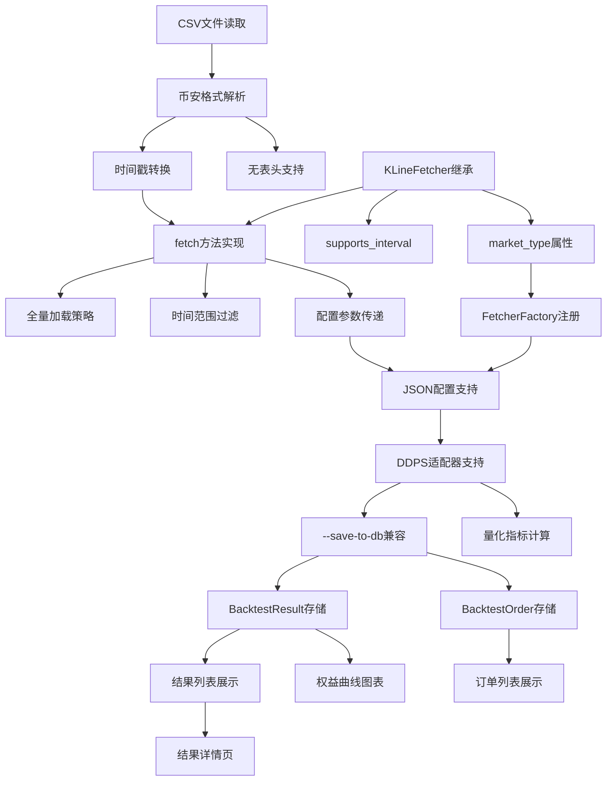

# 功能点清单: CSV数据源K线获取服务

**迭代编号**: 025
**版本**: 1.0
**创建日期**: 2026-01-09

---

## MVP功能点 (P0)

### 模块1: CSV解析器 (csv_parser)

| ID | 功能点 | 优先级 | 复杂度 | 描述 |
|----|--------|--------|--------|------|
| FP-001 | CSV文件读取 | P0 | 低 | 使用pandas读取CSV文件到DataFrame |
| FP-002 | 币安格式解析 | P0 | 中 | 解析12列币安标准格式，映射到StandardKLine |
| FP-003 | 时间戳转换 | P0 | 低 | 微秒时间戳转换为毫秒（CSV中为微秒） |
| FP-004 | 无表头支持 | P0 | 低 | 支持无表头CSV，按列索引解析 |

### 模块2: CSVFetcher数据获取器 (csv_fetcher)

| ID | 功能点 | 优先级 | 复杂度 | 描述 |
|----|--------|--------|--------|------|
| FP-005 | KLineFetcher继承 | P0 | 低 | 继承KLineFetcher抽象基类 |
| FP-006 | fetch方法实现 | P0 | 中 | 实现fetch()方法，支持limit和时间范围 |
| FP-007 | 全量加载策略 | P0 | 中 | 首次调用时全量加载CSV到内存缓存 |
| FP-008 | 时间范围过滤 | P0 | 低 | 根据start_time/end_time过滤数据 |
| FP-009 | supports_interval | P0 | 低 | 检查是否支持1s/1m周期 |
| FP-010 | market_type属性 | P0 | 低 | 返回'csv_local'市场类型 |

### 模块3: 工厂集成 (factory_integration)

| ID | 功能点 | 优先级 | 复杂度 | 描述 |
|----|--------|--------|--------|------|
| FP-011 | FetcherFactory注册 | P0 | 低 | 在FetcherFactory中注册csv_local类型 |
| FP-012 | 配置参数传递 | P0 | 中 | 支持csv_path、interval等参数传递给CSVFetcher |

### 模块4: 回测命令集成 (backtest_integration)

| ID | 功能点 | 优先级 | 复杂度 | 描述 |
|----|--------|--------|--------|------|
| FP-013 | JSON配置支持 | P0 | 中 | 回测配置JSON支持csv_local数据源类型 |
| FP-014 | DDPS适配器支持 | P0 | 中 | DDPSZAdapter能够使用CSV数据源 |

### 模块5: 回测结果持久化 (result_persistence)

| ID | 功能点 | 优先级 | 复杂度 | 描述 |
|----|--------|--------|--------|------|
| FP-015 | --save-to-db兼容 | P0 | 低 | CSV数据源回测支持--save-to-db参数 |
| FP-016 | BacktestResult存储 | P0 | 中 | 回测结果（配置、权益曲线、指标）存储到数据库 |
| FP-017 | BacktestOrder存储 | P0 | 中 | 订单详情（买卖时间、价格、盈亏）存储到数据库 |
| FP-018 | 量化指标计算 | P0 | 中 | 计算17个P0指标（复用MetricsCalculator） |

### 模块6: Web界面查看 (web_view)

| ID | 功能点 | 优先级 | 复杂度 | 描述 |
|----|--------|--------|--------|------|
| FP-019 | 结果列表展示 | P0 | 低 | 在/backtest/results/页面展示CSV回测结果 |
| FP-020 | 结果详情页 | P0 | 低 | 支持查看单个回测的完整详情 |
| FP-021 | 订单列表展示 | P0 | 低 | 显示订单列表（买入/卖出时间、价格、盈亏） |
| FP-022 | 权益曲线图表 | P0 | 中 | 显示权益曲线图表（复用现有Chart.js） |

---

## 延迟功能点 (P1)

| ID | 功能点 | 优先级 | 复杂度 | 描述 |
|----|--------|--------|--------|------|
| FP-023 | 分块加载优化 | P1 | 高 | 大文件分块加载，减少内存占用 |
| FP-024 | 多文件合并 | P1 | 中 | 支持多个CSV文件自动合并（跨月数据） |
| FP-025 | 缓存持久化 | P1 | 中 | 将解析后的数据缓存到本地pickle |
| FP-026 | 格式自动检测 | P1 | 中 | 自动检测CSV格式变体并适配 |

---

## 功能点依赖关系

---

## 功能点统计

| 类别 | 数量 |
|------|------|
| P0 核心功能 | 22 |
| P1 延迟功能 | 4 |
| **总计** | **26** |

### 按模块分布

| 模块 | P0 | P1 | 合计 |
|------|----|----|------|
| CSV解析器 | 4 | 0 | 4 |
| CSVFetcher | 6 | 0 | 6 |
| 工厂集成 | 2 | 0 | 2 |
| 回测命令集成 | 2 | 0 | 2 |
| 回测结果持久化 | 4 | 0 | 4 |
| Web界面查看 | 4 | 0 | 4 |
| 性能优化 | 0 | 4 | 4 |

---

## 验收检查清单

### P0功能验收
- [ ] FP-001: CSV文件可正常读取
- [ ] FP-002: 12列格式正确解析
- [ ] FP-003: 时间戳正确转换为毫秒
- [ ] FP-004: 无表头CSV正常解析
- [ ] FP-005: 正确继承KLineFetcher
- [ ] FP-006: fetch方法返回正确数据
- [ ] FP-007: 全量加载正常工作
- [ ] FP-008: 时间范围过滤准确
- [ ] FP-009: 周期检查正确
- [ ] FP-010: market_type返回csv_local
- [ ] FP-011: 工厂注册成功
- [ ] FP-012: 配置参数传递正确
- [ ] FP-013: 回测JSON配置可用
- [ ] FP-014: DDPS适配器集成成功
- [ ] FP-015: --save-to-db参数正常工作
- [ ] FP-016: BacktestResult记录创建成功
- [ ] FP-017: BacktestOrder记录创建成功
- [ ] FP-018: 量化指标计算正确（17个P0指标）
- [ ] FP-019: /backtest/results/页面显示CSV回测结果
- [ ] FP-020: 结果详情页显示完整信息
- [ ] FP-021: 订单列表显示买入/卖出详情
- [ ] FP-022: 权益曲线图表正常显示

---

## 技术说明

### 时间戳格式
- **CSV文件**: 微秒级时间戳（如`1764547200000000`）
- **StandardKLine**: 毫秒级时间戳（如`1764547200000`）
- **转换公式**: `timestamp_ms = timestamp_us // 1000`

### 内存估算
- 268万行 × 6字段 × 8字节 ≈ 128MB
- 加上pandas开销，预估总内存 ≈ 300MB
- 符合全量加载策略要求（<2GB）

### 支持的K线周期
- `1s`: 1秒K线（需要秒级数据文件）
- `1m`: 1分钟K线（可用分钟或秒级数据）
