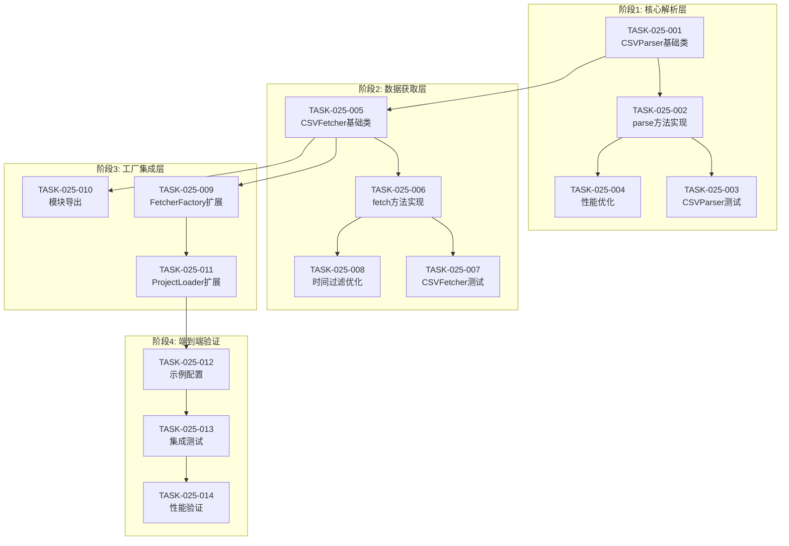

# 任务计划: CSV数据源K线获取服务

**迭代编号**: 025
**版本**: 1.0
**创建日期**: 2026-01-09
**状态**: 任务规划完成

---

## 任务概览

| 阶段 | 任务数 | 功能点覆盖 | 状态 |
|------|--------|------------|------|
| 阶段1: 核心解析层 | 4 | FP-001~004 | 待开始 |
| 阶段2: 数据获取层 | 4 | FP-005~010 | 待开始 |
| 阶段3: 工厂集成层 | 3 | FP-011~014 | 待开始 |
| 阶段4: 端到端验证 | 3 | FP-015~022 | 待开始 |
| **总计** | **14** | **22个P0** | |

---

## 阶段1: 核心解析层

### TASK-025-001: 创建CSVParser基础类

**目标**: 实现CSV文件解析器，解析币安12列格式

**功能点覆盖**: FP-001, FP-002, FP-003, FP-004

**文件变更**:
- 🆕 `ddps_z/datasources/csv_parser.py`

**实现要点**:
```python
class CSVParser:
    """CSV文件解析器"""

    COLUMN_MAPPING = {
        'timestamp': 0,
        'open': 1,
        'high': 2,
        'low': 3,
        'close': 4,
        'volume': 5
    }

    def __init__(self, timestamp_unit: str = 'microseconds'):
        self.timestamp_unit = timestamp_unit
        self._divisor = self._get_divisor()

    def _get_divisor(self) -> int:
        """获取时间戳转换除数"""
        divisors = {
            'microseconds': 1000,
            'milliseconds': 1,
            'seconds': 0.001
        }
        return divisors.get(self.timestamp_unit, 1000)

    def parse(self, csv_path: str) -> List[StandardKLine]:
        """解析CSV文件"""
        # 1. 使用pandas读取（无表头）
        # 2. 提取所需列
        # 3. 时间戳转换
        # 4. 转换为StandardKLine列表
        pass
```

**验收标准**:
- [ ] 成功读取无表头CSV文件
- [ ] 正确解析12列币安格式
- [ ] 时间戳正确从微秒转换为毫秒
- [ ] 返回List[StandardKLine]格式

**依赖**: 无

---

### TASK-025-002: 实现CSVParser.parse()方法

**目标**: 完成CSV解析核心逻辑

**功能点覆盖**: FP-001, FP-002, FP-003

**文件变更**:
- 📝 `ddps_z/datasources/csv_parser.py`

**实现要点**:
```python
def parse(self, csv_path: str) -> List[StandardKLine]:
    """解析CSV文件，返回StandardKLine列表"""
    import pandas as pd
    from pathlib import Path

    # 1. 验证文件存在
    if not Path(csv_path).exists():
        raise FileNotFoundError(f"CSV文件不存在: {csv_path}")

    # 2. 读取CSV（无表头）
    df = pd.read_csv(csv_path, header=None)

    # 3. 提取所需列并转换
    klines = []
    for _, row in df.iterrows():
        timestamp = int(row[0] // self._divisor)  # 微秒→毫秒
        kline = StandardKLine(
            timestamp=timestamp,
            open=float(row[1]),
            high=float(row[2]),
            low=float(row[3]),
            close=float(row[4]),
            volume=float(row[5])
        )
        klines.append(kline)

    return klines
```

**优化方向**:
- 使用numpy向量化操作替代逐行迭代
- 预分配列表大小

**验收标准**:
- [ ] 268万行CSV加载时间<30秒
- [ ] 内存占用<2GB
- [ ] 数据转换正确性100%

**依赖**: TASK-025-001

---

### TASK-025-003: 编写CSVParser单元测试

**目标**: 验证CSVParser各功能点

**功能点覆盖**: FP-001, FP-002, FP-003, FP-004

**文件变更**:
- 🆕 `ddps_z/tests/test_csv_parser.py`

**测试用例**:
```python
class TestCSVParser:
    def test_parse_binance_format(self):
        """测试解析币安12列格式"""
        pass

    def test_timestamp_conversion_microseconds(self):
        """测试微秒时间戳转换"""
        pass

    def test_timestamp_conversion_milliseconds(self):
        """测试毫秒时间戳转换"""
        pass

    def test_no_header_csv(self):
        """测试无表头CSV"""
        pass

    def test_file_not_found(self):
        """测试文件不存在异常"""
        pass
```

**验收标准**:
- [ ] 所有测试用例通过
- [ ] 测试覆盖率>80%

**依赖**: TASK-025-002

---

### TASK-025-004: 性能优化CSVParser

**目标**: 使用numpy向量化优化解析性能

**功能点覆盖**: FP-001, FP-002

**文件变更**:
- 📝 `ddps_z/datasources/csv_parser.py`

**优化实现**:
```python
def parse(self, csv_path: str) -> List[StandardKLine]:
    """优化版：使用numpy向量化"""
    import pandas as pd
    import numpy as np

    # 读取CSV
    df = pd.read_csv(csv_path, header=None, usecols=[0, 1, 2, 3, 4, 5])

    # 向量化转换时间戳
    timestamps = (df[0].values // self._divisor).astype(np.int64)

    # 批量创建StandardKLine
    klines = [
        StandardKLine(
            timestamp=int(timestamps[i]),
            open=float(df.iloc[i, 1]),
            high=float(df.iloc[i, 2]),
            low=float(df.iloc[i, 3]),
            close=float(df.iloc[i, 4]),
            volume=float(df.iloc[i, 5])
        )
        for i in range(len(df))
    ]

    return klines
```

**验收标准**:
- [ ] 268万行加载时间<15秒
- [ ] 内存峰值<500MB

**依赖**: TASK-025-002

---

## 阶段2: 数据获取层

### TASK-025-005: 创建CSVFetcher基础类

**目标**: 实现CSVFetcher，继承KLineFetcher

**功能点覆盖**: FP-005, FP-009, FP-010

**文件变更**:
- 🆕 `ddps_z/datasources/csv_fetcher.py`

**实现要点**:
```python
from ddps_z.datasources.base import KLineFetcher
from ddps_z.datasources.csv_parser import CSVParser
from ddps_z.models import StandardKLine

class CSVFetcher(KLineFetcher):
    """CSV文件K线数据获取器"""

    SUPPORTED_INTERVALS = ['1s', '1m']

    def __init__(
        self,
        csv_path: str,
        interval: str = '1s',
        market_type: str = 'csv_local',
        timestamp_unit: str = 'microseconds'
    ):
        self._csv_path = csv_path
        self._interval = interval
        self._market_type = market_type
        self._cache = None
        self._parser = CSVParser(timestamp_unit=timestamp_unit)

    @property
    def market_type(self) -> str:
        return self._market_type

    def supports_interval(self, interval: str) -> bool:
        return interval in self.SUPPORTED_INTERVALS
```

**验收标准**:
- [ ] 正确继承KLineFetcher
- [ ] market_type返回'csv_local'
- [ ] supports_interval正确判断1s/1m

**依赖**: TASK-025-001

---

### TASK-025-006: 实现CSVFetcher.fetch()方法

**目标**: 实现fetch方法，支持全量加载和时间过滤

**功能点覆盖**: FP-006, FP-007, FP-008

**文件变更**:
- 📝 `ddps_z/datasources/csv_fetcher.py`

**实现要点**:
```python
def fetch(
    self,
    symbol: str,
    interval: str,
    limit: int = 500,
    start_time: Optional[int] = None,
    end_time: Optional[int] = None
) -> List[StandardKLine]:
    """从CSV加载K线数据"""
    import logging
    logger = logging.getLogger(__name__)

    # 1. 懒加载：首次调用时加载CSV
    if self._cache is None:
        logger.info(f"首次加载CSV: {self._csv_path}")
        self._cache = self._parser.parse(self._csv_path)
        logger.info(f"加载完成，共 {len(self._cache)} 根K线")

    # 2. 时间范围过滤
    result = self._filter_by_time(start_time, end_time)

    # 3. 应用limit
    if limit and len(result) > limit:
        result = result[-limit:]

    return result

def _filter_by_time(
    self,
    start_time: Optional[int],
    end_time: Optional[int]
) -> List[StandardKLine]:
    """按时间范围过滤"""
    if start_time is None and end_time is None:
        return self._cache.copy()

    result = []
    for kline in self._cache:
        if start_time and kline.timestamp < start_time:
            continue
        if end_time and kline.timestamp > end_time:
            continue
        result.append(kline)

    return result
```

**验收标准**:
- [ ] 首次调用触发CSV加载
- [ ] 后续调用使用缓存
- [ ] 时间范围过滤正确
- [ ] limit参数生效

**依赖**: TASK-025-005

---

### TASK-025-007: 编写CSVFetcher单元测试

**目标**: 验证CSVFetcher各功能点

**功能点覆盖**: FP-005~010

**文件变更**:
- 🆕 `ddps_z/tests/test_csv_fetcher.py`

**测试用例**:
```python
class TestCSVFetcher:
    def test_inherits_kline_fetcher(self):
        """测试正确继承KLineFetcher"""
        pass

    def test_market_type_property(self):
        """测试market_type返回csv_local"""
        pass

    def test_supports_interval_1s(self):
        """测试支持1s周期"""
        pass

    def test_supports_interval_1m(self):
        """测试支持1m周期"""
        pass

    def test_fetch_lazy_load(self):
        """测试懒加载机制"""
        pass

    def test_fetch_cache_hit(self):
        """测试缓存命中"""
        pass

    def test_fetch_time_filter(self):
        """测试时间范围过滤"""
        pass

    def test_fetch_limit(self):
        """测试limit参数"""
        pass
```

**验收标准**:
- [ ] 所有测试用例通过
- [ ] 测试覆盖率>80%

**依赖**: TASK-025-006

---

### TASK-025-008: 优化时间过滤性能

**目标**: 使用二分查找优化时间范围过滤

**功能点覆盖**: FP-008

**文件变更**:
- 📝 `ddps_z/datasources/csv_fetcher.py`

**优化实现**:
```python
import bisect

def _filter_by_time(
    self,
    start_time: Optional[int],
    end_time: Optional[int]
) -> List[StandardKLine]:
    """使用二分查找优化时间过滤"""
    if start_time is None and end_time is None:
        return self._cache.copy()

    # 提取时间戳列表用于二分查找
    timestamps = [k.timestamp for k in self._cache]

    # 二分查找起始位置
    start_idx = 0
    if start_time:
        start_idx = bisect.bisect_left(timestamps, start_time)

    # 二分查找结束位置
    end_idx = len(self._cache)
    if end_time:
        end_idx = bisect.bisect_right(timestamps, end_time)

    return self._cache[start_idx:end_idx]
```

**验收标准**:
- [ ] 时间过滤从O(n)优化到O(log n)
- [ ] 过滤100万条数据<10ms

**依赖**: TASK-025-006

---

## 阶段3: 工厂集成层

### TASK-025-009: 扩展FetcherFactory支持kwargs

**目标**: 修改create方法支持传递kwargs给Fetcher构造函数

**功能点覆盖**: FP-011, FP-012

**文件变更**:
- 📝 `ddps_z/datasources/fetcher_factory.py`

**实现要点**:
```python
# 在_registry中注册csv_local
_registry: Dict[str, Type[KLineFetcher]] = {
    MarketType.CRYPTO_SPOT.value: BinanceFetcher,
    MarketType.CRYPTO_FUTURES.value: BinanceFetcher,
    'csv_local': CSVFetcher,  # 新增
}

@classmethod
def create(cls, market_type: str, **kwargs) -> KLineFetcher:
    """
    创建Fetcher实例（扩展版）

    Args:
        market_type: 市场类型
        **kwargs: 传递给Fetcher构造函数的参数
    """
    # 对于旧格式market_type，进行标准化
    if market_type != 'csv_local':
        normalized = MarketType.normalize(market_type)
    else:
        normalized = market_type

    fetcher_class = cls._registry.get(normalized)

    if fetcher_class is None:
        raise ValueError(f"不支持的市场类型: {market_type}")

    # 根据类型决定是否传递kwargs
    if normalized == 'csv_local':
        return fetcher_class(**kwargs)
    else:
        # 旧Fetcher保持向后兼容
        return fetcher_class(market_type=normalized)
```

**验收标准**:
- [ ] csv_local注册成功
- [ ] create('csv_local', csv_path=xxx)正常工作
- [ ] 现有BinanceFetcher调用不受影响（向后兼容）

**依赖**: TASK-025-005

---

### TASK-025-010: 更新datasources模块导出

**目标**: 在__init__.py中导出CSVFetcher

**功能点覆盖**: FP-011

**文件变更**:
- 📝 `ddps_z/datasources/__init__.py`

**实现要点**:
```python
from ddps_z.datasources.base import KLineFetcher, FetchError
from ddps_z.datasources.binance_fetcher import BinanceFetcher
from ddps_z.datasources.csv_fetcher import CSVFetcher  # 新增
from ddps_z.datasources.fetcher_factory import FetcherFactory
from ddps_z.datasources.repository import KLineRepository

__all__ = [
    'KLineFetcher',
    'FetchError',
    'BinanceFetcher',
    'CSVFetcher',  # 新增
    'FetcherFactory',
    'KLineRepository',
]
```

**验收标准**:
- [ ] `from ddps_z.datasources import CSVFetcher`可用

**依赖**: TASK-025-005

---

### TASK-025-011: 扩展ProjectLoader支持data_source配置

**目标**: 解析JSON配置中的data_source节点

**功能点覆盖**: FP-013

**文件变更**:
- 📝 `strategy_adapter/core/project_loader.py`

**实现要点**:
```python
def _parse_config(self, data: Dict[str, Any]) -> ProjectConfig:
    """解析配置数据（扩展版）"""

    # 解析data_source配置
    data_source_config = None
    if 'data_source' in data:
        ds = data['data_source']
        data_source_config = DataSourceConfig(
            type=ds.get('type', 'crypto_futures'),
            csv_path=ds.get('csv_path'),
            interval=ds.get('interval', '4h'),
            timestamp_unit=ds.get('timestamp_unit', 'microseconds')
        )

    # ... 其他配置解析

    return ProjectConfig(
        # ... 其他字段
        data_source=data_source_config
    )
```

**新增数据类**:
```python
@dataclass
class DataSourceConfig:
    """数据源配置"""
    type: str = 'crypto_futures'
    csv_path: Optional[str] = None
    interval: str = '4h'
    timestamp_unit: str = 'microseconds'
```

**验收标准**:
- [ ] 正确解析data_source配置
- [ ] 缺少data_source时使用默认值
- [ ] csv_path正确传递

**依赖**: TASK-025-009

---

## 阶段4: 端到端验证

### TASK-025-012: 创建示例配置文件

**目标**: 创建CSV数据源回测示例配置

**功能点覆盖**: FP-013

**文件变更**:
- 🆕 `strategy_adapter/configs/csv_backtest_example.json`

**配置内容**:
```json
{
  "project_name": "csv_backtest_ethusdt_1s",
  "description": "使用1秒K线CSV数据进行DDPS-Z策略回测示例",

  "data_source": {
    "type": "csv_local",
    "csv_path": "/Users/chenchiyuan/projects/crypto_exchange_news_crawler/data/ETHUSDT-1s-2025-12.csv",
    "interval": "1s",
    "timestamp_unit": "microseconds"
  },

  "backtest": {
    "symbol": "ETHUSDT",
    "interval": "1s",
    "start_date": "2025-12-01",
    "end_date": "2025-12-07"
  },

  "capital_management": {
    "initial_cash": 10000,
    "position_size": 100,
    "commission_rate": 0.001
  },

  "strategies": [
    {
      "id": "strategy_1",
      "type": "ddps_z",
      "enabled_strategies": [1, 2],
      "exits": [
        {
          "type": "ema_regression"
        }
      ]
    }
  ]
}
```

**验收标准**:
- [ ] 配置文件格式正确
- [ ] 可被ProjectLoader正确解析

**依赖**: TASK-025-011

---

### TASK-025-013: 端到端集成测试

**目标**: 验证CSV数据源回测完整流程

**功能点覆盖**: FP-014~022

**测试步骤**:
```bash
# 1. 执行回测（不保存到数据库）
python manage.py run_strategy_backtest \
  --config strategy_adapter/configs/csv_backtest_example.json

# 2. 执行回测（保存到数据库）
python manage.py run_strategy_backtest \
  --config strategy_adapter/configs/csv_backtest_example.json \
  --save-to-db

# 3. 验证Web界面
# 访问 /backtest/results/ 查看结果
```

**验收标准**:
- [ ] 回测命令正常执行
- [ ] 无Python异常
- [ ] 输出回测统计信息
- [ ] --save-to-db创建数据库记录
- [ ] Web界面显示回测结果
- [ ] 权益曲线图表正常渲染
- [ ] 订单列表显示正确

**依赖**: TASK-025-012

---

### TASK-025-014: 性能验证测试

**目标**: 验证性能指标达标

**功能点覆盖**: 性能要求

**测试内容**:

| 指标 | 目标 | 测试方法 |
|------|------|----------|
| CSV加载时间 | <30秒 | 计时268万行加载 |
| 内存占用 | <2GB | memory_profiler监控 |
| 时间过滤 | <100ms | 计时100万条过滤 |
| fetch缓存命中 | <10ms | 计时二次调用 |

**测试脚本**:
```python
import time
import tracemalloc
from ddps_z.datasources import CSVFetcher

def test_performance():
    csv_path = '/path/to/ETHUSDT-1s-2025-12.csv'

    # 测试加载时间
    tracemalloc.start()
    start = time.time()

    fetcher = CSVFetcher(csv_path=csv_path, interval='1s')
    klines = fetcher.fetch('ETHUSDT', '1s')

    load_time = time.time() - start
    current, peak = tracemalloc.get_traced_memory()
    tracemalloc.stop()

    print(f"加载时间: {load_time:.2f}秒")
    print(f"内存峰值: {peak / 1024 / 1024:.2f}MB")
    print(f"K线数量: {len(klines)}")

    assert load_time < 30, f"加载时间超标: {load_time}秒"
    assert peak < 2 * 1024 * 1024 * 1024, f"内存超标: {peak}字节"
```

**验收标准**:
- [ ] 所有性能指标达标
- [ ] 无内存泄漏

**依赖**: TASK-025-013

---

## 任务依赖图



---

## 风险与缓解

| 风险 | 影响 | 概率 | 缓解措施 |
|------|------|------|----------|
| CSV加载超时 | 高 | 低 | 使用pandas优化读取，分批处理 |
| 内存不足 | 高 | 低 | 监控内存，预警机制 |
| 时间戳格式错误 | 中 | 低 | 配置指定timestamp_unit |
| 工厂向后兼容问题 | 中 | 低 | 充分测试现有Fetcher |

---

## 相关文档

- PRD: `docs/iterations/025-csv-datasource/prd.md`
- 功能点清单: `docs/iterations/025-csv-datasource/function-points.md`
- 架构设计: `docs/iterations/025-csv-datasource/architecture.md`
- 需求澄清: `docs/iterations/025-csv-datasource/clarifications.md`
