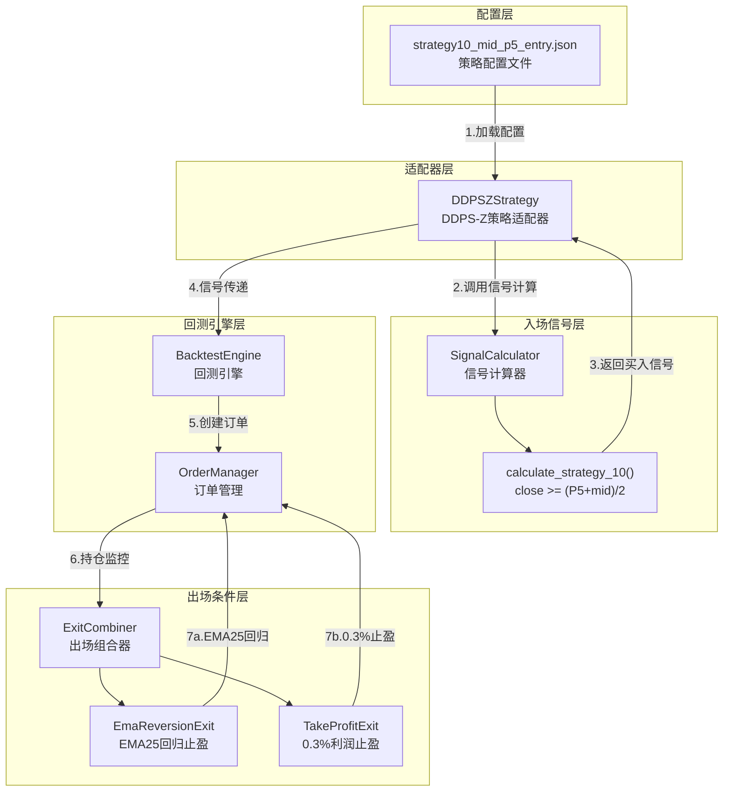

# 架构设计: 策略10 - 中值P5突破做多策略

## 文档信息

| 属性 | 值 |
|------|-----|
| 迭代编号 | 026 |
| 迭代名称 | strategy10-mid-p5-entry |
| 版本 | 1.0 |
| 状态 | Approved |
| 创建日期 | 2026-01-09 |
| PRD关联 | docs/iterations/026-strategy10-mid-p5-entry/prd.md |

---

## 1. 需求解读与目标对齐

### 1.1 核心业务目标

扩展现有DDPS-Z策略体系，新增**策略10**——一个采用"确认反弹"入场逻辑的保守型做多策略。与现有策略（如策略7的"抄底"式low<=P5）不同，策略10采用`close >= (P5 + mid) / 2`作为入场条件，即在价格从低位回升到中值与P5的中点时才入场，配合快速止盈(EMA25回归或0.3%利润)，实现低风险、快兑现的交易模式。

### 1.2 关键用户流程

1. **配置策略**: 用户创建JSON配置文件 `strategy10_mid_p5_entry.json`
2. **执行回测**: 运行 `python manage.py run_strategy_backtest --config xxx.json`
3. **信号检测**: 系统在每根K线上计算指标，当 `close >= (P5 + mid) / 2` 时触发做多
4. **订单管理**: 系统创建虚拟订单，记录开仓价格
5. **出场监控**: 监控两个出场条件（EMA25回归 / 0.3%止盈），先到先触发
6. **结果保存**: 回测结果保存到数据库，可通过Web界面查看

---

## 2. 架构设计与可视化

### 2.1 核心架构图



### 2.2 概念解读

策略10采用**扩展现有组件**的架构模式，通过在SignalCalculator中新增入场逻辑、复用现有Exit组件实现出场逻辑，最小化代码改动的同时完成策略集成。

### 2.3 组件职责

| 组件 | 文件路径 | 职责 | 修改类型 |
|------|----------|------|----------|
| **SignalCalculator** | `ddps_z/calculators/signal_calculator.py` | 计算策略10入场信号 | 扩展 |
| **DDPSZStrategy** | `strategy_adapter/adapters/ddpsz_adapter.py` | 适配策略10 | 扩展 |
| **TakeProfitExit** | `strategy_adapter/exits/take_profit.py` | 0.3%利润止盈 | 复用 |
| **EmaReversionExit** | `strategy_adapter/exits/ema_reversion.py` | EMA25回归止盈 | 复用 |
| **ExitCombiner** | `strategy_adapter/exits/combiner.py` | 组合Exit条件 | 复用 |
| **JSON配置文件** | `strategy_adapter/configs/strategy10_mid_p5_entry.json` | 策略配置 | 新增 |

### 2.4 组件与需求映射

| 组件 | 负责实现的功能点 |
|------|------------------|
| **SignalCalculator** | FP-001（策略10 ID定义）, FP-002（入场条件计算）, FP-003（信号标记） |
| **DDPSZStrategy** | FP-008（DDPSZAdapter支持） |
| **TakeProfitExit** | FP-005（0.3%利润止盈） |
| **EmaReversionExit** | FP-004（EMA25回归止盈） |
| **JSON配置文件** | FP-007（JSON配置文件）, FP-006（无止损设置） |

### 2.5 交互流程

| 序号 | 交互 | 说明 |
|------|------|------|
| 1 | 加载配置 | BacktestEngine从JSON读取策略配置 |
| 2 | 调用信号计算 | DDPSZStrategy调用SignalCalculator |
| 3 | 返回买入信号 | calculate_strategy_10()检测到条件时返回信号 |
| 4 | 信号传递 | 策略将信号传递给回测引擎 |
| 5 | 创建订单 | 引擎创建虚拟订单，记录开仓价格 |
| 6 | 持仓监控 | 订单进入ExitCombiner监控 |
| 7a/7b | 出场触发 | EMA25回归或0.3%止盈，先到先触发 |

---

## 3. 关键决策点与方案评估

### 3.1 决策点一：0.3%止盈的实现方式

| 方案 | 简介 | 优点 | 缺点 |
|------|------|------|------|
| **方案A（采纳）** | 复用TakeProfitExit | 零代码改动，完全复用 | 使用high判断而非close |
| 方案B | 新增CloseTakeProfitExit | 精确匹配需求 | 增加代码和维护成本 |

**最终决策**: 方案A - 复用现有TakeProfitExit，传入percentage=0.3

**决策理由**:
1. 现有实现使用`high >= take_profit_price`在实际交易中更合理
2. 0.3%是非常小的止盈空间，high和close差异很小
3. 零代码改动，降低风险

---

### 3.2 决策点二：入场条件判断方式

| 方案 | 简介 | 优点 | 缺点 |
|------|------|------|------|
| **方案A（采纳）** | 严格使用close | 符合需求，入场时机明确 | 可能错过K线内机会 |
| 方案B | 使用high/low区间 | 更宽松 | 与需求不符 |

**最终决策**: 方案A - 严格使用close判断

**决策理由**:
1. 用户明确指定"close价格"
2. 策略10定位为"确认反弹"，使用close更稳健
3. 与策略7（用low）形成差异化

---

### 3.3 决策点三：策略ID命名

| 方案 | 简介 | 优点 | 缺点 |
|------|------|------|------|
| **方案A（采纳）** | strategy_id=10 | 符合用户需求 | 跳过9 |
| 方案B | strategy_id=9 | 连续编号 | 与需求不符 |

**最终决策**: 方案A - 使用strategy_id=10

**决策理由**:
1. 用户明确要求"策略10"
2. 项目中策略5已被跳过，编号不连续是可接受的

---

## 4. 详细设计

### 4.1 SignalCalculator扩展

在 `ddps_z/calculators/signal_calculator.py` 中新增：

```python
# 策略ID和名称
STRATEGY_10_ID = 'strategy_10'
STRATEGY_10_NAME = '中值P5突破做多'

def calculate_strategy_10(
    self,
    klines: List[Dict],
    p5_series: np.ndarray,
    inertia_mid_series: np.ndarray
) -> List[Dict]:
    """
    计算策略10买入信号

    触发条件: close >= (P5 + inertia_mid) / 2

    Args:
        klines: K线数据列表
        p5_series: P5序列
        inertia_mid_series: 惯性中值序列

    Returns:
        信号列表，每个元素包含 {index, timestamp, price, strategy_id, direction}
    """
    signals = []

    for i, kline in enumerate(klines):
        close = kline['close']
        p5 = p5_series[i]
        mid = inertia_mid_series[i]

        # 入场阈值
        threshold = (p5 + mid) / 2

        if close >= threshold:
            signals.append({
                'index': i,
                'timestamp': kline['timestamp'],
                'price': close,
                'strategy_id': self.STRATEGY_10_ID,
                'strategy_name': self.STRATEGY_10_NAME,
                'direction': 'long',
                'reason': f'close({close:.2f}) >= (P5+mid)/2({threshold:.2f})'
            })

    return signals
```

### 4.2 DDPSZStrategy扩展

在 `strategy_adapter/adapters/ddpsz_adapter.py` 的 `__init__` 中添加策略10支持：

```python
# enabled_strategies 支持 1, 2, 3, 4, 6, 7, 8, 10
```

在 `generate_buy_signals` 方法中添加策略10调用。

### 4.3 JSON配置文件

创建 `strategy_adapter/configs/strategy10_mid_p5_entry.json`：

```json
{
  "project_name": "策略10-中值P5突破做多",
  "description": "close >= (P5+mid)/2 时做多，EMA25回归或0.3%止盈，无止损",
  "version": "1.0",
  "created_at": "2026-01-09",
  "iteration": "026",

  "backtest_config": {
    "symbol": "BTCUSDT",
    "interval": "4h",
    "market_type": "futures",
    "start_date": "2025-01-01",
    "end_date": "2026-01-09",
    "initial_cash": 10000,
    "commission_rate": 0.001
  },

  "capital_management": {
    "mode": "shared",
    "position_size_mode": "fixed",
    "position_size": 1000,
    "max_positions": 10
  },

  "strategies": [
    {
      "id": "strategy_10",
      "name": "中值P5突破做多",
      "type": "ddps-z",
      "enabled": true,
      "entry": {
        "strategy_id": 10,
        "description": "close >= (P5 + mid) / 2 时做多"
      },
      "exits": [
        {
          "type": "ema_reversion",
          "params": {
            "ema_period": 25
          },
          "description": "EMA25回归止盈"
        },
        {
          "type": "take_profit",
          "params": {
            "percentage": 0.3
          },
          "description": "0.3%利润止盈"
        }
      ]
    }
  ]
}
```

---

## 5. 实现任务清单

| 任务ID | 任务描述 | 文件 | 预估工时 |
|--------|----------|------|----------|
| TASK-026-001 | 定义STRATEGY_10_ID和STRATEGY_10_NAME | signal_calculator.py | 10min |
| TASK-026-002 | 实现calculate_strategy_10()方法 | signal_calculator.py | 30min |
| TASK-026-003 | DDPSZStrategy支持strategy_id=10 | ddpsz_adapter.py | 20min |
| TASK-026-004 | 创建JSON配置文件 | strategy10_mid_p5_entry.json | 10min |
| TASK-026-005 | 单元测试 | test_signal_calculator_strategy10.py | 30min |
| TASK-026-006 | 集成测试与回测验证 | - | 20min |

**总预估工时**: 2小时

---

## 6. 风险与缓解

| 风险 | 概率 | 影响 | 缓解措施 |
|------|------|------|----------|
| TakeProfitExit不支持小数百分比 | 低 | 中 | 已验证支持percentage=0.3 |
| 入场条件计算错误 | 低 | 高 | 单元测试覆盖 |
| 与现有策略冲突 | 低 | 中 | 独立strategy_id |

---

## 附录

### A. 相关文档

- PRD: `docs/iterations/026-strategy10-mid-p5-entry/prd.md`
- 功能点清单: `docs/iterations/026-strategy10-mid-p5-entry/function-points.md`
- 澄清记录: `docs/iterations/026-strategy10-mid-p5-entry/clarifications.md`

### B. 变更记录

| 版本 | 日期 | 变更内容 |
|------|------|----------|
| 1.0 | 2026-01-09 | 初始版本，完成架构设计 |
