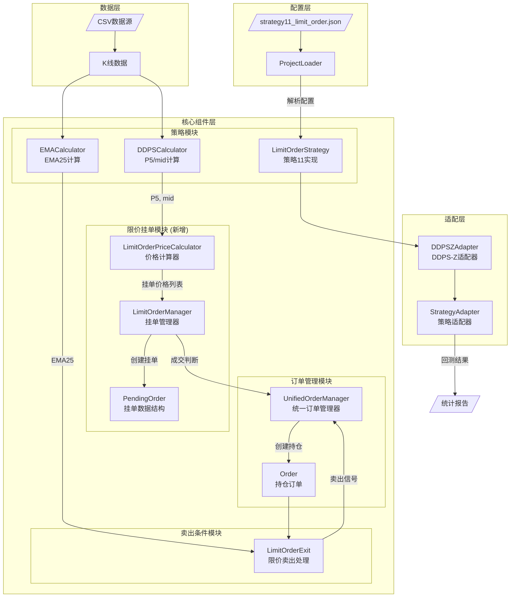
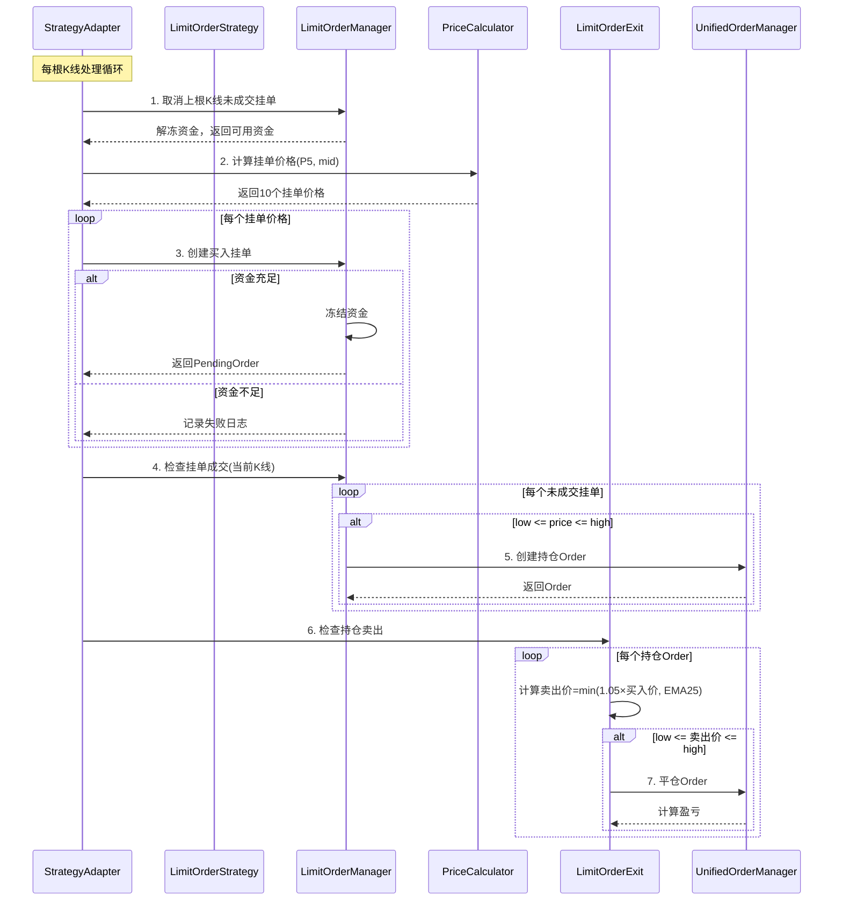

# 架构设计文档: 策略11 - 限价挂单买卖机制

## 文档信息

| 属性 | 值 |
|------|-----|
| 迭代编号 | 027 |
| 迭代名称 | strategy11-limit-order |
| 版本 | 1.0 |
| 状态 | Approved |
| 创建日期 | 2026-01-10 |
| 关联PRD | prd.md |
| 关联功能点 | function-points.md |

---

## 1. 需求解读与目标对齐

### 1.1 核心业务目标

策略11引入**限价挂单机制**，解决现有策略1~10市价单机制的三个局限：
1. **滑点问题**：市价单在高波动行情中可能产生较大滑点
2. **价格控制不足**：无法精确控制成交价格
3. **策略灵活性受限**：无法实现"低价挂单等待成交"的分批建仓策略

这是策略体系中首个限价单策略，实现更精细的价格控制。

### 1.2 关键用户流程

```
每根K线处理流程:
┌─────────────────────────────────────────────────────────────┐
│ 步骤1: 取消上根K线的所有未成交买入挂单，解冻资金              │
│                           ↓                                 │
│ 步骤2: 计算首笔价格 = (P5 + mid) / 2                         │
│                           ↓                                 │
│ 步骤3: 生成10笔买入挂单（每隔0.5%向下递减），逐笔冻结资金      │
│        资金不足时记录失败，继续处理后续                        │
│                           ↓                                 │
│ 步骤4: 检查上根K线的买入挂单是否成交                          │
│        (low <= 挂单价 <= high) → 成交转为持仓Order            │
│                           ↓                                 │
│ 步骤5: 为每笔持仓计算卖出价格 = min(买入价×1.05, EMA25)       │
│                           ↓                                 │
│ 步骤6: 检查卖出挂单是否成交                                   │
│        (low <= 卖出价 <= high) → 平仓，计算盈亏               │
└─────────────────────────────────────────────────────────────┘
```

### 1.3 功能点分布

| 模块 | P0功能点数量 | 说明 |
|------|-------------|------|
| 限价挂单管理器 | 6 | PendingOrder结构、创建/取消挂单、成交判断、资金冻结/解冻 |
| 买入挂单逻辑 | 5 | 价格计算、批量挂单、资金不足处理、成交转换 |
| 卖出挂单逻辑 | 4 | 卖出价格计算、动态更新、成交处理 |
| 策略集成 | 3 | 配置解析、Adapter扩展、回测流程集成 |
| **合计** | **18** | |

---

## 2. 核心架构设计

### 2.1 架构总览图



### 2.2 概念解读

策略11采用**限价挂单驱动**的回测架构，与现有市价单策略的本质区别在于：订单不是"信号触发即成交"，而是"挂单等待成交"。架构核心是新增的**LimitOrderManager**组件，它管理挂单的完整生命周期（创建→冻结资金→等待成交→成交/取消）。

### 2.3 组件职责

| 组件 | 类型 | 文件路径 | 核心职责 |
|------|------|----------|----------|
| **PendingOrder** | 新增 | `strategy_adapter/models/pending_order.py` | 挂单数据结构，包含order_id、price、amount、status、frozen_capital、kline_index |
| **LimitOrderManager** | 新增 | `strategy_adapter/core/limit_order_manager.py` | 挂单生命周期管理：创建挂单、批量取消、成交判断、资金冻结/解冻 |
| **LimitOrderPriceCalculator** | 新增 | `strategy_adapter/core/limit_order_price_calculator.py` | 计算挂单价格：首笔(P5+mid)/2，后续按interval递减 |
| **LimitOrderStrategy** | 新增 | `strategy_adapter/strategies/limit_order_strategy.py` | 策略11的核心逻辑：每根K线生成买入挂单、处理成交、管理持仓 |
| **LimitOrderExit** | 新增 | `strategy_adapter/exits/limit_order_exit.py` | 限价卖出条件：计算min(5%止盈, EMA25)，判断卖出成交 |
| **DDPSZAdapter** | 扩展 | `strategy_adapter/adapters/ddpsz_adapter.py` | 扩展支持strategy_id=11，路由到LimitOrderStrategy |
| **ProjectLoader** | 扩展 | `strategy_adapter/core/project_loader.py` | 解析新增配置参数：order_count、order_interval |

### 2.4 组件与需求映射

#### LimitOrderManager：限价挂单管理器
- **FP-027-001** PendingOrder数据结构
- **FP-027-002** 创建挂单
- **FP-027-003** 批量取消挂单
- **FP-027-004** 成交判断
- **FP-027-005** 资金冻结
- **FP-027-006** 资金解冻

#### LimitOrderPriceCalculator：价格计算器
- **FP-027-007** 计算首笔挂单价格
- **FP-027-008** 计算批量挂单价格

#### LimitOrderStrategy：策略11实现
- **FP-027-009** 生成买入挂单
- **FP-027-010** 资金不足处理
- **FP-027-011** 挂单成交转换

#### LimitOrderExit：限价卖出处理
- **FP-027-012** 计算卖出价格
- **FP-027-013** 创建卖出挂单
- **FP-027-014** 动态更新卖出价
- **FP-027-015** 卖出成交处理

#### ProjectLoader + DDPSZAdapter：配置与集成
- **FP-027-016** 策略11配置解析
- **FP-027-017** DDPSZAdapter扩展
- **FP-027-018** 回测流程集成

---

## 3. 详细设计

### 3.1 PendingOrder 数据结构

```python
@dataclass
class PendingOrder:
    """限价挂单数据结构"""

    order_id: str           # 唯一标识，格式: "pending_{timestamp}_{index}"
    price: Decimal          # 挂单价格
    amount: Decimal         # 挂单金额(USDT)
    quantity: Decimal       # 挂单数量 = amount / price
    status: str             # 状态: pending, filled, cancelled
    side: str               # 方向: buy, sell
    frozen_capital: Decimal # 冻结资金
    kline_index: int        # 创建时的K线索引
    created_at: int         # 创建时间戳(毫秒)
    filled_at: Optional[int] = None  # 成交时间戳

    # 关联字段(卖出挂单专用)
    parent_order_id: Optional[str] = None  # 关联的持仓Order ID
```

### 3.2 LimitOrderManager 接口设计

```python
class LimitOrderManager:
    """限价挂单管理器"""

    def __init__(self, position_size: Decimal = Decimal("100")):
        self._pending_orders: Dict[str, PendingOrder] = {}
        self._available_capital: Decimal = Decimal("0")
        self._frozen_capital: Decimal = Decimal("0")
        self.position_size = position_size

    def initialize(self, initial_capital: Decimal) -> None:
        """初始化可用资金"""

    def create_buy_order(
        self,
        price: Decimal,
        kline_index: int,
        timestamp: int
    ) -> Optional[PendingOrder]:
        """创建买入挂单，冻结资金。资金不足返回None"""

    def cancel_all_buy_orders(self) -> Decimal:
        """取消所有未成交买入挂单，解冻资金，返回解冻金额"""

    def check_buy_order_fill(
        self,
        order: PendingOrder,
        kline_low: Decimal,
        kline_high: Decimal
    ) -> bool:
        """检查买入挂单是否成交: low <= price <= high"""

    def create_sell_order(
        self,
        parent_order: Order,
        sell_price: Decimal,
        kline_index: int,
        timestamp: int
    ) -> PendingOrder:
        """为持仓创建卖出挂单"""

    def update_sell_order_price(
        self,
        order_id: str,
        new_price: Decimal
    ) -> None:
        """更新卖出挂单价格(每根K线动态更新)"""

    def check_sell_order_fill(
        self,
        order: PendingOrder,
        kline_low: Decimal,
        kline_high: Decimal
    ) -> bool:
        """检查卖出挂单是否成交"""

    def get_pending_buy_orders(self) -> List[PendingOrder]:
        """获取所有未成交买入挂单"""

    def get_pending_sell_orders(self) -> List[PendingOrder]:
        """获取所有未成交卖出挂单"""

    @property
    def available_capital(self) -> Decimal:
        """当前可用资金"""

    @property
    def frozen_capital(self) -> Decimal:
        """当前冻结资金"""
```

### 3.3 LimitOrderPriceCalculator 接口设计

```python
class LimitOrderPriceCalculator:
    """限价挂单价格计算器"""

    def __init__(
        self,
        order_count: int = 10,
        order_interval: float = 0.005
    ):
        self.order_count = order_count
        self.order_interval = Decimal(str(order_interval))

    def calculate_buy_prices(
        self,
        p5: Decimal,
        mid: Decimal
    ) -> List[Decimal]:
        """
        计算买入挂单价格列表

        第1笔: (P5 + mid) / 2
        第N笔: 第1笔 × (1 - (N-1) × interval)

        Returns:
            List[Decimal]: order_count个挂单价格
        """

    def calculate_sell_price(
        self,
        buy_price: Decimal,
        ema25: Decimal,
        take_profit_rate: float = 0.05
    ) -> Decimal:
        """
        计算卖出挂单价格

        Returns:
            min(buy_price × 1.05, ema25)
        """
```

### 3.4 LimitOrderStrategy 核心流程

```python
class LimitOrderStrategy(IStrategy):
    """策略11: 限价挂单策略"""

    def __init__(
        self,
        order_count: int = 10,
        order_interval: float = 0.005,
        position_size: Decimal = Decimal("100"),
        take_profit_rate: float = 0.05
    ):
        self.order_manager = LimitOrderManager(position_size)
        self.price_calculator = LimitOrderPriceCalculator(order_count, order_interval)
        self.take_profit_rate = take_profit_rate

    def process_kline(
        self,
        kline_index: int,
        kline: Dict,
        indicators: Dict,
        unified_order_manager: UnifiedOrderManager
    ) -> Dict:
        """
        处理单根K线的完整流程

        Returns:
            {
                'new_orders': List[Order],      # 新成交的持仓
                'closed_orders': List[Order],   # 平仓的订单
                'failed_orders': int            # 资金不足的挂单数
            }
        """
        # 步骤1: 检查上根K线的买入挂单是否成交
        # 步骤2: 取消未成交的买入挂单
        # 步骤3: 计算新的挂单价格
        # 步骤4: 创建新的买入挂单
        # 步骤5: 更新卖出挂单价格
        # 步骤6: 检查卖出挂单是否成交
```

### 3.5 主流程时序图



---

## 4. 关键决策记录

### 4.1 决策点一：LimitOrderManager的定位

| 方案 | 描述 | 优点 | 缺点 |
|------|------|------|------|
| **A) 独立新模块** ✅ | 完全独立的LimitOrderManager类 | 职责清晰、不影响现有功能、易于测试 | 代码有一定重复 |
| B) 扩展UnifiedOrderManager | 在现有UOM中增加挂单功能 | 复用资金管理逻辑 | 增加复杂度、可能影响策略1~10 |

**最终决策**: 方案A - 独立新模块

**决策理由**:
1. 限价单和市价单的生命周期本质不同（挂单有"等待成交"状态）
2. 符合单一职责原则，避免现有代码膨胀
3. 策略11是实验性策略，独立实现便于后续调整或移除

### 4.2 决策点二：挂单存储方式

| 方案 | 描述 | 优点 | 缺点 |
|------|------|------|------|
| **A) 纯内存存储** ✅ | PendingOrder只存在于回测内存中 | 实现简单、性能好 | 无法事后分析挂单历史 |
| B) 持久化到数据库 | 新增Django模型持久化 | 可事后分析 | 复杂度高、数据量大 |

**最终决策**: 方案A - 纯内存存储

**决策理由**:
1. MVP阶段优先验证策略有效性
2. 1m数据挂单量巨大（44640根K线 × 10笔 = 44万条），持久化成本高
3. P1阶段可根据需要添加持久化

### 4.3 决策点三：LimitOrderStrategy的实现方式

| 方案 | 描述 | 优点 | 缺点 |
|------|------|------|------|
| **A) 独立策略类** ✅ | 创建独立的LimitOrderStrategy类 | 完全独立、可单独测试 | 无法复用DDPSZStrategy逻辑 |
| B) 扩展DDPSZStrategy | 在现有类中增加分支 | 复用P5/mid获取 | 增加复杂度、逻辑混杂 |
| C) 策略组合模式 | 内部组合DDPSZStrategy | 复用指标计算 | 组合关系增加理解成本 |

**最终决策**: 方案A - 独立策略类

**决策理由**:
1. 限价单和市价单的信号生成逻辑完全不同
2. 便于独立测试和维护
3. 通过DDPSZAdapter路由，对上层透明

---

## 5. 文件结构

```
strategy_adapter/
├── models/
│   ├── __init__.py              # 导出PendingOrder
│   └── pending_order.py         # [新增] PendingOrder数据类
├── core/
│   ├── limit_order_manager.py   # [新增] 限价挂单管理器
│   ├── limit_order_price_calculator.py  # [新增] 价格计算器
│   └── project_loader.py        # [扩展] 解析新配置参数
├── strategies/
│   └── limit_order_strategy.py  # [新增] 策略11实现
├── exits/
│   ├── __init__.py              # 导出LimitOrderExit
│   └── limit_order_exit.py      # [新增] 限价卖出处理
├── adapters/
│   └── ddpsz_adapter.py         # [扩展] 支持strategy_id=11
└── configs/
    └── strategy11_limit_order.json  # [已创建] 默认配置
```

---

## 6. 接口契约

### 6.1 配置参数扩展

```json
{
  "entry": {
    "strategy_id": 11,
    "order_count": 10,        // [新增] 挂单数量
    "order_interval": 0.005   // [新增] 挂单间隔(0.5%)
  },
  "exits": [
    {
      "type": "limit_order_exit",  // [新增] 限价卖出类型
      "params": {
        "take_profit_rate": 0.05,
        "ema_period": 25
      }
    }
  ]
}
```

### 6.2 关键数据流

1. **挂单创建流**:
   ```
   K线数据 → DDPSCalculator → P5/mid → PriceCalculator → 10个挂单价格 → LimitOrderManager → PendingOrder[]
   ```

2. **成交判断流**:
   ```
   下根K线[low,high] → LimitOrderManager.check_fill() → 成交的PendingOrder → UnifiedOrderManager.create_order() → Order持仓
   ```

3. **卖出计算流**:
   ```
   Order.open_price + EMA25 → min(price×1.05, EMA25) → 卖出挂单价格 → 成交判断 → 平仓
   ```

---

## 7. 性能考量

| 指标 | 目标值 | 设计保障 |
|------|--------|----------|
| 单根K线处理时间 | < 10ms | 纯内存操作，无IO |
| 1个月1m数据回测 | < 60秒 | 44640根K线 × 10ms = 446秒 → 需优化批量操作 |
| 内存占用 | < 2GB | PendingOrder纯内存，每根K线后清理 |

**优化策略**:
- 批量取消挂单时使用字典操作而非循环
- 成交判断使用向量化比较（如numpy）
- 避免在循环中创建临时对象

---

## 附录

### A. 相关文档

- PRD: `docs/iterations/027-strategy11-limit-order/prd.md`
- 功能点清单: `docs/iterations/027-strategy11-limit-order/function-points.md`
- 需求澄清: `docs/iterations/027-strategy11-limit-order/clarifications.md`
- 策略框架: `docs/iterations/017-multi-strategy-backtest/`

### B. 变更历史

| 版本 | 日期 | 变更内容 | 作者 |
|------|------|----------|------|
| 1.0 | 2026-01-10 | 初始版本 | AI助手 |
