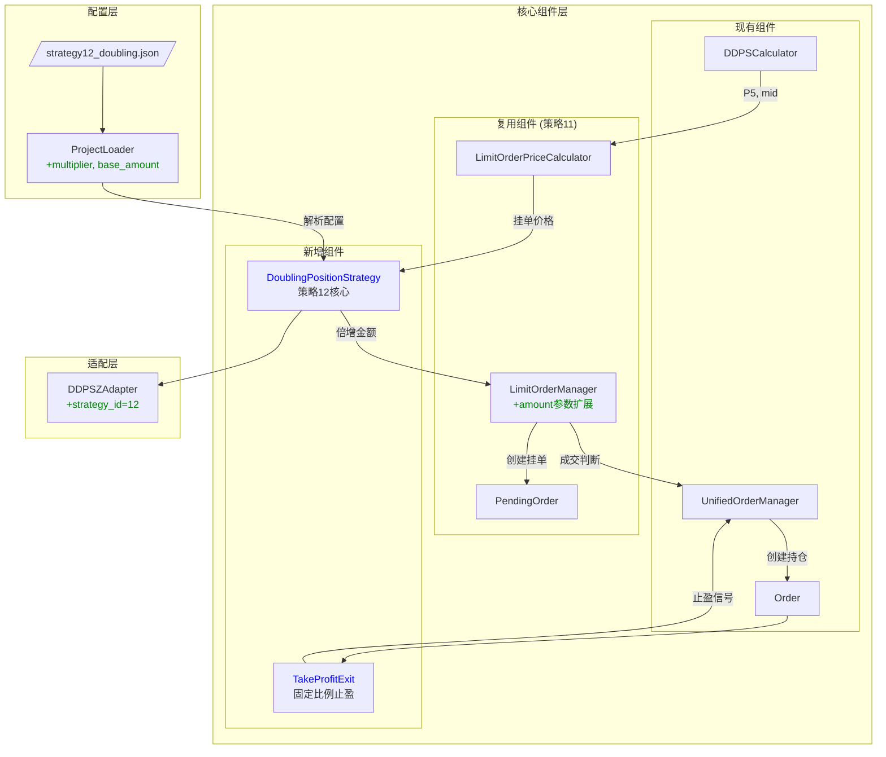
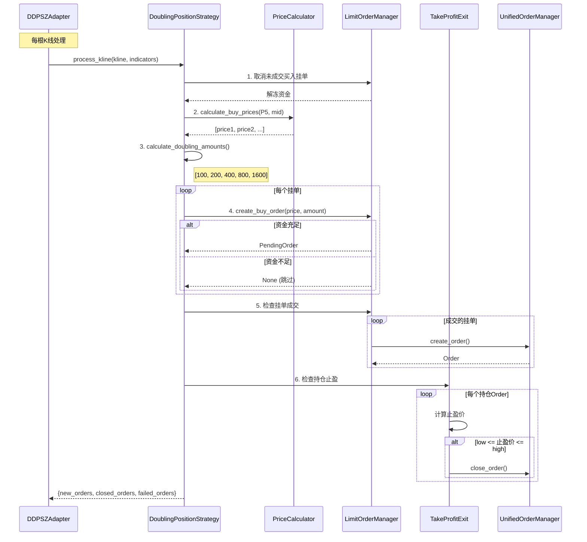

# 架构设计文档: 策略12 - 倍增仓位限价挂单

## 文档信息

| 属性 | 值 |
|------|-----|
| 迭代编号 | 028 |
| 迭代名称 | strategy12-doubling-position |
| 版本 | 1.0 |
| 状态 | Draft |
| 创建日期 | 2026-01-11 |
| 关联PRD | prd.md |
| 关联技术调研 | technical-research.md |

---

## 1. 架构概览

### 1.1 架构定位

策略12是策略11的变体，核心差异在于：
1. **倍增仓位**：每笔挂单金额按倍增系数递增
2. **固定止盈**：2%固定比例止盈，不依赖EMA25

架构设计遵循**最大化复用**原则，仅新增必要组件。

### 1.2 架构总览图



**图例**：
- <span style='color:blue'>蓝色</span>：新增组件
- <span style='color:green'>绿色</span>：扩展/修改

---

## 2. 组件设计

### 2.1 组件清单

| 组件 | 类型 | 文件路径 | 核心职责 |
|------|------|----------|----------|
| **DoublingPositionStrategy** | 新增 | `strategy_adapter/strategies/doubling_position_strategy.py` | 策略12核心逻辑：倍增金额计算、挂单创建、止盈处理 |
| **TakeProfitExit** | 新增 | `strategy_adapter/exits/take_profit_exit.py` | ���定比例止盈条件 |
| **LimitOrderManager** | 扩展 | `strategy_adapter/core/limit_order_manager.py` | create_buy_order新增amount参数 |
| **DDPSZAdapter** | 扩展 | `strategy_adapter/adapters/ddpsz_adapter.py` | 新增strategy_id=12路由 |
| **ProjectLoader** | 扩展 | `strategy_adapter/core/project_loader.py` | 解析multiplier、base_amount参数 |

### 2.2 DoublingPositionStrategy 设计

```python
class DoublingPositionStrategy:
    """
    策略12: 倍增仓位限价挂单策略

    核心特点:
    - 买入挂单价格: 复用策略11逻辑
    - 挂单金额: 倍增式 (100→200→400→...)
    - 卖出条件: 固定2%止盈，单笔独立

    Attributes:
        order_count: 挂单数量，默认5
        order_interval: 挂单间隔，默认0.01 (1%)
        first_order_discount: 首笔折扣，默认0.01 (1%)
        base_amount: 首单金额，默认100 USDT
        multiplier: 倍增系数，默认2
        take_profit_rate: 止盈比例，默认0.02 (2%)
    """

    def __init__(
        self,
        order_count: int = 5,
        order_interval: float = 0.01,
        first_order_discount: float = 0.01,
        base_amount: Decimal = Decimal("100"),
        multiplier: float = 2.0,
        take_profit_rate: float = 0.02
    ):
        self.order_count = order_count
        self.base_amount = base_amount
        self.multiplier = Decimal(str(multiplier))
        self.take_profit_rate = take_profit_rate

        # 复用策略11组件
        self.price_calculator = LimitOrderPriceCalculator(
            order_count=order_count,
            order_interval=order_interval,
            first_order_discount=first_order_discount
        )
        self.order_manager = LimitOrderManager()
        self.exit_condition = TakeProfitExit(take_profit_rate=take_profit_rate)

    def calculate_doubling_amounts(self) -> List[Decimal]:
        """
        计算倍增金额列表

        Returns:
            [100, 200, 400, 800, 1600] (示例，multiplier=2, count=5)
        """
        amounts = []
        for i in range(self.order_count):
            amount = self.base_amount * (self.multiplier ** i)
            amounts.append(amount)
        return amounts

    def process_kline(
        self,
        kline_index: int,
        kline: Dict,
        indicators: Dict,
        unified_order_manager: UnifiedOrderManager
    ) -> Dict:
        """
        处理单根K线

        流程:
        1. 检查上根K线买入挂单是否成交
        2. 取消未成交买入挂单
        3. 计算新挂单价格和金额
        4. 创建新买入挂单（倍增金额）
        5. 检查持仓止盈条件

        Returns:
            {
                'new_orders': List[Order],
                'closed_orders': List[Order],
                'failed_orders': int
            }
        """
        pass  # 实现细节见tasks.md
```

### 2.3 TakeProfitExit 设计

```python
class TakeProfitExit(IExitCondition):
    """
    固定比例止盈条件

    计算止盈价 = 买入价 × (1 + take_profit_rate)
    成交条件: low <= 止盈价 <= high
    """

    def __init__(self, take_profit_rate: float = 0.02):
        self.take_profit_rate = Decimal(str(take_profit_rate))

    def check(
        self,
        order: Order,
        kline: Dict,
        indicators: Dict,
        current_timestamp: int
    ) -> Optional[ExitSignal]:
        """
        检查止盈条件

        Returns:
            ExitSignal if 止盈触发, else None
        """
        take_profit_price = order.open_price * (Decimal("1") + self.take_profit_rate)

        low = Decimal(str(kline['low']))
        high = Decimal(str(kline['high']))

        if low <= take_profit_price <= high:
            return ExitSignal(
                timestamp=current_timestamp,
                price=take_profit_price,
                reason=f"固定{self.take_profit_rate * 100:.1f}%止盈",
                exit_type=self.get_type()
            )
        return None

    def get_type(self) -> str:
        return "take_profit"

    def get_priority(self) -> int:
        return 60  # 低于止损优先级
```

### 2.4 LimitOrderManager 扩展

```python
# 现有方法签名
def create_buy_order(
    self,
    price: Decimal,
    kline_index: int,
    timestamp: int
) -> Optional[PendingOrder]:

# 扩展后（向后兼容）
def create_buy_order(
    self,
    price: Decimal,
    kline_index: int,
    timestamp: int,
    amount: Optional[Decimal] = None  # 新增参数
) -> Optional[PendingOrder]:
    """
    创建买入挂单

    Args:
        amount: 自定义挂单金额。None时使用self.position_size
    """
    actual_amount = amount if amount is not None else self.position_size
    # ... 后续逻辑使用actual_amount
```

---

## 3. 数据流设计

### 3.1 主流程时序图



---

## 4. 配置设计

### 4.1 JSON配置结构

```json
{
  "project_name": "策略12-倍增仓位限价挂单",
  "symbol": "ETHUSDT",
  "interval": "1m",
  "initial_cash": 10000,
  "entry": {
    "strategy_id": 12,
    "order_count": 5,
    "order_interval": 0.01,
    "first_order_discount": 0.01,
    "base_amount": 100,
    "multiplier": 2
  },
  "exits": [
    {
      "type": "take_profit",
      "params": {
        "take_profit_rate": 0.02
      }
    }
  ]
}
```

### 4.2 参数校验规则

| 参数 | 类型 | 范围 | 校验规则 |
|------|------|------|----------|
| order_count | int | [1, 20] | 必须为正整数 |
| order_interval | float | (0, 0.1] | 必须为正数 |
| first_order_discount | float | [0, 0.1] | 0-10%范围 |
| base_amount | Decimal | > 0 | 必须为正数 |
| multiplier | float | [1, 10] | 必须≥1 |
| take_profit_rate | float | (0, 1) | 0-100%范围 |

---

## 5. 文件结构

```
strategy_adapter/
├── strategies/
│   ├── __init__.py                      # 导出DoublingPositionStrategy
│   ├── limit_order_strategy.py          # 策略11（现有）
│   └── doubling_position_strategy.py    # [新增] 策略12
├── exits/
│   ├── __init__.py                      # 导出TakeProfitExit
│   ├── limit_order_exit.py              # 策略11卖出（现有）
│   └── take_profit_exit.py              # [新增] 固定比例止盈
├── core/
│   ├── limit_order_manager.py           # [扩展] +amount参数
│   └── project_loader.py                # [扩展] +新参数解析
├── adapters/
│   └── ddpsz_adapter.py                 # [扩展] +strategy_id=12
└── configs/
    └── strategy12_doubling.json         # [新增] 默认配置
```

---

## 6. 关键决策记录

| 决策点 | 选定方案 | 理由 |
|--------|----------|------|
| 策略实现 | 独立DoublingPositionStrategy类 | 职责清晰，不影响策略11 |
| 倍增计算 | 内嵌于策略类 | 逻辑简单，无需独立组件 |
| LimitOrderManager扩展 | 新增可选amount参数 | 向后兼容，策略11不受影响 |
| 止盈Exit | 新增TakeProfitExit类 | 可复用于其他策略 |

---

## 7. Q-Gate 4 检查清单

- [x] 组件设计已完成
- [x] 数据流已明确
- [x] 关键决策已做出
- [x] 架构图已绘制
- [x] 文件结构已规划

---

## 附录

### A. 与策略11架构对比

| 组件 | 策略11 | 策略12 |
|------|--------|--------|
| 策略类 | LimitOrderStrategy | DoublingPositionStrategy |
| 金额计算 | 固定position_size | 倍增amounts列表 |
| Exit条件 | LimitOrderExit (min(5%, EMA25)) | TakeProfitExit (固定2%) |
| 复用组件 | - | LimitOrderManager, LimitOrderPriceCalculator |

### B. 变更历史

| 版本 | 日期 | 变更内容 |
|------|------|----------|
| 1.0 | 2026-01-11 | 初始版本 |
