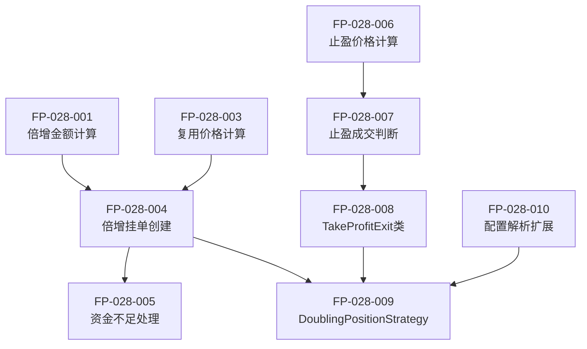

# 功能点清单: 策略12 - 倍增仓位限价挂单

## 文档信息

| 属性 | 值 |
|------|-----|
| 迭代编号 | 028 |
| 迭代名称 | strategy12-doubling-position |
| 版本 | 1.0 |
| 状态 | Draft |
| 创建日期 | 2026-01-11 |
| 关联PRD | prd.md |

---

## 功能点汇总

| 优先级 | 数量 | 说明 |
|--------|------|------|
| P0 (MVP) | 10 | 核心功能，必须实现 |
| P1 (延迟) | 4 | 未来扩展 |
| **总计** | **14** | |

---

## P0 功能点（MVP）

### 模块1: 倍增仓位计算

| ID | 功能点 | 描述 | 验收标准 |
|----|--------|------|----------|
| FP-028-001 | 倍增金额计算 | 根据base_amount和multiplier计算每笔挂单金额 | 输入base=100,mult=2,count=5时，返回[100,200,400,800,1600] |
| FP-028-002 | 累计金额检查 | 计算全部挂单的总资金需求 | 正确返回累计金额（如3100） |

### 模块2: 买入挂单逻辑

| ID | 功能点 | 描述 | 验收标准 |
|----|--------|------|----------|
| FP-028-003 | 复用价格计算 | 调用LimitOrderPriceCalculator计算挂单价格 | 输出与策略11相同（相同参数时） |
| FP-028-004 | 倍增挂单创建 | 结合倍增金额创建多笔挂单 | 每笔挂单金额按倍增规则设定 |
| FP-028-005 | 资金不足处理 | 资金不足时跳过该笔及后续挂单 | 记录跳过的挂单数量，不影响已创建挂单 |

### 模块3: 固定比例止盈

| ID | 功能点 | 描述 | 验收标准 |
|----|--------|------|----------|
| FP-028-006 | 止盈价格计算 | 计算每笔订单的止盈价 = 买入价 × (1 + rate) | 买入价3000,rate=2%时，返回3060 |
| FP-028-007 | 止盈成交判断 | 判断止盈价是否在K线范围内 | low<=止盈价<=high时返回成交信号 |
| FP-028-008 | TakeProfitExit类 | 实现IExitCondition接口的固定比例止盈 | check()方法正确返回ExitSignal |

### 模块4: 策略集成

| ID | 功能点 | 描述 | 验收标准 |
|----|--------|------|----------|
| FP-028-009 | DoublingPositionStrategy类 | 策略12核心类，实现IStrategy接口 | process_kline()正确处理挂单和止盈 |
| FP-028-010 | 配置解析扩展 | ProjectLoader支持新参数(multiplier, base_amount) | 正确解析JSON配置 |

---

## P1 功能点（延迟）

| ID | 功能点 | 延迟原因 |
|----|--------|----------|
| FP-028-P1-001 | 止损机制 | 用户明确不需要 |
| FP-028-P1-002 | 均价止盈 | MVP先用单笔独立止盈 |
| FP-028-P1-003 | 动态倍增系数 | 固定系数满足MVP需求 |
| FP-028-P1-004 | 挂单历史持久化 | 复用策略11决策 |

---

## 功能点依赖关系

---

## 变更历史

| 版本 | 日期 | 变更内容 |
|------|------|----------|
| 1.0 | 2026-01-11 | 初始版本 |
