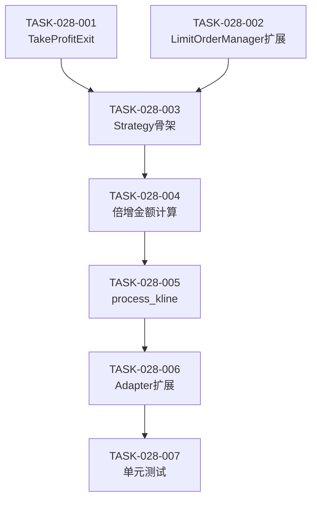

# 任务清单: 策略12 - 倍增仓位限价挂单

## 文档信息

| 属性 | 值 |
|------|-----|
| 迭代编号 | 028 |
| 迭代名称 | strategy12-doubling-position |
| 版本 | 1.0 |
| 状态 | Planned |
| 创建日期 | 2026-01-11 |
| 关联架构 | architecture.md |

---

## 任务概览

| 任务数 | 预估总时长 |
|--------|-----------|
| 7 | 6-8小时 |

---

## 任务列表

### TASK-028-001: TakeProfitExit 固定比例止盈

**目标**: 实现固定比例止盈Exit条件

**文件**: `strategy_adapter/exits/take_profit_exit.py`

**实现要点**:
```python
class TakeProfitExit(IExitCondition):
    def __init__(self, take_profit_rate: float = 0.02):
        self.take_profit_rate = Decimal(str(take_profit_rate))

    def check(self, order, kline, indicators, current_timestamp) -> Optional[ExitSignal]:
        take_profit_price = order.open_price * (Decimal("1") + self.take_profit_rate)
        low, high = Decimal(str(kline['low'])), Decimal(str(kline['high']))
        if low <= take_profit_price <= high:
            return ExitSignal(
                timestamp=current_timestamp,
                price=take_profit_price,
                reason=f"固定{float(self.take_profit_rate)*100:.1f}%止盈",
                exit_type=self.get_type()
            )
        return None

    def get_type(self) -> str:
        return "take_profit"

    def get_priority(self) -> int:
        return 60
```

**验收标准**:
- [ ] check()方法正确计算止盈价格
- [ ] 成交判断逻辑正确（low <= price <= high）
- [ ] 返回正确的ExitSignal格式

**依赖**: 无

**状态**: `pending`

---

### TASK-028-002: LimitOrderManager 扩展

**目标**: 扩展create_buy_order支持自定义金额

**文件**: `strategy_adapter/core/limit_order_manager.py`

**实现要点**:
```python
def create_buy_order(
    self,
    price: Decimal,
    kline_index: int,
    timestamp: int,
    amount: Optional[Decimal] = None  # 新增参数
) -> Optional[PendingOrder]:
    """创建买入挂单，支持自定义金额"""
    actual_amount = amount if amount is not None else self.position_size

    # 检查资金是否充足
    if self._available_capital < actual_amount:
        return None

    # 冻结资金
    self._available_capital -= actual_amount
    self._frozen_capital += actual_amount

    # 创建挂单
    quantity = actual_amount / price
    order = PendingOrder(
        order_id=f"pending_{timestamp}_{kline_index}",
        price=price,
        amount=actual_amount,
        quantity=quantity,
        status='pending',
        side='buy',
        frozen_capital=actual_amount,
        kline_index=kline_index,
        created_at=timestamp
    )
    self._pending_orders[order.order_id] = order
    return order
```

**验收标准**:
- [ ] 新增amount参数，默认值为None
- [ ] amount为None时使用self.position_size（向后兼容）
- [ ] amount有值时使用自定义金额
- [ ] 策略11测试用例仍通过（无regression）

**依赖**: 无

**状态**: `pending`

---

### TASK-028-003: DoublingPositionStrategy 骨架

**目标**: 创建策略12骨架类，实现IStrategy接口

**文件**: `strategy_adapter/strategies/doubling_position_strategy.py`

**实现要点**:
```python
from decimal import Decimal
from typing import Dict, List, Optional

from strategy_adapter.core.limit_order_manager import LimitOrderManager
from strategy_adapter.core.limit_order_price_calculator import LimitOrderPriceCalculator
from strategy_adapter.exits.take_profit_exit import TakeProfitExit


class DoublingPositionStrategy:
    """策略12: 倍增仓位限价挂单"""

    STRATEGY_ID = 12
    STRATEGY_NAME = "倍增仓位限价挂单"

    def __init__(
        self,
        order_count: int = 5,
        order_interval: float = 0.01,
        first_order_discount: float = 0.01,
        base_amount: Decimal = Decimal("100"),
        multiplier: float = 2.0,
        take_profit_rate: float = 0.02
    ):
        self.order_count = order_count
        self.base_amount = base_amount
        self.multiplier = Decimal(str(multiplier))
        self.take_profit_rate = take_profit_rate

        self.price_calculator = LimitOrderPriceCalculator(
            order_count=order_count,
            order_interval=order_interval,
            first_order_discount=first_order_discount
        )
        self.order_manager = LimitOrderManager()
        self.exit_condition = TakeProfitExit(take_profit_rate=take_profit_rate)

    def get_strategy_name(self) -> str:
        return self.STRATEGY_NAME

    def get_strategy_id(self) -> int:
        return self.STRATEGY_ID

    def calculate_doubling_amounts(self) -> List[Decimal]:
        """计算倍增金额列表"""
        pass  # TASK-028-004实现

    def process_kline(self, kline_index, kline, indicators, unified_order_manager) -> Dict:
        """处理单根K线"""
        pass  # TASK-028-005实现
```

**验收标准**:
- [ ] 类结构完整，包含所有属性和方法签名
- [ ] 正确初始化复用组件（LimitOrderPriceCalculator, LimitOrderManager, TakeProfitExit）
- [ ] 导入语句正确

**依赖**: TASK-028-001, TASK-028-002

**状态**: `pending`

---

### TASK-028-004: 倍增金额计算

**目标**: 实现calculate_doubling_amounts方法

**文件**: `strategy_adapter/strategies/doubling_position_strategy.py`

**实现要点**:
```python
def calculate_doubling_amounts(self) -> List[Decimal]:
    """
    计算倍增金额列表

    Returns:
        [100, 200, 400, 800, 1600] (multiplier=2, count=5时)
    """
    amounts = []
    for i in range(self.order_count):
        amount = self.base_amount * (self.multiplier ** i)
        amounts.append(amount)
    return amounts

def get_total_required_capital(self) -> Decimal:
    """计算所需总资金"""
    return sum(self.calculate_doubling_amounts())
```

**验收标准**:
- [ ] multiplier=2, count=5时返回[100, 200, 400, 800, 1600]
- [ ] 总资金计算正确（3100）
- [ ] 支持不同multiplier值（如1.5, 3等）

**依赖**: TASK-028-003

**状态**: `pending`

---

### TASK-028-005: process_kline 核心逻辑

**目标**: 实现策略12的K线处理核心逻辑

**文件**: `strategy_adapter/strategies/doubling_position_strategy.py`

**实现要点**:
```python
def process_kline(
    self,
    kline_index: int,
    kline: Dict,
    indicators: Dict,
    unified_order_manager
) -> Dict:
    """
    处理单根K线

    流程:
    1. 检查上根K线买入挂单是否成交
    2. 取消未成交买入挂单
    3. 计算新挂单价格和金额
    4. 创建新买入挂单（倍增金额）
    5. 检查持仓止盈条件
    """
    result = {
        'new_orders': [],
        'closed_orders': [],
        'failed_orders': 0
    }

    low = Decimal(str(kline['low']))
    high = Decimal(str(kline['high']))
    timestamp = kline['open_time']
    if hasattr(timestamp, 'timestamp'):
        timestamp = int(timestamp.timestamp() * 1000)

    # Step 1: 检查买入挂单成交
    for pending in self.order_manager.get_pending_buy_orders():
        if self.order_manager.check_buy_order_fill(pending, low, high):
            # 创建持仓Order
            order = unified_order_manager.create_order(...)
            result['new_orders'].append(order)

    # Step 2: 取消未成交挂单
    self.order_manager.cancel_all_buy_orders()

    # Step 3: 计算价格和金额
    p5 = Decimal(str(indicators['p5']))
    mid = Decimal(str(indicators['inertia_mid']))
    prices = self.price_calculator.calculate_buy_prices(p5, mid)
    amounts = self.calculate_doubling_amounts()

    # Step 4: 创建新挂单
    for price, amount in zip(prices, amounts):
        pending = self.order_manager.create_buy_order(
            price=price,
            kline_index=kline_index,
            timestamp=timestamp,
            amount=amount
        )
        if pending is None:
            result['failed_orders'] += 1

    # Step 5: 检查止盈
    for order in unified_order_manager.get_open_orders():
        exit_signal = self.exit_condition.check(order, kline, indicators, timestamp)
        if exit_signal:
            unified_order_manager.close_order(order, exit_signal)
            result['closed_orders'].append(order)

    return result
```

**验收标准**:
- [ ] 5步流程完整实现
- [ ] 倍增金额正确传递给create_buy_order
- [ ] 止盈检查正确触发
- [ ] 返回结果格式正确

**依赖**: TASK-028-004

**状态**: `pending`

---

### TASK-028-006: DDPSZAdapter + ProjectLoader 扩展

**目标**: 扩展适配器和配置加载器支持策略12

**文件**:
- `strategy_adapter/adapters/ddpsz_adapter.py`
- `strategy_adapter/core/project_loader.py`

**实现要点**:

**DDPSZAdapter扩展**:
```python
# 在process_kline或策略路由处增加
if strategy_id == 12:
    from strategy_adapter.strategies.doubling_position_strategy import DoublingPositionStrategy
    # 初始化并调用DoublingPositionStrategy
```

**ProjectLoader扩展**:
```python
# 解析新参数
if entry.get('strategy_id') == 12:
    config['base_amount'] = Decimal(str(entry.get('base_amount', 100)))
    config['multiplier'] = float(entry.get('multiplier', 2.0))
```

**验收标准**:
- [ ] strategy_id=12正确路由到DoublingPositionStrategy
- [ ] multiplier和base_amount参数正确解析
- [ ] 策略11功能不受影响

**依赖**: TASK-028-005

**状态**: `pending`

---

### TASK-028-007: 单元测试

**目标**: 编写策略12的核心测试用例

**文件**: `strategy_adapter/tests/test_doubling_position_strategy.py`

**测试用例**:
```python
def test_calculate_doubling_amounts():
    """测试倍增金额计算"""
    strategy = DoublingPositionStrategy(
        order_count=5,
        base_amount=Decimal("100"),
        multiplier=2.0
    )
    amounts = strategy.calculate_doubling_amounts()
    assert amounts == [Decimal("100"), Decimal("200"), Decimal("400"), Decimal("800"), Decimal("1600")]
    assert strategy.get_total_required_capital() == Decimal("3100")


def test_take_profit_exit():
    """测试固定比例止盈"""
    exit_cond = TakeProfitExit(take_profit_rate=0.02)
    order = Order(open_price=Decimal("3000"), ...)
    kline = {'low': 3050, 'high': 3100}  # 止盈价3060在范围内
    signal = exit_cond.check(order, kline, {}, 123456)
    assert signal is not None
    assert signal.price == Decimal("3060")


def test_limit_order_manager_custom_amount():
    """测试自定义金额挂单"""
    manager = LimitOrderManager(position_size=Decimal("100"))
    manager.initialize(Decimal("1000"))

    # 使用自定义金额
    order = manager.create_buy_order(
        price=Decimal("3000"),
        kline_index=0,
        timestamp=123456,
        amount=Decimal("200")
    )
    assert order.amount == Decimal("200")
    assert manager.frozen_capital == Decimal("200")
```

**验收标准**:
- [ ] 倍增金额计算测试通过
- [ ] 止盈Exit测试通过
- [ ] LimitOrderManager扩展测试通过
- [ ] 集成测试通过

**依赖**: TASK-028-006

**状态**: `pending`

---

## 任务依赖图



---

## Q-Gate 5 检查清单

- [x] 任务分解已完成（7个任务）
- [x] 任务粒度合适（每个任务1-2小时）
- [x] 依赖关系已明确
- [x] 验收标准已定义
- [x] 实现要点已细化

---

## 变更历史

| 版本 | 日期 | 变更内容 |
|------|------|----------|
| 1.0 | 2026-01-11 | 初始版本 |
