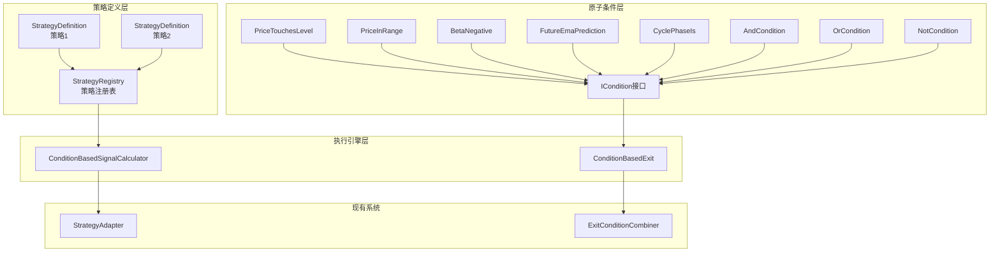

# 架构设计：原子策略组合框架

**迭代编号**: 033
**迭代名称**: 原子策略组合框架
**文档版本**: 1.0
**创建日期**: 2025-01-12
**状态**: 架构设计完成
**优先级**: P0

---

## 第一部分：需求解读与目标对齐

### 1.1 核心业务目标

将回测策略系统从"硬编码的if-else堆砌"升级为"原子条件的声明式组合框架"，解决：
1. **条件逻辑分散**：同一条件在多处重复实现
2. **新策略开发成本高**：添加新策略需修改3+文件、10+处代码
3. **缺乏抽象层**：条件判断无法独立测试、复用、组合

**预期效果**：新策略开发效率提升80%

### 1.2 关键用户流程

```
旧流程：修改SignalCalculator → 修改DDPSZStrategy → 修改Exit → 修改配置
        (3+文件，10+处代码)

新流程：声明式定义策略 → 注册 → 完成
        (1文件，几行代码)
```

---

## 第二部分：核心架构设计

### 2.1 系统架构图



### 2.2 组件职责

| 层级 | 组件 | 职责 |
|------|------|------|
| 策略定义层 | StrategyDefinition | 策略声明式定义容器 |
| 策略定义层 | StrategyRegistry | 策略注册、查询管理 |
| 原子条件层 | ICondition | 统一条件接口，支持&\|~运算符 |
| 原子条件层 | ConditionContext | 条件评估上下文数据 |
| 原子条件层 | ConditionResult | 条件评估结果 |
| 原子条件层 | PriceTouchesLevel | 价格触及级别条件 |
| 原子条件层 | PriceInRange | 价格在范围内条件 |
| 原子条件层 | BetaNegative | Beta为负条件 |
| 原子条件层 | FutureEmaPrediction | 未来EMA预测条件 |
| 原子条件层 | CyclePhaseIs/In | 周期阶段条件 |
| 原子条件层 | And/Or/NotCondition | 逻辑组合条件 |
| 执行引擎层 | ConditionBasedSignalCalculator | 基于条件生成信号 |
| 执行引擎层 | ConditionBasedExit | ICondition到IExitCondition适配器 |

### 2.3 组件与需求映射

| 组件 | 功能点 |
|------|--------|
| ICondition | FP-033-001 |
| ConditionContext | FP-033-002 |
| ConditionResult | FP-033-003 |
| PriceTouchesLevel | FP-033-004 |
| PriceInRange | FP-033-005 |
| BetaNegative | FP-033-006 |
| FutureEmaPrediction | FP-033-007 |
| CyclePhaseIs | FP-033-008 |
| CyclePhaseIn | FP-033-009 |
| AndCondition | FP-033-010 |
| OrCondition | FP-033-011 |
| NotCondition | FP-033-012 |
| StrategyDefinition | FP-033-013 |
| StrategyRegistry | FP-033-014 |
| 策略1定义 | FP-033-015 |
| 策略2定义 | FP-033-016 |
| ConditionBasedSignalCalculator | FP-033-017 |
| ConditionBasedExit | FP-033-018 |

---

## 第三部分：关键技术决策

### 决策点一：原子条件实现粒度

**已选择：方案A - 细粒度条件**

每个原子条件只做一件事，通过组合实现复杂逻辑。

**理由**：复用性最高，符合单一职责，支持独立单元测试。

### 决策点二：新旧SignalCalculator关系

**已选择：方案A - 并行共存，逐步迁移**

新增ConditionBasedSignalCalculator，保留现有SignalCalculator，通过配置切换。

**理由**：风险最低，支持对比验证，渐进式迁移。

### 决策点三：Exit条件集成方式

**已选择：方案A - 适配器模式**

创建ConditionBasedExit适配器，将ICondition包装为IExitCondition。

**理由**：完全兼容现有系统，无需修改ExitConditionCombiner。

---

## 第四部分：模块详细设计

### 4.1 ICondition接口

```python
class ICondition(ABC):
    @abstractmethod
    def evaluate(self, ctx: ConditionContext) -> ConditionResult:
        pass

    @abstractmethod
    def get_name(self) -> str:
        pass

    def __and__(self, other): return AndCondition(self, other)
    def __or__(self, other): return OrCondition(self, other)
    def __invert__(self): return NotCondition(self)
```

### 4.2 ConditionContext

```python
@dataclass
class ConditionContext:
    kline: Dict[str, Any]        # {open, high, low, close}
    indicators: Dict[str, Any]   # {ema25, p5, p95, beta, ...}
    timestamp: int
    order: Optional[Order] = None
```

### 4.3 StrategyDefinition

```python
@dataclass
class StrategyDefinition:
    id: str
    name: str
    direction: str  # 'long' | 'short'
    entry_condition: ICondition
    exit_conditions: List[Tuple[ICondition, int]]  # (condition, priority)
```

### 4.4 使用示例

```python
# 策略1声明式定义
strategy_1 = StrategyDefinition(
    id='strategy_1',
    name='EMA斜率未来预测做多',
    direction='long',
    entry_condition=(
        PriceTouchesLevel('p5', 'below') &
        FutureEmaPrediction(6, above_close=True)
    ),
    exit_conditions=[
        (PriceInRange('ema25'), 30),
    ]
)

registry.register(strategy_1)
```

---

## 第五部分：文件结构

```
strategy_adapter/
├── conditions/                 # 原子条件层
│   ├── __init__.py
│   ├── base.py                 # ICondition, Context, Result
│   ├── price.py                # PriceTouchesLevel, PriceInRange
│   ├── indicator.py            # BetaNegative, FutureEmaPrediction
│   ├── cycle.py                # CyclePhaseIs, CyclePhaseIn
│   └── logic.py                # And, Or, Not
├── definitions/                # 策略定义层
│   ├── __init__.py
│   ├── base.py                 # StrategyDefinition
│   ├── registry.py             # StrategyRegistry
│   └── builtin.py              # 内置策略1,2,7
└── engine/                     # 执行引擎
    ├── __init__.py
    ├── signal_calculator.py    # ConditionBasedSignalCalculator
    └── exit_adapter.py         # ConditionBasedExit
```

---

**文档状态**: ✅ 架构设计完成
**下一阶段**: 任务规划（/powerby.plan）
