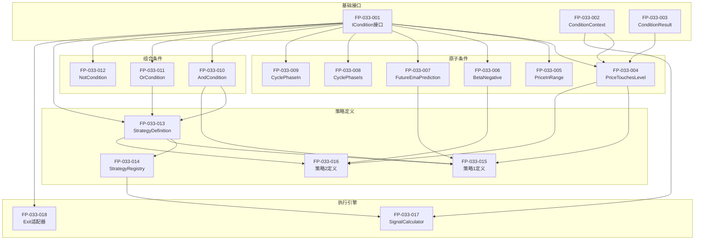

# 功能点清单: 原子策略组合框架

**迭代编号**: 033
**迭代名称**: 原子策略组合框架
**文档版本**: 1.0
**创建日期**: 2025-01-12
**状态**: P1阶段完成

---

## 功能点概览

| 模块 | P0功能点 | P1功能点 | 总计 |
|------|---------|---------|------|
| 原子条件层 | 7 | 3 | 10 |
| 策略定义层 | 4 | 2 | 6 |
| 执行引擎层 | 2 | 1 | 3 |
| **总计** | **13** | **6** | **19** |

---

## 第一部分：原子条件层

### 1.1 基础接口 [P0]

#### FP-033-001: ICondition统一接口

**优先级**: P0
**依赖**: 无
**描述**: 定义原子条件的统一接口，支持入场和出场条件共用

**接口定义**:
```python
class ICondition(ABC):
    def evaluate(ctx: ConditionContext) -> ConditionResult
    def get_name() -> str
    def get_description() -> str  # 可选
    def get_required_indicators() -> List[str]  # 可选
```

**运算符支持**:
- `condition1 & condition2` → AndCondition
- `condition1 | condition2` → OrCondition
- `~condition` → NotCondition

**验收标准**:
- [ ] 接口定义完整，包含类型提示
- [ ] 运算符重载正常工作
- [ ] 可通过isinstance()判断是否为ICondition

---

#### FP-033-002: ConditionContext数据类

**优先级**: P0
**依赖**: 无
**描述**: 条件评估所需的上下文数据结构

**字段定义**:
```python
@dataclass
class ConditionContext:
    kline: Dict[str, Any]        # {open, high, low, close, volume, open_time}
    indicators: Dict[str, Any]   # {ema25, p5, p95, beta, cycle_phase, ...}
    timestamp: int               # 当前时间戳（毫秒）
    order: Optional[Order]       # 持仓订单（出场条件时有值）
    metadata: Dict[str, Any]     # 额外元数据
```

**辅助方法**:
- `get_indicator(name, default)` - 安全获取指标
- `get_kline_value(field)` - 获取K线字段并转Decimal

**验收标准**:
- [ ] 数据类定义完整
- [ ] 辅助方法正常工作
- [ ] 支持可选字段默认值

---

#### FP-033-003: ConditionResult数据类

**优先级**: P0
**依赖**: 无
**描述**: 条件评估的结果数据结构

**字段定义**:
```python
@dataclass
class ConditionResult:
    triggered: bool                  # 是否触发
    price: Optional[Decimal]         # 触发价格
    reason: Optional[str]            # 触发原因
    condition_name: Optional[str]    # 条件名称
    metadata: Dict[str, Any]         # 额外信息
```

**工厂方法**:
- `ConditionResult.not_triggered()` - 快速创建未触发结果
- `ConditionResult.triggered_with(...)` - 快速创建触发结果

**验收标准**:
- [ ] 数据类定义完整
- [ ] 工厂方法简化常用场景

---

### 1.2 价格条件 [P0]

#### FP-033-004: PriceTouchesLevel条件

**优先级**: P0
**依赖**: FP-033-001, FP-033-002, FP-033-003
**描述**: 价格触及某个指标级别

**构造参数**:
```python
PriceTouchesLevel(
    level: str,           # 指标名称 ('p5', 'p95', 'ema25', ...)
    direction: str        # 'below' (low <= level) 或 'above' (high >= level)
)
```

**触发逻辑**:
- `direction='below'`: `kline['low'] <= indicators[level]`
- `direction='above'`: `kline['high'] >= indicators[level]`

**使用场景**:
- 策略1,2,6,7,10: `PriceTouchesLevel('p5', 'below')`
- 策略3,4,8: `PriceTouchesLevel('p95', 'above')`

**验收标准**:
- [ ] below方向正确触发
- [ ] above方向正确触发
- [ ] 指标不存在时返回not_triggered
- [ ] NaN值正确处理

---

#### FP-033-005: PriceInRange条件

**优先级**: P0
**依赖**: FP-033-001, FP-033-002, FP-033-003
**描述**: 价格在指标值附近（K线包含指标值）

**构造参数**:
```python
PriceInRange(
    indicator: str        # 指标名称 ('ema25', ...)
)
```

**触发逻辑**:
- `kline['low'] <= indicators[indicator] <= kline['high']`

**使用场景**:
- EMA25回归: `PriceInRange('ema25')`

**验收标准**:
- [ ] 正确判断指标值在K线范围内
- [ ] 边界情况处理（恰好等于low或high）
- [ ] NaN值正确处理

---

### 1.3 指标条件 [P0]

#### FP-033-006: BetaNegative条件

**优先级**: P0
**依赖**: FP-033-001, FP-033-002, FP-033-003
**描述**: Beta斜率为负（下跌趋势）

**构造参数**: 无

**触发逻辑**:
- `indicators['beta'] < 0`

**使用场景**:
- 策略2前置条件

**验收标准**:
- [ ] beta < 0时触发
- [ ] beta >= 0时不触发
- [ ] beta为NaN时不触发

---

#### FP-033-007: FutureEmaPrediction条件

**优先级**: P0
**依赖**: FP-033-001, FP-033-002, FP-033-003
**描述**: 未来EMA预测价格与当前收盘价比较

**构造参数**:
```python
FutureEmaPrediction(
    periods: int = 6,         # 预测周期数
    above_close: bool = True  # True=预测价>收盘价, False=预测价<收盘价
)
```

**触发逻辑**:
```python
future_ema = indicators['ema25'] + (indicators['beta'] * periods)
if above_close:
    return future_ema > kline['close']
else:
    return future_ema < kline['close']
```

**使用场景**:
- 策略1: `FutureEmaPrediction(6, above_close=True)`
- 策略3,4: `FutureEmaPrediction(6, above_close=False)`

**验收标准**:
- [ ] above_close=True时正确判断
- [ ] above_close=False时正确判断
- [ ] ema或beta为NaN时不触发

---

### 1.4 周期条件 [P0]

#### FP-033-008: CyclePhaseIs条件

**优先级**: P0
**依赖**: FP-033-001, FP-033-002, FP-033-003
**描述**: 当前周期等于指定阶段

**构造参数**:
```python
CyclePhaseIs(
    phase: str  # 'bear_strong', 'bear_warning', 'consolidation', 'bull_warning', 'bull_strong'
)
```

**触发逻辑**:
- `indicators['cycle_phase'] == phase`

**使用场景**:
- 策略6: `CyclePhaseIs('consolidation')`
- 策略8: `CyclePhaseIs('bear_strong')`

**验收标准**:
- [ ] 周期匹配时触发
- [ ] 周期不匹配时不触发
- [ ] cycle_phase不存在时不触发

---

#### FP-033-009: CyclePhaseIn条件

**优先级**: P0
**依赖**: FP-033-001, FP-033-002, FP-033-003
**描述**: 当前周期在指定阶段列表内

**构造参数**:
```python
CyclePhaseIn(
    phases: List[str]  # ['bear_strong', 'bear_warning', ...]
)
```

**触发逻辑**:
- `indicators['cycle_phase'] in phases`

**使用场景**:
- 策略4非上涨区间: `CyclePhaseIn(['consolidation', 'bear_warning', 'bear_strong'])`

**验收标准**:
- [ ] 周期在列表内时触发
- [ ] 周期不在列表内时不触发

---

### 1.5 组合条件 [P0]

#### FP-033-010: AndCondition组合

**优先级**: P0
**依赖**: FP-033-001
**描述**: 所有子条件都满足时触发

**构造方式**:
```python
# 方式1: 构造函数
AndCondition(condition1, condition2, condition3)

# 方式2: 运算符
condition1 & condition2 & condition3
```

**触发逻辑**:
- 短路评估：第一个不满足即返回
- 所有满足时，返回第一个的price和reason

**验收标准**:
- [ ] 所有条件满足时触发
- [ ] 任一条件不满足时不触发
- [ ] 支持多个条件组合
- [ ] 短路评估正常工作

---

#### FP-033-011: OrCondition组合

**优先级**: P0
**依赖**: FP-033-001
**描述**: 任一子条件满足时触发

**构造方式**:
```python
# 方式1: 构造函数
OrCondition(condition1, condition2)

# 方式2: 运算符
condition1 | condition2
```

**触发逻辑**:
- 短路评估：第一个满足即返回
- 返回第一个满足条件的price和reason

**验收标准**:
- [ ] 任一条件满足时触发
- [ ] 所有条件都不满足时不触发
- [ ] 支持多个条件组合

---

#### FP-033-012: NotCondition组合

**优先级**: P0
**依赖**: FP-033-001
**描述**: 子条件不满足时触发

**构造方式**:
```python
# 方式1: 构造函数
NotCondition(condition)

# 方式2: 运算符
~condition
```

**触发逻辑**:
- 子条件不满足时返回triggered=True
- 不提供price（因为是否定条件）

**验收标准**:
- [ ] 子条件不满足时触发
- [ ] 子条件满足时不触发

---

## 第二部分：策略定义层

### 2.1 策略定义 [P0]

#### FP-033-013: StrategyDefinition数据结构

**优先级**: P0
**依赖**: FP-033-001
**描述**: 策略的声明式定义结构

**字段定义**:
```python
@dataclass
class StrategyDefinition:
    id: str                           # 策略ID (strategy_1, strategy_2, ...)
    name: str                         # 策略名称
    version: str                      # 版本号
    direction: str                    # 'long' 或 'short'

    entry_condition: ICondition       # 入场条件（可组合）

    exit_conditions: List[Tuple[ICondition, int]]  # [(条件, 优先级), ...]

    position_calculator: Optional[Callable]  # 仓位计算函数（可选）

    metadata: Dict[str, Any]          # 额外配置
```

**验收标准**:
- [ ] 数据结构定义完整
- [ ] 支持所有必要字段
- [ ] 可正确序列化/反序列化

---

#### FP-033-014: 策略注册表

**优先级**: P0
**依赖**: FP-033-013
**描述**: 策略的注册和查询管理

**核心方法**:
```python
class StrategyRegistry:
    def register(definition: StrategyDefinition) -> None
    def get(strategy_id: str) -> Optional[StrategyDefinition]
    def list_all() -> List[StrategyDefinition]
    def list_by_direction(direction: str) -> List[StrategyDefinition]
```

**装饰器支持**:
```python
@register_strategy
class Strategy1(StrategyDefinition):
    ...
```

**验收标准**:
- [ ] 注册功能正常
- [ ] 查询功能正常
- [ ] 重复注册报错或覆盖

---

### 2.2 现有策略迁移 [P0]

#### FP-033-015: 策略1声明式定义

**优先级**: P0
**依赖**: FP-033-004, FP-033-007, FP-033-010, FP-033-013
**描述**: 将策略1（EMA斜率未来预测做多）迁移到声明式定义

**定义**:
```python
strategy_1 = StrategyDefinition(
    id='strategy_1',
    name='EMA斜率未来预测做多',
    version='2.0',
    direction='long',

    entry_condition=(
        PriceTouchesLevel('p5', 'below') &
        FutureEmaPrediction(periods=6, above_close=True)
    ),

    exit_conditions=[
        (PriceInRange('ema25'), 30),
        (StopLossPercent(5.0), 10),
    ]
)
```

**验收标准**:
- [ ] 定义可正常创建
- [ ] 入场条件逻辑与原实现一致
- [ ] 信号生成结果与原实现一致（回测验证）

---

#### FP-033-016: 策略2声明式定义

**优先级**: P0
**依赖**: FP-033-004, FP-033-006, FP-033-010, FP-033-013
**描述**: 将策略2（惯性下跌中值突破做多）迁移到声明式定义

**定义**:
```python
strategy_2 = StrategyDefinition(
    id='strategy_2',
    name='惯性下跌中值突破做多',
    version='2.0',
    direction='long',

    entry_condition=(
        BetaNegative() &
        IndicatorCompare('inertia_mid', '<', 'p5') &
        PriceBelowMidLine('inertia_mid', 'p5')
    ),

    exit_conditions=[
        (PriceInRange('ema25'), 30),
    ]
)
```

**验收标准**:
- [ ] 定义可正常创建
- [ ] 入场条件逻辑与原实现一致
- [ ] 信号生成结果与原实现一致

---

## 第三部分：执行引擎层

### 3.1 信号生成 [P0]

#### FP-033-017: ConditionBasedSignalCalculator

**优先级**: P0
**依赖**: FP-033-001, FP-033-002, FP-033-013, FP-033-014
**描述**: 基于策略定义生成交易信号

**核心方法**:
```python
class ConditionBasedSignalCalculator:
    def __init__(self, registry: StrategyRegistry):
        ...

    def calculate(
        self,
        klines: List[Dict],
        indicators: Dict[str, np.ndarray],
        enabled_strategies: List[str]
    ) -> Dict[str, List[Dict]]:
        """
        Returns:
            {
                'long_signals': [...],
                'short_signals': [...]
            }
        """
```

**处理流程**:
1. 遍历每根K线
2. 构建ConditionContext
3. 评估启用策略的entry_condition
4. 收集触发的信号

**验收标准**:
- [ ] 正确生成入场信号
- [ ] 支持多策略同时评估
- [ ] 性能达标（1000 K线 < 10ms）

---

#### FP-033-018: ConditionBasedExit适配器

**优先级**: P0
**依赖**: FP-033-001
**描述**: 将ICondition适配为IExitCondition

**实现**:
```python
class ConditionBasedExit(IExitCondition):
    def __init__(self, condition: ICondition, priority: int = 50):
        self.condition = condition
        self.priority = priority

    def check(self, order, kline, indicators, timestamp) -> Optional[ExitSignal]:
        ctx = ConditionContext(kline, indicators, timestamp, order)
        result = self.condition.evaluate(ctx)

        if result.triggered:
            return ExitSignal(
                timestamp=timestamp,
                price=result.price or Decimal(str(kline['close'])),
                reason=result.reason,
                exit_type=self.condition.get_name()
            )
        return None

    def get_type(self) -> str:
        return self.condition.get_name()

    def get_priority(self) -> int:
        return self.priority
```

**验收标准**:
- [ ] 可与ExitConditionCombiner配合使用
- [ ] 优先级正确传递
- [ ] ExitSignal格式正确

---

## 第四部分：P1功能（可推迟）

### 4.1 高级条件 [P1]

#### FP-033-019: ProfitPercentage条件

**描述**: 盈利达到指定百分比
**触发逻辑**: `(current_price - order.open_price) / order.open_price >= threshold`

---

#### FP-033-020: LossPercentage条件

**描述**: 亏损达到指定百分比
**触发逻辑**: `(order.open_price - current_price) / order.open_price >= threshold`

---

#### FP-033-021: IndicatorCompare条件

**描述**: 通用指标比较
**构造**: `IndicatorCompare('inertia_mid', '<', 'p5')`

---

### 4.2 完整策略迁移 [P1]

#### FP-033-022: 策略3,4,8声明式定义

**描述**: 做空策略迁移

---

#### FP-033-023: 策略6,10声明式定义

**描述**: 其他做多策略迁移

---

#### FP-033-024: 策略配置文件支持

**描述**: 从YAML/JSON加载策略定义

---

## 功能点依赖关系图



---

**文档状态**: ✅ 功能点清单完成
**Gate 1检查**: ✅ 已通过
**下一阶段**: 技术调研与架构设计（/powerby.research）
