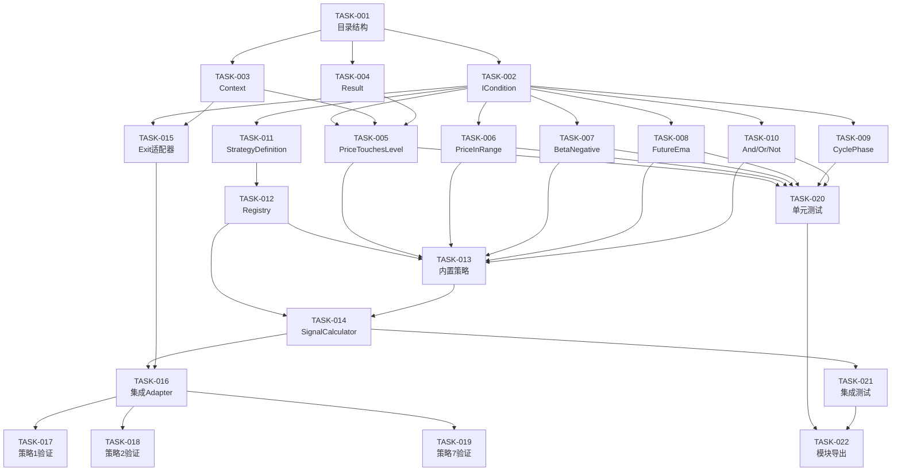

# 任务计划：原子策略组合框架

**迭代编号**: 033
**迭代名称**: 原子策略组合框架
**文档版本**: 1.0
**创建日期**: 2025-01-12
**状态**: 任务规划完成

---

## 任务概览

| 阶段 | 任务数 | 预估工时 |
|------|--------|----------|
| 阶段1: 基础设施 | 4 | 4h |
| 阶段2: 原子条件 | 6 | 6h |
| 阶段3: 策略定义 | 3 | 3h |
| 阶段4: 执行引擎 | 3 | 4h |
| 阶段5: 策略迁移 | 3 | 3h |
| 阶段6: 测试验证 | 3 | 4h |
| **总计** | **22** | **24h** |

---

## 阶段1: 基础设施

### TASK-033-001: 创建conditions模块目录结构

**优先级**: P0
**预估工时**: 0.5h
**依赖**: 无

**描述**: 创建原子条件层的目录和文件结构

**验收标准**:
- [ ] 创建 `strategy_adapter/conditions/` 目录
- [ ] 创建 `__init__.py`, `base.py`, `price.py`, `indicator.py`, `cycle.py`, `logic.py`
- [ ] 创建 `strategy_adapter/definitions/` 目录
- [ ] 创建 `strategy_adapter/engine/` 目录

**文件清单**:
```
strategy_adapter/
├── conditions/
│   ├── __init__.py
│   ├── base.py
│   ├── price.py
│   ├── indicator.py
│   ├── cycle.py
│   └── logic.py
├── definitions/
│   ├── __init__.py
│   ├── base.py
│   ├── registry.py
│   └── builtin.py
└── engine/
    ├── __init__.py
    ├── signal_calculator.py
    └── exit_adapter.py
```

---

### TASK-033-002: 实现ICondition接口

**优先级**: P0
**预估工时**: 1h
**依赖**: TASK-033-001
**关联功能点**: FP-033-001

**描述**: 定义统一的原子条件接口

**实现要点**:
```python
class ICondition(ABC):
    @abstractmethod
    def evaluate(self, ctx: ConditionContext) -> ConditionResult:
        pass

    @abstractmethod
    def get_name(self) -> str:
        pass

    def __and__(self, other): ...
    def __or__(self, other): ...
    def __invert__(self): ...
```

**验收标准**:
- [ ] ICondition抽象类定义完成
- [ ] evaluate()方法签名正确
- [ ] 运算符重载(__and__, __or__, __invert__)实现
- [ ] 类型提示完整

---

### TASK-033-003: 实现ConditionContext数据类

**优先级**: P0
**预估工时**: 1h
**依赖**: TASK-033-001
**关联功能点**: FP-033-002

**描述**: 实现条件评估上下文数据类

**实现要点**:
```python
@dataclass
class ConditionContext:
    kline: Dict[str, Any]
    indicators: Dict[str, Any]
    timestamp: int = 0
    order: Optional['Order'] = None
    metadata: Dict[str, Any] = field(default_factory=dict)

    def get_indicator(self, name, default=None): ...
    def get_kline_value(self, field): ...
```

**验收标准**:
- [ ] 数据类定义完成
- [ ] 辅助方法实现
- [ ] 类型提示完整
- [ ] 支持Order类型（用于出场条件）

---

### TASK-033-004: 实现ConditionResult数据类

**优先级**: P0
**预估工时**: 0.5h
**依赖**: TASK-033-001
**关联功能点**: FP-033-003

**描述**: 实现条件评估结果数据类

**实现要点**:
```python
@dataclass
class ConditionResult:
    triggered: bool
    price: Optional[Decimal] = None
    reason: Optional[str] = None
    condition_name: Optional[str] = None
    metadata: Dict[str, Any] = field(default_factory=dict)

    @classmethod
    def not_triggered(cls): ...

    @classmethod
    def triggered_with(cls, price, reason, ...): ...
```

**验收标准**:
- [ ] 数据类定义完成
- [ ] 工厂方法实现
- [ ] 类型提示完整

---

## 阶段2: 原子条件实现

### TASK-033-005: 实现PriceTouchesLevel条件

**优先级**: P0
**预估工时**: 1h
**依赖**: TASK-033-002, TASK-033-003, TASK-033-004
**关联功能点**: FP-033-004

**描述**: 实现价格触及指标级别条件

**实现要点**:
```python
class PriceTouchesLevel(ICondition):
    def __init__(self, level: str, direction: str = 'below'):
        self.level = level  # 'p5', 'p95', 'ema25', ...
        self.direction = direction  # 'below' or 'above'

    def evaluate(self, ctx):
        level_value = ctx.get_indicator(self.level)
        if self.direction == 'below':
            return ctx.kline['low'] <= level_value
        else:
            return ctx.kline['high'] >= level_value
```

**验收标准**:
- [ ] below方向正确触发
- [ ] above方向正确触发
- [ ] 指标不存在时返回not_triggered
- [ ] NaN值正确处理
- [ ] 单元测试通过

---

### TASK-033-006: 实现PriceInRange条件

**优先级**: P0
**预估工时**: 1h
**依赖**: TASK-033-002, TASK-033-003, TASK-033-004
**关联功能点**: FP-033-005

**描述**: 实现价格在指标范围内条件（用于EMA回归）

**实现要点**:
```python
class PriceInRange(ICondition):
    def __init__(self, indicator: str):
        self.indicator = indicator

    def evaluate(self, ctx):
        value = ctx.get_indicator(self.indicator)
        low, high = ctx.kline['low'], ctx.kline['high']
        return low <= value <= high
```

**验收标准**:
- [ ] 正确判断指标值在K线范围内
- [ ] 边界情况处理（等于low或high）
- [ ] NaN值正确处理
- [ ] 单元测试通过

---

### TASK-033-007: 实现BetaNegative条件

**优先级**: P0
**预估工时**: 0.5h
**依赖**: TASK-033-002, TASK-033-003, TASK-033-004
**关联功能点**: FP-033-006

**描述**: 实现Beta斜率为负条件

**实现要点**:
```python
class BetaNegative(ICondition):
    def evaluate(self, ctx):
        beta = ctx.get_indicator('beta')
        return beta < 0 if beta is not None else False
```

**验收标准**:
- [ ] beta < 0时触发
- [ ] beta >= 0时不触发
- [ ] beta为NaN/None时不触发
- [ ] 单元测试通过

---

### TASK-033-008: 实现FutureEmaPrediction条件

**优先级**: P0
**预估工时**: 1h
**依赖**: TASK-033-002, TASK-033-003, TASK-033-004
**关联功能点**: FP-033-007

**描述**: 实现未来EMA预测条件

**实现要点**:
```python
class FutureEmaPrediction(ICondition):
    def __init__(self, periods: int = 6, above_close: bool = True):
        self.periods = periods
        self.above_close = above_close

    def evaluate(self, ctx):
        ema = ctx.get_indicator('ema25')
        beta = ctx.get_indicator('beta')
        future_ema = ema + (beta * self.periods)
        close = ctx.kline['close']

        if self.above_close:
            return future_ema > close
        else:
            return future_ema < close
```

**验收标准**:
- [ ] above_close=True时正确判断
- [ ] above_close=False时正确判断
- [ ] ema或beta为NaN时不触发
- [ ] 单元测试通过

---

### TASK-033-009: 实现CyclePhaseIs/In条件

**优先级**: P0
**预估工时**: 1h
**依赖**: TASK-033-002, TASK-033-003, TASK-033-004
**关联功能点**: FP-033-008, FP-033-009

**描述**: 实现周期阶段条件

**实现要点**:
```python
class CyclePhaseIs(ICondition):
    def __init__(self, phase: str):
        self.phase = phase

    def evaluate(self, ctx):
        return ctx.get_indicator('cycle_phase') == self.phase

class CyclePhaseIn(ICondition):
    def __init__(self, phases: List[str]):
        self.phases = phases

    def evaluate(self, ctx):
        return ctx.get_indicator('cycle_phase') in self.phases
```

**验收标准**:
- [ ] CyclePhaseIs匹配正确
- [ ] CyclePhaseIn匹配正确
- [ ] cycle_phase不存在时不触发
- [ ] 单元测试通过

---

### TASK-033-010: 实现组合条件(And/Or/Not)

**优先级**: P0
**预估工时**: 1.5h
**依赖**: TASK-033-002
**关联功能点**: FP-033-010, FP-033-011, FP-033-012

**描述**: 实现逻辑组合条件

**实现要点**:
```python
class AndCondition(ICondition):
    def __init__(self, *conditions):
        self.conditions = conditions

    def evaluate(self, ctx):
        for c in self.conditions:
            result = c.evaluate(ctx)
            if not result.triggered:
                return ConditionResult.not_triggered()
        return result  # 返回最后一个结果

class OrCondition(ICondition):
    def __init__(self, *conditions):
        self.conditions = conditions

    def evaluate(self, ctx):
        for c in self.conditions:
            result = c.evaluate(ctx)
            if result.triggered:
                return result
        return ConditionResult.not_triggered()

class NotCondition(ICondition):
    def __init__(self, condition):
        self.condition = condition

    def evaluate(self, ctx):
        result = self.condition.evaluate(ctx)
        if not result.triggered:
            return ConditionResult.triggered_with(reason="NOT条件满足")
        return ConditionResult.not_triggered()
```

**验收标准**:
- [ ] AndCondition短路评估正确
- [ ] OrCondition短路评估正确
- [ ] NotCondition取反正确
- [ ] 支持多层嵌套组合
- [ ] 运算符重载正常工作
- [ ] 单元测试通过

---

## 阶段3: 策略定义层

### TASK-033-011: 实现StrategyDefinition数据结构

**优先级**: P0
**预估工时**: 1h
**依赖**: TASK-033-002
**关联功能点**: FP-033-013

**描述**: 实现策略声明式定义数据结构

**实现要点**:
```python
@dataclass
class StrategyDefinition:
    id: str
    name: str
    version: str = "1.0"
    direction: str = "long"  # 'long' | 'short'

    entry_condition: ICondition = None
    exit_conditions: List[Tuple[ICondition, int]] = field(default_factory=list)

    position_calculator: Optional[Callable] = None
    metadata: Dict[str, Any] = field(default_factory=dict)
```

**验收标准**:
- [ ] 数据结构定义完成
- [ ] 支持所有必要字段
- [ ] 类型提示完整

---

### TASK-033-012: 实现StrategyRegistry

**优先级**: P0
**预估工时**: 1h
**依赖**: TASK-033-011
**关联功能点**: FP-033-014

**描述**: 实现策略注册表

**实现要点**:
```python
class StrategyRegistry:
    _strategies: Dict[str, StrategyDefinition] = {}

    @classmethod
    def register(cls, strategy: StrategyDefinition):
        cls._strategies[strategy.id] = strategy

    @classmethod
    def get(cls, strategy_id: str) -> Optional[StrategyDefinition]:
        return cls._strategies.get(strategy_id)

    @classmethod
    def list_all(cls) -> List[StrategyDefinition]:
        return list(cls._strategies.values())

    @classmethod
    def list_by_direction(cls, direction: str) -> List[StrategyDefinition]:
        return [s for s in cls._strategies.values() if s.direction == direction]
```

**验收标准**:
- [ ] register()正常工作
- [ ] get()正常工作
- [ ] list_all()正常工作
- [ ] list_by_direction()正常工作
- [ ] 单元测试通过

---

### TASK-033-013: 创建内置策略定义

**优先级**: P0
**预估工时**: 1h
**依赖**: TASK-033-011, TASK-033-012, TASK-033-005~010
**关联功能点**: FP-033-015, FP-033-016

**描述**: 将策略1、2、7迁移到声明式定义

**实现要点**:
```python
# builtin.py
strategy_1 = StrategyDefinition(
    id='strategy_1',
    name='EMA斜率未来预测做多',
    direction='long',
    entry_condition=(
        PriceTouchesLevel('p5', 'below') &
        FutureEmaPrediction(6, above_close=True)
    ),
    exit_conditions=[
        (PriceInRange('ema25'), 30),
    ]
)

strategy_2 = StrategyDefinition(
    id='strategy_2',
    name='惯性下跌中值突破做多',
    direction='long',
    entry_condition=(
        BetaNegative() &
        PriceTouchesLevel('p5', 'below')
    ),
    exit_conditions=[
        (PriceInRange('ema25'), 30),
    ]
)

strategy_7 = StrategyDefinition(
    id='strategy_7',
    name='动态周期自适应做多',
    direction='long',
    entry_condition=PriceTouchesLevel('p5', 'below'),
    exit_conditions=[]  # 使用DynamicExitSelector
)

# 注册
StrategyRegistry.register(strategy_1)
StrategyRegistry.register(strategy_2)
StrategyRegistry.register(strategy_7)
```

**验收标准**:
- [ ] 策略1定义可正常创建
- [ ] 策略2定义可正常创建
- [ ] 策略7定义可正常创建
- [ ] 策略已注册到Registry

---

## 阶段4: 执行引擎

### TASK-033-014: 实现ConditionBasedSignalCalculator

**优先级**: P0
**预估工时**: 2h
**依赖**: TASK-033-012, TASK-033-013
**关联功能点**: FP-033-017

**描述**: 实现基于条件的信号计算器

**实现要点**:
```python
class ConditionBasedSignalCalculator:
    def __init__(self, registry: StrategyRegistry = None):
        self.registry = registry or StrategyRegistry

    def calculate(
        self,
        klines: List[Dict],
        indicators: Dict[str, np.ndarray],
        enabled_strategies: List[str] = None
    ) -> Dict[str, List[Dict]]:
        """返回 {'long_signals': [...], 'short_signals': [...]}"""

        strategies = self._get_strategies(enabled_strategies)
        long_signals, short_signals = [], []

        for i, kline in enumerate(klines):
            ctx = ConditionContext(
                kline=kline,
                indicators={k: v[i] for k, v in indicators.items()},
                timestamp=kline.get('open_time', 0)
            )

            for strategy in strategies:
                result = strategy.entry_condition.evaluate(ctx)
                if result.triggered:
                    signal = self._create_signal(strategy, result, ctx)
                    if strategy.direction == 'long':
                        long_signals.append(signal)
                    else:
                        short_signals.append(signal)

        return {'long_signals': long_signals, 'short_signals': short_signals}
```

**验收标准**:
- [ ] 正确生成入场信号
- [ ] 支持多策略同时评估
- [ ] 返回格式与现有SignalCalculator一致
- [ ] 单元测试通过

---

### TASK-033-015: 实现ConditionBasedExit适配器

**优先级**: P0
**预估工时**: 1h
**依赖**: TASK-033-002, TASK-033-003
**关联功能点**: FP-033-018

**描述**: 将ICondition适配为IExitCondition

**实现要点**:
```python
class ConditionBasedExit(IExitCondition):
    def __init__(self, condition: ICondition, priority: int = 50):
        self.condition = condition
        self._priority = priority

    def check(self, order, kline, indicators, timestamp) -> Optional[ExitSignal]:
        ctx = ConditionContext(
            kline=kline,
            indicators=indicators,
            timestamp=timestamp,
            order=order
        )
        result = self.condition.evaluate(ctx)

        if result.triggered:
            return ExitSignal(
                timestamp=timestamp,
                price=result.price or Decimal(str(kline['close'])),
                reason=result.reason,
                exit_type=self.condition.get_name()
            )
        return None

    def get_type(self) -> str:
        return self.condition.get_name()

    def get_priority(self) -> int:
        return self._priority
```

**验收标准**:
- [ ] 可与ExitConditionCombiner配合使用
- [ ] 优先级正确传递
- [ ] ExitSignal格式正确
- [ ] 单元测试通过

---

### TASK-033-016: 集成到DDPSZAdapter

**优先级**: P0
**预估工时**: 1h
**依赖**: TASK-033-014, TASK-033-015

**描述**: 将新的信号计算器集成到现有适配器

**实现要点**:
- 添加use_condition_based配置项
- 在DDPSZAdapter中可选择使用ConditionBasedSignalCalculator
- 保持与现有SignalCalculator并行

**验收标准**:
- [ ] 可通过配置切换计算器
- [ ] 两种计算器产生相同结果
- [ ] 不影响现有功能

---

## 阶段5: 策略迁移验证

### TASK-033-017: 策略1迁移验证

**优先级**: P0
**预估工时**: 1h
**依赖**: TASK-033-016
**关联功能点**: FP-033-015

**描述**: 验证策略1的声明式定义与原实现一致

**验收标准**:
- [ ] 使用相同K线数据
- [ ] 新旧实现生成的信号完全一致
- [ ] 回测结果一致

---

### TASK-033-018: 策略2迁移验证

**优先级**: P0
**预估工时**: 1h
**依赖**: TASK-033-016
**关联功能点**: FP-033-016

**描述**: 验证策略2的声明式定义与原实现一致

**验收标准**:
- [ ] 使用相同K线数据
- [ ] 新旧实现生成的信号完全一致
- [ ] 回测结果一致

---

### TASK-033-019: 策略7迁移验证

**优先级**: P0
**预估工时**: 1h
**依赖**: TASK-033-016

**描述**: 验证策略7的声明式定义与原实现一致

**验收标准**:
- [ ] 使用相同K线数据
- [ ] 新旧实现生成的信号完全一致
- [ ] 回测结果一致

---

## 阶段6: 测试与文档

### TASK-033-020: 原子条件单元测试

**优先级**: P0
**预估工时**: 2h
**依赖**: TASK-033-005~010

**描述**: 为所有原子条件编写单元测试

**测试文件**: `strategy_adapter/tests/test_conditions.py`

**测试用例**:
- 每个条件的正向触发
- 每个条件的反向不触发
- 边界情况（NaN、None、边界值）
- 组合条件的嵌套

**验收标准**:
- [ ] 测试覆盖率 > 80%
- [ ] 所有测试通过

---

### TASK-033-021: 信号计算器集成测试

**优先级**: P0
**预估工时**: 1h
**依赖**: TASK-033-014

**描述**: 测试ConditionBasedSignalCalculator的完整流程

**测试文件**: `strategy_adapter/tests/test_condition_based_calculator.py`

**验收标准**:
- [ ] 端到端信号生成测试
- [ ] 多策略并行测试
- [ ] 所有测试通过

---

### TASK-033-022: 更新模块导出

**优先级**: P0
**预估工时**: 1h
**依赖**: TASK-033-020, TASK-033-021

**描述**: 更新各模块的__init__.py，导出公开API

**验收标准**:
- [ ] conditions模块导出所有条件类
- [ ] definitions模块导出StrategyDefinition和Registry
- [ ] engine模块导出Calculator和Exit适配器
- [ ] 更新strategy_adapter顶层__init__.py

---

## 任务依赖关系图



---

**文档状态**: ✅ 任务规划完成
**下一阶段**: 开发实现（/powerby.implement）
