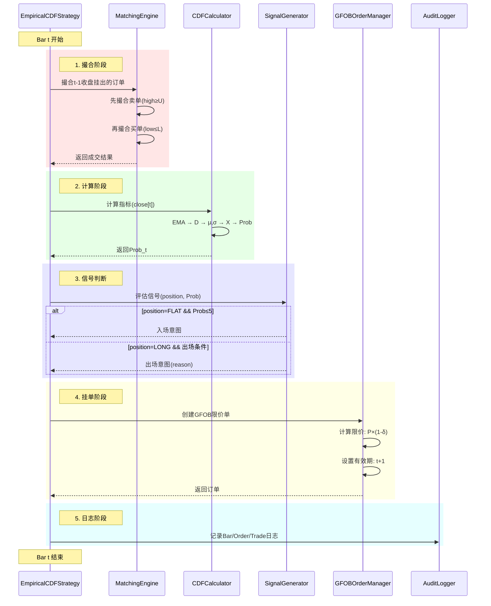

# 架构设计文档：滚动经验CDF信号策略

**迭代编号**: 034
**创建日期**: 2025-01-12
**状态**: Approved
**架构版本**: 1.0

---

## 1. 需求解读与目标对齐

### 1.1 核心业务目标

构建一个**非参数化的量化交易策略系统**，通过滚动经验CDF（而非假设正态分布）来度量价格偏离的"罕见程度"，在极端超卖时入场、回归正常时出场，同时确保严格的**因果一致性**（信号在t时刻计算，成交最早在t+1）和**完整的可审计性**。

### 1.2 关键用户流程

```
┌─────────────────────────────────────────────────────────────────────┐
│                        每根K线处理流程                                │
├─────────────────────────────────────────────────────────────────────┤
│                                                                     │
│  1️⃣ 撮合阶段（Match @ bar t）                                        │
│     └─ 用当前K线OHLC撮合上一根收盘挂出的订单                           │
│        ├─ 卖单优先：high[t] ≥ U → 成交                               │
│        └─ 买单其次：low[t] ≤ L → 成交                                │
│                                                                     │
│  2️⃣ 计算阶段（Compute @ bar t close）                                │
│     └─ 链式指标计算：                                                │
│        close → EMA25 → 偏离率D → EWMA(μ,σ) → 标准化X → 经验CDF Prob   │
│                                                                     │
│  3️⃣ 信号判断阶段                                                     │
│     ├─ 若FLAT且Prob≤5 → 产生入场意图                                 │
│     └─ 若LONG且(Prob≥50 或 时间止损 或 灾难止损) → 产生出场意图        │
│                                                                     │
│  4️⃣ 挂单阶段（Place @ bar t close）                                  │
│     ├─ 入场：挂GFOB限价买单，价格 = close × (1 - 0.1%)               │
│     └─ 出场：挂GFOB限价卖单，价格根据出场原因定价                      │
│                                                                     │
│  5️⃣ 日志记录阶段                                                     │
│     └─ 记录Bar Log、Order Log、Trade Log                            │
│                                                                     │
└─────────────────────────────────────────────────────────────────────┘
```

### 1.3 五大核心模块

| 模块 | 职责 | 功能点 |
|------|------|--------|
| **指标计算模块** | EMA→偏离率D→EWMA(μ,σ)→标准化X→经验CDF Prob | 5个 |
| **信号生成模块** | 入场信号(左尾)、概率回归出场、风控出场 | 3个 |
| **订单管理模块** | GFOB订单创建、入场/出场定价、生命周期管理 | 4个 |
| **撮合引擎模块** | 买单撮合、卖单撮合、顺序控制 | 3个 |
| **日志审计模块** | Bar/Order/Trade三类日志 | 3个 |

### 1.4 关键约束

1. **因果一致性**：Prob只使用过去M个X值（不含当前），订单t挂出t+1成交
2. **GFOB有效期**：订单仅在下一根K线有效，未成交则过期
3. **撮合顺序**：先卖后买，避免同bar翻手套利
4. **冷启动期**：历史不足M时Prob=NaN，禁止入场

---

## 2. 架构设计与可视化

### 2.1 核心架构图

```mermaid
graph TB
    subgraph "数据层"
        KL[K线数据<br/>OHLC]
    end

    subgraph "指标计算模块"
        EMA[EMA25计算器<br/>FP-001]
        DEV[偏离率计算器<br/>D_t<br/>FP-002]
        EWMA[EWMA计算器<br/>μ_t, σ_t<br/>FP-003/004]
        CDF[经验CDF计算器<br/>Prob_t<br/>FP-005]

        KL --> EMA
        EMA --> DEV
        DEV --> EWMA
        EWMA --> CDF
    end

    subgraph "信号生成模块"
        ENTRY[入场信号生成器<br/>Prob≤5<br/>FP-006]
        EXIT_PROB[概率回归出场<br/>Prob≥50<br/>FP-007]
        EXIT_RISK[风控出场<br/>时间/灾难止损<br/>FP-008]

        CDF --> ENTRY
        CDF --> EXIT_PROB
        CDF --> EXIT_RISK
    end

    subgraph "订单管理模块"
        GFOB[GFOB订单管理器<br/>FP-009/012]
        PRICE_BUY[入场定价器<br/>L=P×(1-δ)<br/>FP-010]
        PRICE_SELL[出场定价器<br/>U=P×(1-δ)<br/>FP-011]

        ENTRY --> PRICE_BUY
        EXIT_PROB --> PRICE_SELL
        EXIT_RISK --> PRICE_SELL
        PRICE_BUY --> GFOB
        PRICE_SELL --> GFOB
    end

    subgraph "撮合引擎模块"
        MATCH_BUY[买单撮合<br/>low≤L<br/>FP-013]
        MATCH_SELL[卖单撮合<br/>high≥U<br/>FP-014]
        SEQ[撮合顺序控制<br/>先卖后买<br/>FP-015]

        GFOB --> SEQ
        SEQ --> MATCH_SELL
        SEQ --> MATCH_BUY
        KL --> MATCH_SELL
        KL --> MATCH_BUY
    end

    subgraph "日志审计模块"
        LOG_BAR[Bar日志<br/>FP-016]
        LOG_ORDER[订单日志<br/>FP-017]
        LOG_TRADE[交易日志<br/>FP-018]

        CDF --> LOG_BAR
        GFOB --> LOG_ORDER
        MATCH_SELL --> LOG_TRADE
        MATCH_BUY --> LOG_TRADE
    end

    subgraph "策略主控"
        STRAT[EmpiricalCDFStrategy<br/>实现IStrategy接口]

        STRAT --> EMA
        MATCH_SELL --> STRAT
        MATCH_BUY --> STRAT
    end
```

### 2.2 概念解读

本系统是一个**基于滚动经验CDF的限价单交易策略**，采用**逐K线处理**的回测模式。每根K线按照「撮合→计算→挂单→日志」的顺序执行，确保严格的因果一致性。

### 2.3 组件职责

| 组件 | 职责 | 关键特性 |
|------|------|----------|
| **EMA25计算器** | 计算25周期指数移动平均 | 因果计算，支持增量更新 |
| **偏离率计算器** | 计算收盘价与EMA的偏离率D | D=(P-EMA)/EMA |
| **EWMA计算器** | 计算偏离率的均值μ和波动率σ | α=2/(N+1), 数值稳定 |
| **经验CDF计算器** | 计算标准化偏离X在历史窗口中的百分位 | 窗口M=100，不含当前样本 |
| **入场信号生成器** | 检测左尾极端超卖（Prob≤5） | 仅FLAT状态触发 |
| **概率回归出场** | 检测价格回归正常区间（Prob≥50） | 仅LONG状态触发 |
| **风控出场** | 时间止损(48bar)和灾难止损(-5%) | 触发FAST_EXIT |
| **GFOB订单管理器** | 管理限价订单生命周期 | 订单仅下一根K线有效 |
| **入场/出场定价器** | 计算限价单价格 | 支持折扣参数 |
| **撮合引擎** | 使用OHLC撮合限价单 | 先卖后买，防翻手套利 |
| **日志模块** | 记录Bar/Order/Trade三类日志 | 支持完整审计追溯 |

### 2.4 组件与需求映射

#### EmpiricalCDFCalculator（指标计算服务）
- 负责实现: FP-034-001(EMA计算), FP-034-002(偏离率), FP-034-003(EWMA均值), FP-034-004(EWMA波动率), FP-034-005(滚动经验CDF)

#### SignalGenerator（信号生成服务）
- 负责实现: FP-034-006(入场信号), FP-034-007(概率回归出场), FP-034-008(风控出场)

#### GFOBOrderManager（订单管理服务）
- 负责实现: FP-034-009(GFOB订单创建), FP-034-010(入场定价), FP-034-011(出场定价), FP-034-012(订单生命周期)
- 设计模式: 组合模式，内部持有LimitOrderManager实例

#### MatchingEngine（撮合引擎服务）
- 负责实现: FP-034-013(买单撮合), FP-034-014(卖单撮合), FP-034-015(撮合顺序控制)
- 关键规则: 买单`low≤L`成交，卖单`high≥U`成交

#### AuditLogger（日志审计服务）
- 负责实现: FP-034-016(Bar日志), FP-034-017(订单日志), FP-034-018(交易日志)

### 2.5 交互流程图



---

## 3. 关键决策点与方案评估

### 3.1 决策点一：GFOB订单管理器实现方式

**背景**：现有 `LimitOrderManager` 的撮合规则是 `low ≤ price ≤ high`，而新策略要求：
- 买单：`low ≤ L` 即成交
- 卖单：`high ≥ U` 即成交

| 方案 | 简介 | 优点 | 缺点 |
|------|------|------|------|
| A. 继承扩展 | 继承LimitOrderManager，覆写撮合方法 | 复用代码，一致性好 | 继承耦合 |
| B. 独立新建 | 完全独立实现 | 完全解耦 | 重复代码多 |
| **C. 组合模式** | 内部持有LimitOrderManager，委托资金管理 | 复用+松耦合 | 需定义边界 |

**最终决策**: ✅ **方案C：组合模式**

**理由**:
1. 资金管理逻辑（冻结/解冻/统计）完全复用
2. 撮合逻辑和GFOB有效期管理独立实现
3. 符合"组合优于继承"原则，易于测试和扩展

---

### 3.2 决策点二：指标计算器设计模式

**背景**：需要实现链式指标计算：`close → EMA → D → μ,σ → X → Prob`

| 方案 | 简介 | 优点 | 缺点 |
|------|------|------|------|
| **A. 单一类封装** | 所有计算在一个类中 | 简单直接，状态集中 | 职责较多 |
| B. 分层计算链 | 每种指标一个类 | 单一职责 | 类数量多 |
| C. 函数式 | 纯函数+状态容器 | 无副作用 | 状态管理复杂 |

**最终决策**: ✅ **方案A：单一类封装**

**理由**:
1. 本策略指标计算是紧密耦合的链式依赖
2. 所有指标共享状态（历史队列、EWMA状态等）
3. 单一类便于管理冷启动期和边界条件
4. 复杂度可控（约150行代码）

---

### 3.3 决策点三：策略类与现有框架的集成方式

**背景**：现有回测框架支持传统模式和逐K线模式

| 方案 | 简介 | 优点 | 缺点 |
|------|------|------|------|
| A. 传统IStrategy | 一次性生成所有信号 | 框架兼容 | 无法实现GFOB语义 |
| **B. 逐K线处理** | process_kline逐根处理 | 匹配GFOB，因果一致 | 需自带回测循环 |
| C. 混合模式 | 接口空实现+逐K线 | 接口兼容 | 可能误用 |

**最终决策**: ✅ **方案B：逐K线处理模式**

**理由**:
1. GFOB语义要求"信号在t，成交在t+1"，只有逐K线处理能自然实现
2. 策略11已验证此模式可行，代码可复用
3. 回测循环代码量小（约50行），复用 `run_limit_order_backtest` 模式

---

## 4. 文件结构与实现规划

### 4.1 新建文件清单

```
strategy_adapter/
├── strategies/
│   └── empirical_cdf_strategy.py      # 新建：策略主类
├── calculators/
│   └── empirical_cdf_calculator.py    # 新建：指标计算器
├── core/
│   └── gfob_order_manager.py          # 新建：GFOB订单管理器
└── tests/
    ├── test_empirical_cdf_calculator.py  # 新建：计算器测试
    └── test_empirical_cdf_strategy.py    # 新建：策略测试
```

### 4.2 复用文件清单

| 文件 | 复用方式 | 说明 |
|------|----------|------|
| `interfaces/strategy.py` | 直接使用 | IStrategy接口 |
| `models/pending_order.py` | 直接使用 | PendingOrder模型 |
| `core/limit_order_manager.py` | 组合引用 | 资金管理逻辑 |
| `management/commands/run_strategy_backtest.py` | 扩展支持 | 回测命令 |

### 4.3 类设计详情

#### 4.3.1 EmpiricalCDFCalculator

```python
class EmpiricalCDFCalculator:
    """
    经验CDF指标计算器

    职责：
    - EMA25计算（因果，增量）
    - 偏离率D计算
    - EWMA均值μ和波动率σ计算
    - 标准化偏离X计算
    - 滚动经验CDF百分位Prob计算

    状态：
    - _ema: 当前EMA值
    - _mu: EWMA均值
    - _var: EWMA方差
    - _x_history: 历史X值队列（长度M）
    """

    def __init__(
        self,
        ema_period: int = 25,
        ewma_period: int = 50,
        cdf_window: int = 100,
        epsilon: float = 1e-12
    ):
        pass

    def update(self, close: Decimal) -> Dict:
        """
        更新指标（每根K线调用一次）

        Returns:
            Dict: {
                'ema': Decimal,
                'd': Decimal,
                'mu': Decimal,
                'sigma': Decimal,
                'x': Decimal,
                'prob': Optional[float]  # 冷启动期为None
            }
        """
        pass

    def reset(self) -> None:
        """重置所有状态（回测开始时调用）"""
        pass
```

#### 4.3.2 GFOBOrderManager

```python
class GFOBOrderManager:
    """
    GFOB限价单管理器

    职责：
    - 创建GFOB限价单（有效期=下一根K线）
    - 撮合判断（买单low≤L，卖单high≥U）
    - 订单过期处理
    - 资金管理（委托LimitOrderManager）

    设计：组合模式，内部持有LimitOrderManager
    """

    def __init__(
        self,
        position_size: Decimal = Decimal("100"),
        delta_in: float = 0.001,
        delta_out: float = 0.0,
        delta_out_fast: float = 0.001
    ):
        self._capital_manager = LimitOrderManager(position_size)
        pass

    def create_buy_order(
        self,
        close_price: Decimal,
        kline_index: int,
        timestamp: int
    ) -> Optional[PendingOrder]:
        """创建入场限价买单，价格=close×(1-δ_in)"""
        pass

    def create_sell_order(
        self,
        close_price: Decimal,
        parent_order_id: str,
        quantity: Decimal,
        reason: str,  # 'PROB_REVERSION' or 'FAST_EXIT'
        kline_index: int,
        timestamp: int
    ) -> PendingOrder:
        """创建出场限价卖单"""
        pass

    def match_orders(
        self,
        kline_index: int,
        low: Decimal,
        high: Decimal,
        timestamp: int
    ) -> Dict:
        """
        撮合订单（先卖后买）

        Returns:
            Dict: {
                'sell_fills': List[Dict],
                'buy_fills': List[Dict],
                'expired_orders': List[str]
            }
        """
        pass

    def expire_stale_orders(self, current_kline_index: int) -> List[str]:
        """过期非当前K线的订单（GFOB语义）"""
        pass
```

#### 4.3.3 EmpiricalCDFStrategy

```python
class EmpiricalCDFStrategy(IStrategy):
    """
    滚动经验CDF信号策略

    核心逻辑：
    - 入场：Prob≤q_in（默认5）时挂限价买单
    - 出场：Prob≥q_out（默认50）或风控触发时挂限价卖单
    - 执行：GFOB限价单，下一根K线撮合

    参数：
    - q_in: 入场阈值（默认5）
    - q_out: 出场阈值（默认50）
    - H: 时间止损bar数（默认48）
    - s: 灾难止损阈值（默认0.05）
    """

    STRATEGY_ID = 'empirical_cdf'
    STRATEGY_NAME = '滚动经验CDF策略'
    STRATEGY_VERSION = '1.0'

    def __init__(
        self,
        q_in: float = 5,
        q_out: float = 50,
        max_holding_bars: int = 48,
        stop_loss_threshold: float = 0.05,
        position_size: Decimal = Decimal("100"),
        # ... 其他参数
    ):
        self._calculator = EmpiricalCDFCalculator()
        self._order_manager = GFOBOrderManager(position_size)
        pass

    def process_kline(
        self,
        kline_index: int,
        kline: Dict,
        timestamp: int
    ) -> Dict:
        """
        处理单根K线（核心方法）

        执行顺序：
        1. 撮合阶段：撮合t-1挂出的订单
        2. 计算阶段：计算Prob
        3. 信号阶段：判断入场/出场
        4. 挂单阶段：创建GFOB订单
        5. 日志阶段：记录日志
        """
        pass

    def run_backtest(
        self,
        klines_df: pd.DataFrame,
        initial_capital: Decimal = Decimal("10000")
    ) -> Dict:
        """执行完整回测"""
        pass

    # IStrategy接口实现（兼容性）
    def generate_buy_signals(self, klines, indicators) -> List[Dict]:
        return []  # 使用process_kline模式

    def generate_sell_signals(self, klines, indicators, open_orders) -> List[Dict]:
        return []  # 使用process_kline模式
```

---

## 5. 验收标准

### 5.1 因果与执行一致性

- [ ] Prob_t 只使用过去M个X值（不含X_t）
- [ ] 所有订单均在 bar t 收盘挂出，最早在 bar t+1 成交
- [ ] 所有订单均为GFOB：只在下一根有效，未成交必过期
- [ ] 撮合规则：买单 `low ≤ L`，卖单 `high ≥ U`
- [ ] 撮合顺序固定：先卖后买

### 5.2 策略闭环正确性

- [ ] 仅在 Prob≤q_in 时尝试入场
- [ ] 持仓期间在 Prob≥q_out 时尝试出场
- [ ] 时间止损与灾难止损触发FAST_EXIT卖单

### 5.3 可审计性

- [ ] 每根bar日志、订单日志、交易日志字段齐全
- [ ] 任意成交可追溯：信号计算→挂单→下根撮合→成交/过期

---

## 6. 技术决策汇总

| 决策点 | 最终方案 | 核心理由 |
|--------|----------|----------|
| GFOB订单管理器 | 组合模式 | 复用资金管理，撮合逻辑独立，松耦合 |
| 指标计算器 | 单一类封装 | 链式依赖紧密，状态共享，复杂度可控 |
| 框架集成 | 逐K线模式 | 匹配GFOB语义，保证因果一致性 |

---

## 附录：复用组件分析

### A.1 LimitOrderManager 复用点

| 方法 | 复用 | 说明 |
|------|------|------|
| `initialize()` | ✅ | 资金初始化 |
| `available_capital` | ✅ | 可用资金查询 |
| `frozen_capital` | ✅ | 冻结资金查询 |
| `create_buy_order()` | ✅ | 创建买单+冻结资金 |
| `cancel_all_buy_orders()` | ❌ | GFOB不需要批量取消 |
| `check_buy_order_fill()` | ❌ | 撮合规则不同 |
| `check_sell_order_fill()` | ❌ | 撮合规则不同 |
| `fill_buy_order()` | ✅ | 确认买单成交 |
| `fill_sell_order()` | ✅ | 确认卖单成交+释放资金 |
| `get_statistics()` | ✅ | 统计信息 |

### A.2 策略11代码复用点

| 代码块 | 复用 | 说明 |
|--------|------|------|
| `process_kline` 框架 | ✅ | 逐K线处理模式 |
| `run_limit_order_backtest` | ✅ | 回测循环框架 |
| 持仓管理 `_holdings` | ✅ | 持仓字典结构 |
| 交易记录 `_completed_orders` | ✅ | 完成交易列表 |
| 统计方法 `get_statistics()` | ✅ | 统计信息结构 |

---

**文档状态**: ✅ 架构设计已确认
**下一步**: 使用 `/powerby-plan` 进入开发规划阶段
