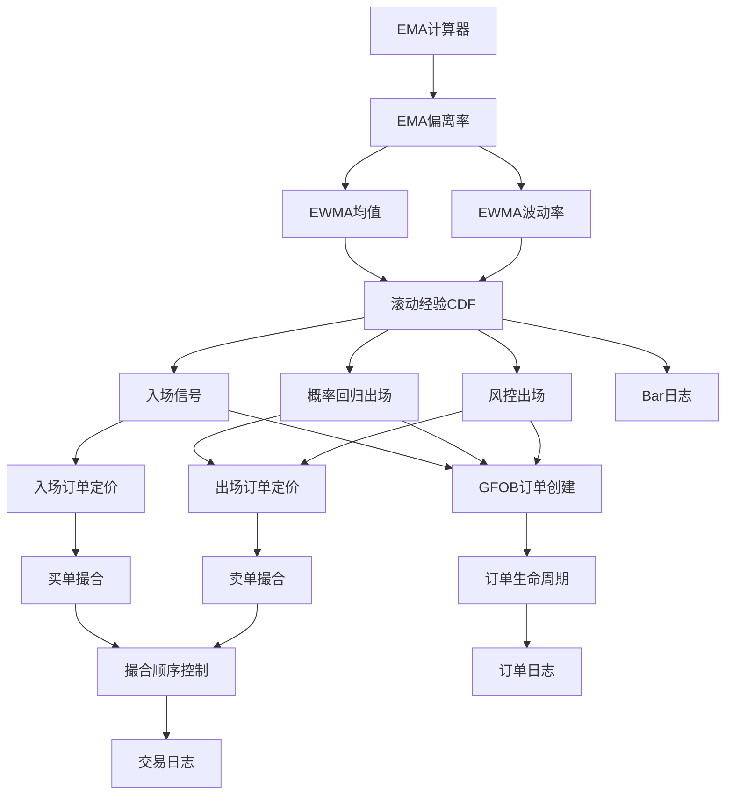

# 功能点清单：滚动经验CDF信号策略

**迭代编号**: 034
**创建日期**: 2025-01-12
**状态**: Draft

---

## 功能点总览

| 模块 | 功能点数 | MVP优先级 |
|------|----------|-----------|
| 指标计算模块 | 5 | P0 |
| 信号生成模块 | 3 | P0 |
| 订单管理模块 | 4 | P0 |
| 撮合引擎模块 | 3 | P0 |
| 日志审计模块 | 3 | P0 |
| **总计** | **18** | - |

---

## 模块一：指标计算模块

### FP-034-001: EMA计算器
- **描述**: 计算25周期指数移动平均线
- **输入**: close[t] 收盘价序列
- **输出**: EMA25[t]
- **约束**: 必须因果计算，不得使用未来数据
- **优先级**: P0
- **验收标准**:
  - [ ] EMA计算结果与标准库一致
  - [ ] 支持增量更新

### FP-034-002: EMA偏离率计算
- **描述**: 计算收盘价与EMA的偏离率
- **公式**: D_t = (P_t - EMA_t) / EMA_t
- **输入**: close[t], EMA25[t]
- **输出**: D_t
- **优先级**: P0
- **验收标准**:
  - [ ] 偏离率计算精度达到小数点后8位

### FP-034-003: EWMA均值计算
- **描述**: 计算偏离率的指数加权移动平均
- **公式**: μ_t = α·D_t + (1-α)·μ_{t-1}, α = 2/(N+1)
- **参数**: N = 50（默认）
- **优先级**: P0
- **验收标准**:
  - [ ] 递推计算正确
  - [ ] 支持自定义N值

### FP-034-004: EWMA波动率计算
- **描述**: 计算偏离率的指数加权波动率
- **公式**: σ²_t = α·(D_t - μ_t)² + (1-α)·σ²_{t-1}
- **数值稳定**: σ_t = sqrt(max(σ²_t, ε)), ε = 1e-12
- **优先级**: P0
- **验收标准**:
  - [ ] 数值稳定，无除零错误
  - [ ] 波动率始终为正数

### FP-034-005: 滚动经验CDF百分位
- **描述**: 计算标准化偏离X在历史窗口中的百分位
- **公式**: Prob_t = 100 × (1/M) × Σ𝟙(X_{t-i} ≤ X_t)
- **参数**: M = 100（窗口大小）
- **约束**:
  - 窗口不含当前样本X_t
  - 历史不足M时返回NaN
- **优先级**: P0
- **验收标准**:
  - [ ] 百分位计算范围0-100
  - [ ] 窗口正确排除当前样本
  - [ ] 冷启动期正确返回NaN

---

## 模块二：信号生成模块

### FP-034-006: 入场信号生成
- **描述**: 当Prob处于左尾时生成入场信号
- **触发条件**:
  1. position = FLAT
  2. Prob_t 有效（非NaN）
  3. Prob_t ≤ q_in（默认5）
- **输出**: 入场挂单意图（非立即成交）
- **优先级**: P0
- **验收标准**:
  - [ ] 仅在FLAT状态触发
  - [ ] Prob无效时不触发
  - [ ] 阈值判断正确

### FP-034-007: 概率回归出场信号
- **描述**: 当Prob回归到中位附近时生成出场信号
- **触发条件**:
  1. position = LONG
  2. Prob_t ≥ q_out（默认50）
- **输出**: 出场挂单意图（reason=PROB_REVERSION）
- **优先级**: P0
- **验收标准**:
  - [ ] 仅在LONG状态触发
  - [ ] 阈值判断正确

### FP-034-008: 风控出场信号
- **描述**: 时间止损和灾难止损触发
- **触发条件**（满足任一）:
  1. 时间止损: t - t_entry ≥ H（默认48）
  2. 灾难止损: r_t = (P_t - P_entry) / P_entry ≤ -s（默认-5%）
- **输出**: 快速出场挂单意图（reason=FAST_EXIT）
- **优先级**: P0
- **验收标准**:
  - [ ] 持仓时间计算正确
  - [ ] 浮动收益率计算正确
  - [ ] 止损阈值判断正确

---

## 模块三：订单管理模块

### FP-034-009: GFOB订单创建
- **描述**: 创建Good-for-One-Bar限价订单
- **属性**:
  - order_id: 唯一标识
  - type: BUY_LIMIT / SELL_LIMIT
  - placed_time: 挂单时间
  - valid_bar: 有效K线（placed_time + 1）
  - limit_price: 限价
  - reason: ENTRY_TAIL / PROB_REVERSION / FAST_EXIT
- **优先级**: P0
- **验收标准**:
  - [ ] 订单属性完整
  - [ ] 有效期正确设置为下一根K线

### FP-034-010: 入场订单定价
- **描述**: 计算入场限价买单价格
- **公式**: L_t = P_t × (1 - δ_in)
- **参数**: δ_in = 0.001（默认，0.1%折扣）
- **优先级**: P0
- **验收标准**:
  - [ ] 价格计算精度正确
  - [ ] 支持自定义折扣参数

### FP-034-011: 出场订单定价
- **描述**: 计算出场限价卖单价格
- **公式**:
  - 快速退出: U_fast = P_t × (1 - δ_out_fast)
  - 正常退出: U_norm = P_t × (1 - δ_out)
- **参数**: δ_out_fast = 0.001, δ_out = 0.0
- **优先级**: P0
- **验收标准**:
  - [ ] 根据出场原因选择正确定价模式
  - [ ] 价格计算精度正确

### FP-034-012: 订单生命周期管理
- **描述**: 管理订单状态转换
- **状态**: PLACED → FILLED / EXPIRED
- **约束**: 订单仅在valid_bar有效，过期自动撤销
- **优先级**: P0
- **验收标准**:
  - [ ] 状态转换正确
  - [ ] 过期订单自动清理

---

## 模块四：撮合引擎模块

### FP-034-013: 买单撮合
- **描述**: 使用K线OHLC撮合限价买单
- **规则**: 若 low[t] ≤ L，成交价 = L；否则未成交
- **优先级**: P0
- **验收标准**:
  - [ ] 撮合逻辑正确
  - [ ] 成交价为限价（非low）

### FP-034-014: 卖单撮合
- **描述**: 使用K线OHLC撮合限价卖单
- **规则**: 若 high[t] ≥ U，成交价 = U；否则未成交
- **优先级**: P0
- **验收标准**:
  - [ ] 撮合逻辑正确
  - [ ] 成交价为限价（非high）

### FP-034-015: 撮合顺序控制
- **描述**: 固定撮合顺序避免同bar翻手套利
- **规则**:
  1. 先撮合卖单（若持仓）
  2. 再撮合买单（若空仓）
- **优先级**: P0
- **验收标准**:
  - [ ] 撮合顺序固定
  - [ ] 同bar不会出现买卖双成交

---

## 模块五：日志审计模块

### FP-034-016: Bar日志记录
- **描述**: 每根K线记录完整状态
- **字段**: t, OHLC, EMA25, D, μ, σ, X, Prob, position, pending_buy, pending_sell
- **优先级**: P0
- **验收标准**:
  - [ ] 字段完整
  - [ ] 支持CSV/JSON输出

### FP-034-017: 订单日志记录
- **描述**: 每次挂单记录完整信息
- **字段**: order_id, type, placed_time, valid_bar, limit_price, reason, status, fill_time, fill_price
- **优先级**: P0
- **验收标准**:
  - [ ] 挂单、成交、过期均有记录
  - [ ] 支持按order_id查询

### FP-034-018: 交易日志记录
- **描述**: 每笔完整交易记录
- **字段**: entry_time, entry_price, exit_time, exit_price, entry_signal_time, entry_prob, exit_reason, gross_return
- **优先级**: P0
- **验收标准**:
  - [ ] 交易闭环记录完整
  - [ ] 支持收益统计

---

## 功能依赖关系

---

## MVP范围确认

### P0（MVP必须）: 18个功能点

所有18个功能点均为P0优先级，构成完整的可运行系统：
- 指标计算：5个
- 信号生成：3个
- 订单管理：4个
- 撮合引擎：3个
- 日志审计：3个

### P1（后续迭代）

- 状态过滤（Regime Detection）
- 赔率/期望值计算
- 风控报表体系
- 手续费/滑点模型
