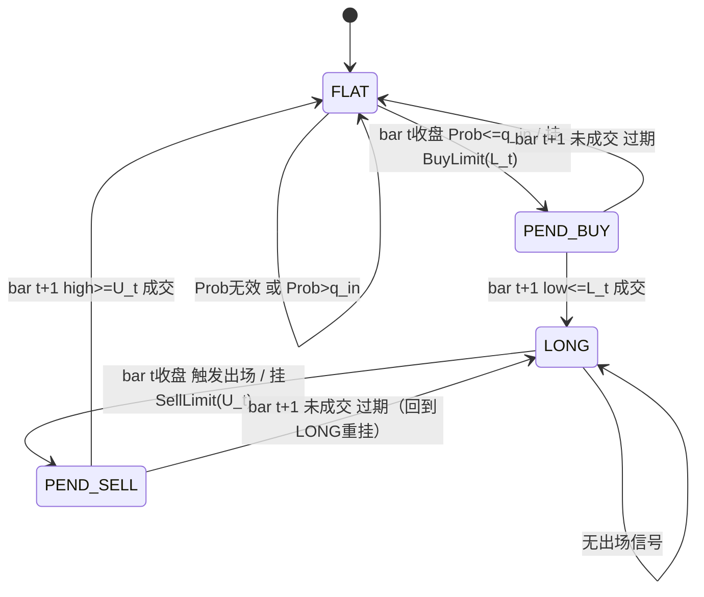

# PRD: 滚动经验CDF信号策略

**迭代编号**: 034
**迭代名称**: 滚动经验CDF信号 + 概率回归平仓
**创建日期**: 2025-01-12
**状态**: Draft

---

## 1. 背景与目标

### 1.1 问题陈述

金融序列具有厚尾、偏态且非平稳的特性，使用正态分布CDF会在尾部产生系统性偏差。传统的参数化分布假设难以准确捕捉极端行情。

### 1.2 解决方案

使用**滚动经验CDF（经验百分位）**来度量"偏离是否罕见"，形成交易闭环：

- **入场**：当 Prob 处于左尾（小概率、极端超卖）时触发买入意图
- **出场**：当 Prob 回归到中位附近（例如 ≥50%）时触发平仓意图
- **执行**：在当前K线收盘计算并挂限价单，在下一根K线以OHLC撮合成交

### 1.3 核心价值

1. **非参数化**：不假设特定分布，自适应市场变化
2. **因果一致**：严格的时序执行，信号在t时刻，成交最早在t+1
3. **可审计**：完整的日志体系支持回溯分析

---

## 2. 范围定义

### 2.1 In Scope

| 模块 | 内容 |
|------|------|
| 指标计算 | EMA偏离率D、EWMA均值μ/波动σ、标准化偏离X |
| 信号生成 | 滚动经验CDF百分位Prob（0-100） |
| 交易模式 | 多头、单仓位（FLAT/LONG） |
| 订单执行 | 当根收盘挂单，下根K线撮合；GFOB有效期 |
| 出场机制 | 概率回归 + 时间止损 + 灾难止损 |

### 2.2 Out of Scope

- 分状态（Regime）/状态内CDF（计划Iteration 2）
- 赔率/期望值/风控报表体系（计划Iteration 3）
- 多品种组合与资金分配
- 做空、加仓、网格、对冲
- 手续费/滑点模型（预留配置项，默认为0）

---

## 3. 术语与约定

| 术语 | 定义 |
|------|------|
| bar t | 第t根K线，包含open[t], high[t], low[t], close[t] |
| 信号计算时点 | bar t 收盘后（可使用该bar完整OHLC信息） |
| 成交时点 | 最早在 bar t+1 内发生（因果一致性） |
| GFOB | Good-for-One-Bar订单：在bar t收盘挂出，仅在bar t+1有效，未成交则过期撤销 |

---

## 4. 数据需求

### 4.1 必需字段

| 字段 | 用途 |
|------|------|
| close[t] | 收盘价，用于计算EMA和偏离率 |
| high[t] | 最高价，用于卖单撮合判断 |
| low[t] | 最低价，用于买单撮合判断 |

### 4.2 指标输入

- **EMA25[t]**：由系统内部按close因果计算

---

## 5. 数学定义

> **实现要求**：所有公式均为实现级定义；不得使用未来数据；经验CDF窗口不包含当前样本。

### 5.1 EMA偏离率

$$D_t = \frac{P_t - EMA_t}{EMA_t}$$

其中 $P_t = close[t]$，$EMA_t = EMA25[t]$

### 5.2 EWMA均值与方差

设EWMA长度 N（默认50），定义：

$$\alpha = \frac{2}{N+1}$$

递推公式：

$$\mu_t = \alpha D_t + (1-\alpha)\mu_{t-1}$$

$$\sigma_t^2 = \alpha(D_t - \mu_t)^2 + (1-\alpha)\sigma_{t-1}^2$$

数值稳定版本：

$$\sigma_t = \sqrt{\max(\sigma_t^2, \epsilon)}$$

其中 $\epsilon = 10^{-12}$

### 5.3 标准化偏离

$$X_t = \frac{D_t - \mu_t}{\sigma_t}$$

### 5.4 滚动经验CDF百分位

窗口长度 M（默认100），**不含当前样本**：

$$W_t = \{X_{t-1}, X_{t-2}, ..., X_{t-M}\}$$

经验CDF百分位：

$$Prob_t = 100 \times \frac{1}{M} \sum_{i=1}^{M} \mathbf{1}(X_{t-i} \le X_t)$$

**边界条件**：当历史不足M（t ≤ M）时，$Prob_t = NaN$，策略不得挂入场单。

---

## 6. 策略规则

### 6.1 默认参数

| 参数 | 默认值 | 说明 |
|------|--------|------|
| q_in | 5 | 入场左尾阈值 |
| q_out | 50 | 概率回归出场阈值 |
| H | 48 | 最大持仓bar数（时间止损） |
| s | 0.05 | 灾难止损阈值（-5%） |
| δ_in | 0.001 | 入场限价折扣（0.1%） |
| δ_out | 0.0 | 正常出场折扣 |
| δ_out_fast | 0.001 | 快速出场折扣（0.1%） |

### 6.2 入场信号（bar t 收盘评估）

当且仅当满足以下全部条件：
1. position = FLAT
2. Prob_t 有效（非NaN）
3. Prob_t ≤ q_in

则产生**入场挂单意图**（非立即成交）。

### 6.3 出场信号（bar t 收盘评估）

当 position = LONG 且满足以下任一条件：

| 条件 | 公式 | 说明 |
|------|------|------|
| 概率回归 | $Prob_t \ge q_{out}$ | 价格回归正常区间 |
| 时间止损 | $t - t_{entry} \ge H$ | 持仓时间过长 |
| 灾难止损 | $r_t = \frac{P_t - P_{entry}}{P_{entry}} \le -s$ | 浮亏超限 |

---

## 7. 执行模型

### 7.1 每根K线执行顺序

```
bar t 开始
    │
    ├─ 1. 撮合阶段（Match）
    │     └─ 用 bar t 的 OHLC 撮合 t-1 收盘挂出的订单
    │
    ├─ 2. 计算阶段（Compute）
    │     └─ 计算 EMA、D、μ、σ、X、Prob
    │
    └─ 3. 挂单阶段（Place）
          └─ 基于 Prob 与风控生成 bar t+1 有效的限价单（GFOB）
```

**核心原则**：信号在t时刻计算，成交最早在t+1，杜绝未来函数。

### 7.2 撮合优先级

为避免同bar"翻手套利"偏差，固定撮合顺序：
1. **先撮合卖单**（若持仓）
2. **再撮合买单**（若空仓）

---

## 8. 订单定价规则

### 8.1 入场限价买单

$$L_t = P_t \cdot (1 - \delta_{in})$$

- Order: BUY_LIMIT(price = L_t)
- 有效期: 仅 bar t+1（GFOB）

### 8.2 出场限价卖单

**(A) 快速退出**（时间止损/灾难止损）：

$$U_t^{fast} = P_t \cdot (1 - \delta_{out\_fast})$$

**(B) 正常退出**（概率回归）：

$$U_t^{norm} = P_t \cdot (1 - \delta_{out})$$

**挂单规则**：
- 若触发灾难止损或时间止损：挂 SELL_LIMIT($U^{fast}$)
- 否则若触发概率回归：挂 SELL_LIMIT($U^{norm}$)
- 同一时刻最多挂出一张卖单

---

## 9. 撮合规则

### 9.1 Buy Limit 撮合

若存在 BUY_LIMIT(price=L)，在 bar t：
- 若 low[t] ≤ L：成交价 = L
- 否则：未成交，订单过期

### 9.2 Sell Limit 撮合

若存在 SELL_LIMIT(price=U)，在 bar t：
- 若 high[t] ≥ U：成交价 = U
- 否则：未成交，订单过期

---

## 10. 状态机



> 实现上可用 position + pending_buy + pending_sell 表达，无需显式PEND_*状态变量。

---

## 11. 日志体系

### 11.1 Bar Log（每根K线）

| 字段 | 说明 |
|------|------|
| t | K线索引 |
| open/high/low/close | OHLC数据 |
| EMA25, D, μ, σ, X, Prob | 计算指标 |
| position | FLAT/LONG |
| pending_buy | price/NONE |
| pending_sell | price/NONE |

### 11.2 Order Log

| 字段 | 说明 |
|------|------|
| order_id | 订单唯一标识 |
| type | BUY_LIMIT / SELL_LIMIT |
| placed_time | 挂单时间（=t） |
| valid_bar | 有效K线（=t+1） |
| limit_price | 限价 |
| reason | ENTRY_TAIL / PROB_REVERSION / FAST_EXIT |
| status | PLACED / FILLED / EXPIRED |
| fill_time | 成交时间（若成交） |
| fill_price | 成交价格（若成交） |

### 11.3 Trade Log

| 字段 | 说明 |
|------|------|
| entry_time | 入场成交时间 |
| entry_price | 入场价格 |
| exit_time | 出场成交时间 |
| exit_price | 出场价格 |
| entry_signal_time | 入场信号时间 |
| entry_prob | 入场时的Prob值 |
| exit_reason | PROB_REVERSION / FAST_EXIT |
| gross_return | 毛收益率 |

---

## 12. 验收标准

### 12.1 因果与执行一致性（必须）

- [ ] Prob_t 只使用过去M个X值（不含X_t）
- [ ] 所有订单均在 bar t 收盘挂出，最早在 bar t+1 成交
- [ ] 所有订单均为GFOB：只在下一根有效，未成交必过期
- [ ] 撮合规则严格按OHLC（买：low≤L；卖：high≥U）
- [ ] 撮合顺序固定：先卖后买

### 12.2 策略闭环正确性（必须）

- [ ] 仅在 Prob≤q_in 时尝试入场
- [ ] 持仓期间在 Prob≥q_out 时尝试出场
- [ ] 时间止损与灾难止损触发FAST_EXIT卖单

### 12.3 可审计性（必须）

- [ ] 每根bar日志、订单日志、交易日志字段齐全
- [ ] 任意成交可追溯：信号计算→挂单→下根撮合→成交/过期

---

## 13. 已知局限与风险

1. **限价止损风险**：跳空/单边行情中可能反复未成交
2. **成交率权衡**：close打折挂买单会降低成交率
3. **无状态过滤**：趋势下跌+高波动阶段可能回撤较大（Iteration 2改进）

---

## 14. 参数边界

| 参数 | 合理范围 | 说明 |
|------|----------|------|
| δ_in | 0.000-0.005 | 太大成交率过低 |
| δ_out_fast | 0.000-0.010 | 越大越容易成交但价格更差 |
| q_in | 1-15 | 入场阈值 |
| q_out | 40-60 | 出场阈值 |
| H | 12-72(1h) / 6-30(4h) | 与周期匹配 |

---

## 15. 交付物

1. **指标模块**：EMA25、EWMA μ/σ、X、Prob（滚动经验CDF）
2. **执行模块**：GFOB限价单引擎（挂单/撮合/过期）
3. **策略模块**：入场/出场信号、风控触发、订单生成
4. **日志模块**：bar/order/trade三类日志

---

## 附录：伪代码

详见原始需求文档第12节完整伪代码实现。
