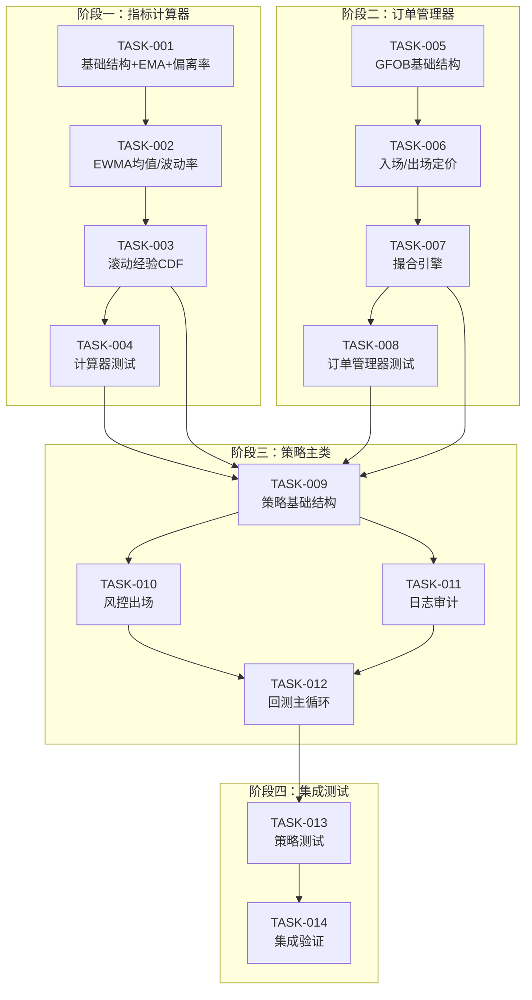

# 开发任务计划：滚动经验CDF信号策略

**迭代编号**: 034
**创建日期**: 2025-01-12
**状态**: Active

---

## 任务总览

| 阶段 | 任务数 | 功能点覆盖 | 预估复杂度 |
|------|--------|-----------|-----------|
| 阶段一：指标计算器 | 4 | FP-001~005 | 中 |
| 阶段二：订单管理器 | 4 | FP-009~015 | 中高 |
| 阶段三：策略主类 | 4 | FP-006~008, 016~018 | 中 |
| 阶段四：集成测试 | 2 | 全部 | 低 |
| **总计** | **14** | **18** | - |

---

## 阶段一：指标计算器模块

### TASK-034-001: 创建 EmpiricalCDFCalculator 基础结构

**文件**: `strategy_adapter/calculators/empirical_cdf_calculator.py`

**描述**: 创建指标计算器基础结构，实现EMA25和偏离率D的计算

**功能点**: FP-034-001 (EMA计算器), FP-034-002 (偏离率)

**依赖**: 无

**验收标准**:
- [ ] 类结构完整，包含 `__init__`, `update`, `reset` 方法
- [ ] EMA25计算结果正确（与pandas.ewm一致）
- [ ] 偏离率D计算精度达到小数点后8位
- [ ] 支持增量更新（单根K线）

**实现要点**:
```python
class EmpiricalCDFCalculator:
    def __init__(self, ema_period=25, ewma_period=50, cdf_window=100, epsilon=1e-12):
        self._ema_period = ema_period
        self._ema_alpha = Decimal(2) / Decimal(ema_period + 1)
        self._ema = None  # 当前EMA值
        self._bar_count = 0
        # ...

    def _update_ema(self, close: Decimal) -> Decimal:
        """更新EMA25（因果计算）"""
        if self._ema is None:
            self._ema = close  # 第一根K线
        else:
            self._ema = self._ema_alpha * close + (1 - self._ema_alpha) * self._ema
        return self._ema

    def _calculate_deviation(self, close: Decimal, ema: Decimal) -> Decimal:
        """计算偏离率 D = (P - EMA) / EMA"""
        return (close - ema) / ema
```

**状态**: [ ] 未开始

---

### TASK-034-002: 实现 EWMA 均值和波动率计算

**文件**: `strategy_adapter/calculators/empirical_cdf_calculator.py`

**描述**: 在 EmpiricalCDFCalculator 中实现EWMA均值μ和波动率σ的计算

**功能点**: FP-034-003 (EWMA均值), FP-034-004 (EWMA波动率)

**依赖**: TASK-034-001

**验收标准**:
- [ ] EWMA递推计算正确
- [ ] 波动率始终为正数（数值稳定）
- [ ] 支持自定义N值
- [ ] 无除零错误

**实现要点**:
```python
def _update_ewma(self, d: Decimal) -> Tuple[Decimal, Decimal]:
    """
    更新EWMA均值μ和方差σ²

    公式:
    - μ_t = α·D_t + (1-α)·μ_{t-1}
    - σ²_t = α·(D_t - μ_t)² + (1-α)·σ²_{t-1}
    - σ_t = sqrt(max(σ²_t, ε))
    """
    alpha = self._ewma_alpha

    if self._mu is None:
        self._mu = d
        self._var = Decimal(0)
    else:
        self._mu = alpha * d + (1 - alpha) * self._mu
        diff_sq = (d - self._mu) ** 2
        self._var = alpha * diff_sq + (1 - alpha) * self._var

    # 数值稳定
    sigma = (max(self._var, self._epsilon)).sqrt()
    return self._mu, sigma
```

**状态**: [ ] 未开始

---

### TASK-034-003: 实现滚动经验CDF百分位计算

**文件**: `strategy_adapter/calculators/empirical_cdf_calculator.py`

**描述**: 实现标准化偏离X和滚动经验CDF百分位Prob的计算

**功能点**: FP-034-005 (滚动经验CDF)

**依赖**: TASK-034-002

**验收标准**:
- [ ] X_t = (D_t - μ_t) / σ_t 计算正确
- [ ] 百分位范围0-100
- [ ] 窗口正确排除当前样本（因果性）
- [ ] 冷启动期（历史不足M）正确返回None

**实现要点**:
```python
def _calculate_prob(self, x: Decimal) -> Optional[float]:
    """
    计算经验CDF百分位

    Prob_t = 100 × (1/M) × Σ𝟙(X_{t-i} ≤ X_t)

    窗口: W_t = {X_{t-1}, X_{t-2}, ..., X_{t-M}}  # 不含当前
    """
    # 冷启动检查
    if len(self._x_history) < self._cdf_window:
        return None

    # 使用最近M个历史值（不含当前）
    window = list(self._x_history)[-self._cdf_window:]

    # 计算百分位
    count_le = sum(1 for x_i in window if x_i <= x)
    prob = 100.0 * count_le / self._cdf_window

    return prob
```

**状态**: [ ] 未开始

---

### TASK-034-004: 创建计算器单元测试

**文件**: `strategy_adapter/tests/test_empirical_cdf_calculator.py`

**描述**: 编写 EmpiricalCDFCalculator 的完整单元测试

**功能点**: FP-034-001~005 测试覆盖

**依赖**: TASK-034-001, TASK-034-002, TASK-034-003

**验收标准**:
- [ ] EMA计算测试（边界、正常、精度）
- [ ] 偏离率计算测试
- [ ] EWMA均值/波动率测试
- [ ] 经验CDF测试（冷启动、窗口边界、百分位正确性）
- [ ] reset方法测试
- [ ] 测试覆盖率 > 90%

**测试用例**:
```python
class TestEmpiricalCDFCalculator:
    def test_ema_first_bar(self):
        """第一根K线EMA等于close"""

    def test_ema_incremental(self):
        """EMA增量更新"""

    def test_deviation_calculation(self):
        """偏离率计算精度"""

    def test_ewma_stability(self):
        """EWMA数值稳定性"""

    def test_prob_cold_start(self):
        """冷启动期返回None"""

    def test_prob_window_exclusion(self):
        """窗口排除当前样本"""

    def test_prob_percentile_range(self):
        """百分位范围0-100"""
```

**状态**: [ ] 未开始

---

## 阶段二：订单管理器模块

### TASK-034-005: 创建 GFOBOrderManager 基础结构

**文件**: `strategy_adapter/core/gfob_order_manager.py`

**描述**: 创建GFOB订单管理器基础结构，采用组合模式持有LimitOrderManager

**功能点**: FP-034-009 (GFOB订单创建), FP-034-012 (生命周期管理)

**依赖**: 无（复用 LimitOrderManager）

**验收标准**:
- [ ] 组合模式实现正确
- [ ] 订单有效期设置为下一根K线
- [ ] 订单过期自动处理
- [ ] 资金管理委托正确

**实现要点**:
```python
class GFOBOrderManager:
    def __init__(self, position_size=Decimal("100"), delta_in=0.001,
                 delta_out=0.0, delta_out_fast=0.001):
        # 组合模式：内部持有LimitOrderManager
        self._capital_manager = LimitOrderManager(position_size)
        self._delta_in = delta_in
        self._delta_out = delta_out
        self._delta_out_fast = delta_out_fast

        # GFOB订单存储
        self._pending_buy: Optional[Dict] = None  # 最多一个待撮合买单
        self._pending_sell: Optional[Dict] = None  # 最多一个待撮合卖单

    def expire_stale_orders(self, current_kline_index: int) -> List[str]:
        """过期非当前K线的订单（GFOB语义）"""
        expired = []
        if self._pending_buy and self._pending_buy['valid_bar'] != current_kline_index:
            # 解冻资金
            self._capital_manager.cancel_all_buy_orders()
            expired.append(self._pending_buy['order_id'])
            self._pending_buy = None
        # 卖单类似处理
        return expired
```

**状态**: [ ] 未开始

---

### TASK-034-006: 实现入场/出场定价逻辑

**文件**: `strategy_adapter/core/gfob_order_manager.py`

**描述**: 实现入场和出场订单的定价逻辑

**功能点**: FP-034-010 (入场定价), FP-034-011 (出场定价)

**依赖**: TASK-034-005

**验收标准**:
- [ ] 入场价格: L = close × (1 - δ_in)
- [ ] 正常出场价格: U = close × (1 - δ_out)
- [ ] 快速出场价格: U = close × (1 - δ_out_fast)
- [ ] 价格精度正确
- [ ] 支持自定义折扣参数

**实现要点**:
```python
def create_buy_order(self, close_price: Decimal, kline_index: int,
                     timestamp: int) -> Optional[PendingOrder]:
    """创建入场限价买单"""
    # 计算限价: L = P × (1 - δ_in)
    limit_price = close_price * (1 - Decimal(str(self._delta_in)))

    # 委托LimitOrderManager创建订单（冻结资金）
    order = self._capital_manager.create_buy_order(
        price=limit_price,
        kline_index=kline_index,
        timestamp=timestamp
    )

    if order:
        # 存储GFOB订单信息
        self._pending_buy = {
            'order_id': order.order_id,
            'price': limit_price,
            'valid_bar': kline_index + 1,  # 下一根K线有效
            'placed_bar': kline_index,
            'reason': 'ENTRY_TAIL'
        }

    return order

def create_sell_order(self, close_price: Decimal, parent_order_id: str,
                      quantity: Decimal, reason: str, kline_index: int,
                      timestamp: int) -> PendingOrder:
    """创建出场限价卖单"""
    # 根据原因选择定价模式
    if reason == 'FAST_EXIT':
        delta = self._delta_out_fast
    else:  # PROB_REVERSION
        delta = self._delta_out

    sell_price = close_price * (1 - Decimal(str(delta)))
    # ...
```

**状态**: [ ] 未开始

---

### TASK-034-007: 实现撮合引擎逻辑

**文件**: `strategy_adapter/core/gfob_order_manager.py`

**描述**: 实现买单/卖单撮合逻辑，包含先卖后买的顺序控制

**功能点**: FP-034-013 (买单撮合), FP-034-014 (卖单撮合), FP-034-015 (顺序控制)

**依赖**: TASK-034-006

**验收标准**:
- [ ] 买单撮合: low ≤ L 即成交，成交价=L
- [ ] 卖单撮合: high ≥ U 即成交，成交价=U
- [ ] 撮合顺序固定: 先卖后买
- [ ] 同bar不会出现买卖双成交

**实现要点**:
```python
def match_orders(self, kline_index: int, low: Decimal, high: Decimal,
                 timestamp: int) -> Dict:
    """
    撮合订单（先卖后买）

    关键差异（与LimitOrderManager）：
    - 买单: low ≤ L 即成交（不是 low ≤ L ≤ high）
    - 卖单: high ≥ U 即成交（不是 low ≤ U ≤ high）
    """
    result = {
        'sell_fills': [],
        'buy_fills': [],
        'expired_orders': []
    }

    # Step 1: 先过期非当前K线的订单
    result['expired_orders'] = self.expire_stale_orders(kline_index)

    # Step 2: 先撮合卖单（若有）
    if self._pending_sell and self._pending_sell['valid_bar'] == kline_index:
        sell_price = self._pending_sell['price']
        if high >= sell_price:  # 成交条件
            fill = self._fill_sell_order(timestamp)
            result['sell_fills'].append(fill)

    # Step 3: 再撮合买单（若有）
    if self._pending_buy and self._pending_buy['valid_bar'] == kline_index:
        buy_price = self._pending_buy['price']
        if low <= buy_price:  # 成交条件
            fill = self._fill_buy_order(timestamp)
            result['buy_fills'].append(fill)

    return result
```

**状态**: [ ] 未开始

---

### TASK-034-008: 创建订单管理器单元测试

**文件**: `strategy_adapter/tests/test_gfob_order_manager.py`

**描述**: 编写 GFOBOrderManager 的完整单元测试

**功能点**: FP-034-009~015 测试覆盖

**依赖**: TASK-034-005, TASK-034-006, TASK-034-007

**验收标准**:
- [ ] 订单创建测试（买单、卖单）
- [ ] 定价测试（入场折扣、出场折扣）
- [ ] 撮合规则测试（边界条件）
- [ ] 撮合顺序测试（先卖后买）
- [ ] 订单过期测试（GFOB语义）
- [ ] 资金管理测试
- [ ] 测试覆盖率 > 90%

**测试用例**:
```python
class TestGFOBOrderManager:
    def test_buy_order_pricing(self):
        """入场定价: close × (1 - δ_in)"""

    def test_sell_order_pricing_normal(self):
        """正常出场定价"""

    def test_sell_order_pricing_fast(self):
        """快速出场定价"""

    def test_buy_match_low_touch(self):
        """买单撮合: low ≤ L 成交"""

    def test_buy_match_low_not_touch(self):
        """买单撮合: low > L 不成交"""

    def test_sell_match_high_touch(self):
        """卖单撮合: high ≥ U 成交"""

    def test_match_order_sell_first(self):
        """撮合顺序: 先卖后买"""

    def test_order_expiry_gfob(self):
        """订单过期: 仅下一根有效"""
```

**状态**: [ ] 未开始

---

## 阶段三：策略主类模块

### TASK-034-009: 创建 EmpiricalCDFStrategy 基础结构

**文件**: `strategy_adapter/strategies/empirical_cdf_strategy.py`

**描述**: 创建策略主类基础结构，实现IStrategy接口和process_kline核心方法

**功能点**: FP-034-006~008 (信号生成)

**依赖**: TASK-034-003, TASK-034-007

**验收标准**:
- [ ] 实现IStrategy接口
- [ ] process_kline执行顺序正确（撮合→计算→信号→挂单→日志）
- [ ] 入场信号逻辑正确（FLAT && Prob≤q_in）
- [ ] 出场信号逻辑正确（概率回归 + 风控）
- [ ] 持仓管理正确

**实现要点**:
```python
class EmpiricalCDFStrategy(IStrategy):
    STRATEGY_ID = 'empirical_cdf'
    STRATEGY_NAME = '滚动经验CDF策略'
    STRATEGY_VERSION = '1.0'

    def __init__(self, q_in=5, q_out=50, max_holding_bars=48,
                 stop_loss_threshold=0.05, position_size=Decimal("100"), ...):
        self._calculator = EmpiricalCDFCalculator()
        self._order_manager = GFOBOrderManager(position_size)

        # 策略参数
        self._q_in = q_in
        self._q_out = q_out
        self._max_holding_bars = max_holding_bars
        self._stop_loss_threshold = stop_loss_threshold

        # 持仓管理
        self._position = 'FLAT'  # FLAT or LONG
        self._holding: Optional[Dict] = None

    def process_kline(self, kline_index: int, kline: Dict, timestamp: int) -> Dict:
        """处理单根K线（核心方法）"""
        result = {...}

        # 1. 撮合阶段
        match_result = self._order_manager.match_orders(
            kline_index, kline['low'], kline['high'], timestamp
        )
        # 更新持仓状态

        # 2. 计算阶段
        indicators = self._calculator.update(kline['close'])
        prob = indicators['prob']

        # 3. 信号判断 + 挂单
        if self._position == 'FLAT' and prob is not None and prob <= self._q_in:
            self._order_manager.create_buy_order(...)
        elif self._position == 'LONG':
            exit_reason = self._check_exit_conditions(prob, kline, kline_index)
            if exit_reason:
                self._order_manager.create_sell_order(..., reason=exit_reason)

        return result
```

**状态**: [ ] 未开始

---

### TASK-034-010: 实现风控出场逻辑

**文件**: `strategy_adapter/strategies/empirical_cdf_strategy.py`

**描述**: 实现时间止损和灾难止损的风控出场逻辑

**功能点**: FP-034-008 (风控出场)

**依赖**: TASK-034-009

**验收标准**:
- [ ] 时间止损: 持仓bar数 ≥ H 触发
- [ ] 灾难止损: 浮动收益率 ≤ -s 触发
- [ ] 风控触发使用FAST_EXIT定价
- [ ] 持仓时间计算正确

**实现要点**:
```python
def _check_exit_conditions(self, prob: Optional[float], kline: Dict,
                           kline_index: int) -> Optional[str]:
    """
    检查出场条件

    返回:
    - 'PROB_REVERSION': 概率回归出场
    - 'FAST_EXIT': 风控触发出场
    - None: 不出场
    """
    if self._holding is None:
        return None

    # 检查时间止损
    holding_bars = kline_index - self._holding['entry_bar']
    if holding_bars >= self._max_holding_bars:
        return 'FAST_EXIT'

    # 检查灾难止损
    entry_price = self._holding['entry_price']
    current_price = Decimal(str(kline['close']))
    pnl_rate = (current_price - entry_price) / entry_price
    if pnl_rate <= -Decimal(str(self._stop_loss_threshold)):
        return 'FAST_EXIT'

    # 检查概率回归
    if prob is not None and prob >= self._q_out:
        return 'PROB_REVERSION'

    return None
```

**状态**: [ ] 未开始

---

### TASK-034-011: 实现日志审计模块

**文件**: `strategy_adapter/strategies/empirical_cdf_strategy.py`

**描述**: 实现Bar日志、订单日志、交易日志的记录功能

**功能点**: FP-034-016 (Bar日志), FP-034-017 (订单日志), FP-034-018 (交易日志)

**依赖**: TASK-034-009

**验收标准**:
- [ ] Bar日志字段完整（t, OHLC, EMA, D, μ, σ, X, Prob, position, pending）
- [ ] 订单日志字段完整（order_id, type, placed_time, valid_bar, limit_price, reason, status）
- [ ] 交易日志字段完整（entry/exit时间、价格、reason、return）
- [ ] 支持CSV/JSON输出

**实现要点**:
```python
def _record_bar_log(self, kline_index: int, kline: Dict,
                    indicators: Dict) -> Dict:
    """记录Bar日志"""
    return {
        't': kline_index,
        'open': kline['open'],
        'high': kline['high'],
        'low': kline['low'],
        'close': kline['close'],
        'ema25': indicators['ema'],
        'd': indicators['d'],
        'mu': indicators['mu'],
        'sigma': indicators['sigma'],
        'x': indicators['x'],
        'prob': indicators['prob'],
        'position': self._position,
        'pending_buy': self._order_manager.get_pending_buy_price(),
        'pending_sell': self._order_manager.get_pending_sell_price(),
    }

def _record_trade_log(self, entry_info: Dict, exit_info: Dict,
                      exit_reason: str) -> Dict:
    """记录交易日志"""
    gross_return = (exit_info['price'] - entry_info['price']) / entry_info['price']
    return {
        'entry_time': entry_info['timestamp'],
        'entry_price': entry_info['price'],
        'exit_time': exit_info['timestamp'],
        'exit_price': exit_info['price'],
        'entry_signal_time': entry_info['signal_bar'],
        'entry_prob': entry_info['prob'],
        'exit_reason': exit_reason,
        'gross_return': gross_return,
    }
```

**状态**: [ ] 未开始

---

### TASK-034-012: 实现回测主循环

**文件**: `strategy_adapter/strategies/empirical_cdf_strategy.py`

**描述**: 实现 run_backtest 方法，提供完整的回测循环

**功能点**: 全部（集成验证）

**依赖**: TASK-034-009, TASK-034-010, TASK-034-011

**验收标准**:
- [ ] 回测循环正确执行
- [ ] 统计信息完整
- [ ] 支持初始资金配置
- [ ] 返回结果格式与LimitOrderStrategy一致

**实现要点**:
```python
def run_backtest(self, klines_df: pd.DataFrame,
                 initial_capital: Decimal = Decimal("10000")) -> Dict:
    """执行完整回测"""
    # 初始化
    self.initialize(initial_capital)
    self._calculator.reset()

    all_bar_logs = []
    all_order_logs = []
    all_trade_logs = []

    # 逐K线处理
    for i, (idx, row) in enumerate(klines_df.iterrows()):
        kline = {
            'open': Decimal(str(row['open'])),
            'high': Decimal(str(row['high'])),
            'low': Decimal(str(row['low'])),
            'close': Decimal(str(row['close'])),
        }
        timestamp = int(idx.timestamp() * 1000) if hasattr(idx, 'timestamp') else int(idx)

        result = self.process_kline(i, kline, timestamp)

        # 收集日志
        all_bar_logs.append(result['bar_log'])
        all_order_logs.extend(result.get('order_logs', []))
        all_trade_logs.extend(result.get('trade_logs', []))

    # 生成统计
    return self._generate_statistics(all_bar_logs, all_order_logs, all_trade_logs)
```

**状态**: [ ] 未开始

---

## 阶段四：集成测试

### TASK-034-013: 创建策略单元测试

**文件**: `strategy_adapter/tests/test_empirical_cdf_strategy.py`

**描述**: 编写 EmpiricalCDFStrategy 的单元测试

**功能点**: FP-034-006~008, 016~018 测试覆盖

**依赖**: TASK-034-012

**验收标准**:
- [ ] 入场信号测试（Prob≤5触发）
- [ ] 出场信号测试（概率回归、时间止损、灾难止损）
- [ ] 日志记录测试
- [ ] 回测循环测试
- [ ] 边界条件测试（冷启动期无入场）

**测试用例**:
```python
class TestEmpiricalCDFStrategy:
    def test_entry_signal_prob_threshold(self):
        """入场信号: Prob≤5时触发"""

    def test_no_entry_during_cold_start(self):
        """冷启动期: Prob=None时不入场"""

    def test_exit_prob_reversion(self):
        """出场: 概率回归Prob≥50"""

    def test_exit_time_stop(self):
        """出场: 时间止损"""

    def test_exit_disaster_stop(self):
        """出场: 灾难止损"""

    def test_match_order_sell_first_buy_second(self):
        """撮合顺序: 先卖后买"""

    def test_bar_log_complete(self):
        """Bar日志字段完整"""
```

**状态**: [ ] 未开始

---

### TASK-034-014: 集成验证与回测命令扩展

**文件**: 多文件

**描述**: 扩展回测命令支持新策略，执行集成验证

**功能点**: 全部（端到端验证）

**依赖**: TASK-034-013

**验收标准**:
- [ ] run_strategy_backtest.py 支持 `--strategy empirical_cdf`
- [ ] batch_backtest.py 支持新策略
- [ ] 使用真实数据进行端到端验证
- [ ] 验证因果一致性（信号t，成交t+1）
- [ ] 验证撮合规则正确性

**修改文件**:
- `strategy_adapter/management/commands/run_strategy_backtest.py`: 添加策略支持
- `strategy_adapter/core/strategy_factory.py`: 注册新策略

**实现要点**:
```python
# strategy_factory.py
from strategy_adapter.strategies.empirical_cdf_strategy import EmpiricalCDFStrategy

STRATEGY_REGISTRY = {
    # ... existing
    'empirical_cdf': EmpiricalCDFStrategy,
}

# run_strategy_backtest.py
parser.add_argument(
    '--strategy',
    choices=['strategy_1', ..., 'empirical_cdf'],
    default='strategy_1'
)
```

**状态**: [ ] 未开始

---

## 任务依赖关系



---

## 进度跟踪

| 任务ID | 描述 | 状态 | 开始时间 | 完成时间 |
|--------|------|------|----------|----------|
| TASK-034-001 | 计算器基础结构 | [ ] 未开始 | - | - |
| TASK-034-002 | EWMA实现 | [ ] 未开始 | - | - |
| TASK-034-003 | 经验CDF实现 | [ ] 未开始 | - | - |
| TASK-034-004 | 计算器测试 | [ ] 未开始 | - | - |
| TASK-034-005 | GFOB基础结构 | [ ] 未开始 | - | - |
| TASK-034-006 | 定价逻辑 | [ ] 未开始 | - | - |
| TASK-034-007 | 撮合引擎 | [ ] 未开始 | - | - |
| TASK-034-008 | 订单管理器测试 | [ ] 未开始 | - | - |
| TASK-034-009 | 策略基础结构 | [ ] 未开始 | - | - |
| TASK-034-010 | 风控出场 | [ ] 未开始 | - | - |
| TASK-034-011 | 日志审计 | [ ] 未开始 | - | - |
| TASK-034-012 | 回测主循环 | [ ] 未开始 | - | - |
| TASK-034-013 | 策略测试 | [ ] 未开始 | - | - |
| TASK-034-014 | 集成验证 | [ ] 未开始 | - | - |

---

**文档状态**: ✅ 任务规划完成
**下一步**: 使用 `/powerby-implement` 开始开发实现
