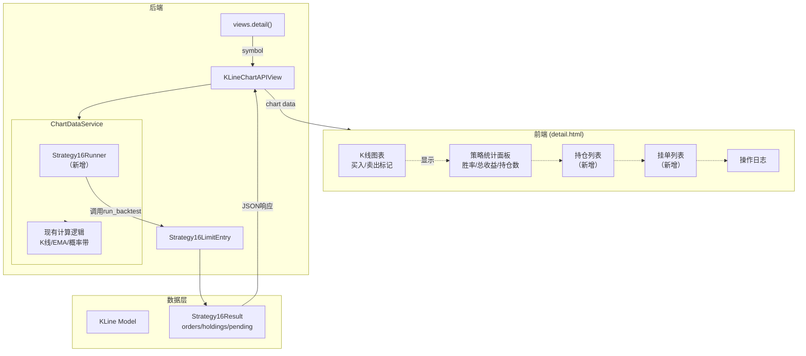
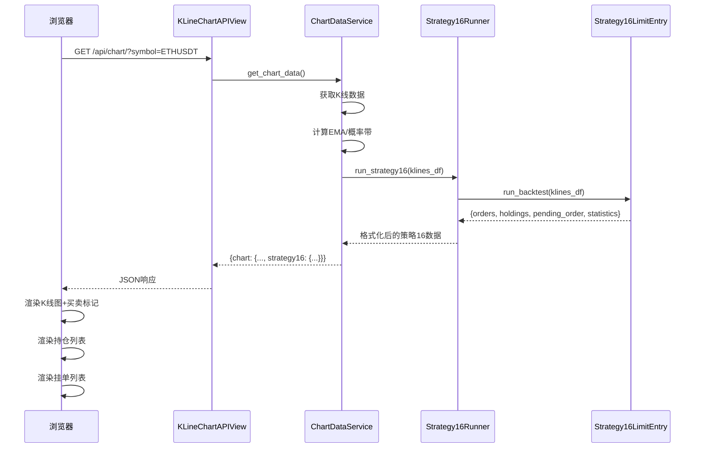

# 迭代037：策略16详情页架构设计

## 1. 概述

### 1.1 需求背景

将 `/ddps-z/detail/<symbol>/` 页面改造为**策略16专属展示页面**，展示策略16（P5限价挂单入场 + EMA状态止盈）的回测结果、持仓列表和挂单列表。

### 1.2 核心目标

1. **默认支持策略16**：页面加载时自动运行策略16回测
2. **持仓列表展示**：显示当前持仓，按时间倒序排列（最新在前）
3. **挂单列表展示**：显示当前待成交的限价挂单

### 1.3 策略16核心特征

- **限价挂单入场**：`base_price = min(p5, close, (p5+mid)/2)`，挂单价格 = base_price × 0.999
- **EMA状态止盈**：根据周期状态（强势上涨/下跌/震荡）使用不同止盈条件
- **止损**：默认5%止损

---

## 2. 系统架构

### 2.1 核心架构图



### 2.2 概念解读

本架构将策略16的回测引擎集成到现有的DDPS详情页面，通过新增 `Strategy16Runner` 服务层组件调用策略16的回测逻辑，并将结果（持仓、挂单、已完成订单）格式化后返回给前端展示。

### 2.3 交互时序图



---

## 3. 组件设计

### 3.1 组件职责

| 组件 | 类型 | 职责 |
|------|------|------|
| **Strategy16Runner** | 新增 | 封装Strategy16LimitEntry的调用，转换K线数据格式，运行回测并格式化结果 |
| **ChartDataService** | 修改 | 新增调用Strategy16Runner获取策略16数据，通过参数控制策略模式 |
| **KLineChartAPIView** | 修改 | 响应中新增 `strategy16` 字段 |
| **持仓列表组件** | 新增 | 前端组件，展示当前持仓，支持按时间倒序排列 |
| **挂单列表组件** | 新增 | 前端组件，展示当前待成交挂单 |

### 3.2 组件与需求映射

| 组件 | 负责实现的需求 |
|------|---------------|
| Strategy16Runner + ChartDataService | 默认支持策略16、生成回测数据 |
| 持仓列表组件 (UI_Holdings) | 列出当前持仓和价格，最新持仓放在前面 |
| 挂单列表组件 (UI_PendingOrders) | 列出目前挂单列表 |

---

## 4. 数据结构设计

### 4.1 API响应结构

API响应新增 `strategy16` 字段：

```json
{
  "success": true,
  "chart": {
    "candles": [...],
    "ema": [...],
    "bands": {...},
    "fan": {...},
    "strategy16": {
      "orders": [...],
      "holdings": [...],
      "pending_order": {...},
      "statistics": {...}
    }
  }
}
```

### 4.2 已完成订单 (orders)

```json
{
  "id": "pending_1736500800000_100",
  "buy_price": 3200.50,
  "sell_price": 3360.00,
  "quantity": 0.3125,
  "amount": 1000.00,
  "profit_loss": 49.84,
  "profit_rate": 4.98,
  "buy_timestamp": 1736500800000,
  "sell_timestamp": 1736590000000,
  "exit_reason": "ema_state_take_profit"
}
```

### 4.3 当前持仓 (holdings)

```json
{
  "id": "pending_1736600000000_150",
  "buy_price": 3180.00,
  "quantity": 0.3145,
  "amount": 1000.00,
  "buy_timestamp": 1736600000000,
  "current_price": 3250.00,
  "floating_pnl": 22.01,
  "floating_pnl_rate": 2.20,
  "holding_bars": 5
}
```

### 4.4 当前挂单 (pending_order)

```json
{
  "order_id": "pending_1736700000000_200",
  "price": 3150.50,
  "amount": 1000.00,
  "quantity": 0.3174,
  "status": "pending",
  "created_at": 1736700000000,
  "base_price": 3153.65,
  "metadata": {
    "p5": 3160.00,
    "close": 3200.00,
    "mid_p5": 3155.00
  }
}
```

### 4.5 统计数据 (statistics)

```json
{
  "total_orders": 15,
  "winning_orders": 10,
  "losing_orders": 5,
  "win_rate": 66.67,
  "total_profit": 520.50,
  "return_rate": 5.21,
  "open_positions": 2,
  "initial_capital": 10000.00,
  "final_capital": 10520.50
}
```

---

## 5. 关键决策

### 5.1 决策一：数据获取时机

**选定方案：实时回测（方案A）**

- 每次访问页面时调用 `Strategy16LimitEntry.run_backtest()` 实时计算
- 理由：
  1. MVP阶段优先简单可用
  2. 策略16回测性能可接受（实测约1秒内）
  3. 避免引入缓存一致性问题

### 5.2 决策二：前端展示位置

**选定方案：独立卡片区域（方案A）**

- 在现有操作日志下方新增两个独立卡片：持仓列表、挂单列表
- 理由：
  1. 持仓和挂单是关键业务数据，值得独立展示
  2. 用户更容易快速定位所需信息
  3. 扩展性好，后续可增加更多功能

### 5.3 决策三：策略模式切换

**选定方案：参数控制（方案B）**

- 新增 `strategy_mode` 参数，值为 `legacy`（策略1/2）或 `strategy16`，默认 `strategy16`
- 理由：
  1. 低风险，保留回退能力
  2. 便于后续扩展支持更多策略
  3. 实现成本增加不多（只需一个条件分支）

---

## 6. 文件变更清单

### 6.1 后端文件

| 文件路径 | 变更类型 | 说明 |
|---------|---------|------|
| `ddps_z/services/strategy16_runner.py` | 新增 | 策略16运行器，封装回测调用和结果格式化 |
| `ddps_z/services/chart_data_service.py` | 修改 | 新增 `_generate_strategy16_data()` 方法 |
| `ddps_z/api_views.py` | 修改 | 支持 `strategy_mode` 参数 |

### 6.2 前端文件

| 文件路径 | 变更类型 | 说明 |
|---------|---------|------|
| `ddps_z/templates/ddps_z/detail.html` | 修改 | 移除策略1/2筛选，新增持仓列表和挂单列表组件 |

---

## 7. 前端UI设计

### 7.1 页面布局

```
┌─────────────────────────────────────────────────┐
│  面包屑导航 + 标题                               │
├─────────────────────────────────────────────────┤
│  周期选择器 | 时间范围选择器                      │
├─────────────────────────────────────────────────┤
│  指标卡片区 (当前价格/EMA/偏离率/Z-Score等)       │
├─────────────────────────────────────────────────┤
│  策略16统计面板 (修改)                           │
│  总订单 | 胜率 | 总收益 | 持仓数 | 挂单数         │
├─────────────────────────────────────────────────┤
│  K线图 + 买卖标记                                │
├─────────────────────────────────────────────────┤
│  Z-Score图                                      │
├─────────────────────────────────────────────────┤
│  持仓列表 (新增)                                 │
│  ┌───────┬────────┬────────┬─────────┬───────┐  │
│  │订单ID │买入价格 │当前价格 │浮动盈亏  │持仓时长│  │
│  ├───────┼────────┼────────┼─────────┼───────┤  │
│  │...    │...     │...     │...      │...    │  │
│  └───────┴────────┴────────┴─────────┴───────┘  │
├─────────────────────────────────────────────────┤
│  挂单列表 (新增)                                 │
│  ┌───────┬────────┬────────┬─────────┬───────┐  │
│  │挂单ID │挂单价格 │挂单金额 │状态     │创建时间│  │
│  ├───────┼────────┼────────┼─────────┼───────┤  │
│  │...    │...     │...     │...      │...    │  │
│  └───────┴────────┴────────┴─────────┴───────┘  │
├─────────────────────────────────────────────────┤
│  操作日志                                        │
└─────────────────────────────────────────────────┘
```

### 7.2 移除的UI元素

- 买入点策略筛选按钮组（策略1/策略2/全部）

### 7.3 新增的UI元素

- 持仓列表卡片
- 挂单列表卡片
- 统计面板新增"挂单数"指标

---

## 8. 质量门禁

- [x] 系统架构明确 (Mermaid图表)
- [x] 模块职责清晰
- [x] 组件与需求映射完整
- [x] 关键决策点分析完成
- [x] 方案评估结构化
- [x] 数据结构设计完整
- [x] 文件变更清单明确

---

## 9. 下一步

进入 `/powerby-plan` 阶段，将架构设计分解为具体的开发任务。
