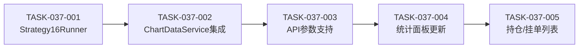

# 迭代037：策略16详情页 - 任务计划

## 概述

- **迭代编号**: 037
- **迭代名称**: 策略16详情页
- **预计任务数**: 5个
- **关联架构**: [architecture.md](./architecture.md)

---

## 任务列表

### TASK-037-001: 创建Strategy16Runner服务

**类型**: 后端 - 新增
**优先级**: P0 (阻塞其他任务)
**预计复杂度**: 中等

**描述**:
创建 `Strategy16Runner` 服务类，封装 `Strategy16LimitEntry` 的调用，负责数据格式转换和结果格式化。

**文件变更**:
- 新增: `ddps_z/services/strategy16_runner.py`

**实现要点**:
1. 从K线QuerySet转换为DataFrame格式
2. 调用 `Strategy16LimitEntry.run_backtest()`
3. 格式化返回结果，包含:
   - `orders`: 已完成订单列表
   - `holdings`: 当前持仓列表（添加浮动盈亏计算）
   - `pending_order`: 当前挂单
   - `statistics`: 统计数据
4. 持仓列表按 `buy_timestamp` 倒序排列

**输入输出**:
```python
def run(self, symbol: str, interval: str, market_type: str,
        current_price: Decimal) -> Dict[str, Any]:
    """
    Returns:
        {
            'orders': [...],
            'holdings': [...],
            'pending_order': {...} or None,
            'statistics': {...}
        }
    """
```

**验收标准**:
- [ ] 能正确调用Strategy16LimitEntry运行回测
- [ ] 持仓列表包含浮动盈亏字段
- [ ] 持仓按时间倒序排列
- [ ] 异常情况返回空数据而非抛出异常

**依赖**: 无

---

### TASK-037-002: 集成Strategy16到ChartDataService

**类型**: 后端 - 修改
**优先级**: P0
**预计复杂度**: 中等

**描述**:
修改 `ChartDataService`，新增 `strategy_mode` 参数支持，当模式为 `strategy16` 时调用 `Strategy16Runner`。

**文件变更**:
- 修改: `ddps_z/services/chart_data_service.py`

**实现要点**:
1. 在 `__init__` 中初始化 `Strategy16Runner`
2. 在 `get_chart_data()` 方法中新增 `strategy_mode` 参数，默认值 `'strategy16'`
3. 新增 `_generate_strategy16_data()` 私有方法
4. 根据 `strategy_mode` 决定调用旧逻辑还是新逻辑
5. 返回结果中新增 `strategy16` 字段

**代码结构**:
```python
def get_chart_data(
    self,
    symbol: str,
    interval: Optional[str] = None,
    market_type: str = 'futures',
    limit: int = 500,
    # ... 其他参数
    strategy_mode: str = 'strategy16'  # 新增参数
) -> Dict[str, Any]:
    # ...
    if strategy_mode == 'strategy16':
        strategy16_data = self._generate_strategy16_data(...)
    else:
        # 保留旧逻辑
        buy_signals_data = self._generate_buy_signals_data(...)
        order_data = self._generate_order_data(...)
```

**验收标准**:
- [ ] `strategy_mode='strategy16'` 时返回策略16数据
- [ ] `strategy_mode='legacy'` 时返回旧的策略1/2数据
- [ ] 默认使用策略16模式
- [ ] 不破坏现有API兼容性

**依赖**: TASK-037-001

---

### TASK-037-003: 更新API支持strategy_mode参数

**类型**: 后端 - 修改
**优先级**: P1
**预计复杂度**: 简单

**描述**:
修改 `KLineChartAPIView`，支持 `strategy_mode` 查询参数。

**文件变更**:
- 修改: `ddps_z/api_views.py`

**实现要点**:
1. 解析 `strategy_mode` 查询参数
2. 传递给 `ChartDataService.get_chart_data()`
3. 默认值为 `'strategy16'`

**代码变更**:
```python
def get(self, request):
    # ...
    strategy_mode = request.query_params.get('strategy_mode', 'strategy16')

    result = self.chart_service.get_chart_data(
        # ...
        strategy_mode=strategy_mode
    )
```

**验收标准**:
- [ ] API支持 `?strategy_mode=strategy16` 参数
- [ ] API支持 `?strategy_mode=legacy` 参数
- [ ] 不传参数时默认使用strategy16

**依赖**: TASK-037-002

---

### TASK-037-004: 前端-更新统计面板和移除筛选按钮

**类型**: 前端 - 修改
**优先级**: P1
**预计复杂度**: 简单

**描述**:
更新详情页模板，移除策略1/2筛选按钮，修改统计面板使用策略16数据。

**文件变更**:
- 修改: `ddps_z/templates/ddps_z/detail.html`

**实现要点**:
1. 删除买入点策略筛选按钮组（策略1/策略2/全部）
2. 修改统计面板数据绑定，使用 `chart.strategy16.statistics`
3. 修改订单列表数据源，使用 `chart.strategy16.orders`
4. 修改买卖标记数据源
5. 统计面板新增"持仓数"指标

**移除的HTML元素**:
```html
<!-- 删除以下筛选按钮组 -->
<div class="btn-group" role="group">
    <button type="button" class="btn btn-outline-primary filter-btn active" data-filter="all">全部</button>
    <button type="button" class="btn btn-outline-primary filter-btn" data-filter="strategy_1">策略1</button>
    <button type="button" class="btn btn-outline-primary filter-btn" data-filter="strategy_2">策略2</button>
</div>
```

**验收标准**:
- [ ] 策略筛选按钮已移除
- [ ] 统计面板显示策略16数据
- [ ] 统计面板包含"持仓数"指标
- [ ] K线图买卖标记正确显示

**依赖**: TASK-037-003

---

### TASK-037-005: 前端-新增持仓列表和挂单列表组件

**类型**: 前端 - 新增
**优先级**: P1
**预计复杂度**: 中等

**描述**:
在详情页新增持仓列表卡片和挂单列表卡片。

**文件变更**:
- 修改: `ddps_z/templates/ddps_z/detail.html`

**实现要点**:

1. **持仓列表卡片**:
   - 位置: 操作日志上方
   - 字段: 订单ID、买入价格、当前价格、浮动盈亏、浮动盈亏率、持仓时长
   - 样式: 盈利绿色、亏损红色
   - 排序: 按买入时间倒序（最新在前）
   - 空状态: "暂无持仓"

2. **挂单列表卡片**:
   - 位置: 持仓列表下方
   - 字段: 挂单ID、挂单价格、挂单金额、数量、状态、创建时间
   - 空状态: "暂无挂单"

**HTML结构**:
```html
<!-- 持仓列表 -->
<div class="card mb-4" id="holdings-card">
    <div class="card-header">
        <h5 class="mb-0">当前持仓 <span class="badge bg-primary" id="holdings-count">0</span></h5>
    </div>
    <div class="card-body">
        <div class="table-responsive">
            <table class="table table-sm" id="holdings-table">
                <thead>
                    <tr>
                        <th>订单ID</th>
                        <th>买入价格</th>
                        <th>当前价格</th>
                        <th>浮动盈亏</th>
                        <th>盈亏率</th>
                        <th>持仓时长</th>
                    </tr>
                </thead>
                <tbody></tbody>
            </table>
        </div>
        <div class="text-muted text-center py-3" id="holdings-empty">暂无持仓</div>
    </div>
</div>

<!-- 挂单列表 -->
<div class="card mb-4" id="pending-orders-card">
    <div class="card-header">
        <h5 class="mb-0">当前挂单 <span class="badge bg-warning" id="pending-count">0</span></h5>
    </div>
    <div class="card-body">
        <div class="table-responsive">
            <table class="table table-sm" id="pending-table">
                <thead>
                    <tr>
                        <th>挂单ID</th>
                        <th>挂单价格</th>
                        <th>挂单金额</th>
                        <th>数量</th>
                        <th>状态</th>
                        <th>创建时间</th>
                    </tr>
                </thead>
                <tbody></tbody>
            </table>
        </div>
        <div class="text-muted text-center py-3" id="pending-empty">暂无挂单</div>
    </div>
</div>
```

**JavaScript逻辑**:
```javascript
function renderHoldings(holdings) {
    // 渲染持仓列表
    // 按buy_timestamp倒序
    // 盈亏颜色区分
}

function renderPendingOrder(pendingOrder) {
    // 渲染挂单（最多1条）
}
```

**验收标准**:
- [ ] 持仓列表正确显示，按时间倒序
- [ ] 持仓浮动盈亏颜色正确（绿/红）
- [ ] 挂单列表正确显示
- [ ] 空状态提示正确
- [ ] 数据刷新时列表同步更新

**依赖**: TASK-037-004

---

## 任务依赖图



---

## 执行顺序

| 顺序 | 任务ID | 任务名称 | 阻塞关系 |
|------|--------|---------|---------|
| 1 | TASK-037-001 | 创建Strategy16Runner服务 | 无 |
| 2 | TASK-037-002 | 集成Strategy16到ChartDataService | 依赖001 |
| 3 | TASK-037-003 | 更新API支持strategy_mode参数 | 依赖002 |
| 4 | TASK-037-004 | 前端-更新统计面板和移除筛选按钮 | 依赖003 |
| 5 | TASK-037-005 | 前端-新增持仓列表和挂单列表组件 | 依赖004 |

---

## 风险与缓解

| 风险 | 影响 | 缓解措施 |
|------|------|---------|
| Strategy16回测性能问题 | 页面加载慢 | 限制K线数量，考虑异步加载 |
| 前端数据结构变化 | 旧代码兼容性 | 保留legacy模式，渐进式迁移 |
| 浮动盈亏计算不准确 | 用户体验差 | 使用最新K线close作为当前价格 |

---

## 验收标准总览

完成本迭代后，用户应能够：

1. ✅ 访问详情页时自动看到策略16的回测结果
2. ✅ 在统计面板查看策略16的胜率、总收益等指标
3. ✅ 在K线图上看到策略16的买卖标记
4. ✅ 查看当前持仓列表，包含浮动盈亏信息
5. ✅ 查看当前挂单信息
6. ✅ 持仓列表按最新在前排序
