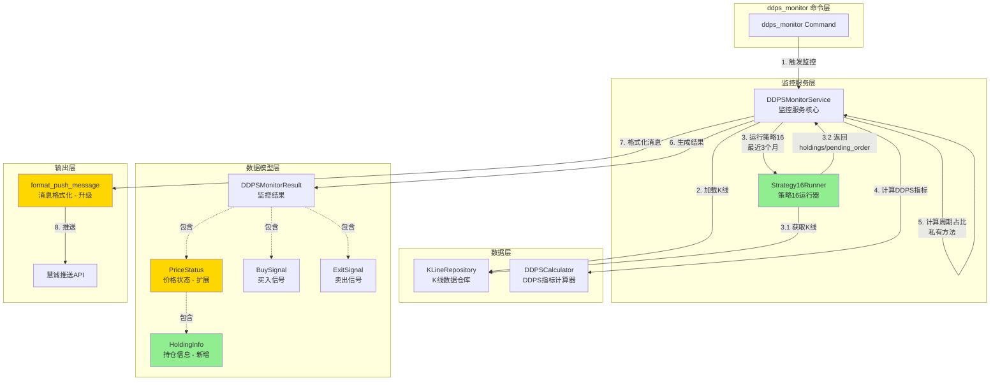

# 架构设计: DDPS监控服务策略16升级

## 文档信息

| 属性 | 值 |
|------|-----|
| 迭代编号 | 038 |
| 创建日期 | 2026-01-12 |
| PRD文档 | prd.md |
| 功能点清单 | function-points.md |

---

## 1. 需求解读与目标对齐

### 1.1 核心业务目标

将DDPS价格监控推送服务从策略7升级为策略16，提供更精准的交易信号检测和更丰富的市场状态信息推送，确保推送内容与策略16回测结果完全一致。

### 1.2 关键用户流程

```
1. 系统定时触发监控 (ddps_monitor --full)
                ↓
2. 【步骤1】更新K线数据
   └── 调用 update_ddps_klines 命令获取最新K线
                ↓
3. 【步骤2】为每个交易对运行策略16回测（最近3个月）
   ├── 获取未平仓订单 (holdings)
   ├── 获取当前挂单 (pending_order)
   └── 计算周期占比 (42根K线)
                ↓
4. 【步骤2续】检测最新K线的交易信号
   ├── 买入信号：策略16入场条件
   └── 卖出信号：EMA状态止盈条件
                ↓
5. 【步骤2续】汇总价格状态信息
   ├── 基础指标：P5/P95/惯性范围/概率
   ├── 策略16挂单价格
   ├── 周期详情：状态/ADX/贝塔/持续时长
   ├── 42周期占比分布
   └── 持仓订单列表
                ↓
6. 【步骤3】格式化并推送消息到慧诚平台
```

### 1.3 功能点映射

| 流程步骤 | 对应功能点 |
|----------|------------|
| K线数据更新 | 现有功能（不变） |
| 数据模型支撑 | FP-038-001 (PriceStatus扩展) |
| 策略16回测 | FP-038-002 (Strategy16集成) |
| 周期统计 | FP-038-003 (周期占比统计) |
| 买入检测 | FP-038-004 (买入信号升级) |
| 卖出检测 | FP-038-005 (卖出信号升级) |
| 消息格式化 | FP-038-006 (推送格式升级) |
| 命令入口 | FP-038-007 (命令更新) |

---

## 2. 架构设计与可视化

### 2.1 核心架构图



**图例说明**:
- 🟢 绿色: 新增组件
- 🟡 黄色: 修改组件
- ⬜ 白色: 现有组件（不变）

### 2.2 概念解读

该架构展示了DDPS监控服务升级为策略16后的整体结构：**通过集成Strategy16Runner实现精准的信号检测，通过DDPSMonitorService私有方法实现周期占比统计，最终生成更丰富的推送内容**。

### 2.3 组件职责

| 组件 | 类型 | 职责 |
|------|------|------|
| **ddps_monitor Command** | 现有 | 命令入口，协调更新K线→计算→推送流程 |
| **DDPSMonitorService** | 修改 | 核心服务，集成Strategy16Runner，包含周期占比计算私有方法 |
| **Strategy16Runner** | 新集成 | 运行策略16回测（最近3个月），返回holdings和pending_order |
| **KLineRepository** | 现有 | 加载K线数据 |
| **DDPSCalculator** | 现有 | 计算DDPS指标（P5/P95/周期等） |
| **PriceStatus** | 扩展 | 价格状态数据类，新增order_price/adx/beta/cycle_distribution/holdings字段 |
| **HoldingInfo** | 新增 | 持仓订单信息数据类 |
| **format_push_message** | 升级 | 生成新格式的推送消息 |

### 2.4 组件与需求映射

**DDPSMonitorService（修改）**
- 负责实现: FP-038-002 (Strategy16集成), FP-038-003 (周期占比统计), FP-038-004 (买入信号检测升级), FP-038-005 (卖出信号检测升级)

**PriceStatus + HoldingInfo（数据模型）**
- 负责实现: FP-038-001 (数据模型扩展)

**format_push_message（升级）**
- 负责实现: FP-038-006 (推送消息格式升级)

**ddps_monitor Command（更新）**
- 负责实现: FP-038-007 (命令更新)

### 2.5 交互说明

```
序号1: ddps_monitor触发监控，调用DDPSMonitorService.monitor()
序号2: DDPSMonitorService通过KLineRepository加载最新K线数据
序号3: DDPSMonitorService调用Strategy16Runner运行策略16回测（限制最近3个月）
  3.1: Strategy16Runner内部从KLineRepository获取K线
  3.2: Strategy16Runner返回holdings（未平仓订单）和pending_order（当前挂单）
序号4: DDPSMonitorService调用DDPSCalculator计算DDPS指标（P5/P95/周期等）
序号5: DDPSMonitorService调用私有方法_calculate_cycle_distribution计算42周期占比
序号6: DDPSMonitorService汇总结果生成DDPSMonitorResult
序号7: DDPSMonitorService调用format_push_message格式化消息
序号8: 将格式化消息推送到慧诚平台
```

---

## 3. 关键决策点与方案评估

### 3.1 决策点一：Strategy16持仓数据获取方式

| 方案 | 简介 | 优点 | 缺点 |
|------|------|------|------|
| **A. 每次监控时运行回测** | 每次ddps_monitor运行时，调用Strategy16Runner对最近3个月K线运行回测 | 数据100%与策略16一致，无需额外持久化 | 每次回测有一定耗时 |
| B. 持久化holdings到数据库 | 将Strategy16的holdings持久化到数据库 | 读取速度快 | 需要同步机制，增加复杂度 |

**最终决策**: ✅ **方案A - 每次监控时运行回测（限制最近3个月）**

**决策理由**:
1. 保证数据一致性是核心需求（PRD明确要求与策略16一致）
2. 限制为最近3个月数据，回测耗时可控
3. 监控通常每4小时执行一次，延迟可接受
4. 避免引入数据库同步的复杂性

---

### 3.2 决策点二：周期占比统计的实现位置

| 方案 | 简介 | 优点 | 缺点 |
|------|------|------|------|
| A. DDPSCalculator新方法 | 在现有DDPSCalculator中新增方法 | 复用现有计算器 | Calculator职责增加 |
| B. 独立Calculator类 | 新建独立的CycleDistributionCalculator | 单一职责 | 多一个类，需要依赖注入 |
| **C. Service私有方法** | 直接在DDPSMonitorService中实现 | 实现简单，无需新增类 | Service职责增加 |

**最终决策**: ✅ **方案C - 作为DDPSMonitorService的私有方法**

**决策理由**:
1. 周期占比计算逻辑简单（统计42个值的分布）
2. 只在监控服务中使用，无需复用
3. 保持架构简洁，避免过度设计

---

### 3.3 决策点三：买入信号的展示方式

| 方案 | 简介 | 优点 | 缺点 |
|------|------|------|------|
| A. 展示pending_order | 推送中直接展示策略16的pending_order | 与策略16完全一致 | 用户可能困惑概念 |
| **B. 转换为BuySignal格式** | 将pending_order转换为BuySignal展示 | 格式统一，用户理解成本低 | 需要数据转换 |

**最终决策**: ✅ **方案B - 转换为买入信号格式**

**决策理由**:
1. 保持推送消息格式的一致性
2. 用户已习惯"买入信号"的概念
3. 挂单价格作为附加信息展示，提供更多决策依据

---

## 4. 详细设计

### 4.1 数据模型扩展

#### 4.1.1 HoldingInfo（新增）

```python
@dataclass
class HoldingInfo:
    """持仓订单信息"""
    order_id: str           # 订单ID
    buy_price: Decimal      # 买入价格
    buy_timestamp: int      # 买入时间戳(ms)
    holding_hours: float    # 持仓时长(小时)
```

#### 4.1.2 PriceStatus（扩展）

```python
@dataclass
class PriceStatus:
    # 现有字段
    symbol: str
    current_price: Decimal
    cycle_phase: str
    p5: Decimal
    p95: Decimal
    ema25: Decimal
    inertia_mid: Decimal
    probability: int

    # 🆕 新增字段
    order_price: Optional[Decimal] = None           # 策略16挂单价格
    adx: Optional[float] = None                     # ADX指标值
    beta: Optional[float] = None                    # 贝塔值
    cycle_duration_hours: Optional[float] = None    # 周期连续时长
    inertia_lower: Optional[Decimal] = None         # 惯性下界
    inertia_upper: Optional[Decimal] = None         # 惯性上界
    cycle_distribution: Optional[Dict[str, float]] = None  # 42周期占比
    holdings: Optional[List[HoldingInfo]] = None    # 持仓订单列表
```

### 4.2 DDPSMonitorService扩展

#### 4.2.1 新增私有方法

```python
def _run_strategy16(
    self,
    symbol: str,
    interval: str,
    market_type: str
) -> Optional[Dict]:
    """
    运行策略16获取回测结果（限制最近3个月）

    Returns:
        {
            'holdings': List[Dict],      # 未平仓订单
            'pending_order': Dict,       # 当前挂单
            'statistics': Dict           # 统计数据
        }
    """

def _calculate_cycle_distribution(
    self,
    cycle_phases: List[str],
    window: int = 42
) -> Dict[str, float]:
    """
    计算周期占比（私有方法）

    Returns:
        {
            'bull_strong': 30.0,
            'bull_warning': 10.0,
            'consolidation': 40.0,
            'bear_warning': 10.0,
            'bear_strong': 10.0
        }
    """

def _convert_pending_order_to_buy_signal(
    self,
    pending_order: Dict,
    cycle_phase: str
) -> Optional[BuySignal]:
    """
    将策略16的pending_order转换为BuySignal格式
    """
```

### 4.3 推送消息格式

#### 4.3.1 标题格式（不变）

```
[市场/周期] MM-DD HH:MM: 买入(N) 卖出(N) 上涨预警(N) 下跌预警(N)
```

#### 4.3.2 内容格式（升级）

```
时间: YYYY-MM-DD HH:MM

买入信号 (N个):
  - ETHUSDT @ 3500.50 (上涨预警)
  - BTCUSDT @ 42000.00 (震荡期)

卖出信号 (N个):
  - 订单#abc123 BTCUSDT: EMA状态止盈(强势上涨) @ 42500.00 (开仓40000.00, +6.25%)

上涨预警: ETHUSDT, SOLUSDT
下跌预警: XRPUSDT

价格状态:
  ETHUSDT: 3500.50 (上涨预警)
    P5=3400.00 P95=3700.00
    惯性范围: 3450.00~3550.00
    概率: P42
    挂单价格: 3380.12
    所处周期: 上涨预警 - ADX(30) - 贝塔(0.012) - 连续48小时
    最近42周期占比: 强势上涨(30%), 震荡(50%), 强势下跌(20%)
    持仓订单 (2个):
      01-10 08:00 @ 3200.00 → 持仓56小时
      01-08 16:00 @ 3100.00 → 持仓104小时

  BTCUSDT: 95000.00 (震荡期)
    ...
```

---

## 5. 实现计划

### 5.1 任务清单

| 任务ID | 描述 | 依赖 | 预估复杂度 |
|--------|------|------|------------|
| TASK-038-001 | 新增HoldingInfo数据类 | - | 低 |
| TASK-038-002 | 扩展PriceStatus数据类 | TASK-038-001 | 低 |
| TASK-038-003 | 集成Strategy16Runner到DDPSMonitorService | TASK-038-002 | 中 |
| TASK-038-004 | 实现_calculate_cycle_distribution私有方法 | - | 低 |
| TASK-038-005 | 升级get_buy_signals方法 | TASK-038-003 | 中 |
| TASK-038-006 | 升级get_exit_signals方法 | TASK-038-003 | 中 |
| TASK-038-007 | 升级get_price_status方法 | TASK-038-003, TASK-038-004 | 中 |
| TASK-038-008 | 升级format_push_message方法 | TASK-038-007 | 中 |
| TASK-038-009 | 更新ddps_monitor命令 | TASK-038-008 | 低 |
| TASK-038-010 | 集成测试与验证 | TASK-038-009 | 中 |

### 5.2 执行顺序

```
TASK-038-001 (HoldingInfo)
    ↓
TASK-038-002 (PriceStatus扩展)
    ↓
TASK-038-003 (Strategy16集成) + TASK-038-004 (周期占比)
    ↓
TASK-038-005 (买入信号) + TASK-038-006 (卖出信号) + TASK-038-007 (价格状态)
    ↓
TASK-038-008 (消息格式)
    ↓
TASK-038-009 (命令更新)
    ↓
TASK-038-010 (测试验证)
```

---

## 6. 风险与缓解

| 风险 | 影响 | 缓解措施 |
|------|------|----------|
| 策略16回测耗时 | 推送延迟 | 限制回测为最近3个月数据 |
| 内存占用增加 | 服务稳定性 | 及时清理缓存，限制K线数量 |
| 数据不一致 | 用户困惑 | 统一使用Strategy16作为数据源 |

---

## 7. 验收标准

- [ ] 买入信号来自策略16最新K线检测
- [ ] 卖出信号基于策略16 EMA状态止盈
- [ ] 持仓订单与策略16回测结果一致
- [ ] 挂单价格计算正确
- [ ] 周期占比统计准确（42根K线）
- [ ] 推送消息格式符合规范
- [ ] dry-run模式显示完整新格式
