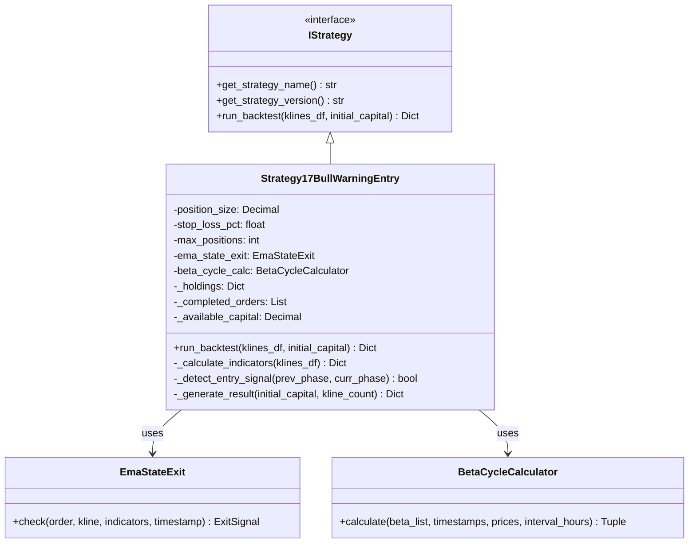
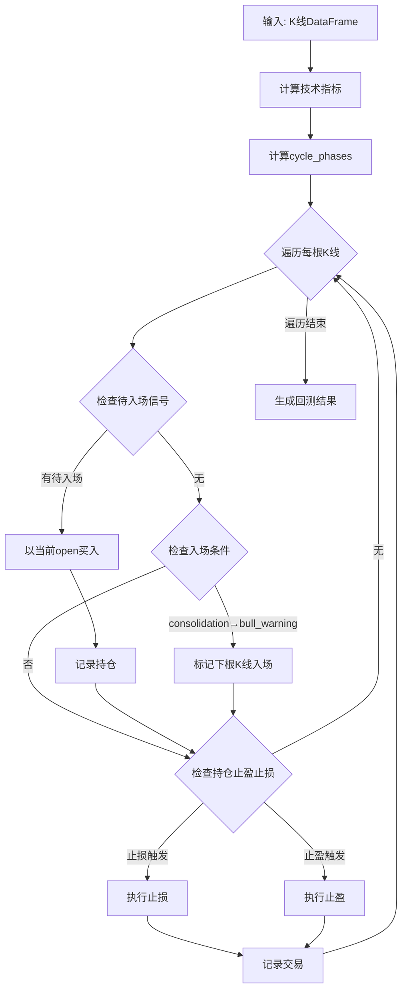

# 架构设计 - 策略17

## 1. 组件设计

### 1.1 类图



### 1.2 核心类: Strategy17BullWarningEntry

```python
class Strategy17BullWarningEntry(IStrategy):
    """
    策略17：上涨预警入场 + EMA状态止盈

    入场逻辑：
    - 检测cycle_phase从consolidation首次变为bull_warning
    - 在下一根K线的open价格买入

    止盈止损：
    - 止盈：EMA状态止盈（复用EmaStateExit）
    - 止损：5%固定止损
    """

    STRATEGY_ID = 'strategy_17'
    STRATEGY_NAME = '上涨预警入场'
    STRATEGY_VERSION = '1.0'
```

## 2. 数据流

### 2.1 回测流程



### 2.2 关键状态转换

```
K线序列:    [K0]  [K1]  [K2]  [K3]  [K4]  [K5]
cycle_phase: con   con   warn  warn  strong con
                    ↑
                 首次bull_warning
                    ↓
买入时机:               [K3.open买入]
```

## 3. 接口设计

### 3.1 run_backtest()

```python
def run_backtest(
    self,
    klines_df: pd.DataFrame,
    initial_capital: Decimal = Decimal("10000")
) -> Dict:
    """
    执行回测

    Args:
        klines_df: K线数据，index为DatetimeIndex
        initial_capital: 初始资金

    Returns:
        {
            'orders': List[Dict],          # 已完成交易
            'total_trades': int,           # 总交易数
            'winning_trades': int,         # 盈利交易数
            'losing_trades': int,          # 亏损交易数
            'total_profit_loss': float,    # 总盈亏
            'win_rate': float,             # 胜率
            'return_rate': float,          # 收益率
            'statistics': Dict,            # 详细统计
        }
    """
```

### 3.2 _detect_entry_signal()

```python
def _detect_entry_signal(
    self,
    prev_phase: str,
    curr_phase: str
) -> bool:
    """
    检测是否触发入场信号

    Args:
        prev_phase: 前一根K线的cycle_phase
        curr_phase: 当前K线的cycle_phase

    Returns:
        bool: True表示触发入场信号
    """
    # 仅当从consolidation首次进入bull_warning时触发
    return (
        curr_phase == 'bull_warning' and
        prev_phase == 'consolidation'
    )
```

## 4. 关键决策

### 4.1 入场信号检测方式

**决策**: 检测`consolidation → bull_warning`状态转变

**替代方案**:
1. 检测任意状态 → bull_warning（包括从bear_warning）
2. 仅检测β值突破600阈值

**选择理由**:
- 符合"第一根出现上涨预警"的语义
- 避免在周期延续时重复入场
- 与BetaCycleCalculator的状态机设计一致

### 4.2 买入价格

**决策**: 使用下一根K线的open价格

**理由**:
- 避免后验偏差（不能用当前K线的close，因为信号是在K线结束时才能确认）
- 符合实盘操作逻辑（信号触发后，在下一个交易窗口开盘时执行）

## 5. 文件结构

```
strategy_adapter/
├── strategies/
│   ├── __init__.py              # 添加Strategy17导出
│   ├── strategy16_limit_entry.py
│   └── strategy17_bull_warning_entry.py  # [新增]
└── configs/
    └── strategy17_bull_warning.json      # [新增] 可选配置文件
```

---

**创建时间**: 2026-01-12
**迭代编号**: 038
