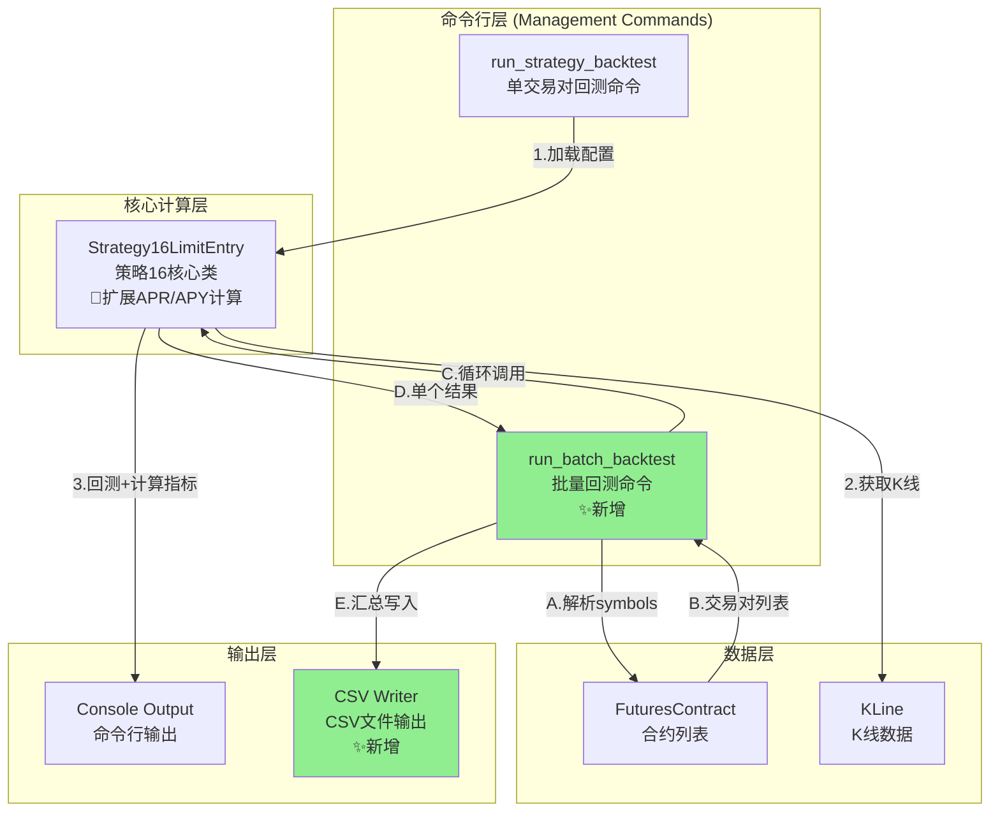
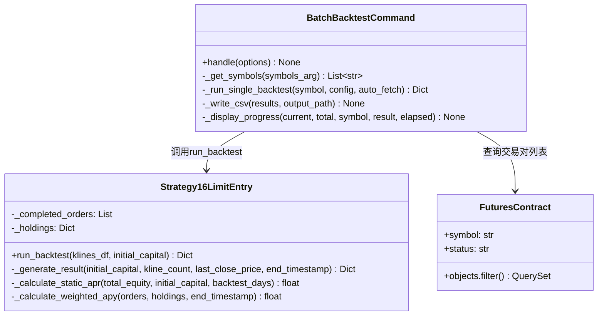

# 架构设计文档: 批量回测评估体系

## 文档信息
| 属性 | 值 |
|------|-----|
| 迭代编号 | 040 |
| 项目名称 | batch-backtest-evaluation |
| 创建日期 | 2026-01-13 |
| 版本 | 1.0 |
| 状态 | 架构确认 |

---

## 1. 需求解读与目标对齐

### 1.1 核心业务目标

构建一套策略回测的**整体评估体系**，解决以下核心问题：
1. 当前回测系统只能单个交易对运行，无法批量对比多个交易对的策略表现
2. 缺乏资金利用效率指标（APR/APY），无法评估资金的真实年化收益能力
3. 回测结果仅在命令行显示，无法结构化存储和后续分析

### 1.2 关键用户流程

```
用户典型操作流程：

1. 【准备阶段】用户准备策略配置文件（如strategy16_p5_ema_state_exit.json）

2. 【Phase 1 - 单交易对回测增强】
   └── 运行: python manage.py run_strategy_backtest ETHUSDT --config xxx.json
   └── 获得: 原有指标 + 新增的静态APR + 综合APY

3. 【Phase 2 - 批量回测】
   └── 运行: python manage.py run_batch_backtest --config xxx.json --symbols ALL
   └── 系统逐个回测所有交易对，显示进度
   └── 生成CSV文件（包含所有交易对的完整指标）

4. 【分析阶段】用户打开CSV文件（Excel/Python）
   └── 按APR/APY排序，筛选优质交易对
   └── 对比不同交易对的表现差异
```

### 1.3 功能点总结

| Phase | ID | 功能点 | 核心职责 |
|-------|-----|--------|----------|
| 1 | FP-040-001 | 静态APR指标 | 线性年化收益率计算 |
| 1 | FP-040-002 | 综合APY指标 | 时间加权年化收益率计算 |
| 1 | FP-040-003 | 扩展统计输出 | 命令行新增APR/APY显示 |
| 2 | FP-040-004 | 批量回测命令 | 批量回测主入口 |
| 2 | FP-040-005 | 交易对列表获取 | 支持指定列表或ALL |
| 2 | FP-040-006 | CSV结果存储 | UTF-8 BOM编码输出 |
| 2 | FP-040-007 | 错误处理与跳过 | 单个失败不中断整体 |
| 2 | FP-040-008 | 进度显示 | 实时显示回测进度（P1） |

---

## 2. 架构设计与可视化

### 2.1 核心架构图



### 2.2 概念解读

本系统采用**分层架构**，在现有单交易对回测基础上，通过新增**批量回测命令**（run_batch_backtest）和**CSV输出组件**，实现多交易对批量评估和结果导出能力。

**设计原则**：
- **最小改动**：APR/APY计算内嵌到现有Strategy16类，无需新增模块
- **复用优先**：批量回测复用单交易对回测的全部逻辑
- **简单可靠**：同步串行执行，保证稳定性和可调试性

### 2.3 组件职责

| 组件 | 类型 | 文件位置 | 职责 |
|------|------|----------|------|
| **run_strategy_backtest** | 现有命令 | `strategy_adapter/management/commands/run_strategy_backtest.py` | 单交易对回测入口，新增APR/APY显示 |
| **run_batch_backtest** | ✨新增命令 | `strategy_adapter/management/commands/run_batch_backtest.py` | 批量回测入口，解析symbols，循环回测，输出CSV |
| **Strategy16LimitEntry** | 现有策略类 | `strategy_adapter/strategies/strategy16_limit_entry.py` | 策略16核心逻辑，`_generate_result()`扩展APR/APY计算 |
| **FuturesContract** | 现有模型 | `backtest/models.py` | 提供活跃合约列表，支持ALL模式查询 |
| **KLine** | 现有模型 | `backtest/models.py` | 提供K线历史数据 |
| **CSV Writer** | ✨新增组件 | 内嵌于run_batch_backtest | 使用csv标准模块写入CSV文件 |

### 2.4 组件与需求映射

```
┌─────────────────────────────────────────────────────────────────┐
│                    Strategy16LimitEntry                         │
│  _generate_result() 方法扩展                                    │
│  ├── FP-040-001: 静态APR计算                                   │
│  └── FP-040-002: 综合APY计算（时间加权）                       │
└─────────────────────────────────────────────────────────────────┘

┌─────────────────────────────────────────────────────────────────┐
│                  run_strategy_backtest                          │
│  输出显示扩展                                                   │
│  └── FP-040-003: 扩展统计输出（新增APR/APY行）                 │
└─────────────────────────────────────────────────────────────────┘

┌─────────────────────────────────────────────────────────────────┐
│                  run_batch_backtest (新增)                      │
│  批量回测主命令                                                 │
│  ├── FP-040-004: 批量回测命令（参数解析、循环执行）            │
│  ├── FP-040-005: 交易对列表获取（_get_symbols方法）            │
│  ├── FP-040-006: CSV结果存储（_write_csv方法）                 │
│  ├── FP-040-007: 错误处理与跳过（try-except包装）              │
│  └── FP-040-008: 进度显示（_display_progress方法）             │
└─────────────────────────────────────────────────────────────────┘
```

### 2.5 详细类设计



---

## 3. 关键决策点与方案评估

### 3.1 决策点一：APR/APY计算逻辑位置

| 方案 | 描述 | 优点 | 缺点 |
|------|------|------|------|
| A. 独立模块 | 创建MetricsCalculator类 | 职责分离，可复用 | 新增文件，过度设计 |
| **B. 内嵌Strategy16** | 在_generate_result()中计算 | 改动最小，实现快速 | 其他策略无法复用 |

**最终决策**: ✅ **方案B - 内嵌到Strategy16**

**理由**:
- MVP阶段仅策略16需要，无复用需求
- 计算逻辑简单（各约10行代码）
- 避免过度设计，符合YAGNI原则

---

### 3.2 决策点二：批量回测执行方式

| 方案 | 描述 | 优点 | 缺点 |
|------|------|------|------|
| **A. 同步串行** | 逐个顺序执行 | 实现简单，内存可控 | 耗时较长 |
| B. 异步并行 | 多进程/asyncio | 缩短总耗时 | 实现复杂，内存压力大 |

**最终决策**: ✅ **方案A - 同步串行执行**

**理由**:
- MVP阶段优先保证正确性和可调试性
- 进度显示需要顺序执行才直观
- 避免内存爆炸（每次只加载一个交易对的K线）

---

### 3.3 决策点三：CSV输出实现方式

| 方案 | 描述 | 优点 | 缺点 |
|------|------|------|------|
| **A. csv标准模块** | 使用csv.DictWriter | 无额外依赖，简单 | 需手动处理BOM |
| B. pandas | 使用DataFrame.to_csv() | 功能丰富 | 重型依赖 |

**最终决策**: ✅ **方案A - csv标准模块**

**理由**:
- 功能需求简单，仅需写入固定格式CSV
- BOM处理只需一行代码：`f.write('\ufeff')`
- 更轻量，启动更快

---

## 4. 数据流设计

### 4.1 单交易对回测数据流

```
输入:
  - symbol: str (交易对)
  - config: Dict (策略配置)
  - klines_df: DataFrame (K线数据)

处理:
  Strategy16LimitEntry.run_backtest()
    ├── 执行回测逻辑
    ├── _generate_result()
    │   ├── 计算基础统计（订单数、胜率等）
    │   ├── 计算资金统计（持仓市值、账户总值等）
    │   ├── _calculate_static_apr()  <- 新增
    │   └── _calculate_weighted_apy() <- 新增
    └── 返回完整结果Dict

输出:
  {
    'total_orders': int,
    'win_rate': float,
    'return_rate': float,
    'static_apr': float,      # 新增
    'weighted_apy': float,    # 新增
    'total_equity': float,
    ...
  }
```

### 4.2 批量回测数据流

```
输入:
  --config: strategy16_p5_ema_state_exit.json
  --symbols: "ETHUSDT,BTCUSDT" 或 "ALL"
  --output: data/backtest_results.csv
  --auto-fetch: True/False

处理流程:
  1. 解析symbols参数
     └── ALL → FuturesContract.objects.filter(status='trading')
     └── 列表 → split(',')

  2. 循环回测 (同步串行)
     for symbol in symbols:
         try:
             result = run_single_backtest(symbol)
             results.append(result)
             display_progress(...)
         except Exception as e:
             results.append(error_result)
             log_error(...)

  3. 写入CSV (UTF-8 BOM)
     with open(output, 'w', encoding='utf-8-sig') as f:
         writer = csv.DictWriter(f, fieldnames=CSV_HEADERS)
         writer.writeheader()
         writer.writerows(results)

输出:
  - CSV文件 (19列)
  - 控制台进度显示
```

---

## 5. 接口设计

### 5.1 Strategy16LimitEntry 扩展

```python
# strategy_adapter/strategies/strategy16_limit_entry.py

def _generate_result(
    self,
    initial_capital: Decimal,
    kline_count: int,
    last_close_price: Decimal = None,
    end_timestamp: int = None  # 新增参数
) -> Dict:
    """
    生成回测结果，包含APR/APY计算

    新增字段:
    - static_apr: 静态年化收益率
    - weighted_apy: 时间加权年化收益率
    - backtest_days: 回测天数
    """
    ...

def _calculate_static_apr(
    self,
    total_equity: Decimal,
    initial_capital: Decimal,
    backtest_days: int
) -> float:
    """
    计算静态APR
    公式: (total_equity - initial_capital) / initial_capital / backtest_days * 365 * 100
    """
    if backtest_days <= 0:
        return 0.0
    return float((total_equity - initial_capital) / initial_capital / backtest_days * 365 * 100)

def _calculate_weighted_apy(
    self,
    completed_orders: List[Dict],
    holdings: Dict,
    end_timestamp: int
) -> float:
    """
    计算时间加权APY
    公式: Σ(年化收益率_i × 金额_i) / Σ(金额_i)
    """
    ...
```

### 5.2 run_batch_backtest 命令

```python
# strategy_adapter/management/commands/run_batch_backtest.py

class Command(BaseCommand):
    help = '批量回测多个交易对，输出CSV结果'

    def add_arguments(self, parser):
        parser.add_argument('--config', required=True, help='策略配置文件路径')
        parser.add_argument('--symbols', default='ALL', help='交易对列表(逗号分隔)或ALL')
        parser.add_argument('--output', help='CSV输出路径')
        parser.add_argument('--auto-fetch', action='store_true', help='自动拉取缺失K线')

    def handle(self, *args, **options):
        # 1. 获取交易对列表
        symbols = self._get_symbols(options['symbols'])

        # 2. 循环回测
        results = []
        for i, symbol in enumerate(symbols, 1):
            start_time = time.time()
            try:
                result = self._run_single_backtest(symbol, config, options['auto_fetch'])
                results.append(result)
            except Exception as e:
                results.append(self._error_result(symbol, str(e)))

            elapsed = time.time() - start_time
            self._display_progress(i, len(symbols), symbol, result, elapsed)

        # 3. 写入CSV
        output_path = options['output'] or self._default_output_path()
        self._write_csv(results, output_path)
```

### 5.3 CSV字段定义

```python
CSV_HEADERS = [
    'symbol',           # 交易对
    'total_orders',     # 总订单数
    'closed_orders',    # 已平仓
    'open_positions',   # 持仓中
    'available_capital',# 可用现金
    'frozen_capital',   # 挂单冻结
    'holding_cost',     # 持仓成本
    'holding_value',    # 持仓市值
    'total_equity',     # 账户总值
    'total_volume',     # 总交易量
    'total_commission', # 总手续费
    'win_rate',         # 胜率
    'net_profit',       # 净利润
    'return_rate',      # 收益率
    'static_apr',       # 静态APR
    'weighted_apy',     # 综合APY
    'backtest_days',    # 回测天数
    'start_date',       # 开始日期
    'end_date',         # 结束日期
]
```

---

## 6. 文件变更清单

### 6.1 修改文件

| 文件 | 变更内容 |
|------|----------|
| `strategy_adapter/strategies/strategy16_limit_entry.py` | `_generate_result()` 新增APR/APY计算 |
| `strategy_adapter/management/commands/run_strategy_backtest.py` | 输出显示新增APR/APY行 |

### 6.2 新增文件

| 文件 | 描述 |
|------|------|
| `strategy_adapter/management/commands/run_batch_backtest.py` | 批量回测命令 |

---

## 7. 测试策略

### 7.1 单元测试

| 测试项 | 输入 | 预期输出 |
|--------|------|----------|
| APR正收益 | 初始10000，总值12000，357天 | APR ≈ +20.45% |
| APR负收益 | 初始10000，总值7875，357天 | APR ≈ -21.72% |
| APR零天数 | backtest_days=0 | APR = 0% |
| APY单笔订单 | 1000USDT，+5%，10天 | APY ≈ +182.5% |
| APY无订单 | orders=[], holdings={} | APY = 0% |

### 7.2 集成测试

| 测试项 | 命令 | 预期结果 |
|--------|------|----------|
| 单个交易对 | `--symbols ETHUSDT` | CSV含1行 |
| 多个交易对 | `--symbols ETHUSDT,BTCUSDT` | CSV含2行 |
| ALL模式 | `--symbols ALL` | CSV含所有活跃交易对 |
| 部分失败 | 含无数据交易对 | 失败项数值为0，不中断 |

---

## 8. 附录

### 8.1 命令使用示例

```bash
# Phase 1: 单交易对回测（增强版）
python manage.py run_strategy_backtest ETHUSDT \
  --config strategy_adapter/configs/strategy16_p5_ema_state_exit.json \
  --auto-fetch

# Phase 2: 批量回测
python manage.py run_batch_backtest \
  --config strategy_adapter/configs/strategy16_p5_ema_state_exit.json \
  --symbols ETHUSDT,BTCUSDT,SOLUSDT \
  --output data/backtest_results.csv \
  --auto-fetch

# Phase 2: 回测所有交易对
python manage.py run_batch_backtest \
  --config strategy_adapter/configs/strategy16_p5_ema_state_exit.json \
  --symbols ALL \
  --auto-fetch
```

### 8.2 CSV输出示例

```csv
symbol,total_orders,closed_orders,open_positions,available_capital,frozen_capital,holding_cost,holding_value,total_equity,total_volume,total_commission,win_rate,net_profit,return_rate,static_apr,weighted_apy,backtest_days,start_date,end_date
ETHUSDT,180,172,8,956.59,0.00,8000.00,6918.76,7875.36,342956.59,342.96,56.98,-1043.41,-21.25,-21.72,45.32,357,2024-12-31,2025-12-24
BTCUSDT,145,140,5,2500.00,0.00,5000.00,5500.00,8000.00,250000.00,250.00,62.07,500.00,10.00,10.22,38.50,357,2024-12-31,2025-12-24
```

### 8.3 关联文档

- PRD: `docs/iterations/040-batch-backtest-evaluation/prd.md`
- 功能点清单: `docs/iterations/040-batch-backtest-evaluation/function-points.md`
- 需求澄清: `docs/iterations/040-batch-backtest-evaluation/clarifications.md`
