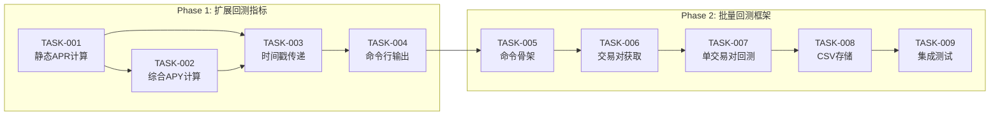

# 任务计划: 批量回测评估体系

## 文档信息
| 属性 | 值 |
|------|-----|
| 迭代编号 | 040 |
| 项目名称 | batch-backtest-evaluation |
| 创建日期 | 2026-01-13 |
| 版本 | 1.0 |

---

## 任务总览

| 阶段 | 任务数 | 预估工时 | 状态 |
|------|--------|----------|------|
| Phase 1: 扩展回测指标 | 4 | 2h | 待开发 |
| Phase 2: 批量回测框架 | 5 | 3h | 待开发 |
| **总计** | **9** | **5h** | - |

---

## Phase 1: 扩展回测指标

### TASK-040-001: 实现静态APR计算
**优先级**: P0 | **预估工时**: 30min | **状态**: 待开发

**目标**: 在Strategy16LimitEntry中新增静态APR计算

**实现步骤**:
1. 修改 `_generate_result()` 方法签名，新增 `start_timestamp` 和 `end_timestamp` 参数
2. 计算回测天数: `backtest_days = (end_timestamp - start_timestamp) / (24 * 60 * 60 * 1000)`
3. 实现 `_calculate_static_apr()` 方法:
   ```python
   def _calculate_static_apr(self, total_equity, initial_capital, backtest_days):
       if backtest_days <= 0:
           return 0.0
       return float((total_equity - initial_capital) / initial_capital / backtest_days * 365 * 100)
   ```
4. 在返回结果中新增 `static_apr` 和 `backtest_days` 字段

**修改文件**:
- `strategy_adapter/strategies/strategy16_limit_entry.py`

**验收标准**:
- [ ] `_calculate_static_apr()` 方法存在且可调用
- [ ] 返回结果包含 `static_apr` 字段
- [ ] 返回结果包含 `backtest_days` 字段
- [ ] APR计算公式正确

**依赖**: 无

---

### TASK-040-002: 实现综合APY计算
**优先级**: P0 | **预估工时**: 45min | **状态**: 待开发

**目标**: 实现时间加权年化收益率计算

**实现步骤**:
1. 实现 `_calculate_weighted_apy()` 方法:
   ```python
   def _calculate_weighted_apy(self, completed_orders, holdings, end_timestamp):
       MS_PER_DAY = 24 * 60 * 60 * 1000
       weighted_sum = 0.0
       total_amount = 0.0

       # 处理已平仓订单
       for order in completed_orders:
           amount = order['amount']
           profit_rate = order['profit_rate'] / 100  # 转为小数
           holding_days = max((order['sell_timestamp'] - order['buy_timestamp']) / MS_PER_DAY, 1)
           annualized_rate = profit_rate * (365 / holding_days)
           weighted_sum += annualized_rate * amount
           total_amount += amount

       # 处理持仓中订单（使用浮动盈亏）
       for order_id, holding in holdings.items():
           amount = holding['amount']
           buy_price = holding['buy_price']
           # 浮动盈亏需要从外部传入当前价格计算
           holding_days = max((end_timestamp - holding['buy_timestamp']) / MS_PER_DAY, 1)
           # ... 计算浮动收益率并年化

       return (weighted_sum / total_amount * 100) if total_amount > 0 else 0.0
   ```
2. 在 `_generate_result()` 中调用并返回 `weighted_apy` 字段

**修改文件**:
- `strategy_adapter/strategies/strategy16_limit_entry.py`

**验收标准**:
- [ ] `_calculate_weighted_apy()` 方法存在且可调用
- [ ] 已平仓订单正确计算持仓天数和年化收益
- [ ] 持仓中订单使用回测结束时间计算
- [ ] 无订单时返回0
- [ ] 持仓天数最小为1天

**依赖**: TASK-040-001

---

### TASK-040-003: 修改run_backtest传递时间戳
**优先级**: P0 | **预估工时**: 15min | **状态**: 待开发

**目标**: 确保回测时间戳正确传递到`_generate_result()`

**实现步骤**:
1. 在 `run_backtest()` 方法中获取开始和结束时间戳:
   ```python
   start_timestamp = int(klines_df.index[0].timestamp() * 1000)
   end_timestamp = int(klines_df.index[-1].timestamp() * 1000)
   ```
2. 将时间戳传递给 `_generate_result()`
3. 确保回测结果包含 `start_date` 和 `end_date` 字符串字段

**修改文件**:
- `strategy_adapter/strategies/strategy16_limit_entry.py`

**验收标准**:
- [ ] 回测结果包含正确的时间戳
- [ ] `backtest_days` 计算正确
- [ ] `start_date` 和 `end_date` 格式为 `YYYY-MM-DD`

**依赖**: TASK-040-001, TASK-040-002

---

### TASK-040-004: 扩展命令行输出显示
**优先级**: P0 | **预估工时**: 30min | **状态**: 待开发

**目标**: 在run_strategy_backtest命令输出中新增APR/APY显示

**实现步骤**:
1. 在【整体统计】区域新增两行:
   ```
   静态APR: +xx.xx%
   综合APY: +xx.xx%
   ```
2. 处理正负号显示（正数显示+，负数自带-）
3. 保持与现有输出格式一致

**修改文件**:
- `strategy_adapter/management/commands/run_strategy_backtest.py`

**验收标准**:
- [ ] 静态APR正确显示（保留2位小数）
- [ ] 综合APY正确显示（保留2位小数）
- [ ] 正负号显示正确
- [ ] 格式与现有输出对齐

**依赖**: TASK-040-001, TASK-040-002, TASK-040-003

---

## Phase 2: 批量回测框架

### TASK-040-005: 创建批量回测命令骨架
**优先级**: P0 | **预估工时**: 30min | **状态**: 待开发

**目标**: 创建run_batch_backtest命令基础结构

**实现步骤**:
1. 创建新文件 `strategy_adapter/management/commands/run_batch_backtest.py`
2. 实现命令参数:
   - `--config`: 策略配置文件路径（必填）
   - `--symbols`: 交易对列表或ALL（默认ALL）
   - `--output`: CSV输出路径（可选）
   - `--auto-fetch`: 自动拉取K线（flag）
3. 实现基础 `handle()` 方法框架

**新增文件**:
- `strategy_adapter/management/commands/run_batch_backtest.py`

**验收标准**:
- [ ] 命令可通过 `python manage.py run_batch_backtest --help` 查看帮助
- [ ] 参数解析正确
- [ ] 缺少必填参数时报错

**依赖**: Phase 1完成

---

### TASK-040-006: 实现交易对列表获取
**优先级**: P0 | **预估工时**: 30min | **状态**: 待开发

**目标**: 实现`_get_symbols()`方法，支持指定列表或ALL

**实现步骤**:
1. 实现 `_get_symbols()` 方法:
   ```python
   def _get_symbols(self, symbols_arg: str) -> List[str]:
       if symbols_arg.upper() == 'ALL':
           from backtest.models import FuturesContract
           return list(FuturesContract.objects.filter(
               status='trading'
           ).values_list('symbol', flat=True))
       else:
           return [s.strip().upper() for s in symbols_arg.split(',')]
   ```
2. 添加去重处理
3. 添加空列表检查

**修改文件**:
- `strategy_adapter/management/commands/run_batch_backtest.py`

**验收标准**:
- [ ] 逗号分隔列表正确解析
- [ ] ALL模式获取所有活跃合约
- [ ] 交易对名称统一转大写
- [ ] 空列表时报错提示

**依赖**: TASK-040-005

---

### TASK-040-007: 实现单交易对回测调用
**优先级**: P0 | **预估工时**: 45min | **状态**: 待开发

**目标**: 实现`_run_single_backtest()`方法，复用现有回测逻辑

**实现步骤**:
1. 实现 `_run_single_backtest()` 方法:
   - 加载配置文件
   - 获取K线数据（支持auto-fetch）
   - 初始化Strategy16LimitEntry
   - 调用run_backtest()
   - 返回结果Dict
2. 实现错误处理:
   - try-except包装
   - 失败时返回error结果
   - 记录错误日志
3. 实现进度显示:
   ```
   [1/50] ETHUSDT ... 3.2s | 订单:180 胜率:56.98% APR:-21.72%
   ```

**修改文件**:
- `strategy_adapter/management/commands/run_batch_backtest.py`

**验收标准**:
- [ ] 单个交易对回测正确执行
- [ ] 失败时不中断整体流程
- [ ] 进度显示正确
- [ ] 耗时统计正确

**依赖**: TASK-040-006

---

### TASK-040-008: 实现CSV结果存储
**优先级**: P0 | **预估工时**: 30min | **状态**: 待开发

**目标**: 实现`_write_csv()`方法，将结果写入CSV文件

**实现步骤**:
1. 定义CSV表头常量:
   ```python
   CSV_HEADERS = [
       'symbol', 'total_orders', 'closed_orders', 'open_positions',
       'available_capital', 'frozen_capital', 'holding_cost', 'holding_value', 'total_equity',
       'total_volume', 'total_commission',
       'win_rate', 'net_profit', 'return_rate', 'static_apr', 'weighted_apy',
       'backtest_days', 'start_date', 'end_date'
   ]
   ```
2. 实现 `_write_csv()` 方法:
   ```python
   def _write_csv(self, results: List[Dict], output_path: str):
       import csv
       with open(output_path, 'w', encoding='utf-8-sig', newline='') as f:
           writer = csv.DictWriter(f, fieldnames=CSV_HEADERS, extrasaction='ignore')
           writer.writeheader()
           for result in results:
               writer.writerow(self._format_row(result))
   ```
3. 实现 `_format_row()` 格式化数值精度
4. 实现默认输出路径: `data/backtest_{timestamp}.csv`

**修改文件**:
- `strategy_adapter/management/commands/run_batch_backtest.py`

**验收标准**:
- [ ] CSV文件正确生成
- [ ] 编码为UTF-8 BOM（Excel可正确打开）
- [ ] 数值精度正确（保留2位小数）
- [ ] 表头与定义一致

**依赖**: TASK-040-007

---

### TASK-040-009: 集成测试与验收
**优先级**: P0 | **预估工时**: 30min | **状态**: 待开发

**目标**: 完成端到端测试，确保功能正常

**测试场景**:
1. **Phase 1 测试**:
   ```bash
   python manage.py run_strategy_backtest ETHUSDT \
     --config strategy_adapter/configs/strategy16_p5_ema_state_exit.json \
     --auto-fetch
   ```
   验证: 输出包含静态APR和综合APY

2. **Phase 2 单交易对测试**:
   ```bash
   python manage.py run_batch_backtest \
     --config strategy_adapter/configs/strategy16_p5_ema_state_exit.json \
     --symbols ETHUSDT \
     --output data/test_single.csv
   ```
   验证: CSV文件生成，包含1行数据

3. **Phase 2 多交易对测试**:
   ```bash
   python manage.py run_batch_backtest \
     --config strategy_adapter/configs/strategy16_p5_ema_state_exit.json \
     --symbols ETHUSDT,BTCUSDT,SOLUSDT \
     --auto-fetch
   ```
   验证: CSV包含3行，进度显示正确

4. **Phase 2 ALL模式测试**:
   ```bash
   python manage.py run_batch_backtest \
     --config strategy_adapter/configs/strategy16_p5_ema_state_exit.json \
     --symbols ALL \
     --auto-fetch
   ```
   验证: CSV包含所有活跃交易对

**验收标准**:
- [ ] 所有测试场景通过
- [ ] 无运行时错误
- [ ] CSV可用Excel正确打开

**依赖**: TASK-040-008

---

## 任务依赖关系图



---

## 实施顺序

| 序号 | 任务ID | 任务名称 | 预估工时 |
|------|--------|----------|----------|
| 1 | TASK-040-001 | 实现静态APR计算 | 30min |
| 2 | TASK-040-002 | 实现综合APY计算 | 45min |
| 3 | TASK-040-003 | 修改run_backtest传递时间戳 | 15min |
| 4 | TASK-040-004 | 扩展命令行输出显示 | 30min |
| 5 | TASK-040-005 | 创建批量回测命令骨架 | 30min |
| 6 | TASK-040-006 | 实现交易对列表获取 | 30min |
| 7 | TASK-040-007 | 实现单交易对回测调用 | 45min |
| 8 | TASK-040-008 | 实现CSV结果存储 | 30min |
| 9 | TASK-040-009 | 集成测试与验收 | 30min |
| | **总计** | | **5h** |

---

## 风险与缓解

| 风险 | 影响 | 缓解措施 |
|------|------|----------|
| APY计算持仓中订单复杂 | 计算不准确 | 简化为使用最后收盘价计算浮盈 |
| 批量回测内存压力 | 程序崩溃 | 串行执行，每次只加载一个交易对 |
| CSV编码问题 | Excel乱码 | 使用utf-8-sig编码（BOM） |
