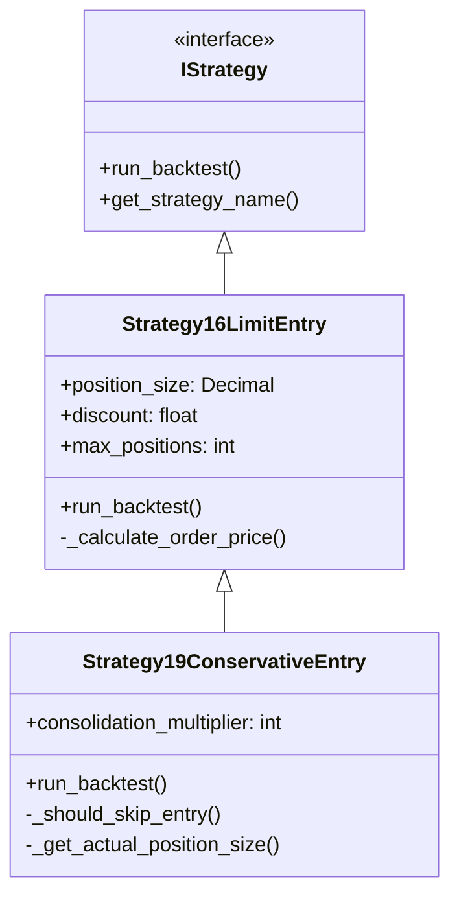
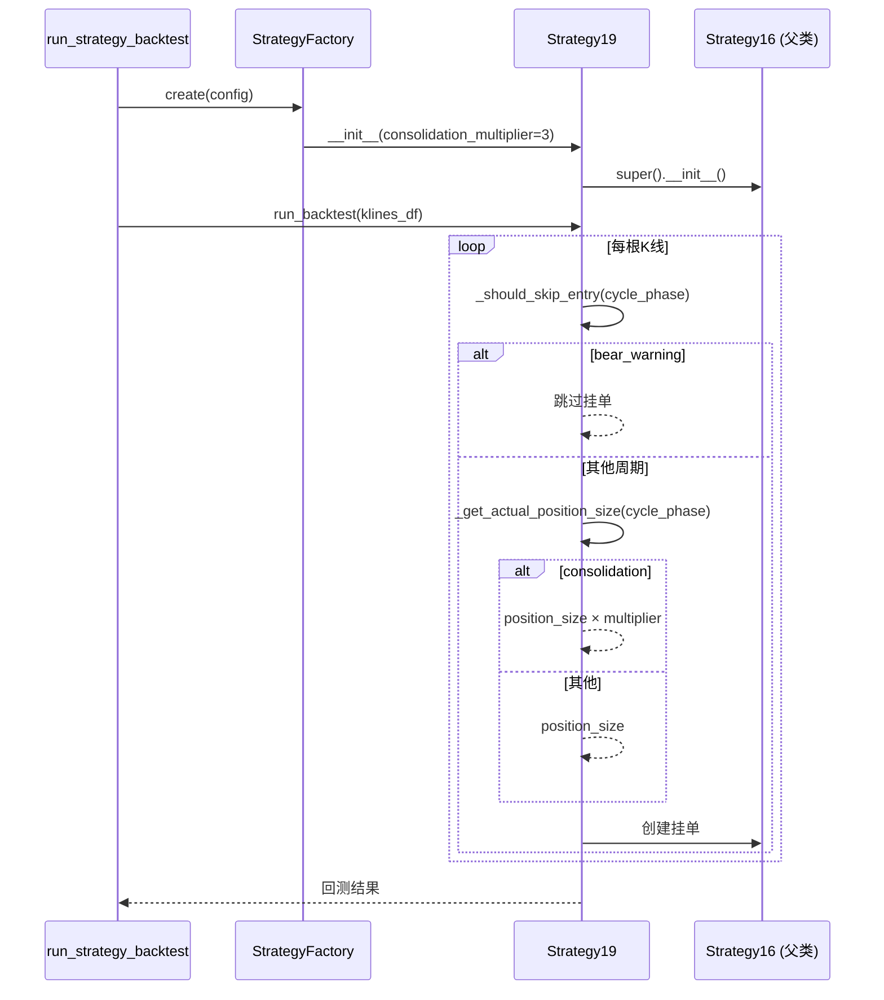

# 架构设计: 策略19-保守入场策略

## 文档信息

| 字段 | 值 |
|------|-----|
| 迭代编号 | 041 |
| 创建日期 | 2026-01-13 |

## 1. 架构概述

### 1.1 设计原则

- **继承复用**: 继承Strategy16LimitEntry，最小化代码改动
- **单一职责**: 只修改入场控制逻辑，保持止盈止损不变
- **配置化**: 新参数通过构造函数传入，支持CLI配置

### 1.2 组件图



## 2. 核心组件

### 2.1 Strategy19ConservativeEntry

**文件**: `strategy_adapter/strategies/strategy19_conservative_entry.py`

**职责**: 在策略16基础上增加保守入场控制

**新增属性**:
| 属性 | 类型 | 默认值 | 说明 |
|------|------|--------|------|
| consolidation_multiplier | int | 3 | 震荡期挂单倍数 |

**新增方法**:
| 方法 | 说明 |
|------|------|
| `_should_skip_entry(cycle_phase)` | 判断是否跳过入场 |
| `_get_actual_position_size(cycle_phase)` | 获取实际挂单金额 |

### 2.2 策略工厂扩展

**修改文件**: `strategy_adapter/core/strategy_factory.py`

**新增注册**:
```python
# 注册策略19: 保守入场策略 (迭代041)
try:
    from strategy_adapter.strategies import Strategy19ConservativeEntry
    StrategyFactory.register("strategy-19-conservative-entry", Strategy19ConservativeEntry)
except ImportError as e:
    logger.warning(f"无法注册策略19: {e}")
```

**工厂创建逻辑**:
```python
elif strategy_type == "strategy-19-conservative-entry":
    from strategy_adapter.strategies import Strategy19ConservativeEntry

    discount = float(config.entry.get("discount", 0.001))
    consolidation_multiplier = int(config.entry.get("consolidation_multiplier", 3))

    if position_size is None:
        position_size = Decimal(str(config.entry.get("position_size", 1000)))

    max_positions = int(config.entry.get("max_positions", 10))

    strategy = Strategy19ConservativeEntry(
        position_size=position_size,
        discount=discount,
        max_positions=max_positions,
        consolidation_multiplier=consolidation_multiplier
    )
```

## 3. 数据流



## 4. 关键决策

| 决策点 | 选择 | 理由 |
|--------|------|------|
| 实现方式 | 继承Strategy16 | 最小化代码改动，复用现有逻辑 |
| 参数命名 | consolidation_multiplier | 明确表示震荡期倍数 |
| 资金检查 | 使用实际金额检查 | 震荡期需检查3倍资金是否足够 |

## 5. 文件清单

| 文件 | 操作 | 说明 |
|------|------|------|
| `strategy_adapter/strategies/strategy19_conservative_entry.py` | 新增 | 策略19核心实现 |
| `strategy_adapter/strategies/__init__.py` | 修改 | 导出Strategy19 |
| `strategy_adapter/core/strategy_factory.py` | 修改 | 注册策略19 |

## Q-Gate 4 检查

- [x] 组件设计已完成
- [x] 数据流已明确
- [x] 关键决策已做出
- [x] 架构图已绘制

**Q-Gate 4 通过**: 可进入P5阶段
