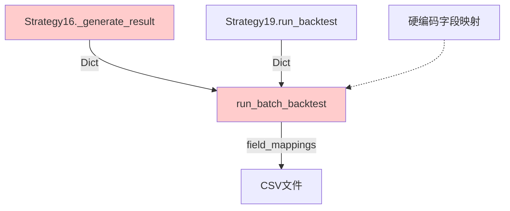
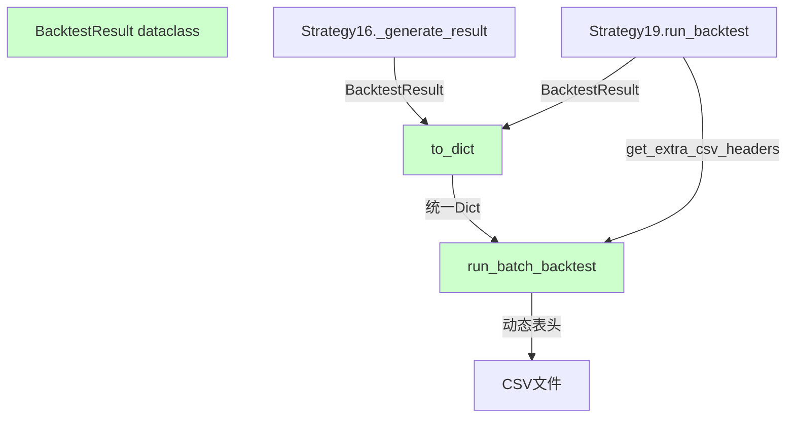
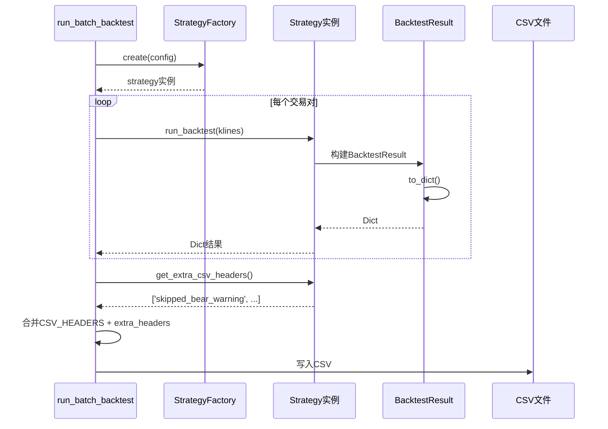

# 架构设计: 回测结果协议抽象

## 文档信息

| 字段 | 值 |
|------|-----|
| 迭代编号 | 042 |
| 创建日期 | 2026-01-13 |

## 1. 系统架构

### 1.1 当前架构



**问题**: 字段名不统一，命令层需要映射；扩展字段无标准方式处理。

### 1.2 目标架构



**改进**: 协议定义统一字段名；扩展字段通过标准方法声明。

## 2. 组件设计

### 2.1 BacktestResult数据类

```
文件: strategy_adapter/models/backtest_result.py
```

```python
from dataclasses import dataclass, field, asdict
from typing import Dict, List, Any

@dataclass
class BacktestResult:
    """
    回测结果标准数据结构

    所有策略的run_backtest方法应返回此类型（或通过to_dict转为Dict）。
    """

    # === 核心统计 ===
    total_orders: int = 0           # 总订单数（已平仓）
    winning_orders: int = 0         # 盈利订单数
    losing_orders: int = 0          # 亏损订单数
    open_positions: int = 0         # 持仓中订单数
    win_rate: float = 0.0           # 胜率 (%)
    net_profit: float = 0.0         # 净利润
    return_rate: float = 0.0        # 收益率 (%)

    # === 资金统计 ===
    initial_capital: float = 0.0    # 初始资金
    total_equity: float = 0.0       # 账户总值
    available_capital: float = 0.0  # 可用现金
    frozen_capital: float = 0.0     # 挂单冻结
    holding_cost: float = 0.0       # 持仓成本
    holding_value: float = 0.0      # 持仓市值
    holding_unrealized_pnl: float = 0.0  # 持仓浮盈浮亏

    # === 交易统计 ===
    total_volume: float = 0.0       # 总交易量
    total_commission: float = 0.0   # 总手续费
    last_close_price: float = 0.0   # 最后收盘价

    # === 年化指标 ===
    static_apr: float = 0.0         # 静态APR (%)
    weighted_apy: float = 0.0       # 综合APY (%)
    backtest_days: int = 0          # 回测天数
    start_date: str = ''            # 开始日期
    end_date: str = ''              # 结束日期

    # === 扩展字段 ===
    extra_stats: Dict[str, Any] = field(default_factory=dict)
    orders: List[Dict] = field(default_factory=list)

    def to_dict(self) -> Dict[str, Any]:
        """
        转换为字典格式

        - 保持向后兼容
        - 展开extra_stats到顶层
        - 添加兼容字段别名
        """
        result = asdict(self)

        # 展开extra_stats到顶层
        extra = result.pop('extra_stats', {})
        result.update(extra)

        # 添加兼容字段别名
        result['total_trades'] = result['total_orders']
        result['winning_trades'] = result['winning_orders']
        result['losing_trades'] = result['losing_orders']
        result['remaining_holdings'] = result['open_positions']
        result['total_profit_loss'] = result['net_profit']

        # 添加statistics嵌套（兼容旧代码）
        result['statistics'] = {
            'total_orders': result['total_orders'],
            'winning_orders': result['winning_orders'],
            'losing_orders': result['losing_orders'],
            'open_positions': result['open_positions'],
            'win_rate': result['win_rate'],
            'total_profit': result['net_profit'],
            'net_profit': result['net_profit'],
            'initial_capital': result['initial_capital'],
            'final_capital': result['total_equity'],
            'return_rate': result['return_rate'],
            'total_volume': result['total_volume'],
            'total_commission': result['total_commission'],
            'static_apr': result['static_apr'],
            'weighted_apy': result['weighted_apy'],
            'backtest_days': result['backtest_days'],
        }

        return result
```

### 2.2 IStrategy扩展

```
文件: strategy_adapter/interfaces/strategy.py
```

添加可选方法:

```python
def get_extra_csv_headers(self) -> List[str]:
    """
    返回策略特有的CSV表头（可选）

    子类可覆盖此方法声明额外的统计字段。
    这些字段应出现在BacktestResult.extra_stats中。

    Returns:
        List[str]: 额外的CSV列名

    Example:
        >>> class Strategy19(Strategy16):
        ...     def get_extra_csv_headers(self):
        ...         return ['skipped_bear_warning', 'consolidation_multiplier']
    """
    return []
```

### 2.3 run_batch_backtest修改

```
文件: strategy_adapter/management/commands/run_batch_backtest.py
```

修改点:
1. _run_single_backtest返回时保留策略实例
2. 动态获取extra_csv_headers
3. CSV写入时合并扩展字段

## 3. 数据流



## 4. 文件变更清单

| 文件 | 变更类型 | 描述 |
|------|----------|------|
| `strategy_adapter/models/backtest_result.py` | 新增 | BacktestResult数据类 |
| `strategy_adapter/models/__init__.py` | 修改 | 导出BacktestResult |
| `strategy_adapter/interfaces/strategy.py` | 修改 | 添加get_extra_csv_headers |
| `strategy_adapter/strategies/strategy16_limit_entry.py` | 修改 | 使用BacktestResult |
| `strategy_adapter/strategies/strategy19_conservative_entry.py` | 修改 | 实现扩展字段 |
| `strategy_adapter/management/commands/run_batch_backtest.py` | 修改 | 支持动态表头 |

## 5. 验收检查点

1. **BacktestResult可用**: 可正常导入和实例化
2. **Strategy16兼容**: 返回结果格式不变，现有命令正常
3. **Strategy19扩展**: extra_stats包含特有统计
4. **CSV输出**: 包含基础字段+扩展字段
5. **向后兼容**: 旧格式Dict仍可处理
