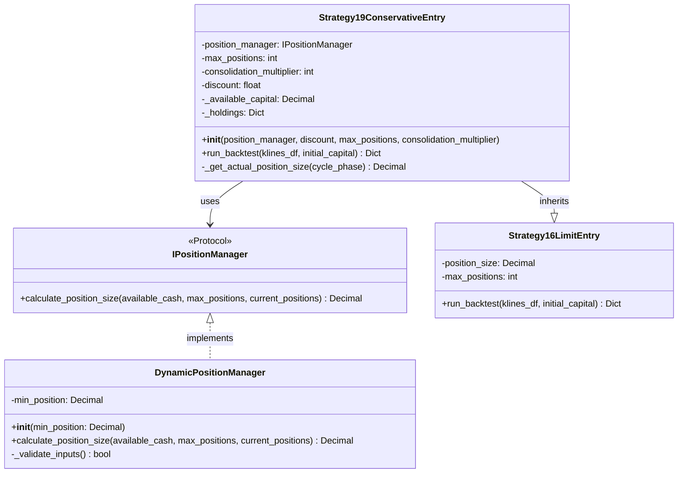
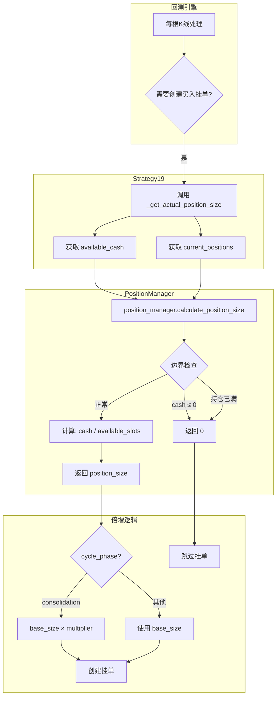

# 架构设计文档 - 迭代043：动态复利仓位管理

## 1. 需求解读与目标对齐

### 1.1 核心业务目标

解决当前策略固定仓位金额的两个痛点：
1. 盈利后资金闲置，无法充分利用复利效应
2. 亏损后仍使用固定金额，可能加速亏损

通过动态仓位计算公式 `单笔金额 = 可用现金 / (max_positions - 持仓数)` 实现：
- **复利效应**：盈利后可用现金增加 → 单笔金额自动增大
- **风控效应**：亏损后可用现金减少 → 单笔金额自动减小

### 1.2 关键用户流程

```
1. 策略初始化
   └── 注入 DynamicPositionManager（仓位管理器）
       └── 配置 max_positions = 10

2. 回测执行中（每根K线）
   └── 策略调用 position_manager.calculate_position_size()
       ├── 输入：available_cash, max_positions, current_positions
       └── 输出：单笔仓位金额（0 表示跳过挂单）

3. 边界处理
   ├── 可用现金 ≤ 0 → 返回 0，跳过挂单
   ├── 持仓已满 → 返回 0，跳过挂单
   └── 正常情况 → 返回计算结果

4. 震荡期倍增（Strategy19特有）
   └── 基础金额 × consolidation_multiplier
```

---

## 2. 架构设计与可视化

### 2.1 核心架构图



### 2.2 数据流图



### 2.3 概念解读

本架构采用**策略模式 + 依赖注入**设计，将仓位计算逻辑从策略类中解耦出来，形成独立的可插拔模块。核心是通过 `IPositionManager` 接口定义仓位计算契约，`DynamicPositionManager` 实现动态复利算法，Strategy19 通过构造函数注入使用。

### 2.4 组件职责

| 组件 | 职责 |
|------|------|
| **IPositionManager** | 仓位管理器接口协议，定义 `calculate_position_size` 方法签名，支持未来扩展不同仓位策略 |
| **DynamicPositionManager** | 动态复利仓位管理器实现，执行核心公式 `cash / (max - current)`，处理边界条件 |
| **Strategy19ConservativeEntry** | 保守入场策略，通过依赖注入使用仓位管理器，保留震荡期倍增逻辑 |

### 2.5 组件与需求映射

| 组件 | 负责实现的功能点 |
|------|------------------|
| **IPositionManager** | F01 IPositionManager接口定义 |
| **DynamicPositionManager** | F02 DynamicPositionManager实现, F03 边界条件处理 |
| **Strategy19ConservativeEntry** | F04 Strategy19仓位管理器集成, F05 移除固定position_size参数 |
| **测试模块** | F06 单元测试 |

### 2.6 交互说明

**主流程（每根K线）**：

1. **触发计算**：Strategy19 在创建买入挂单前调用 `_get_actual_position_size(cycle_phase)`

2. **委托计算**：方法内部调用 `position_manager.calculate_position_size()`，传入：
   - `available_cash`: 当前可用现金（`self._available_capital`）
   - `max_positions`: 最大持仓数（`self.max_positions`）
   - `current_positions`: 当前持仓数（`len(self._holdings)`）

3. **边界检查**：DynamicPositionManager 执行验证：
   - 可用现金 ≤ 0 → 返回 0
   - 持仓已满 → 返回 0
   - 通过验证 → 执行公式计算

4. **应用倍增**：Strategy19 根据 `cycle_phase` 决定是否应用 `consolidation_multiplier`

5. **结果使用**：返回 0 则跳过挂单，否则使用计算结果创建挂单

---

## 3. 关键决策点与方案评估

### 3.1 决策点一：文件组织方式

| 方案 | 简介 | 优点 | 缺点 |
|------|------|------|------|
| **方案A：独立新文件** ✅ | 创建 `strategy_adapter/core/position_manager.py` | 职责清晰、便于测试、符合单一职责 | 增加一个新文件 |
| 方案B：合并到现有文件 | 添加到 `__init__.py` 或策略文件 | 减少文件数量 | 违反单一职责、难以复用 |

**最终决策**：**方案A - 独立新文件**

---

### 3.2 决策点二：Strategy16是否同步修改

| 方案 | 简介 | 优点 | 缺点 |
|------|------|------|------|
| **方案A：仅修改Strategy19** ✅ | Strategy16保持不变 | 影响最小、风险可控 | 两策略仓位逻辑不一致 |
| 方案B：同时修改16和19 | 两者都使用仓位管理器 | 架构统一 | 影响范围大、需额外实现 |

**最终决策**：**方案A - 仅修改Strategy19**

---

### 3.3 决策点三：震荡期倍增逻辑位置

| 方案 | 简介 | 优点 | 缺点 |
|------|------|------|------|
| **方案A：保留在Strategy19** ✅ | 倍增逻辑留在策略中 | 最小改动、职责清晰 | 管理器不感知倍增 |
| 方案B：移入PositionManager | 创建带倍增的管理器 | 完全封装 | 增加复杂度、概念泄露 |

**最终决策**：**方案A - 保留在Strategy19中**

---

## 4. 文件结构

```
strategy_adapter/
├── core/
│   ├── __init__.py
│   ├── position_manager.py          # 新增：仓位管理器模块
│   │   ├── IPositionManager         # 接口协议
│   │   └── DynamicPositionManager   # 动态复利实现
│   └── ...
├── strategies/
│   ├── strategy16_limit_entry.py    # 不修改
│   └── strategy19_conservative_entry.py  # 修改：注入仓位管理器
└── tests/
    └── test_position_manager.py     # 新增：单元测试
```

---

## 5. 接口规范

### 5.1 IPositionManager 接口

```python
from typing import Protocol
from decimal import Decimal

class IPositionManager(Protocol):
    """仓位管理器接口协议"""

    def calculate_position_size(
        self,
        available_cash: Decimal,
        max_positions: int,
        current_positions: int
    ) -> Decimal:
        """
        计算单笔仓位金额

        Args:
            available_cash: 当前可用现金
            max_positions: 最大持仓数量
            current_positions: 当前持仓数量

        Returns:
            Decimal: 单笔仓位金额，0表示跳过挂单
        """
        ...
```

### 5.2 DynamicPositionManager 实现

```python
class DynamicPositionManager:
    """动态复利仓位管理器"""

    def __init__(self, min_position: Decimal = Decimal("0")):
        """
        Args:
            min_position: 最小仓位金额（可选），低于此值跳过挂单
        """
        self.min_position = min_position

    def calculate_position_size(
        self,
        available_cash: Decimal,
        max_positions: int,
        current_positions: int
    ) -> Decimal:
        """计算单笔仓位金额"""
        # 边界检查
        if available_cash <= 0:
            return Decimal("0")

        available_slots = max_positions - current_positions
        if available_slots <= 0:
            return Decimal("0")

        # 计算仓位
        position_size = available_cash / Decimal(str(available_slots))

        # 最小金额检查（可选）
        if self.min_position > 0 and position_size < self.min_position:
            return Decimal("0")

        return position_size
```

### 5.3 Strategy19 修改后的构造函数

```python
class Strategy19ConservativeEntry(Strategy16LimitEntry):
    def __init__(
        self,
        position_manager: IPositionManager,
        discount: float = 0.001,
        max_positions: int = 10,
        consolidation_multiplier: int = 3
    ):
        # 注意：不再调用 super().__init__() 传递 position_size
        self.position_manager = position_manager
        self.discount = Decimal(str(discount))
        self.max_positions = max_positions
        self.consolidation_multiplier = consolidation_multiplier
        # ... 其他初始化
```

---

## 6. 决策记录汇总

| 决策项 | 最终选择 | 理由 |
|--------|----------|------|
| 文件组织方式 | 独立新文件 `position_manager.py` | 职责清晰、便于复用、符合项目风格 |
| Strategy16修改 | 仅修改Strategy19 | MVP原则、最小影响范围 |
| 震荡期倍增位置 | 保留在Strategy19中 | 策略特有逻辑不泄露到通用模块 |

---

## 7. 文档信息

- **迭代编号**：043
- **创建日期**：2026-01-13
- **设计阶段**：P4 架构设计
- **关联文档**：
  - PRD: `docs/iterations/043-dynamic-position-manager/prd.md`
  - 功能点: `docs/iterations/043-dynamic-position-manager/function-points.md`
  - 澄清记录: `docs/iterations/043-dynamic-position-manager/clarifications.md`
