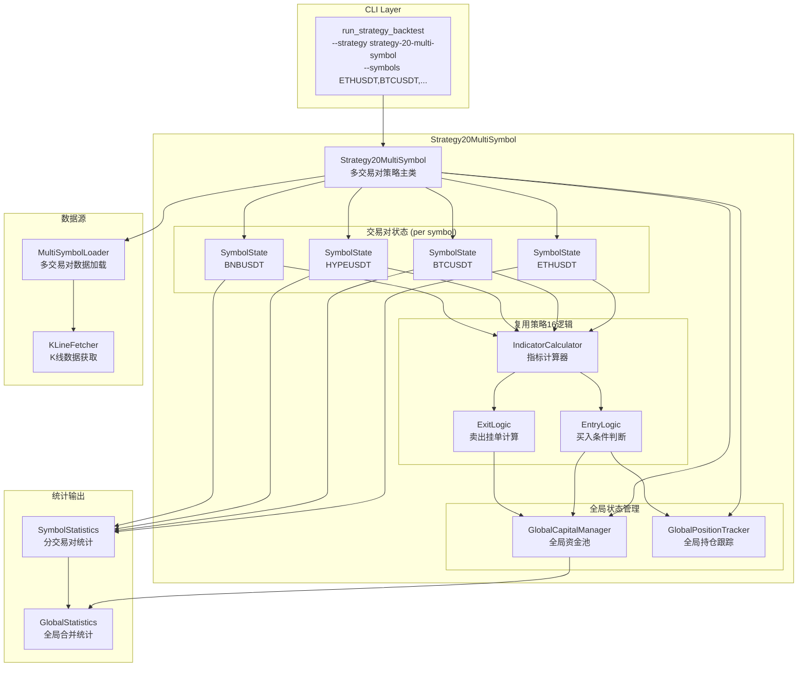
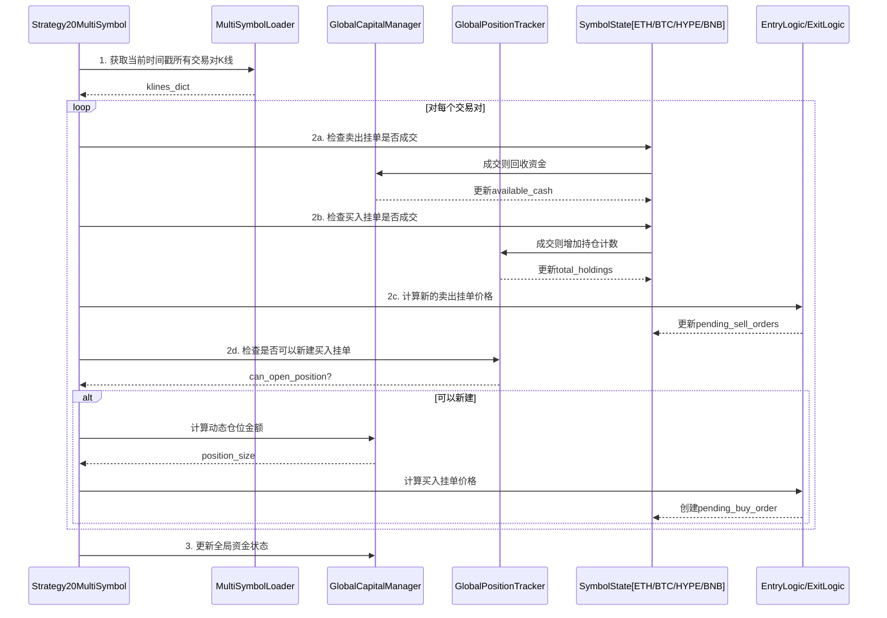

# 策略20 架构设计文档

## 1. 需求解读与目标对齐

### 1.1 核心业务目标

将现有的单交易对策略（策略16）扩展为多交易对共享资金池策略（策略20），使用户能够用一笔资金同时管理ETH、BTC、HYPE、BNB四个交易对的买卖，实现资金利用率最大化和风险分散。

### 1.2 关键用户流程

```
用户执行 run_strategy_backtest --strategy strategy-20-multi-symbol
                    ↓
    ┌───────────────────────────────────────┐
    │  1. 系统加载4个交易对的K线数据         │
    │     (ETHUSDT, BTCUSDT, HYPEUSDT, BNBUSDT) │
    └───────────────────────────────────────┘
                    ↓
    ┌───────────────────────────────────────┐
    │  2. 按时间戳逐K线处理：                │
    │     - 每个交易对独立计算买卖信号       │
    │     - 共享资金池约束下执行交易         │
    │     - 全局持仓数不超过10个             │
    └───────────────────────────────────────┘
                    ↓
    ┌───────────────────────────────────────┐
    │  3. 输出回测结果：                     │
    │     - 每个交易对独立统计               │
    │     - 全局合并统计（总收益/APR/回撤）  │
    └───────────────────────────────────────┘
```

### 1.3 核心约束

| 约束项 | 说明 |
|--------|------|
| 资金全局共享 | 4个交易对竞争同一资金池（如10000 USDT） |
| 持仓全局限制 | 合计最多10个持仓（非每交易对10个） |
| 仓位动态计算 | `单笔金额 = available_cash / (max_positions - total_holdings)` |
| 买卖逻辑复用 | 完全复用策略16的P5限价挂单入场 + 动态挂单止盈 |

---

## 2. 架构设计与可视化

### 2.1 核心架构图



### 2.2 概念解读

策略20采用**组合模式**架构：一个主策略类（Strategy20MultiSymbol）管理多个交易对状态（SymbolState），共享全局资金池和持仓限制，复用策略16的买卖逻辑。

### 2.3 组件职责

| 组件 | 职责 |
|------|------|
| **Strategy20MultiSymbol** | 策略主类，协调多交易对处理流程，管理回测生命周期 |
| **GlobalCapitalManager** | 全局资金池管理，跟踪available_cash、冻结资金、资金变动 |
| **GlobalPositionTracker** | 全局持仓跟踪，统计所有交易对持仓总数，执行持仓上限检查 |
| **SymbolState** | 单交易对状态容器，存储该交易对的挂单、持仓、已完成订单 |
| **IndicatorCalculator** | 指标计算器（复用现有），计算P5/EMA25/cycle_phase等 |
| **EntryLogic** | 买入条件判断（复用策略16），计算挂单价格，检查bear_warning |
| **ExitLogic** | 卖出挂单计算（复用策略16），根据cycle_phase计算止盈价 |
| **MultiSymbolLoader** | 多交易对数据加载器，加载并对齐多个交易对的K线数据 |
| **SymbolStatistics** | 分交易对统计，计算单个交易对的订单数/胜率/盈亏 |
| **GlobalStatistics** | 全局合并统计，计算总收益/APR/APY/最大回撤 |

### 2.4 组件与需求映射

| 组件 | 负责实现的功能点 |
|------|------------------|
| **Strategy20MultiSymbol** | F-018(策略工厂注册), F-019(CLI命令支持), F-020(symbols参数) |
| **MultiSymbolLoader** | F-001(多交易对K线加载), F-002(时间戳对齐), F-003(交易对配置) |
| **GlobalCapitalManager** | F-004(共享资金池), F-005(资金冻结/解冻), F-006(持仓价值跟踪) |
| **GlobalPositionTracker** | F-007(全局持仓计数), F-008(持仓上限控制), F-009(动态仓位计算) |
| **SymbolState + Logic** | F-010(指标独立计算), F-011(买入条件复用), F-012(卖出挂单复用), F-013(bear_warning跳过) |
| **Statistics** | F-014(分交易对统计), F-015(全局合并统计), F-016(最大回撤计算), F-017(订单列表输出) |

### 2.5 交互流程（单根K线处理）



---

## 3. 关键决策点与最终方案

### 3.1 决策点一：策略类实现方式

| 方案 | 描述 | 优点 | 缺点 |
|------|------|------|------|
| **A. 独立新类 ✓** | 创建全新的Strategy20MultiSymbol类 | 结构清晰，解耦，易维护 | 需要提取公共方法 |
| B. 继承策略16 | 继承Strategy16LimitEntry | 可复用父类方法 | 语义混乱，状态管理复杂 |

**最终决策**: 方案A - 独立新类

**理由**: 策略20的核心模型（多交易对+共享资金池）与策略16（单交易对）本质不同，继承会导致"is-a"语义错误。

---

### 3.2 决策点二：全局状态管理方式

| 方案 | 描述 | 优点 | 缺点 |
|------|------|------|------|
| A. 内嵌主类 | 作为实例变量 | 简单直接 | 主类职责过重 |
| **B. 独立管理类 ✓** | GlobalCapitalManager + GlobalPositionTracker | 职责单一，易测试 | 增加类数量 |
| C. 单一Manager | 合并为GlobalStateManager | 减少类数量 | 违背单一职责 |

**最终决策**: 方案B - 独立管理类

**理由**: 资金管理和持仓管理是两个独立关注点，分开更易于单元测试和后续扩展。

---

### 3.3 决策点三：买卖逻辑复用方式

| 方案 | 描述 | 优点 | 缺点 |
|------|------|------|------|
| **A. 静态工具函数 ✓** | 提取为独立工具函数 | 最大复用，易测试 | 小规模重构 |
| B. 复制代码 | 在策略20中复制 | 零改动现有代码 | 代码重复，维护成本高 |
| C. 基类继承 | 提取BaseP5Strategy | OOP标准 | 改动范围大 |

**最终决策**: 方案A - 静态工具函数

**理由**: 提取工具函数改动最小（仅新增文件），且策略16可选择性调用，保持向后兼容。

---

## 4. 详细设计

### 4.1 文件结构

```
strategy_adapter/
├── core/
│   ├── position_manager.py          # 已有
│   ├── global_capital_manager.py    # 新增：全局资金池管理
│   └── global_position_tracker.py   # 新增：全局持仓跟踪
├── utils/
│   └── entry_exit_logic.py          # 新增：提取的买卖逻辑工具函数
├── strategies/
│   ├── strategy16_limit_entry.py    # 已有（可选复用工具函数）
│   └── strategy20_multi_symbol.py   # 新增：多交易对策略
└── models.py                        # 已有（新增SymbolState）
```

### 4.2 核心类设计

#### 4.2.1 GlobalCapitalManager

```python
class GlobalCapitalManager:
    """全局资金池管理器"""

    def __init__(self, initial_capital: Decimal):
        self._total_capital = initial_capital
        self._available_cash = initial_capital
        self._frozen_cash = Decimal("0")

    @property
    def available_cash(self) -> Decimal:
        """可用资金"""
        return self._available_cash

    def freeze(self, amount: Decimal) -> bool:
        """冻结资金（挂单）"""
        if amount > self._available_cash:
            return False
        self._available_cash -= amount
        self._frozen_cash += amount
        return True

    def unfreeze(self, amount: Decimal):
        """解冻资金（取消挂单）"""
        self._frozen_cash -= amount
        self._available_cash += amount

    def settle(self, frozen_amount: Decimal, actual_amount: Decimal):
        """结算（挂单成交）"""
        self._frozen_cash -= frozen_amount
        # actual_amount可能与frozen_amount不同（盈亏）

    def add_profit(self, profit: Decimal):
        """增加收益（卖出成交）"""
        self._available_cash += profit
```

#### 4.2.2 GlobalPositionTracker

```python
class GlobalPositionTracker:
    """全局持仓跟踪器"""

    def __init__(self, max_positions: int = 10):
        self._max_positions = max_positions
        self._holdings: Dict[str, int] = {}  # symbol -> holding_count

    @property
    def total_holdings(self) -> int:
        """总持仓数"""
        return sum(self._holdings.values())

    def can_open_position(self) -> bool:
        """是否可以新建持仓"""
        return self.total_holdings < self._max_positions

    def add_holding(self, symbol: str):
        """增加持仓"""
        self._holdings[symbol] = self._holdings.get(symbol, 0) + 1

    def remove_holding(self, symbol: str):
        """减少持仓"""
        if symbol in self._holdings and self._holdings[symbol] > 0:
            self._holdings[symbol] -= 1

    def calculate_position_size(self, available_cash: Decimal) -> Decimal:
        """计算动态仓位金额"""
        remaining_slots = self._max_positions - self.total_holdings
        if remaining_slots <= 0:
            return Decimal("0")
        return available_cash / remaining_slots
```

#### 4.2.3 SymbolState

```python
@dataclass
class SymbolState:
    """单交易对状态"""
    symbol: str
    pending_buy_order: Optional[PendingOrder] = None
    pending_sell_orders: Dict[str, Dict] = field(default_factory=dict)
    holdings: Dict[str, Dict] = field(default_factory=dict)
    completed_orders: List[Dict] = field(default_factory=list)
    indicators_cache: Dict = field(default_factory=dict)

    # 统计
    total_orders: int = 0
    winning_orders: int = 0
    total_profit_loss: Decimal = Decimal("0")
```

#### 4.2.4 Strategy20MultiSymbol

```python
class Strategy20MultiSymbol(IStrategy):
    """策略20：多交易对共享资金池"""

    STRATEGY_ID = 'strategy_20'
    STRATEGY_NAME = '多交易对共享资金池'
    STRATEGY_VERSION = '1.0'

    DEFAULT_SYMBOLS = ['ETHUSDT', 'BTCUSDT', 'HYPEUSDT', 'BNBUSDT']

    def __init__(
        self,
        symbols: List[str] = None,
        discount: float = 0.001,
        max_positions: int = 10
    ):
        self.symbols = symbols or self.DEFAULT_SYMBOLS
        self.discount = Decimal(str(discount))

        # 全局管理器
        self._capital_manager: GlobalCapitalManager = None
        self._position_tracker: GlobalPositionTracker = None

        # 交易对状态
        self._symbol_states: Dict[str, SymbolState] = {}

    def run_backtest(
        self,
        klines_dict: Dict[str, pd.DataFrame],
        initial_capital: Decimal = Decimal("10000")
    ) -> Dict:
        """执行多交易对回测"""
        # 初始化
        self._capital_manager = GlobalCapitalManager(initial_capital)
        self._position_tracker = GlobalPositionTracker(self.max_positions)
        self._init_symbol_states()

        # 获取对齐的时间戳列表
        timestamps = self._get_aligned_timestamps(klines_dict)

        # 逐时间戳处理
        for ts in timestamps:
            self._process_timestamp(ts, klines_dict)

        # 生成结果
        return self._generate_result()
```

### 4.3 回测结果结构

```python
{
    "global": {
        "initial_capital": 10000.0,
        "final_capital": 11234.56,
        "total_return": 12.35,
        "total_return_rate": 0.1235,
        "total_orders": 45,
        "winning_orders": 28,
        "win_rate": 0.622,
        "max_drawdown": 0.08,
        "apr": 0.15,
        "apy": 0.16,
        "trading_days": 365
    },
    "by_symbol": {
        "ETHUSDT": {
            "orders": 15,
            "winning_orders": 10,
            "win_rate": 0.667,
            "profit_loss": 456.78,
            "current_holdings": 2
        },
        "BTCUSDT": {...},
        "HYPEUSDT": {...},
        "BNBUSDT": {...}
    },
    "orders": [
        {
            "order_id": "ETH_001",
            "symbol": "ETHUSDT",
            "buy_price": 3200.0,
            "sell_price": 3280.0,
            "quantity": 0.03125,
            "profit_loss": 2.5,
            "profit_rate": 0.025,
            "buy_timestamp": 1704067200000,
            "sell_timestamp": 1704153600000
        },
        ...
    ],
    "equity_curve": [
        {"timestamp": 1704067200000, "equity": 10000.0},
        {"timestamp": 1704081600000, "equity": 10025.0},
        ...
    ]
}
```

---

## 5. 验收标准

### 5.1 功能验收

- [ ] 4个交易对同时回测，资金池正确共享
- [ ] 全局持仓数不超过 max_positions (10)
- [ ] 每个交易对独立输出统计
- [ ] 合并汇总统计正确（总收益/APR/APY/最大回撤）
- [ ] run_strategy_backtest 命令正常执行

### 5.2 性能验收

- [ ] 4交易对1年4h数据回测 < 60秒
- [ ] 内存占用 < 2GB

### 5.3 兼容性验收

- [ ] 不影响现有策略16/19功能
- [ ] 与现有回测框架兼容

---

## 6. 迭代信息

| 项目 | 值 |
|------|-----|
| 迭代编号 | 045 |
| 迭代名称 | 策略20-多交易对共享资金池 |
| 架构设计日期 | 2026-01-14 |
| 基础策略 | 策略16 (v4.0) |
| 默认交易对 | ETHUSDT, BTCUSDT, HYPEUSDT, BNBUSDT |

### 架构决策记录

| 决策点 | 最终方案 | 理由 |
|--------|----------|------|
| 策略类实现 | 独立新类 | 语义清晰，避免继承混乱 |
| 状态管理 | 独立管理类 | 职责单一，易于测试扩展 |
| 逻辑复用 | 静态工具函数 | 改动最小，保持兼容 |
