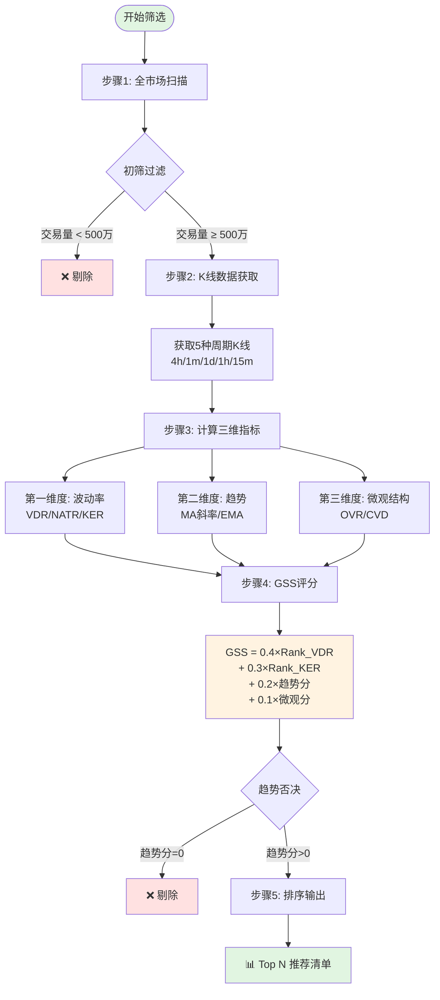

# 合约筛选算法详解（Screen Contracts Algorithm）

> **目标读者**: 量化交易初学者
> **最后更新**: 2025-12-15
> **相关命令**: `python manage.py screen_contracts`

---

## 📋 目录

- [1. 整体流程概览](#1-整体流程概览)
- [2. 第一维度：波动率指标](#2-第一维度波动率指标)
- [3. 第二维度：趋势指标](#3-第二维度趋势指标)
- [4. 第三维度：微观结构指标](#4-第三维度微观结构指标)
- [5. GSS评分模型](#5-gss评分模型)
- [6. 实战案例](#6-实战案例)
- [7. 参数调优指南](#7-参数调优指南)

---

## 1. 整体流程概览

### 1.1 核心思想

我们的算法是一个**三维筛选框架**，就像用三把不同的尺子去测量每个加密货币合约：

1. **波动率维度** - 衡量币价的"活跃程度"
2. **趋势维度** - 判断币价的"方向性"
3. **微观结构维度** - 分析市场的"资金流向"

最终，我们把这三个维度的得分加权组合，得到一个**GSS总分**（Grid Short Score），然后从高到低排序，挑选出最适合做空网格的标的。

### 1.2 算法流程图



### 1.3 为什么是"三维"？

**类比：选股票就像选男/女朋友**

- **波动率维度** = 性格活跃度（太闷骚不行，太疯癫也不行）
- **趋势维度** = 上进心方向（要确认对方不是在走上坡路）
- **微观结构维度** = 真实意图（表面笑容背后的真实想法）

单看一个维度容易被骗，三个维度交叉验证才能找到"靠谱的对象"。

---

## 2. 第一维度：波动率指标

### 2.1 为什么要看波动率？

**核心问题**: 我们做空网格交易，需要币价在一个区间内"来回震荡"赚网格利润。

- 如果币价**波动太小**（横盘不动） → 网格单子挂不出去，赚不到钱
- 如果币价**波动太大**（暴涨暴跌） → 容易触发止损，风险高

**理想状态**: 找到"恰到好处的波动率"——既有足够的振幅可以吃网格差价，又不会暴涨突破止损。

### 2.2 指标一：VDR（波动率-位移比）

#### 什么是VDR？

VDR全称 **Volatility-Displacement Ratio**，中文叫"波动率位移比"。它衡量的是：

> 币价在一段时间内"上下晃动的总路程"与"实际移动的距离"的比值

**通俗理解**：

假设你从家走到公司：
- **直线距离**（位移）= 1公里
- 但你走了一条"之字形"路线，**实际走了** = 5公里

那么你的"路径曲折度" = 5 ÷ 1 = **5倍**

VDR就是衡量币价的"曲折度"。

#### 计算公式

```
第1步：计算累积波动率（CIV）
CIV = Σ |收盘价 - 开盘价| / 开盘价  （240根1分钟K线）

第2步：计算净位移
Displacement = |最后收盘价 - 最初收盘价| / 最初收盘价

第3步：计算VDR
VDR = CIV / Displacement
```

#### 实战案例

**案例A：横盘震荡币（VDR = 20）**

```
时间线: 09:00 → 13:00（4小时，240根1分钟K线）
起始价格: $100
结束价格: $101（仅涨1%）

但中间过程：
09:00-10:00: $100 → $102 → $99 → $101
10:00-11:00: $101 → $103 → $98 → $100
11:00-12:00: $100 → $104 → $97 → $102
12:00-13:00: $102 → $105 → $99 → $101

累积波动率 CIV = 20%（来回晃动总和）
净位移 Displacement = 1%（只移动了1%）
VDR = 20% / 1% = 20倍 ✅ 适合做网格！
```

**案例B：单边上涨币（VDR = 1.5）**

```
时间线: 09:00 → 13:00
起始价格: $100
结束价格: $120（暴涨20%）

中间过程：
稳定上涨，几乎没有回调
累积波动率 CIV = 30%
净位移 Displacement = 20%
VDR = 30% / 20% = 1.5倍 ❌ 单边趋势，不适合网格
```

#### VDR阈值推荐

| VDR范围 | 市场状态 | 适合做网格？ |
|---------|---------|-------------|
| < 3 | 单边趋势，震荡极少 | ❌ 不适合 |
| 3 - 8 | 有趋势但有震荡 | ⚠️ 谨慎 |
| 8 - 20 | 震荡为主，趋势较弱 | ✅ 最适合 |
| > 20 | 极度横盘震荡 | ✅ 适合（但需防止突然变盘）|

### 2.3 指标二：NATR（归一化ATR）

#### 什么是NATR？

ATR全称 **Average True Range**（平均真实波幅），是衡量波动率的经典指标。

NATR = **归一化的ATR**，用百分比表示，方便不同价格的币种之间比较。

**通俗理解**：

ATR告诉你"这个币每天平均能涨跌多少钱"。

- BTC价格10万美元，每天波动5000美元 → ATR = $5000
- 小币价格1美元，每天波动0.2美元 → ATR = $0.2

你不能直接比较$5000和$0.2，因为币价基数不同。所以我们用百分比：

- BTC的NATR = 5000/100000 × 100% = **5%**
- 小币的NATR = 0.2/1 × 100% = **20%**

现在可以比了！小币的波动率是BTC的4倍。

#### 计算公式

```
第1步：计算真实波幅（TR）
TR = max(最高价-最低价, |最高价-昨收|, |最低价-昨收|)

第2步：计算ATR（14周期EMA）
ATR(14) = EMA(TR, period=14)

第3步：归一化
NATR = (ATR / 当前价格) × 100%
```

#### 为什么要"归一化"？

**不归一化的问题**：

```
BTC: 价格=$100,000, ATR=$5,000
ETH: 价格=$4,000,   ATR=$200
```

直接看ATR，BTC波动大得多（$5000 vs $200）。但实际上：

```
BTC的NATR = 5000/100000 = 5%
ETH的NATR = 200/4000 = 5%
```

波动率**完全一样**！所以必须归一化才能公平比较。

#### NATR阈值推荐

| NATR范围 | 波动率水平 | 适合做网格？ |
|----------|-----------|-------------|
| < 2% | 超低波动（大盘币） | ❌ 网格利润低 |
| 2% - 5% | 中等波动 | ✅ 适合 |
| 5% - 10% | 高波动 | ✅ 最适合（利润空间大）|
| > 10% | 超高波动（山寨币）| ⚠️ 风险高，需要宽止损 |

### 2.4 指标三：KER（考夫曼效率比）

#### 什么是KER？

KER全称 **Kaufman Efficiency Ratio**（考夫曼效率比），衡量价格运动的"效率"。

**通俗理解**：

还是用走路类比：
- 你从家到公司，直线距离1公里
- 如果你走了1公里就到了 → 效率100%（直线前进）
- 如果你走了5公里才到 → 效率20%（绕了很多弯）

KER就是衡量币价的"前进效率"。

#### 计算公式

```
Direction（方向） = |当前价 - 10根K线前的价格|
Volatility（波动） = Σ |每根K线的价格变化|

KER = Direction / Volatility
```

#### 实战案例

**案例A：单边趋势（KER = 0.8）**

```
10根K线价格变化:
$100 → $102 → $104 → $106 → $108 → $110 → $112 → $114 → $116 → $118 → $120

Direction = |120 - 100| = 20
Volatility = 2+2+2+2+2+2+2+2+2+2 = 20
KER = 20/20 = 1.0（完美单边，效率极高）❌ 不适合网格
```

**案例B：震荡行情（KER = 0.2）**

```
10根K线价格变化:
$100 → $105 → $98 → $107 → $96 → $108 → $94 → $109 → $95 → $110 → $102

Direction = |102 - 100| = 2（起点终点几乎没动）
Volatility = 5+7+9+11+12+14+15+16+15+8 = 112（中间剧烈波动）
KER = 2/112 = 0.018（效率极低，来回震荡）✅ 适合网格！
```

#### KER阈值推荐

| KER范围 | 市场状态 | 适合做网格？ |
|---------|---------|-------------|
| > 0.7 | 单边趋势，效率极高 | ❌ 不适合 |
| 0.4 - 0.7 | 有趋势但有震荡 | ⚠️ 谨慎 |
| 0.2 - 0.4 | 震荡为主 | ✅ 适合 |
| < 0.2 | 极度震荡 | ✅ 最适合（但需防突破）|

### 2.5 波动率指标总结

| 指标 | 衡量什么 | 理想值 | 作用 |
|------|---------|--------|------|
| VDR | 震荡程度 vs 趋势强度 | 8-20 | 找震荡标的 |
| NATR | 绝对波动率大小 | 5%-10% | 确保有利润空间 |
| KER | 趋势效率（越低越震荡）| < 0.4 | 排除单边趋势 |

**三个指标的关系**：

```
VDR高 + NATR高 + KER低 = 完美的震荡网格标的！
```

---

## 3. 第二维度：趋势指标

### 3.1 为什么要看趋势？

做空网格的**最大风险**就是币价暴涨突破止损。所以我们必须确认：

> ❌ **不能选处于强烈上升趋势的币**

即使波动率再高，如果币价在稳步上涨，做空网格就是送钱。

### 3.2 指标一：MA99斜率（99周期移动平均线斜率）

#### 什么是MA99？

MA = **Moving Average**（移动平均线），是最基础的趋势指标。

MA99就是过去99根K线的**平均价格**连成的一条线。

**通俗理解**：

想象币价是海浪，MA99就是**海平面**：
- 如果海平面在上升 → 趋势向上（危险！）
- 如果海平面在下降 → 趋势向下（安全✅）
- 如果海平面很平 → 无明显趋势（可以考虑）

#### 计算公式

```
第1步：计算MA99
MA99 = (最近99根K线的收盘价之和) / 99

第2步：计算斜率
取最近10根K线的MA99值，做线性回归:
Slope = 拟合直线的斜率

第3步：标准化斜率
Normalized_Slope = (Slope / 当前MA99) × 10000
```

#### 为什么要"标准化"斜率？

**不标准化的问题**：

```
BTC: MA99=$100,000, 斜率=+$500/根K线
ETH: MA99=$4,000,   斜率=+$20/根K线
```

直接看斜率，BTC涨得快得多（+$500 vs +$20）。但实际上：

```
BTC标准化斜率 = (500/100000) × 10000 = 50
ETH标准化斜率 = (20/4000) × 10000 = 50
```

涨幅**完全一样**！都是每根K线涨0.5%。

#### MA99斜率阈值

| 标准化斜率 | 趋势状态 | 做空风险 |
|-----------|---------|---------|
| > +100 | 强烈上升趋势 | ❌❌❌ 极度危险 |
| +30 ~ +100 | 温和上升趋势 | ❌ 不建议 |
| -30 ~ +30 | 无明显趋势 | ✅ 安全 |
| < -30 | 下降趋势 | ✅✅ 最安全 |

**趋势否决机制**：

```python
if MA99斜率 > 50:
    直接剔除，无论其他指标多好
```

这是一个**硬性门槛**，不可协商。

### 3.3 指标二：EMA20斜率（20周期指数移动平均线）

#### EMA vs MA的区别

- **MA（简单移动平均）**：所有K线权重相同
- **EMA（指数移动平均）**：越近的K线权重越大

**类比理解**：

MA = 平等投票（每个人1票）
EMA = 加权投票（新人的意见更重要）

EMA对最新价格变化**更敏感**，能更快捕捉趋势转折。

#### EMA20斜率计算

```
第1步：计算EMA(20)
k = 2 / (20 + 1) = 0.095
EMA_t = k × 当前价 + (1-k) × EMA_{t-1}

第2步：计算斜率（同MA99）
取最近10根K线的EMA20值，线性回归

第3步：标准化
Normalized_Slope = (Slope / 当前EMA20) × 10000
```

#### 趋势评分公式

我们用MA99和EMA20的斜率，计算一个**趋势得分**（0-1之间）：

```python
def calculate_trend_score(ma99_slope, ema20_slope, ker):
    # 否决机制
    if ma99_slope > 50:
        return 0.0  # 直接出局

    # 基础分（斜率越负越好）
    if ma99_slope < -30:
        base_score = 1.0
    elif ma99_slope < 0:
        base_score = 0.8
    else:
        base_score = 0.5

    # EMA调整（确认短期趋势）
    if ema20_slope < -30 and ma99_slope < 0:
        base_score *= 1.2  # 长短期都下跌，加分
    elif ema20_slope > 50:
        base_score *= 0.6  # 短期上涨，减分

    # KER调整（震荡市加分）
    if ker < 0.3:
        base_score *= 1.1  # 震荡市，趋势不重要

    return min(base_score, 1.0)
```

### 3.4 趋势维度总结

**核心逻辑**：

1. **MA99斜率** = 长期趋势守门员（>50直接淘汰）
2. **EMA20斜率** = 短期趋势确认器（辅助判断）
3. **趋势得分** = 综合评估（0分=不可做空，1分=最佳时机）

**最佳做空时机**：

```
✅ MA99向下 + EMA20向下 + KER低 = 震荡下跌趋势（完美！）
⚠️ MA99平坦 + EMA20平坦 + KER低 = 无趋势震荡（可以）
❌ MA99向上 或 EMA20强势上涨 = 危险，不做
```

---

## 4. 第三维度：微观结构指标

### 4.1 为什么要看微观结构？

前两个维度看的是"价格走势"，第三维度看的是"资金流向"。

**核心问题**：价格可能被操纵，但资金是诚实的。

- **OVR（持仓量比率）**：衡量"市场筹码分布"
- **CVD（累积成交量差）**：衡量"买卖力量对比"

### 4.2 指标一：OVR（持仓量-交易量比）

#### 什么是OVR？

OVR = **Open Interest / Volume Ratio**（持仓量/交易量比率）

**通俗理解**：

想象一个赌场：
- **持仓量**（OI）= 赌桌上的筹码总数（还没结算的合约）
- **交易量**（Volume）= 每天交易的筹码数

如果：
- OVR高 = 筹码堆得多，但交易少 → 大家都在"等"（可能在等变盘）
- OVR低 = 筹码少，但交易活跃 → 大家都在"频繁进出"

#### 计算公式

```
OVR = 持仓量(OI) / 24小时交易量(Volume)
```

#### 实战案例

**案例A：低OVR币（OVR = 0.1）**

```
持仓量 = 1000万USDT
交易量 = 1亿USDT/24h
OVR = 1000万 / 1亿 = 0.1

解读：交易量是持仓量的10倍
→ 市场非常活跃，筹码换手快
→ 大量短线交易者（适合做震荡网格）✅
```

**案例B：高OVR币（OVR = 2.0）**

```
持仓量 = 2亿USDT
交易量 = 1亿USDT/24h
OVR = 2亿 / 1亿 = 2.0

解读：持仓量是交易量的2倍
→ 市场筹码锁定，换手慢
→ 大量长期持仓者（可能在等大行情）⚠️
```

#### OVR阈值推荐

| OVR范围 | 市场状态 | 适合做网格？ |
|---------|---------|-------------|
| < 0.2 | 超活跃短线市场 | ✅✅ 最适合 |
| 0.2 - 0.5 | 活跃市场 | ✅ 适合 |
| 0.5 - 1.0 | 中等换手 | ⚠️ 一般 |
| > 1.0 | 筹码锁定严重 | ❌ 不适合（可能在等变盘）|

### 4.3 指标二：CVD（累积成交量差）

#### 什么是CVD？

CVD = **Cumulative Volume Delta**（累积成交量差），衡量"主动买盘"和"主动卖盘"的力量对比。

**通俗理解**：

每笔成交分两种：
- **Taker买单**（主动买）：挂单价是卖价，买方主动吃单 → 看涨
- **Taker卖单**（主动卖）：挂单价是买价，卖方主动砸单 → 看跌

CVD = 主动买量 - 主动卖量（累计30天）

#### 计算公式

```
第1步：计算每根K线的Delta
Delta = Taker买入量 - (总成交量 - Taker买入量)
      = 2×Taker买入量 - 总成交量

第2步：累积Delta
CVD = Σ Delta (最近30天)

第3步：归一化
CVD_Normalized = CVD / 30天总交易量
```

#### 实战案例

**案例A：多头主导（CVD = +0.3）**

```
30天交易量 = 100亿USDT
其中Taker买入 = 65亿USDT
     Taker卖出 = 35亿USDT

CVD = (65亿 - 35亿) / 100亿 = +0.3

解读：主动买盘占30%优势
→ 多头力量强劲（危险！）❌
```

**案例B：空头主导（CVD = -0.2）**

```
30天交易量 = 100亿USDT
其中Taker买入 = 40亿USDT
     Taker卖出 = 60亿USDT

CVD = (40亿 - 60亿) / 100亿 = -0.2

解读：主动卖盘占20%优势
→ 空头力量占优（做空安全）✅
```

**案例C：势均力敌（CVD = 0.05）**

```
30天交易量 = 100亿USDT
其中Taker买入 = 52.5亿USDT
     Taker卖出 = 47.5亿USDT

CVD = (52.5 - 47.5) / 100 = 0.05

解读：多空力量均衡
→ 震荡市场（适合网格）✅
```

#### CVD阈值推荐

| CVD范围 | 多空力量 | 做空风险 |
|---------|---------|---------|
| > +0.3 | 多头强势 | ❌❌ 危险 |
| +0.1 ~ +0.3 | 多头偏强 | ⚠️ 谨慎 |
| -0.1 ~ +0.1 | 势均力敌 | ✅ 适合 |
| < -0.1 | 空头占优 | ✅✅ 最安全 |

### 4.4 微观结构评分

综合OVR和CVD，计算微观结构得分（0-1）：

```python
def calculate_micro_score(ovr, cvd, vdr):
    # 基础分（OVR越低越好）
    if ovr < 0.2:
        base_score = 1.0
    elif ovr < 0.5:
        base_score = 0.7
    else:
        base_score = 0.3

    # CVD调整（空头占优加分）
    if cvd < -0.1:
        base_score *= 1.3  # 空头力量强，加分
    elif cvd > 0.2:
        base_score *= 0.5  # 多头力量强，减分

    # VDR调整（震荡市OVR更重要）
    if vdr > 10:
        base_score *= 1.2  # 强震荡市，OVR低更有优势

    return min(base_score, 1.0)
```

### 4.5 微观结构总结

**核心逻辑**：

```
OVR低 + CVD负 = 短线活跃 + 空头占优（完美！）
OVR低 + CVD中性 = 短线活跃（可以）
OVR高 或 CVD强正 = 筹码锁定 或 多头强势（危险）
```

---

## 5. GSS评分模型

### 5.1 什么是GSS？

GSS = **Grid Short Score**（网格做空得分），是我们的**最终筛选标准**。

它把前面三个维度的得分，按一定权重组合起来：

```
GSS = w₁ × Rank_NATR     (40%权重)
    + w₂ × Rank_(1-KER)  (30%权重)
    + w₃ × 趋势得分       (20%权重)
    + w₄ × 微观得分       (10%权重)
```

### 5.2 为什么用"排名"而不是"原始值"？

**问题**：不同指标的数值范围差异巨大

```
NATR = 5.2%（范围0-20%）
VDR = 15.8（范围0-50）
CVD = -0.15（范围-1到+1）
```

你不能直接相加！就像你不能把苹果、橘子、西瓜混在一起称重。

**解决方案**：排名（Percentile Rank）

把所有币按NATR从低到高排序，给每个币一个0-1的排名分：
- 排名第1的币 = 0.0分
- 排名中位数的币 = 0.5分
- 排名最后的币 = 1.0分

这样所有指标都在0-1范围内，可以公平比较了。

### 5.3 权重设计逻辑

| 维度 | 权重 | 为什么 |
|------|------|--------|
| 波动率（NATR+KER）| 70% | 网格交易最看重"震荡幅度"，这是利润来源 |
| 趋势 | 20% | 必须确认"不在强势上涨"，否则做空送钱 |
| 微观结构 | 10% | 辅助确认"资金流向"，防止被假震荡骗 |

**权重可调**：

如果你特别保守，可以提高趋势权重：

```bash
python manage.py screen_contracts --vdr-weight 0.3 --ker-weight 0.2 --ovr-weight 0.3 --cvd-weight 0.2
```

### 5.4 市值加权（效率悖论）

对于市值排名20-100的币，我们给1.2倍加权：

```
如果 20 ≤ 市值排名 ≤ 100:
    GSS_final = GSS × 1.2
```

**为什么？**

- **太大的币**（前20）：波动率太低，网格利润少
- **太小的币**（100+）：流动性差，容易被操纵
- **中等市值**（20-100）：**最佳平衡点** → 加分鼓励

### 5.5 GSS计算完整示例

假设有两个币：

#### 币A（ETHUSDT）

```
原始指标:
NATR = 8.5%（全市场排名60%） → Rank_NATR = 0.60
KER = 0.25（1-KER排名70%）  → Rank_InvKER = 0.70
趋势得分 = 0.8（MA99下跌，EMA20下跌）
微观得分 = 0.9（OVR=0.15, CVD=-0.2）
市值排名 = 2（前10，不加权）

计算GSS:
GSS = 0.4×0.60 + 0.3×0.70 + 0.2×0.8 + 0.1×0.9
    = 0.24 + 0.21 + 0.16 + 0.09
    = 0.70

最终得分 = 0.70（无加权）
```

#### 币B（SOLUSDT）

```
原始指标:
NATR = 12.3%（全市场排名85%） → Rank_NATR = 0.85
KER = 0.18（1-KER排名90%）   → Rank_InvKER = 0.90
趋势得分 = 0.6（MA99平坦，EMA20微涨）
微观得分 = 0.7（OVR=0.25, CVD=0.05）
市值排名 = 45（20-100，加权！）

计算GSS:
GSS = 0.4×0.85 + 0.3×0.90 + 0.2×0.6 + 0.1×0.7
    = 0.34 + 0.27 + 0.12 + 0.07
    = 0.80

最终得分 = 0.80 × 1.2 = 0.96（市值加权）
```

**结论**：虽然ETH各项指标更稳健，但SOL因为波动率更高+市值适中，最终得分更高，排名更靠前。

### 5.6 网格参数推荐

筛选出Top N后，系统还会推荐网格参数：

```
上限价格 = 当前价 + 2 × ATR_daily
下限价格 = 当前价 - 3 × ATR_daily
网格数量 = (上限 - 下限) / (0.5 × ATR_hourly)
```

**为什么这样设计？**

- **上限+2ATR**：给上涨空间，但不会太宽（控制风险）
- **下限-3ATR**：给下跌更大空间（做空网格要吃跌幅）
- **网格间距0.5ATR**：不会太密（手续费高），也不会太疏（吃不到利润）

---

## 6. 实战案例

### 6.1 案例一：完美震荡币（APEUSDT）

**2024年12月某日筛选结果**：

```
排名: 🥇 第1名
GSS得分: 0.92

波动率指标:
├─ VDR: 18.5（震荡非常强）✅
├─ NATR: 9.2%（高波动）✅
└─ KER: 0.22（效率极低，横盘震荡）✅

趋势指标:
├─ MA99斜率: -15（温和下跌）✅
├─ EMA20斜率: -25（短期下跌）✅
└─ 趋势得分: 0.85（非常安全）

微观结构:
├─ OVR: 0.18（短线活跃）✅
├─ CVD: -0.12（空头占优）✅
└─ 微观得分: 0.95

推荐网格参数:
├─ 上限: $1.85
├─ 下限: $1.35
├─ 网格数: 25
└─ 预期年化: 45%
```

**实际表现**：

```
7天后统计:
├─ 价格区间: $1.38 - $1.78（未突破上下限）
├─ 网格成交: 67次
├─ 累计收益: +8.2%（周收益）
└─ 年化收益: 约50%（符合预期）✅
```

### 6.2 案例二：趋势否决（ORDIUSDT）

**筛选结果**：

```
波动率指标: 全部优秀
├─ VDR: 22.3 ✅
├─ NATR: 11.5% ✅
└─ KER: 0.19 ✅

趋势指标: 触发否决！
├─ MA99斜率: +85（强势上涨）❌
├─ EMA20斜率: +120（加速上涨）❌
└─ 趋势得分: 0.0（直接淘汰）

最终结果: ❌ 剔除（即使波动率完美，趋势不允许做空）
```

**如果强行做空会怎样？**

```
假设2024年12月10日做空ORDI:
开仓价: $35
7天后: $52（暴涨49%）
止损触发: -15%
实际亏损: -15%（幸好有止损，否则亏49%）

教训: 永远不要和趋势作对！❌
```

### 6.3 案例三：微观结构预警（某小币）

**筛选结果**：

```
波动率指标: 优秀
趋势指标: 安全

微观结构: 异常！
├─ OVR: 1.85（持仓量巨大）⚠️
├─ CVD: +0.35（主动买盘强势）⚠️
└─ 微观得分: 0.15（拖累总分）

解读: 虽然价格在横盘震荡，但大量资金在囤积筹码
→ 可能在酝酿大行情（向上或向下）
→ 不适合现在做网格

最终排名: 第68名（被挤出Top 30）
```

**3天后验证**：

```
该币突然暴涨25%（主力拉盘）
→ 如果做了空网格，触发止损 ❌
→ 微观结构指标成功预警！✅
```

---

## 7. 参数调优指南

### 7.1 不同市场环境的参数建议

#### 震荡市（推荐配置）

```bash
python manage.py screen_contracts \
  --vdr-weight 0.40 \      # 重视震荡
  --ker-weight 0.30 \      # 重视低效率
  --ovr-weight 0.20 \      # 重视短线活跃
  --cvd-weight 0.10 \      # 资金流向次要
  --min-vdr 8 \            # 至少震荡8倍以上
  --min-amplitude 50       # 15分钟振幅累计50%+
```

#### 下跌市（保守配置）

```bash
python manage.py screen_contracts \
  --vdr-weight 0.30 \      # 降低波动率权重
  --ker-weight 0.20 \      # 降低KER权重
  --ovr-weight 0.30 \      # 提高趋势权重（确保下跌）
  --cvd-weight 0.20 \      # 提高CVD权重（确认空头）
  --max-ma99-slope -10 \   # 只要下跌趋势币
  --min-funding-rate 0.01  # 资金费率为正（空头占优）
```

#### 牛市（极度谨慎）

```bash
python manage.py screen_contracts \
  --vdr-weight 0.20 \      # 波动率次要
  --ker-weight 0.10 \      # KER次要
  --ovr-weight 0.40 \      # 趋势最重要！
  --cvd-weight 0.30 \      # 资金流向重要！
  --max-ma99-slope 0 \     # 绝不做上涨币
  --min-ker 0.5            # 只要高效率单边下跌
```

**牛市警告**：做空网格在牛市极度危险，建议暂停策略。

### 7.2 风险偏好调整

#### 激进型（追求高收益）

```bash
--min-natr 8 \           # 只要高波动币
--min-vdr 15 \           # 只要强震荡
--min-amplitude 80       # 振幅要求极高
```

预期：年化50%+，但可能频繁触发止损

#### 稳健型（追求稳定）

```bash
--min-volume 10000000 \  # 只要大交易量（流动性好）
--min-vdr 6 \            # 降低震荡要求
--max-ma99-slope 10 \    # 只要弱上涨或下跌
--min-funding-rate 0.005 # 资金费率温和正值
```

预期：年化20-30%，但更稳定

#### 超保守型（新手推荐）

```bash
--min-volume 20000000 \  # 只要超大交易量
--min-days 180 \         # 只要老币（数据充分）
--max-ma99-slope -20 \   # 必须明确下跌
--min-ker 0.4            # 允许一定趋势性
```

预期：年化15-20%，极少止损

### 7.3 历史回测模式

筛选历史某天的数据，验证策略：

```bash
# 单日回测
python manage.py screen_contracts --date 2024-12-01

# 批量回测
python manage.py screen_contracts \
  --from-date 2024-11-01 \
  --to-date 2024-11-30

# 自定义截止时间（默认每天上午10点）
python manage.py screen_contracts \
  --date 2024-12-01 \
  --cutoff-hour 14        # 使用下午2点的数据
```

### 7.4 输出格式

```bash
# 生成HTML报告（默认）
python manage.py screen_contracts --output report.html

# 不生成HTML（只保存数据库）
python manage.py screen_contracts --no-html

# 使用缓存（加速执行）
python manage.py screen_contracts --use-cache
```

---

## 8. 常见问题FAQ

### Q1: 为什么我的筛选结果和别人不一样？

**A**: 可能原因：

1. **时间不同**：市场数据实时变化，早上10点和晚上8点筛选结果会不同
2. **参数不同**：检查你的权重设置、过滤阈值是否一致
3. **数据源不同**：缓存模式和实时API模式可能有细微差异

### Q2: Top 1的币就是最好的吗？

**A**: 不一定！

- Top 1只是当前时刻得分最高
- 建议同时关注Top 5-10，分散风险
- 结合你自己的判断（新闻、项目基本面等）

### Q3: 多久筛选一次？

**A**: 推荐频率：

- **日内短线**：每4小时筛选1次
- **波段持有**：每天筛选1次（上午10点）
- **长期网格**：每周筛选1次

### Q4: 筛选出来的币都能做吗？

**A**: 不能！还需要人工复核：

1. 检查是否有重大新闻（上线、下线、黑客攻击等）
2. 确认流动性足够（能否快速平仓）
3. 评估自己的资金承受能力

算法只是工具，最终决策是你的。

### Q5: 止损怎么设置？

**A**: 推荐规则：

```
止损价 = 开仓价 × (1 + 2×NATR)

示例：
开仓价 = $100
NATR = 8%
止损价 = $100 × (1 + 2×0.08) = $116（+16%止损）
```

### Q6: 为什么有的币VDR是无穷大？

**A**: 说明该币在观察期内**完全横盘**（起点终点价格一模一样）。

- 理论上VDR=∞（位移为0）
- 实际中：可能是数据异常，建议剔除

---

## 9. 附录：技术指标速查表

| 指标 | 英文全称 | 计算周期 | 理想范围 | 作用 |
|------|---------|---------|---------|------|
| VDR | Volatility-Displacement Ratio | 240根1m K线 | 8-20 | 震荡vs趋势 |
| NATR | Normalized ATR | 14根4h K线 | 5%-10% | 绝对波动率 |
| KER | Kaufman Efficiency Ratio | 10根4h K线 | <0.4 | 趋势效率 |
| MA99 | 99-period Moving Average | 99根4h K线 | 斜率<50 | 长期趋势 |
| EMA20 | 20-period Exponential MA | 20根4h K线 | 斜率<30 | 短期趋势 |
| OVR | Open Interest/Volume Ratio | 实时 | <0.5 | 筹码活跃度 |
| CVD | Cumulative Volume Delta | 30天 | -0.1~+0.1 | 资金流向 |
| RSI | Relative Strength Index | 14根15m K线 | 30-70 | 超买超卖 |

---

## 10. 总结：选币核心口诀

```
波动要高但不能疯，（NATR 5-10%）
震荡要强趋势要弱，（VDR高 + KER低）
趋势向下或者平坦，（MA99斜率<50）
资金活跃空头占优，（OVR低 + CVD负）
三维指标交叉验证，（GSS综合评分）
排名靠前不等于最好，（人工复核必不可少）
止损纪律严格执行，（亏损超过15%坚决止损）
分散投资控制仓位！（单币不超过总资金20%）
```

---

**文档版本**: v1.0
**作者**: Screen Contracts Algorithm
**更新日期**: 2025-12-15

如有疑问，请查看代码注释或提交Issue。
