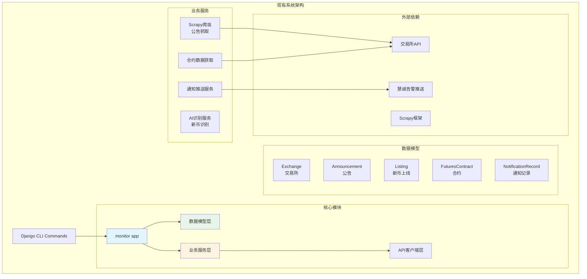
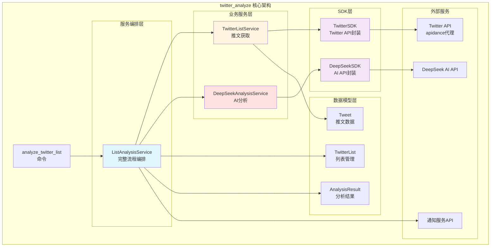
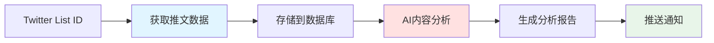
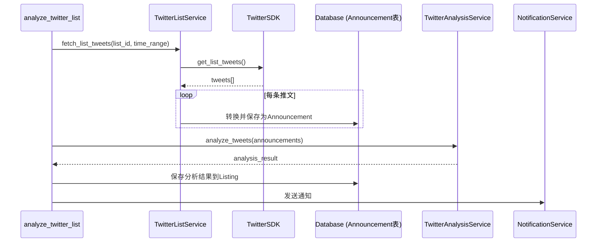
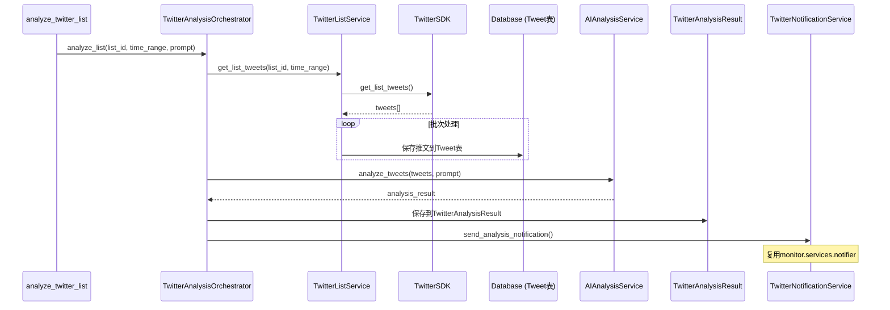
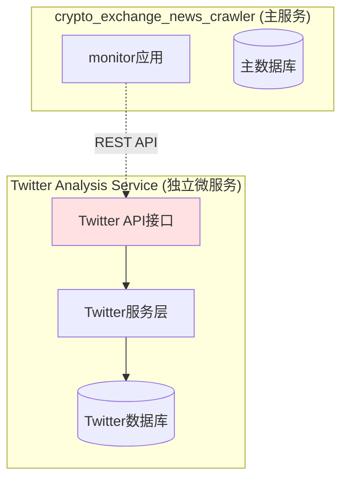

# Twitter 分析功能集成方案

**文档版本**: v1.0
**创建时间**: 2025-11-13
**状态**: 待审批

---

## A. 现状分析 (Current State)

### 1. crypto_exchange_news_crawler 项目架构



### 2. twitter_analyze 项目核心设计



### 3. 现有数据模型对比

| crypto_exchange_news_crawler | twitter_analyze | 功能对比 |
|-------------------------------|-----------------|----------|
| Exchange (交易所) | - | 数据源管理 |
| Announcement (公告) | Tweet (推文) | 原始内容 |
| Listing (新币上线) | AnalysisResult (分析结果) | 识别/分析结果 |
| NotificationRecord (通知记录) | 内置通知服务 | 通知管理 |
| - | TwitterList (Twitter列表) | **缺失：数据源管理** |
| - | TwitterUser (用户) | **缺失：用户管理** |

---

## B. 深度分析 (Your Analysis)

### 1. 核心需求拆解

从需求"从 Twitter List 获取并存储推文，结合 AI 分析"可以拆解为以下核心功能：



### 2. 关键挑战识别

#### 挑战 1: 架构集成复杂度
- **问题**: 两个项目的架构风格和依赖体系不同
  - `crypto_exchange_news_crawler`: Scrapy框架 + REST API客户端
  - `twitter_analyze`: Twitter GraphQL API + DeepSeek AI

- **影响**:
  - 代码复用困难
  - 依赖冲突风险
  - 维护成本增加

#### 挑战 2: 数据模型差异
- **问题**:
  - `crypto_exchange_news_crawler` 使用 `Announcement` 模型表示内容
  - `twitter_analyze` 使用 `Tweet` 模型表示内容
  - 两者字段结构不同，关联关系不同

- **影响**:
  - 需要决策是否复用现有模型还是创建新模型
  - 数据迁移和兼容性问题

#### 挑战 3: AI 服务差异
- **问题**:
  - `crypto_exchange_news_crawler` 使用简单的AI识别服务（识别新币）
  - `twitter_analyze` 使用复杂的DeepSeek AI分析（生成结构化报告）

- **影响**:
  - AI服务能力差异大
  - 成本控制和监控需求不同

#### 挑战 4: 通知系统差异
- **问题**:
  - `crypto_exchange_news_crawler` 使用慧诚告警推送
  - `twitter_analyze` 使用自定义通知服务

- **影响**:
  - 需要统一通知接口
  - 或支持多通道通知

### 3. 核心矛盾

#### 矛盾 1: 复用 vs 独立
- **复用现有模型和服务**: 代码量少，但可能造成语义混乱
- **创建独立模块**: 清晰分离，但增加代码量和维护成本

#### 矛盾 2: 轻量集成 vs 完整移植
- **轻量集成**: 只实现核心功能（获取+存储+分析）
- **完整移植**: 移植 twitter_analyze 的全部功能（包括Follow管理等）

#### 矛盾 3: 模型统一 vs 模型分离
- **统一模型**: Tweet复用Announcement，减少表数量
- **分离模型**: 创建独立的Tweet表，语义清晰但增加复杂度

---

## C. 方案选项 (Solution Options)

### 方案一：轻量集成方案（最小化改动）

#### 方案描述

**核心思路**: 将 Twitter 推文视为特殊类型的"公告"，复用现有架构，最小化改动。

#### 系统变更

```diff
# 1. 数据模型层 (monitor/models.py)
+ class TwitterListSource(models.Model):
+     """Twitter List 数据源模型"""
+     list_id = models.CharField(max_length=50, unique=True)
+     name = models.CharField(max_length=255)
+     description = models.TextField(blank=True)
+     enabled = models.BooleanField(default=True)
+     created_at = models.DateTimeField(auto_now_add=True)

# 2. 扩展 Announcement 模型
class Announcement(models.Model):
    # 原有字段保持不变
    news_id = models.CharField(max_length=200, unique=True)
    title = models.CharField(max_length=1000)
    ...

+   # 新增字段：支持Twitter推文
+   source_type = models.CharField(
+       max_length=20,
+       choices=[('exchange', '交易所'), ('twitter', 'Twitter')],
+       default='exchange'
+   )
+   twitter_list = models.ForeignKey(
+       'TwitterListSource',
+       null=True, blank=True,
+       on_delete=models.SET_NULL
+   )
+   tweet_author = models.CharField(max_length=100, blank=True)
+   tweet_metrics = models.JSONField(default=dict, blank=True)

# 3. 新增服务层 (monitor/services/twitter_analyzer.py)
+ class TwitterListService:
+     """Twitter List 推文获取服务"""
+     def __init__(self, twitter_sdk):
+         self.twitter_sdk = twitter_sdk
+
+     def fetch_list_tweets(self, list_id, start_time, end_time):
+         """获取List推文并转换为Announcement格式"""
+         # 调用 TwitterSDK
+         # 转换为 Announcement 对象
+         # 保存到数据库
+         pass

+ class TwitterAnalysisService:
+     """Twitter 内容AI分析服务"""
+     def __init__(self, ai_client):
+         self.ai_client = ai_client
+
+     def analyze_tweets(self, announcements, prompt_template):
+         """分析推文内容"""
+         # 调用 AI API
+         # 生成分析结果
+         pass

# 4. 复用 Listing 模型存储分析结果
# 无需修改，直接复用

# 5. 新增命令 (monitor/management/commands/analyze_twitter_list.py)
+ class Command(BaseCommand):
+     def handle(self, *args, **options):
+         list_id = options['list_id']
+         # 1. 获取推文
+         # 2. 存储为Announcement
+         # 3. AI分析
+         # 4. 存储分析结果
+         # 5. 推送通知
+         pass

# 6. 新增 SDK (monitor/api_clients/twitter_sdk.py)
+ class TwitterSDK:
+     """Twitter API 客户端（从twitter_analyze移植）"""
+     def get_list_tweets(self, list_id, start_time, end_time):
+         pass
```

#### 数据流程图



#### 优点 (Pros)

✅ **最小化改动**
- 复用现有 `Announcement` 和 `Listing` 模型
- 复用现有通知服务 `NotificationRecord`
- 不引入新的数据表（仅增加1个 `TwitterListSource` 表）

✅ **代码量少**
- 只需新增约 500-800 行代码
- 主要工作是移植 TwitterSDK 和编写适配层

✅ **学习成本低**
- 开发者无需理解新的模型体系
- 符合现有项目习惯

✅ **快速上线**
- 预计 3-5 个工作日完成开发
- 测试简单，风险可控

#### 缺点 (Cons)

❌ **语义混乱**
- `Announcement` 表同时存储"交易所公告"和"Twitter推文"，语义不清晰
- `title` 字段存储推文内容会造成字段语义冲突

❌ **字段冗余**
- 交易所公告的字段（如 `category`）对推文无意义
- 推文特有的字段（如 `retweet_count`）只能存到JSON中，不利于查询

❌ **扩展性差**
- 未来如果需要独立管理Twitter功能（如用户关注、推文回复等），会很困难
- 数据迁移成本高

❌ **分析结果复用受限**
- Twitter分析结果和新币识别结果存储在同一个 `Listing` 表，语义不匹配
- 难以支持复杂的分析结果（如多空统计、情绪分析等）

---

### 方案二：模块化集成方案（推荐）

#### 方案描述

**核心思路**: 创建独立的 `twitter` 应用模块，保持清晰的模块边界，适度复用现有服务。

#### 系统变更

```diff
# 1. 创建新应用
+ python manage.py startapp twitter

# 2. 数据模型层 (twitter/models.py)
+ class TwitterList(models.Model):
+     """Twitter List 模型"""
+     list_id = models.CharField(max_length=50, unique=True)
+     name = models.CharField(max_length=255)
+     description = models.TextField(blank=True)
+     status = models.CharField(max_length=20, choices=[...])
+     created_at = models.DateTimeField(auto_now_add=True)

+ class Tweet(models.Model):
+     """推文模型"""
+     tweet_id = models.CharField(max_length=50, primary_key=True)
+     twitter_list = models.ForeignKey(TwitterList, on_delete=models.CASCADE)
+     user_id = models.CharField(max_length=50)
+     screen_name = models.CharField(max_length=100)
+     content = models.TextField()
+     tweet_created_at = models.DateTimeField()
+     retweet_count = models.IntegerField(default=0)
+     favorite_count = models.IntegerField(default=0)
+     reply_count = models.IntegerField(default=0)
+     created_at = models.DateTimeField(auto_now_add=True)

+ class TwitterAnalysisResult(models.Model):
+     """Twitter 分析结果模型"""
+     task_id = models.UUIDField(default=uuid.uuid4, unique=True)
+     twitter_list = models.ForeignKey(TwitterList, on_delete=models.CASCADE)
+     start_time = models.DateTimeField()
+     end_time = models.DateTimeField()
+     prompt_template = models.TextField()
+     tweet_count = models.IntegerField(default=0)
+     analysis_result = models.JSONField(default=dict)
+     status = models.CharField(max_length=20, choices=[...])
+     cost_amount = models.DecimalField(max_digits=10, decimal_places=4)
+     processing_time = models.DurationField(null=True)
+     created_at = models.DateTimeField(auto_now_add=True)

# 3. 服务层 (twitter/services.py)
+ class TwitterListService:
+     """Twitter List 推文获取服务（从twitter_analyze移植）"""
+     def __init__(self, twitter_sdk):
+         self.twitter_sdk = twitter_sdk
+
+     def get_list_tweets(self, list_id, start_time, end_time, batch_size=500):
+         """获取List推文并返回TweetData对象"""
+         pass

+ class AIAnalysisService:
+     """AI 分析服务（支持多种AI后端）"""
+     def __init__(self, ai_backend='deepseek'):
+         self.backend = self._get_backend(ai_backend)
+
+     def analyze_tweets(self, tweets, prompt_template):
+         """分析推文内容"""
+         pass
+
+     def _get_backend(self, name):
+         """支持扩展多种AI后端"""
+         backends = {
+             'deepseek': DeepSeekAnalysisService,
+             'openai': OpenAIAnalysisService,  # 预留
+         }
+         return backends[name]()

+ class TwitterAnalysisOrchestrator:
+     """完整分析流程编排（类似twitter_analyze的ListAnalysisService）"""
+     def __init__(self):
+         self.twitter_service = TwitterListService()
+         self.ai_service = AIAnalysisService()
+
+     def analyze_list(self, list_id, start_time, end_time, prompt_template):
+         """执行完整分析流程"""
+         # 1. 获取推文
+         # 2. 存储到数据库
+         # 3. AI分析
+         # 4. 保存分析结果
+         # 5. 发送通知
+         pass

# 4. SDK层 (twitter/sdk/twitter_sdk.py)
+ """从 twitter_analyze 完整移植 TwitterSDK"""

# 5. SDK层 (twitter/sdk/deepseek_sdk.py)
+ """从 twitter_analyze 完整移植 DeepSeekSDK"""

# 6. 命令层 (twitter/management/commands/analyze_twitter_list.py)
+ """从 twitter_analyze 移植命令，适配新的服务层"""

# 7. 通知服务集成 (twitter/services/notifier.py)
+ class TwitterNotificationService:
+     """Twitter分析通知服务"""
+     def __init__(self):
+         # 复用 monitor 的通知服务
+         from monitor.services.notifier import AlertPushService
+         self.alert_service = AlertPushService()
+
+     def send_analysis_notification(self, analysis_result):
+         """发送分析完成通知"""
+         pass
```

#### 项目结构

```
crypto_exchange_news_crawler/
├── monitor/                    # 现有应用（不改动）
│   ├── models.py
│   ├── services/
│   │   ├── identifier.py
│   │   ├── notifier.py       # 被twitter复用
│   │   └── ...
│   └── ...
│
+ ├── twitter/                  # 新增应用
+     ├── models.py             # TwitterList, Tweet, TwitterAnalysisResult
+     ├── services.py           # TwitterListService, AIAnalysisService
+     ├── sdk/
+     │   ├── twitter_sdk.py    # 移植自twitter_analyze
+     │   └── deepseek_sdk.py   # 移植自twitter_analyze
+     ├── management/
+     │   └── commands/
+     │       └── analyze_twitter_list.py
+     └── admin.py
│
├── crypto_exchange_news/       # 项目配置
│   ├── settings.py
+   │   # 新增 INSTALLED_APPS: 'twitter'
│   └── ...
│
└── manage.py
```

#### 数据流程图



#### 优点 (Pros)

✅ **模块清晰**
- 独立的 `twitter` 应用，边界清晰
- 不影响现有 `monitor` 应用的功能
- 易于理解和维护

✅ **语义正确**
- `Tweet` 表专门存储推文，字段语义清晰
- `TwitterAnalysisResult` 专门存储分析结果，支持复杂的结构化数据

✅ **扩展性强**
- 未来可以轻松添加 Twitter 用户管理、关注关系等功能
- 支持多种 AI 后端（DeepSeek、OpenAI 等）
- 可以独立升级 Twitter 功能，不影响其他模块

✅ **代码复用**
- 完整移植 `twitter_analyze` 的成熟代码
- 复用 `monitor` 的通知服务
- 减少重复开发

✅ **测试独立**
- Twitter 功能的测试不影响现有功能
- 可以独立进行单元测试和集成测试

#### 缺点 (Cons)

❌ **开发工作量大**
- 需要创建完整的应用模块
- 需要移植和适配较多代码
- 预计需要 5-8 个工作日

❌ **数据表增加**
- 新增 3 个数据表：`TwitterList`, `Tweet`, `TwitterAnalysisResult`
- 数据库迁移需要谨慎处理

❌ **学习成本**
- 开发者需要理解新的模块结构
- 需要维护两套相似但独立的数据模型（monitor 和 twitter）

---

### 方案三：微服务方案（未来扩展）

#### 方案描述

**核心思路**: 将 Twitter 分析功能作为独立的微服务部署，通过 API 与主系统通信。

> ⚠️ **说明**: 此方案作为未来扩展选项，暂不推荐在当前阶段实施。

#### 架构示意



#### 优点 (Pros)

✅ 完全解耦，互不影响
✅ 可以独立扩展和部署
✅ 技术栈灵活选择

#### 缺点 (Cons)

❌ 架构复杂度大幅增加
❌ 运维成本高（需要独立部署、监控）
❌ 网络通信开销
❌ 不适合当前项目规模

---

## D. 推荐方案 (Your Recommendation)

### 我推荐：**方案二 - 模块化集成方案**

### 推荐理由

#### 1. 平衡短期和长期收益

**短期**（3个月内）:
- 清晰的模块边界，降低维护成本
- 完整移植成熟代码，减少bug风险
- 独立测试，不影响现有功能

**长期**（6个月以上）:
- 易于扩展 Twitter 相关功能（用户管理、情绪分析等）
- 支持多种 AI 后端，降低供应商锁定风险
- 未来可以轻松拆分为微服务

#### 2. 避免技术债务

**方案一的风险**:
- 语义混乱会导致代码难以理解
- 字段冗余会影响查询性能
- 未来重构成本高（数据迁移困难）

**方案二的优势**:
- 从一开始就有清晰的架构
- 语义正确，易于理解和维护
- 数据模型合理，查询效率高

#### 3. 符合 Django 最佳实践

Django 推荐的应用设计原则：
- ✅ **高内聚**: 每个应用专注于一个业务领域
- ✅ **低耦合**: 应用之间通过明确的接口交互
- ✅ **可复用**: 应用可以在不同项目中复用

方案二完全符合这些原则。

#### 4. 代码质量和可维护性

**可读性**:
```python
# 方案一：语义不清
announcement = Announcement.objects.filter(source_type='twitter')  # 这是公告还是推文？

# 方案二：语义清晰
tweet = Tweet.objects.filter(twitter_list=list_obj)  # 明确是推文
```

**扩展性**:
```python
# 方案一：扩展困难
# 如果要添加推文回复功能，Announcement表无法支持

# 方案二：扩展容易
class TweetReply(models.Model):
    tweet = models.ForeignKey(Tweet, on_delete=models.CASCADE)
    reply_to = models.ForeignKey('self', null=True)
    # ... 其他字段
```

#### 5. 成本效益分析

| 维度 | 方案一 | 方案二 | 对比 |
|------|--------|--------|------|
| **初期开发时间** | 3-5天 | 5-8天 | 方案二多投入 2-3天 |
| **代码质量** | 中等 | 优秀 | 方案二更清晰 |
| **维护成本** | 高（语义混乱） | 低（结构清晰） | 方案二长期更优 |
| **扩展成本** | 高（需重构） | 低（易扩展） | 方案二长期更优 |
| **重构风险** | 高 | 低 | 方案二更安全 |

**结论**: 虽然方案二初期多投入 2-3 天，但长期收益远大于方案一。

#### 6. 风险评估

**方案一的技术债务风险**:
- 概率：**高**（80%）
- 影响：**中等**（6个月后需要重构，成本约 10-15 天）
- 期望损失：0.8 × 12 天 = 9.6 天

**方案二的过度设计风险**:
- 概率：**低**（20%）
- 影响：**低**（多余的表和代码，浪费约 2-3 天）
- 期望损失：0.2 × 2.5 天 = 0.5 天

**综合评估**: 方案二的风险更低，期望收益更高。

### 实施建议

#### Phase 1: 核心功能（第1-2周）
1. 创建 `twitter` 应用和数据模型
2. 移植 `TwitterSDK` 和 `DeepSeekSDK`
3. 实现 `TwitterListService` 和基础推文获取
4. 编写单元测试

#### Phase 2: 分析服务（第3周）
1. 实现 `AIAnalysisService`
2. 实现 `TwitterAnalysisOrchestrator`
3. 集成通知服务
4. 编写集成测试

#### Phase 3: 命令和管理（第4周）
1. 实现 `analyze_twitter_list` 命令
2. 配置 Django Admin
3. 编写端到端测试
4. 文档和部署指南

---

## E. 附录

### 1. 依赖清单

```txt
# 新增依赖（twitter应用需要）
requests>=2.31.0        # Twitter API调用
tenacity>=8.2.0         # 重试机制
python-dateutil>=2.8.2  # 时间解析
```

### 2. 环境变量

```bash
# Twitter API 配置
TWITTER_API_BASE_URL=https://api.apidance.pro
TWITTER_API_KEY=your_twitter_api_key

# DeepSeek AI 配置
DEEPSEEK_API_KEY=your_deepseek_api_key
DEEPSEEK_BASE_URL=https://api.deepseek.com

# 成本控制
MAX_COST_PER_ANALYSIS=10.00  # 单次分析最大成本（美元）
```

### 3. 数据库迁移检查清单

- [ ] 创建 `TwitterList` 表
- [ ] 创建 `Tweet` 表（带索引）
- [ ] 创建 `TwitterAnalysisResult` 表
- [ ] 验证外键约束
- [ ] 验证唯一性约束
- [ ] 测试数据写入和查询
- [ ] 备份现有数据库

### 4. 风险缓解措施

| 风险 | 缓解措施 |
|------|----------|
| Twitter API 限流 | 实现指数退避重试，监控API配额 |
| AI 成本超支 | 设置成本上限，实现成本监控告警 |
| 数据库性能 | 优化索引，考虑读写分离 |
| 依赖冲突 | 使用虚拟环境，锁定依赖版本 |

---

**下一步**: 等待方案审批，审批通过后生成详细的 `IMPLEMENTATION_PLAN.md`
