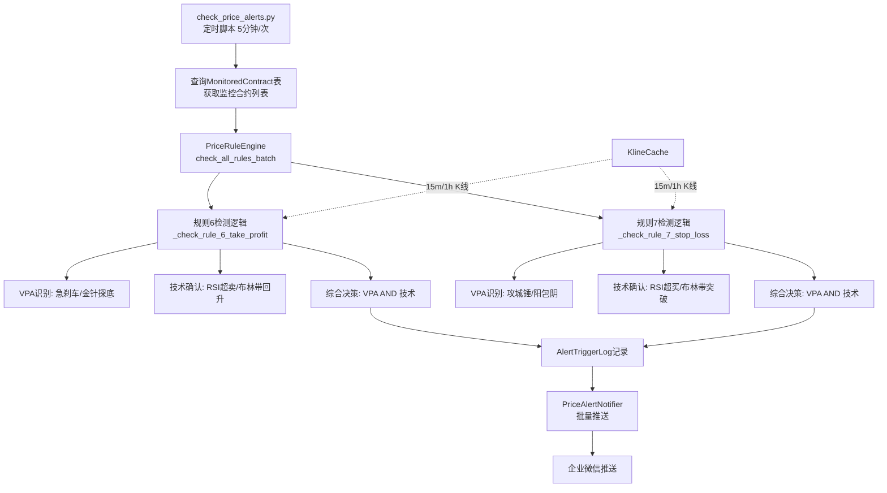

# Feature Specification: 止盈止损智能监控规则 (Rule 6 & 7: Smart Take-Profit & Stop-Loss Monitoring)

**Feature Branch**: `001-006-short-grid`
**Created**: 2025-12-11
**Status**: Draft
**Parent Feature**: 001-price-alert-monitor
**Input**: 在check_price_alerts脚本中新增第6号和第7号规则，基于量价形态识别和技术指标确认，分别监控止盈和止损时机

## 核心理念

本功能在 **001-price-alert-monitor** 现有5条规则的基础上，新增两条互为镜像的规则：
- **规则6 (止盈监控)**: 检测"有量无价"的恐慌抛售接盘信号，提示做多止盈时机
- **规则7 (止损监控)**: 检测"量价齐升"的多头进攻突破信号，提示做空止损时机

复用相同的基础架构：
- 通过 `check_price_alerts.py` 脚本每5分钟定时检测
- 通过 `PriceRuleEngine` 的规则引擎判定触发
- 通过 `PriceAlertNotifier` 批量推送告警
- 受 `AlertTriggerLog` 防重复机制保护（默认60分钟）

### 止损与止盈的逻辑镜像

| 维度 | 止盈 (Take Profit) - 规则6 | 止损 (Stop Loss) - 规则7 |
|------|---------------------------|------------------------|
| 市场情绪 | 极度恐慌 (Panic) | 极度亢奋 (Euphoria) |
| K线实体 | 越小越好 (十字星/小阴线)<br>含义：跌不动了 | 越大越好 (大阳线/光头)<br>含义：涨势如虹 |
| 影线特征 | 长下影线 (金针探底) | 无上影线 (光头阳线) |
| 成交量 | 巨量 (主力接盘) | 放量 (主力推升) |
| 布林带行为 | 跌破下轨后收回 (回归) | 突破上轨后站稳 (扩散) |
| RSI行为 | RSI<20 或底背离 (超卖) | RSI>60 或加速上升 (超买) |
| 核心哲学 | 动能衰竭 (Exhaustion) | 动能爆发 (Ignition) |

## User Scenarios & Testing *(mandatory)*

### User Story 1 - 规则6止盈监控：急刹车模式识别 (Priority: P1)

作为网格交易员，当MonitoredContract中的合约出现"急刹车"模式（大跌后成交量维持但实体缩小）且RSI超卖时，系统应推送止盈提醒。

**Why this priority**: 这是规则6的核心检测能力。急刹车模式（前一根大阴线+当前实体压缩+放量维持）是恐慌抛售后接盘的强信号。

**Independent Test**: BTCUSDT在MonitoredContract表中。检测到15m K线：前一根阴线(open=98000, close=96000, vol=2000BTC)，当前K线(open=95800, close=95900, vol=1700BTC)，当前实体<前实体×0.25，RSI(14)=18。系统触发规则6，推送"🎯止盈提醒：BTCUSDT 检测到急刹车模式+RSI超卖(18)，建议考虑止盈"。

**Acceptance Scenarios**:

1. **Given** BTCUSDT在MonitoredContract中，前一根15m为大阴线(跌幅2.04%)，**When** 当前K线实体压缩至前实体的20%，Vol维持80%以上，RSI=18，**Then** 规则6触发，extra_info={'vpa_signal':'急刹车','tech_signal':'RSI超卖','timeframe':'15m'}
2. **Given** ETHUSDT在MonitoredContract中，前一根为小阴线(跌幅0.5%)，**When** 当前出现小实体，**Then** 规则6不触发（不满足"前序暴跌"条件）
3. **Given** SOLUSDT不在MonitoredContract表中，**When** 出现急刹车模式，**Then** 规则6不检测该合约

---

### User Story 2 - 规则6止盈监控：金针探底模式识别 (Priority: P1)

作为网格交易员，当合约出现"金针探底"模式（放量暴跌后长下影线收回）且布林带回升时，系统应推送止盈提醒。

**Why this priority**: 与急刹车并列P1。金针探底是价格瞬间击穿低点后被主力买回的标志，下影线越长信号越强。

**Independent Test**: BTCUSDT检测到15m K线：open=96000, high=96200, low=94500, close=95800, vol=3000BTC（是MA50的2.8倍），下影线1300点是实体200点的6.5倍，收盘价位于K线的76%位置，布林带下轨95000，收盘价95800站回下轨之上。规则6触发。

**Acceptance Scenarios**:

1. **Given** BTCUSDT在MonitoredContract中，**When** 15m K线：vol>MA50×2.5，下影线>实体×2.0，close>low+(high-low)×0.6，close>BB_lower，**Then** 规则6触发，extra_info={'vpa_signal':'金针探底','tech_signal':'布林带回升'}
2. **Given** ETHUSDT出现长下影线但成交量正常，**When** vol<MA50×2.5，**Then** 规则6不触发
3. **Given** BNBUSDT下影线是实体的1.5倍（不足2倍），**When** 其他条件满足，**Then** 规则6不触发

---

### User Story 3 - 规则7止损监控：攻城锤模式识别 (Priority: P1)

作为网格交易员，当合约出现"攻城锤"模式（大阳线+成交量放大+几乎无上影线）且RSI超买加速时，系统应推送止损预警。

**Why this priority**: 这是规则7的核心检测能力。攻城锤模式是强烈的多头进攻信号。

**Independent Test**: BTCUSDT检测到15m K线：open=96000, close=98080, high=98100, vol=2500BTC（是MA50的1.8倍），涨幅2.08%，上影线20点<实体2080点的10%，RSI从前3根的[55,58,62]加速到当前66，斜率3.67>2.0。规则7触发。

**Acceptance Scenarios**:

1. **Given** BTCUSDT在MonitoredContract中，**When** 15m K线涨幅>2%，vol>=MA50×1.5，上影线<实体×0.1，RSI>60且斜率>2.0，**Then** 规则7触发，extra_info={'vpa_signal':'攻城锤','tech_signal':'RSI超买加速'}
2. **Given** ETHUSDT出现小阳线(涨幅0.5%)但成交量放大，**Then** 规则7不触发（不满足涨幅条件）
3. **Given** SOLUSDT出现大阴线，**Then** 规则7不触发（方向相反）

---

### User Story 4 - 规则7止损监控：阳包阴模式识别 (Priority: P1)

作为网格交易员，当合约出现"阳包阴"反转模式（当前阳线完全吞没前一根阴线）且布林带突破时，系统应推送止损预警。

**Why this priority**: 与攻城锤并列P1。阳包阴是趋势反转的关键信号。

**Independent Test**: BTCUSDT检测到连续两根15m K线：前一根阴线(open=98000, close=97500, vol=1500BTC)，当前阳线(open=97300, close=98200, vol=1800BTC)，完全吞没前阴线，vol_t>vol_t-1，close_t>MA20，布林带上轨98000，当前收盘价98200突破上轨。规则7触发。

**Acceptance Scenarios**:

1. **Given** BTCUSDT前一根15m为阴线，**When** 当前阳线：open<close_t-1 AND close>open_t-1，vol_t>vol_t-1，close>MA20，close>BB_upper，**Then** 规则7触发，extra_info={'vpa_signal':'阳包阴','tech_signal':'布林带突破'}
2. **Given** ETHUSDT前一根为阳线，**When** 当前也为阳线，**Then** 规则7不触发（不满足吞没条件）
3. **Given** SOLUSDT当前阳线仅部分吞没，**When** close未超过前open，**Then** 规则7不触发

---

### User Story 5 - 多周期独立触发与批量推送 (Priority: P1)

系统应同时检测15m和1h两个周期的K线，任意周期触发即推送，并在消息中标注触发周期。支持与其他规则合并批量推送。

**Why this priority**: 多周期独立触发可最大化信号覆盖，不遗漏快速突破。

**Independent Test**: BTCUSDT的15m K线触发规则6（急刹车），1h K线未触发。系统推送"🎯止盈提醒：BTCUSDT 检测到急刹车模式+RSI超卖(18) [15m]，建议考虑止盈"。

**Acceptance Scenarios**:

1. **Given** BTCUSDT的15m K线触发规则6，1h K线未触发，**When** 批量推送，**Then** 消息标注"[15m]"，只推送一次
2. **Given** ETHUSDT的15m和1h K线都触发规则7，**When** 批量推送，**Then** 消息标注"[15m+1h]"，提示双周期确认
3. **Given** SOLUSDT同时触发规则1(7天新高)和规则7(止损预警)，**When** 批量推送，**Then** 两条规则合并在同一条消息中推送
4. **Given** BNBUSDT在14:00触发规则6并已推送，**When** 14:30再次触发，**Then** 受60分钟防重复机制保护，不重复推送

---

### User Story 6 - Django Admin配置与参数调优 (Priority: P3)

管理员可以通过Django Admin配置规则6和规则7的参数（成交量倍数、RSI阈值等），支持动态调整无需重启服务。

**Why this priority**: P3优先级，用于优化检测准确率。

**Independent Test**: 管理员在Django Admin的PriceAlertRule页面找到rule_id=6和rule_id=7的配置，分别修改parameters并保存。修改后立即生效。

**Acceptance Scenarios**:

1. **Given** 管理员在Django Admin打开PriceAlertRule，**When** 找到rule_id=6和7的记录，**Then** 显示各自的parameters字段（JSON格式）
2. **Given** 修改规则6的VOL_MULTI_SPIKE从2.5改为3.0，**When** 保存后下一次检测，**Then** 金针探底需要3倍放量才触发

---

### Edge Cases

- **K线数据不足**: 当合约上市不足50根K线（无法计算MA50）时，跳过该合约的检测，记录警告日志
- **极端波动**: 当同时触发多个VPA信号（如既满足急刹车又满足金针探底），在extra_info中记录所有信号，但推送消息只展示优先级最高的信号
- **多周期冲突**: 当15m显示止盈但1h显示止损时（理论上极少），两条规则独立触发，用户根据消息自行判断
- **网络延迟**: 当K线数据延迟到达时，在推送消息中不作特殊标注（与其他规则一致）
- **成交量异常**: 当检测到突发10倍以上放量（可能是交易规则变更），记录警告日志但仍正常检测
- **RSI计算窗口**: RSI(14)需要至少14根K线，新上市合约在数据不足时跳过RSI相关检测，仅依赖VPA信号

## Requirements *(mandatory)*

### Functional Requirements

**核心集成要求**:

- **FR-001**: 规则6和规则7必须集成到现有的`check_price_alerts.py`脚本中，作为PriceAlertRule表的第6条和第7条预设规则
- **FR-002**: 规则6和规则7必须通过PriceRuleEngine.check_all_rules_batch方法检测，与现有5条规则使用统一的检测流程
- **FR-003**: 规则6和规则7的触发结果必须记录到AlertTriggerLog表，字段结构与现有规则保持一致
- **FR-004**: 规则6和规则7必须受现有防重复推送机制保护（默认60分钟窗口，从SystemConfig.duplicate_suppress_minutes读取）
- **FR-005**: 规则6和规则7的推送消息必须通过PriceAlertNotifier.send_batch_alert发送，支持与其他规则合并在同一批次推送

**规则6特有要求（止盈监控）**:

- **FR-006**: 规则6仅监控MonitoredContract表中的合约，与规则1-5使用相同的合约范围
- **FR-007**: 规则6必须支持15m和1h两种时间周期的K线独立检测，任意周期触发即记录，周期从PriceAlertRule.parameters['timeframe']读取（默认['15m', '1h']）
- **FR-008**: 规则6必须实现VPA模式识别 - 急刹车检测（需同时满足）：
  - 前序暴跌：`(Open_t-1 - Close_t-1) / Open_t-1 > 0.02`
  - 成交量维持：`Vol_t >= Vol_t-1 × 0.8`
  - 实体压缩：`|Open_t - Close_t| < |Open_t-1 - Close_t-1| × 0.25`
- **FR-009**: 规则6必须实现VPA模式识别 - 金针探底检测（需同时满足）：
  - 放量恐慌：`Vol_t > MA(Vol, 50) × multiplier`（multiplier从parameters读取，默认2.5）
  - 长下影线：`(min(Open_t, Close_t) - Low_t) > |Open_t - Close_t| × 2.0`
  - 收盘强势：`Close_t > Low_t + (High_t - Low_t) × 0.6`
- **FR-010**: 规则6必须实现技术指标确认 - RSI超卖检测（满足其一即可）：
  - 极度超卖：`RSI(14) < 20`
  - 底背离：`Low_t < min(Low_t-1...Low_t-20) AND RSI_t > min(RSI_t-1...RSI_t-20)`
- **FR-011**: 规则6必须实现技术指标确认 - 布林带触底回升检测（需同时满足）：
  - 击穿下轨：`Low_t < BB_Lower(20, 2)`
  - 收回轨道：`Close_t > BB_Lower(20, 2)`
- **FR-012**: 规则6的触发逻辑必须遵循：`VPA信号（急刹车 OR 金针探底）AND 技术信号（RSI超卖 OR 布林带回升）`

**规则7特有要求（止损监控）**:

- **FR-013**: 规则7仅监控MonitoredContract表中的合约，与规则1-5使用相同的合约范围
- **FR-014**: 规则7必须支持15m和1h两种时间周期的K线独立检测，任意周期触发即记录
- **FR-015**: 规则7必须实现VPA模式识别 - 攻城锤检测（需同时满足）：
  - 涨幅：`(Close_t - Open_t) / Open_t > 0.02`
  - 放量：`Vol_t >= MA(Vol, 50) × multiplier`（multiplier从parameters读取，默认1.5）
  - 光头阳：`(High_t - Close_t) < (Close_t - Open_t) × 0.1`
- **FR-016**: 规则7必须实现VPA模式识别 - 阳包阴检测（需同时满足）：
  - 反包：`Open_t < Close_t-1 AND Close_t > Open_t-1`
  - 增量：`Vol_t > Vol_t-1`
  - 位置：`Close_t > MA(Close, 20)`
- **FR-017**: 规则7必须实现技术指标确认 - RSI超买加速检测（需同时满足）：
  - 超买：`RSI(14) > threshold`（threshold从parameters读取，默认60）
  - 加速：`(RSI_t - RSI_t-3) / 3 > slope_threshold`（slope_threshold从parameters读取，默认2.0）
- **FR-018**: 规则7必须实现技术指标确认 - 布林带突破扩张检测（需同时满足）：
  - 突破：`Close_t > BB_Upper(20, 2)`
  - 扩张：`BandWidth_t > BandWidth_t-1`（BandWidth = BB_Upper - BB_Lower）
- **FR-019**: 规则7的触发逻辑必须遵循：`VPA信号（攻城锤 OR 阳包阴）AND 技术信号（RSI超买加速 OR 布林带突破）`

**触发记录与推送格式**:

- **FR-020**: 规则6的触发记录必须在AlertTriggerLog.extra_info字段存储详细信息（JSON格式）：
  ```python
  {
    "rule_id": 6,
    "signal_type": "take_profit",
    "vpa_signal": "急刹车" | "金针探底",
    "tech_signal": "RSI超卖" | "RSI底背离" | "布林带回升",
    "timeframe": "15m" | "1h" | "15m+1h",
    "rsi_value": 18.5,
    "volume_ratio": 2.8
  }
  ```
- **FR-021**: 规则7的触发记录必须在AlertTriggerLog.extra_info字段存储详细信息（JSON格式）：
  ```python
  {
    "rule_id": 7,
    "signal_type": "stop_loss",
    "vpa_signal": "攻城锤" | "阳包阴",
    "tech_signal": "RSI超买加速" | "布林带突破扩张",
    "timeframe": "15m" | "1h" | "15m+1h",
    "rsi_value": 66.0,
    "rsi_slope": 3.67
  }
  ```
- **FR-022**: 规则6的推送消息格式必须根据触发情况动态生成：
  - 单VPA单技术：`🎯止盈提醒：{symbol} 检测到{vpa_signal}+{tech_signal} [{timeframe}]，建议考虑止盈`
  - 双周期确认：`🎯止盈提醒：{symbol} 检测到{vpa_signal}+{tech_signal} [15m+1h双周期确认]，建议考虑止盈`
- **FR-023**: 规则7的推送消息格式必须根据触发情况动态生成：
  - 单VPA单技术：`🚨止损预警：{symbol} 检测到{vpa_signal}+{tech_signal} [{timeframe}]，建议考虑止损`
  - 双周期确认：`🚨止损预警：{symbol} 检测到{vpa_signal}+{tech_signal} [15m+1h双周期确认]，建议考虑止损`

**配置与扩展要求**:

- **FR-024**: 规则6和规则7必须在Django Admin的PriceAlertRule管理页面中可配置，支持独立的启用/禁用开关
- **FR-025**: 规则6的parameters字段必须支持JSON格式配置：
  ```json
  {
    "timeframe": ["15m", "1h"],
    "crash_threshold": 0.02,
    "vol_multi_spike": 2.5,
    "vol_multi_sustain": 0.8,
    "body_shrink_ratio": 0.25,
    "lower_shadow_ratio": 2.0,
    "close_position_ratio": 0.6,
    "rsi_period": 14,
    "rsi_oversold": 20,
    "bb_period": 20,
    "bb_std": 2.0
  }
  ```
- **FR-026**: 规则7的parameters字段必须支持JSON格式配置：
  ```json
  {
    "timeframe": ["15m", "1h"],
    "surge_threshold": 0.02,
    "vol_multiplier": 1.5,
    "upper_shadow_ratio": 0.1,
    "rsi_period": 14,
    "rsi_threshold": 60,
    "rsi_slope_threshold": 2.0,
    "bb_period": 20,
    "bb_std": 2.0
  }
  ```

### Key Entities *(复用现有数据模型)*

**复用的实体（无需修改）**:

- **MonitoredContract**: 规则6和规则7与规则1-5使用相同的合约监控范围
- **AlertTriggerLog**: 复用现有表，规则6和规则7的触发记录与其他规则使用相同结构
- **SystemConfig**: 复用现有表，读取duplicate_suppress_minutes等配置
- **KlineData**: 复用现有表，规则6和规则7读取15m和1h K线数据

**需要新增的配置记录**:

- **PriceAlertRule** (rule_id=6):
  - name: '止盈信号监控'
  - description: '检测恐慌抛售后的接盘信号（急刹车/金针探底）+超卖确认（RSI/布林带），提示做多止盈时机'
  - enabled: True
  - parameters: JSON格式（见FR-025）

- **PriceAlertRule** (rule_id=7):
  - name: '止损信号监控'
  - description: '检测多头进攻突破信号（攻城锤/阳包阴）+超买确认（RSI/布林带），提示做空止损时机'
  - enabled: True
  - parameters: JSON格式（见FR-026）

## Success Criteria *(mandatory)*

### Measurable Outcomes

- **SC-001**: 规则6和规则7能够在check_price_alerts脚本的单次执行中（5分钟周期）完成所有MonitoredContract合约的检测，平均每个合约检测耗时≤2秒
- **SC-002**: 规则6的触发判定准确率≥65%（通过回测验证，定义：信号触发后24小时内价格上涨≥2%视为有效）
- **SC-003**: 规则7的触发判定准确率≥65%（通过回测验证，定义：信号触发后24小时内价格下跌≥2%视为有效）
- **SC-004**: 规则6和规则7的推送延迟≤30秒（从K线数据更新到推送消息发出的端到端延迟）
- **SC-005**: 规则6和规则7与其他规则的批量推送机制兼容性100%（同一合约同时触发多条规则时，能正确合并推送）
- **SC-006**: 规则6和规则7的防重复机制有效性≥95%（在60分钟窗口内，同一合约同一规则不应重复推送超过1次）
- **SC-007**: 管理员可通过Django Admin在3分钟内完成规则6和规则7的参数调整，无需重启服务即可生效

## 实现方案概述

### 架构集成点



### 代码修改点

1. **grid_trading/services/rule_engine.py** - PriceRuleEngine类
   - 新增方法：`_check_rule_6_take_profit(symbol, klines_15m, klines_1h, current_price) -> dict | None`
   - 新增方法：`_check_rule_7_stop_loss(symbol, klines_15m, klines_1h, current_price) -> dict | None`
   - 实现规则6 VPA检测：`_detect_stopping_volume()`, `_detect_golden_needle()`
   - 实现规则6技术确认：`_check_rsi_oversold()`, `_check_bb_reversion()`
   - 实现规则7 VPA检测：`_detect_battering_ram()`, `_detect_bullish_engulfing()`
   - 实现规则7技术确认：`_check_rsi_acceleration()`, `_check_bb_breakout()`

2. **grid_trading/management/commands/check_price_alerts.py**
   - 修改`_check_all_contracts`方法：对每个MonitoredContract合约，额外获取15m和1h K线数据
   - 调用engine.check_all_rules_batch时传递klines_15m和klines_1h参数
   - 无需查询GridStrategy表（规则6和7不依赖持仓数据）

3. **grid_trading/django_models.py**
   - 在PriceAlertRule表中插入rule_id=6和rule_id=7的初始记录（通过migration或init_price_alert_rules命令）

4. **grid_trading/management/commands/init_price_alert_rules.py**
   - 新增规则6和规则7的初始化逻辑

5. **grid_trading/services/alert_notifier.py** - PriceAlertNotifier类
   - 修改`send_batch_alert`方法：针对rule_id=6和7的触发，使用特殊的消息模板格式化（区分止盈和止损）

### 测试策略

- **单元测试**: 针对各VPA模式检测、技术指标计算、综合决策逻辑编写独立测试用例
- **集成测试**: 在测试环境准备历史K线数据，运行check_price_alerts验证端到端流程
- **回测验证**: 使用2024年真实历史数据，验证规则6和规则7的准确率
