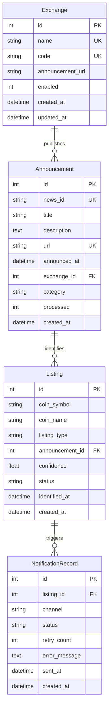

# Phase 1: 数据模型设计

**项目**: 加密货币交易所新币上线监控系统
**创建日期**: 2025-11-06
**更新日期**: 2025-11-06
**状态**: 设计完成
**架构模式**: Django + Celery混合架构

## 目录

1. [数据库架构概览](#1-数据库架构概览)
2. [实体模型详细设计](#2-实体模型详细设计)
3. [索引策略](#3-索引策略)
4. [数据完整性约束](#4-数据完整性约束)
5. [查询示例](#5-查询示例)
6. [数据库迁移策略](#6-数据库迁移策略)

---

## 1. 数据库架构概览

### ER图(实体关系图)



### 数据流

```
交易所API → Announcement(公告表) → Listing(识别表) → NotificationRecord(通知表)
```

---

## 2. 实体模型详细设计

### 2.1 Exchange(交易所表)

**用途**: 存储支持的交易所基础信息

**Django模型**:

```python
# monitor/models.py
from django.db import models
from django.utils import timezone

class Exchange(models.Model):
    """交易所模型"""

    # 基本信息
    name = models.CharField(max_length=100, unique=True, verbose_name='交易所名称')
    code = models.CharField(max_length=50, unique=True, verbose_name='交易所代码')
    announcement_url = models.URLField(max_length=500, blank=True, verbose_name='公告URL')

    # 状态
    enabled = models.BooleanField(default=True, verbose_name='是否启用')

    # 时间戳
    created_at = models.DateTimeField(auto_now_add=True, verbose_name='创建时间')
    updated_at = models.DateTimeField(auto_now=True, verbose_name='更新时间')

    class Meta:
        db_table = 'exchanges'
        verbose_name = '交易所'
        verbose_name_plural = '交易所'

    def __str__(self):
        return f"{self.name} ({self.code})"
```

**字段说明**:

| 字段 | 类型 | 约束 | 说明 |
|------|------|------|------|
| id | INT | PK, AUTO_INCREMENT | 主键 |
| name | VARCHAR(100) | UNIQUE, NOT NULL | 交易所名称(如"Binance") |
| code | VARCHAR(50) | UNIQUE, NOT NULL | 交易所代码(如"binance") |
| announcement_url | VARCHAR(500) | NULL | 公告页面URL |
| enabled | INT | NOT NULL, DEFAULT 1 | 是否启用监控(1=是,0=否) |
| created_at | DATETIME | NOT NULL | 创建时间 |
| updated_at | DATETIME | NOT NULL | 更新时间 |

**初始数据**:

```python
# monitor/management/commands/init_exchanges.py
from django.core.management.base import BaseCommand
from monitor.models import Exchange

class Command(BaseCommand):
    help = '初始化交易所数据'

    def handle(self, *args, **options):
        exchanges_data = [
            {'name': 'Binance', 'code': 'binance', 'announcement_url': 'https://www.binance.com/en/support/announcement/', 'enabled': True},
            {'name': 'Bybit', 'code': 'bybit', 'announcement_url': 'https://www.bybit.com/en/announcement-info/', 'enabled': True},
            {'name': 'Bitget', 'code': 'bitget', 'announcement_url': 'https://www.bitget.com/en/support/announcement/', 'enabled': True},
            {'name': 'Hyperliquid', 'code': 'hyperliquid', 'announcement_url': '', 'enabled': False},
        ]

        for data in exchanges_data:
            Exchange.objects.get_or_create(code=data['code'], defaults=data)

        self.stdout.write(self.style.SUCCESS('交易所数据初始化完成'))
```

---

### 2.2 Announcement(公告表)

**用途**: 存储从交易所爬取的原始公告数据

**Django模型**:

```python
# monitor/models.py
class Announcement(models.Model):
    """公告模型"""

    # 公告信息
    news_id = models.CharField(max_length=200, unique=True, verbose_name='公告ID')
    title = models.CharField(max_length=1000, verbose_name='公告标题')
    description = models.TextField(blank=True, verbose_name='公告描述')
    url = models.URLField(max_length=1000, unique=True, verbose_name='公告URL')
    announced_at = models.DateTimeField(verbose_name='发布时间')

    # 分类
    category = models.CharField(max_length=100, blank=True, verbose_name='分类')

    # 外键
    exchange = models.ForeignKey(Exchange, on_delete=models.CASCADE,
                                 related_name='announcements', verbose_name='交易所')

    # 处理状态
    processed = models.BooleanField(default=False, verbose_name='是否已处理')

    # 时间戳
    created_at = models.DateTimeField(auto_now_add=True, verbose_name='创建时间')

    class Meta:
        db_table = 'announcements'
        ordering = ['-announced_at']
        indexes = [
            models.Index(fields=['exchange', 'announced_at']),
            models.Index(fields=['processed']),
            models.Index(fields=['created_at']),
        ]
        verbose_name = '公告'
        verbose_name_plural = '公告'

    def __str__(self):
        return f"{self.exchange.name} - {self.title[:30]}..."
```

**字段说明**:

| 字段 | 类型 | 约束 | 说明 |
|------|------|------|------|
| id | INT | PK, AUTO_INCREMENT | 主键 |
| news_id | VARCHAR(200) | UNIQUE, NOT NULL | 公告唯一ID(来自交易所) |
| title | VARCHAR(1000) | NOT NULL | 公告标题 |
| description | TEXT | NULL | 公告描述/摘要 |
| url | VARCHAR(1000) | UNIQUE, NOT NULL | 公告详情URL |
| announced_at | DATETIME | NOT NULL | 公告发布时间 |
| category | VARCHAR(100) | NULL | 公告分类 |
| exchange_id | INT | FK, NOT NULL | 所属交易所ID |
| processed | INT | NOT NULL, DEFAULT 0 | 是否已识别处理 |
| created_at | DATETIME | NOT NULL | 入库时间 |

**去重策略**:
- 唯一约束: `news_id`(交易所提供的唯一ID)
- 备用去重: `url`(防止news_id格式变化)

---

### 2.3 Listing(新币上线表)

**用途**: 存储识别出的新币上线事件

**SQLAlchemy模型**:

```python
# listing_monitor/models/listing.py
from sqlalchemy import Column, Integer, String, Float, DateTime, ForeignKey, Index
from sqlalchemy.orm import relationship
from datetime import datetime
from .database import Base

class Listing(Base):
    """新币上线模型"""
    __tablename__ = 'listings'

    # 主键
    id = Column(Integer, primary_key=True, autoincrement=True)

    # 币种信息
    coin_symbol = Column(String(50), nullable=False, comment='币种代码(如BTC)')
    coin_name = Column(String(200), nullable=True, comment='币种全称(如Bitcoin)')
    listing_type = Column(String(50), nullable=False, comment='上线类型(spot/futures/both)')

    # 外键
    announcement_id = Column(Integer, ForeignKey('announcements.id'), nullable=False, comment='关联公告ID')

    # 识别信息
    confidence = Column(Float, nullable=False, comment='识别置信度(0.0-1.0)')
    status = Column(String(50), default='pending_review', nullable=False, comment='状态(pending_review/confirmed/ignored)')

    # 时间戳
    identified_at = Column(DateTime, nullable=False, comment='识别时间')
    created_at = Column(DateTime, default=datetime.utcnow, nullable=False, comment='入库时间')

    # 关系
    announcement = relationship('Announcement', back_populates='listings')
    notification_records = relationship('NotificationRecord', back_populates='listing', cascade='all, delete-orphan')

    def __repr__(self):
        return f"<Listing(coin_symbol='{self.coin_symbol}', listing_type='{self.listing_type}', status='{self.status}')>"
```

**字段说明**:

| 字段 | 类型 | 约束 | 说明 |
|------|------|------|------|
| id | INT | PK, AUTO_INCREMENT | 主键 |
| coin_symbol | VARCHAR(50) | NOT NULL | 币种代码(如BTC) |
| coin_name | VARCHAR(200) | NULL | 币种全称 |
| listing_type | VARCHAR(50) | NOT NULL | 上线类型(spot/futures/both) |
| announcement_id | INT | FK, NOT NULL | 关联公告ID |
| confidence | FLOAT | NOT NULL | 识别置信度(0.0-1.0) |
| status | VARCHAR(50) | NOT NULL, DEFAULT 'pending_review' | 状态 |
| identified_at | DATETIME | NOT NULL | 识别时间 |
| created_at | DATETIME | NOT NULL | 入库时间 |

**状态说明**:
- `pending_review`: 待审核(置信度低于阈值)
- `confirmed`: 已确认(自动识别高置信度或人工确认)
- `ignored`: 已忽略(人工标记为非新币上线)

**去重策略**:
- 业务逻辑去重: `coin_symbol + exchange_id + listing_type` 24小时内唯一
- 数据库层不强制,允许历史记录

---

### 2.4 NotificationRecord(通知记录表)

**用途**: 记录所有通知发送历史

**SQLAlchemy模型**:

```python
# listing_monitor/models/notification.py
from sqlalchemy import Column, Integer, String, Text, DateTime, ForeignKey, Index
from sqlalchemy.orm import relationship
from datetime import datetime
from .database import Base

class NotificationRecord(Base):
    """通知记录模型"""
    __tablename__ = 'notification_records'

    # 主键
    id = Column(Integer, primary_key=True, autoincrement=True)

    # 外键
    listing_id = Column(Integer, ForeignKey('listings.id'), nullable=False, comment='关联新币上线ID')

    # 通知信息
    channel = Column(String(50), nullable=False, comment='通知渠道(telegram/email/webhook)')
    status = Column(String(50), nullable=False, comment='发送状态(pending/success/failed)')
    retry_count = Column(Integer, default=0, nullable=False, comment='重试次数')
    error_message = Column(Text, nullable=True, comment='错误信息')

    # 时间戳
    sent_at = Column(DateTime, nullable=True, comment='成功发送时间')
    created_at = Column(DateTime, default=datetime.utcnow, nullable=False, comment='创建时间')

    # 关系
    listing = relationship('Listing', back_populates='notification_records')

    def __repr__(self):
        return f"<NotificationRecord(listing_id={self.listing_id}, channel='{self.channel}', status='{self.status}')>"
```

**字段说明**:

| 字段 | 类型 | 约束 | 说明 |
|------|------|------|------|
| id | INT | PK, AUTO_INCREMENT | 主键 |
| listing_id | INT | FK, NOT NULL | 关联新币上线ID |
| channel | VARCHAR(50) | NOT NULL | 通知渠道 |
| status | VARCHAR(50) | NOT NULL | 发送状态 |
| retry_count | INT | NOT NULL, DEFAULT 0 | 重试次数 |
| error_message | TEXT | NULL | 错误信息 |
| sent_at | DATETIME | NULL | 成功发送时间 |
| created_at | DATETIME | NOT NULL | 创建时间 |

**状态说明**:
- `pending`: 待发送
- `success`: 发送成功
- `failed`: 发送失败(超过最大重试次数)

---

## 3. 索引策略

### 3.1 主要查询场景

1. **按交易所查询公告**: `WHERE exchange_id = ?`
2. **按时间范围查询公告**: `WHERE announced_at BETWEEN ? AND ?`
3. **查询未处理公告**: `WHERE processed = 0`
4. **查询待审核新币**: `WHERE status = 'pending_review'`
5. **去重查询**: `WHERE news_id = ?` 或 `WHERE url = ?`

### 3.2 索引定义

```python
# 在模型中添加索引
from sqlalchemy import Index

# Announcement表索引
Index('idx_announcements_exchange_announced', Announcement.exchange_id, Announcement.announced_at)
Index('idx_announcements_processed', Announcement.processed)
Index('idx_announcements_created', Announcement.created_at)

# Listing表索引
Index('idx_listings_status', Listing.status)
Index('idx_listings_coin_symbol', Listing.coin_symbol)
Index('idx_listings_identified', Listing.identified_at)
Index('idx_listings_announcement', Listing.announcement_id)

# NotificationRecord表索引
Index('idx_notifications_listing', NotificationRecord.listing_id)
Index('idx_notifications_status', NotificationRecord.status)
Index('idx_notifications_created', NotificationRecord.created_at)
```

### 3.3 复合索引说明

| 表 | 索引名 | 字段 | 用途 |
|---|--------|------|------|
| announcements | idx_announcements_exchange_announced | (exchange_id, announced_at) | 按交易所+时间查询 |
| announcements | idx_announcements_processed | (processed) | 查询未处理公告 |
| listings | idx_listings_status | (status) | 查询待审核列表 |
| listings | idx_listings_coin_symbol | (coin_symbol) | 按币种查询 |

---

## 4. 数据完整性约束

### 4.1 主键约束

所有表都有自增主键`id`

### 4.2 唯一约束

| 表 | 字段 | 说明 |
|---|------|------|
| exchanges | name | 交易所名称唯一 |
| exchanges | code | 交易所代码唯一 |
| announcements | news_id | 公告ID唯一 |
| announcements | url | 公告URL唯一 |

### 4.3 外键约束

| 子表 | 字段 | 父表 | 父表字段 | 删除策略 |
|------|------|------|---------|---------|
| announcements | exchange_id | exchanges | id | CASCADE |
| listings | announcement_id | announcements | id | CASCADE |
| notification_records | listing_id | listings | id | CASCADE |

**级联删除说明**:
- 删除交易所 → 自动删除其所有公告及关联数据
- 删除公告 → 自动删除其识别的新币上线及通知记录
- 删除新币上线 → 自动删除其通知记录

### 4.4 非空约束

所有关键字段(name, code, title, url等)均设置`NOT NULL`

### 4.5 默认值

| 表 | 字段 | 默认值 |
|---|------|--------|
| exchanges | enabled | 1 |
| announcements | processed | 0 |
| listings | status | 'pending_review' |
| notification_records | retry_count | 0 |

---

## 5. 查询示例

### 5.1 获取最近24小时未处理的公告

```python
from datetime import datetime, timedelta
from sqlalchemy import and_

with db.session_scope() as session:
    cutoff_time = datetime.utcnow() - timedelta(hours=24)

    unprocessed = (
        session.query(Announcement)
        .filter(
            and_(
                Announcement.processed == 0,
                Announcement.announced_at >= cutoff_time
            )
        )
        .order_by(Announcement.announced_at.desc())
        .all()
    )
```

### 5.2 查询待审核的新币上线(按置信度排序)

```python
with db.session_scope() as session:
    pending_listings = (
        session.query(Listing)
        .filter(Listing.status == 'pending_review')
        .order_by(Listing.confidence.desc())
        .all()
    )
```

### 5.3 查询某个币种在所有交易所的上线记录

```python
with db.session_scope() as session:
    listings = (
        session.query(Listing, Announcement, Exchange)
        .join(Announcement, Listing.announcement_id == Announcement.id)
        .join(Exchange, Announcement.exchange_id == Exchange.id)
        .filter(Listing.coin_symbol == 'BTC')
        .all()
    )

    for listing, announcement, exchange in listings:
        print(f"{exchange.name}: {listing.listing_type} at {announcement.announced_at}")
```

### 5.4 去重检查(防止24小时内重复通知)

```python
from datetime import datetime, timedelta

def is_duplicate_listing(session, coin_symbol, exchange_id, listing_type):
    """检查24小时内是否已存在相同上线记录"""
    cutoff_time = datetime.utcnow() - timedelta(hours=24)

    existing = (
        session.query(Listing)
        .join(Announcement)
        .filter(
            and_(
                Listing.coin_symbol == coin_symbol,
                Listing.listing_type == listing_type,
                Announcement.exchange_id == exchange_id,
                Listing.identified_at >= cutoff_time
            )
        )
        .first()
    )

    return existing is not None
```

### 5.5 统计每个交易所的新币上线数量

```python
from sqlalchemy import func

with db.session_scope() as session:
    stats = (
        session.query(
            Exchange.name,
            func.count(Listing.id).label('listing_count')
        )
        .join(Announcement, Exchange.id == Announcement.exchange_id)
        .join(Listing, Announcement.id == Listing.announcement_id)
        .filter(Listing.status == 'confirmed')
        .group_by(Exchange.name)
        .all()
    )

    for exchange_name, count in stats:
        print(f"{exchange_name}: {count} listings")
```

---

## 6. 数据库迁移策略

### 6.1 使用Django Migrations管理迁移

**Django Migrations**是Django内置的数据库迁移系统,自动追踪模型变更并生成迁移脚本。

**创建迁移**:
```bash
# 生成迁移文件
python manage.py makemigrations

# 查看迁移SQL(可选)
python manage.py sqlmigrate monitor 0001

# 应用迁移
python manage.py migrate
```

**查看迁移状态**:
```bash
# 查看所有迁移状态
python manage.py showmigrations

# 查看特定应用的迁移
python manage.py showmigrations monitor
```

### 6.2 迁移版本管理

| 版本 | 描述 | 日期 |
|------|------|------|
| 0001_initial | 初始化四张表 | 2025-11-06 |
| 0002_indexes | 添加索引优化 | TBD |
| 0003_review_fields | 添加审核字段 | TBD |

### 6.3 生产环境迁移注意事项

1. **备份数据库**: 迁移前必须备份
2. **测试迁移**: 在测试环境先执行
3. **停机窗口**: 复杂迁移需要停机
4. **回滚计划**: Django支持回滚迁移(`python manage.py migrate <app> <migration_name>`)

**回滚示例**:
```bash
# 回滚到指定迁移
python manage.py migrate monitor 0001_initial

# 回滚所有迁移
python manage.py migrate monitor zero
```

---

## 7. 数据库初始化脚本

```python
# monitor/management/commands/init_db.py
from django.core.management.base import BaseCommand
from django.core.management import call_command
from monitor.models import Exchange

class Command(BaseCommand):
    help = '初始化数据库'

    def handle(self, *args, **options):
        self.stdout.write('正在初始化数据库...')

        # 1. 运行迁移
        self.stdout.write('应用数据库迁移...')
        call_command('migrate')

        # 2. 初始化交易所数据
        self.stdout.write('初始化交易所数据...')
        exchanges_data = [
            {'name': 'Binance', 'code': 'binance',
             'announcement_url': 'https://www.binance.com/en/support/announcement/',
             'enabled': True},
            {'name': 'Bybit', 'code': 'bybit',
             'announcement_url': 'https://www.bybit.com/en/announcement-info/',
             'enabled': True},
            {'name': 'Bitget', 'code': 'bitget',
             'announcement_url': 'https://www.bitget.com/en/support/announcement/',
             'enabled': True},
            {'name': 'Hyperliquid', 'code': 'hyperliquid',
             'announcement_url': '', 'enabled': False},
        ]

        for data in exchanges_data:
            exchange, created = Exchange.objects.get_or_create(
                code=data['code'],
                defaults=data
            )
            if created:
                self.stdout.write(f"  创建交易所: {exchange.name}")
            else:
                self.stdout.write(f"  交易所已存在: {exchange.name}")

        self.stdout.write(self.style.SUCCESS('数据库初始化完成!'))

# 使用示例
# python manage.py init_db
```

---

## 总结

本数据模型设计遵循以下原则:
1. **简单至上**: 四张表清晰表达业务逻辑,无冗余复杂关系
2. **可扩展性**: 支持新增交易所、通知渠道、识别算法
3. **数据完整性**: 完善的约束和级联删除策略
4. **查询效率**: 针对主要查询场景建立索引
5. **可维护性**: 使用Django ORM和迁移工具,便于版本管理
6. **Admin支持**: 所有模型自动集成Django Admin管理界面

下一步将基于此模型实现业务逻辑。
