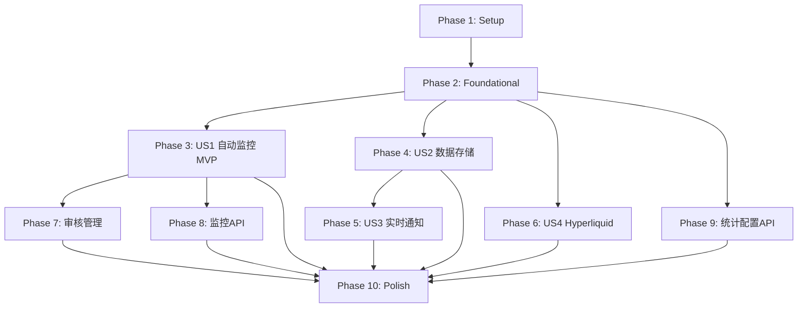

# Tasks: 加密货币交易所新币上线监控系统

**Input**: Design documents from `/specs/001-listing-monitor/`
**Prerequisites**: plan.md, spec.md, data-model.md, contracts/api-endpoints.md

**Feature Branch**: `001-listing-monitor`
**Status**: Ready for Implementation
**Created**: 2025-11-06

## Format: `[ID] [P?] [Story] Description`

- **[P]**: Can run in parallel (different files, no dependencies)
- **[Story]**: Which user story this task belongs to (US1=自动监控, US2=数据存储, US3=实时通知, US4=Hyperliquid扩展)
- All paths are absolute from repository root

---

## Phase 1: 环境设置 (Setup)

**Purpose**: Django项目初始化和基础环境配置

**Dependencies**: None - 可立即开始

- [ ] T001 创建Django项目根目录结构 listing_monitor_project
- [ ] T002 初始化Django项目 in listing_monitor_project/
- [ ] T003 [P] 创建Django应用monitor in monitor/
- [ ] T004 [P] 创建Django应用api in api/
- [ ] T005 [P] 更新requirements.txt添加Django相关依赖(Django 4.2+, Celery 5.3+, django-celery-beat 2.5+, requests 2.31+)
- [ ] T006 [P] 创建requirements-dev.txt添加开发依赖(pytest, pytest-django)
- [ ] T007 安装Redis 7.0+ (brew install redis on macOS)
- [ ] T008 配置Django settings in listing_monitor_project/settings.py
- [ ] T009 [P] 创建配置目录 config/ 及keywords.yaml配置文件
- [ ] T010 [P] 创建测试目录结构 tests/

**Checkpoint**: Django项目骨架就绪,可运行`python manage.py runserver`

---

## Phase 2: 基础设施 (Foundational)

**Purpose**: 核心基础设施,所有用户故事的阻塞性前置任务

**⚠️ CRITICAL**: 所有用户故事工作必须等待此阶段完成

**Dependencies**: 依赖Phase 1完成

- [ ] T011 配置Celery应用 in listing_monitor_project/celery.py
- [ ] T012 配置django-celery-beat in listing_monitor_project/settings.py
- [ ] T013 配置Redis作为Celery消息代理和结果后端 in listing_monitor_project/settings.py
- [ ] T014 创建manage.py Django管理脚本 in manage.py
- [ ] T015 [P] 配置Django Admin基础设置 in monitor/admin.py
- [ ] T016 [P] 创建数据库迁移基础配置 in monitor/migrations/
- [ ] T017 [P] 配置日志系统 in listing_monitor_project/settings.py
- [ ] T018 [P] 配置CORS支持 in listing_monitor_project/settings.py
- [ ] T019 初始化数据库迁移(首次makemigrations)
- [ ] T020 应用数据库迁移(首次migrate)

**Checkpoint**: 基础设施就绪 - 用户故事实现可并行开始

---

## Phase 3: User Story 1 - 自动监控交易所新币上线公告 (P1) 🎯 MVP

**Goal**: 系统能够定期自动监控Binance、Bybit、Bitget三个交易所的公告,并识别新币上线信息存储到数据库

**Independent Test**: 运行监控任务,验证能成功爬取公告并识别新币上线,数据正确存储到数据库

**Dependencies**: 依赖Phase 2完成

### 数据模型 (User Story 1)

- [ ] T021 [P] [US1] 创建Exchange模型 in monitor/models.py
- [ ] T022 [P] [US1] 创建Announcement模型 in monitor/models.py
- [ ] T023 [US1] 生成并应用数据库迁移(Exchange和Announcement表)
- [ ] T024 [US1] 配置Exchange和Announcement的Django Admin in monitor/admin.py

### 爬虫集成服务 (User Story 1)

- [ ] T025 [P] [US1] 创建爬虫调用服务 in monitor/services/crawler.py
- [ ] T026 [P] [US1] 创建新币识别器服务 in monitor/services/identifier.py
- [ ] T027 [US1] 配置识别关键词列表 in config/keywords.yaml
- [ ] T028 [US1] 测试爬虫服务可成功调用现有Scrapy爬虫

### Celery监控任务 (User Story 1)

- [ ] T029 [US1] 创建监控任务 in monitor/tasks.py
- [ ] T030 [US1] 配置Celery Beat定时任务(5分钟间隔) in listing_monitor_project/settings.py
- [ ] T031 [US1] 创建Django管理命令init_exchanges.py初始化交易所数据 in monitor/management/commands/init_exchanges.py
- [ ] T032 [US1] 运行init_exchanges命令初始化Binance/Bybit/Bitget三个交易所
- [ ] T033 [US1] 测试手动触发监控任务验证流程完整性

### 错误处理与监控 (User Story 1)

- [ ] T034 [US1] 实现指数退避策略处理API限流 in monitor/services/crawler.py
- [ ] T035 [US1] 实现解析成功率监控逻辑 in monitor/tasks.py
- [ ] T036 [US1] 添加历史公告初始化逻辑(获取过去24小时) in monitor/tasks.py

**Checkpoint**: User Story 1完成 - MVP可运行!可独立测试监控功能

---

## Phase 4: User Story 2 - 新币上线信息结构化存储 (P2)

**Goal**: 将识别出的新币上线信息结构化存储,支持查询、统计和去重

**Independent Test**: 通过API查询历史新币上线数据,验证数据格式完整且可筛选

**Dependencies**: 依赖Phase 2完成(可与US1并行开发)

### 数据模型 (User Story 2)

- [ ] T037 [P] [US2] 创建Listing模型 in monitor/models.py
- [ ] T038 [US2] 生成并应用数据库迁移(Listing表)
- [ ] T039 [US2] 配置Listing的Django Admin in monitor/admin.py
- [ ] T040 [US2] 添加Listing模型的索引优化 in monitor/models.py

### 业务逻辑 (User Story 2)

- [ ] T041 [US2] 实现去重逻辑服务 in monitor/services/deduplication.py
- [ ] T042 [US2] 实现数据验证服务 in monitor/services/validator.py
- [ ] T043 [US2] 集成Listing创建到监控任务 in monitor/tasks.py

### API端点 (User Story 2)

- [ ] T044 [P] [US2] 创建DRF序列化器 in api/serializers.py
- [ ] T045 [US2] 实现GET /api/listings端点 in api/views.py
- [ ] T046 [US2] 实现GET /api/listings/{id}端点 in api/views.py
- [ ] T047 [US2] 配置API路由 in api/urls.py和listing_monitor_project/urls.py
- [ ] T048 [US2] 测试API端点返回正确数据格式

**Checkpoint**: User Story 2完成 - 数据存储和查询功能可用

---

## Phase 5: User Story 3 - 新币上线实时通知 (P3)

**Goal**: 识别到新币上线后,立即通过Webhook推送通知,支持重试机制

**Independent Test**: 触发新币上线事件,验证Webhook通知成功发送到配置的URL

**Dependencies**: 依赖Phase 2和US2完成(需要Listing模型)

### 数据模型 (User Story 3)

- [ ] T049 [P] [US3] 创建NotificationRecord模型 in monitor/models.py
- [ ] T050 [US3] 生成并应用数据库迁移(NotificationRecord表)
- [ ] T051 [US3] 配置NotificationRecord的Django Admin in monitor/admin.py

### 通知服务 (User Story 3)

- [ ] T052 [US3] 创建Webhook通知服务 in monitor/services/notifier.py
- [ ] T053 [US3] 实现重试机制(3次重试,间隔1分钟) in monitor/services/notifier.py
- [ ] T054 [US3] 配置Webhook URL in listing_monitor_project/settings.py
- [ ] T055 [US3] 集成通知服务到监控任务 in monitor/tasks.py

### 通知管理API (User Story 3)

- [ ] T056 [US3] 实现GET /api/notifications端点查询通知记录 in api/views.py
- [ ] T057 [US3] 实现POST /api/notifications/retry/{id}端点重试失败通知 in api/views.py
- [ ] T058 [US3] 测试通知发送和重试逻辑

**Checkpoint**: User Story 3完成 - 实时通知功能可用

---

## Phase 6: User Story 4 - 扩展Hyperliquid交易所监控 (P4)

**Goal**: 添加对Hyperliquid交易所的监控支持,遵循与现有交易所一致的模式

**Independent Test**: Hyperliquid公告可正常爬取并识别新币上线

**Dependencies**: 依赖Phase 2和US1完成

### Hyperliquid爬虫 (User Story 4)

- [ ] T059 [US4] 研究Hyperliquid公告页面结构和API
- [ ] T060 [US4] 创建Hyperliquid Scrapy爬虫 in crypto_exchange_news/spiders/hyperliquid.py
- [ ] T061 [US4] 测试Hyperliquid爬虫可成功获取公告数据
- [ ] T062 [US4] 添加Hyperliquid交易所到数据库(enabled=True)
- [ ] T063 [US4] 验证Hyperliquid监控任务完整流程

**Checkpoint**: User Story 4完成 - 支持Hyperliquid交易所

---

## Phase 7: 审核管理功能 (P1扩展)

**Purpose**: 实现待审核公告的管理界面和API

**Dependencies**: 依赖Phase 2和US2完成

- [ ] T064 [P] 实现GET /api/review/pending端点 in api/views.py
- [ ] T065 [P] 实现PUT /api/review/{id}端点 in api/views.py
- [ ] T066 实现POST /api/review/batch批量审核端点 in api/views.py
- [ ] T067 在Django Admin中添加待审核列表过滤器 in monitor/admin.py

---

## Phase 8: 监控管理API (P0)

**Purpose**: 提供监控任务的控制和状态查询API

**Dependencies**: 依赖Phase 2和US1完成

- [ ] T068 [P] 实现POST /api/monitor/trigger手动触发监控 in api/views.py
- [ ] T069 [P] 实现GET /api/monitor/status查询监控状态 in api/views.py
- [ ] T070 实现PUT /api/monitor/schedule更新调度配置 in api/views.py

---

## Phase 9: 统计和配置API (P2)

**Purpose**: 提供统计信息和配置管理API

**Dependencies**: 依赖Phase 2完成

- [ ] T071 [P] 实现GET /api/stats/overview总体统计 in api/views.py
- [ ] T072 [P] 实现GET /api/stats/exchanges交易所统计 in api/views.py
- [ ] T073 [P] 实现GET /api/exchanges交易所列表 in api/views.py
- [ ] T074 [P] 实现PUT /api/exchanges/{id}更新交易所 in api/views.py
- [ ] T075 [P] 实现GET /api/config查询配置 in api/views.py
- [ ] T076 [P] 实现PUT /api/config更新配置 in api/views.py

---

## Phase 10: 完善与优化 (Polish)

**Purpose**: 优化、文档和生产环境准备

**Dependencies**: 依赖所有用户故事完成

- [ ] T077 [P] 创建Dockerfile in Dockerfile
- [ ] T078 [P] 创建docker-compose.yml配置 in docker-compose.yml
- [ ] T079 [P] 更新项目README.md in README.md
- [ ] T080 [P] 创建quickstart.md用户指南 in specs/001-listing-monitor/quickstart.md
- [ ] T081 [P] 添加API文档(drf-yasg Swagger) in api/views.py
- [ ] T082 优化Django Admin界面美化 in monitor/admin.py
- [ ] T083 [P] 添加性能监控和日志优化
- [ ] T084 [P] 安全检查和环境变量配置
- [ ] T085 [P] 编写部署文档 in docs/deployment.md
- [ ] T086 验证quickstart.md所有步骤可执行

**Checkpoint**: 生产环境就绪 - 可部署

---

## Dependencies & Execution Order

### Phase Dependencies (顺序依赖)



### User Story Dependencies (用户故事依赖)

| User Story | Priority | Depends On | Can Start After |
|------------|----------|------------|-----------------|
| US1: 自动监控 | P1 (MVP) | Phase 2: Foundational | 基础设施完成 |
| US2: 数据存储 | P2 | Phase 2: Foundational | 基础设施完成(可与US1并行) |
| US3: 实时通知 | P3 | Phase 2 + US2 (需要Listing模型) | US2完成 |
| US4: Hyperliquid | P4 | Phase 2 + US1 | US1完成 |

### Within Each Phase

- Setup阶段: T001必须先于其他,T003-T010可并行
- Foundational阶段: T011-T013串行,T015-T018可并行,T019-T020必须最后
- User Story阶段:
  - 模型创建任务可并行 [P]
  - 迁移任务必须在模型之后
  - 服务层可与模型并行 [P]
  - API端点可与服务层并行 [P]
  - 测试任务必须在实现之后

### Parallel Opportunities (并行机会)

**Setup阶段可并行**:
- T003, T004, T005, T006, T009, T010 (不同文件)

**Foundational阶段可并行**:
- T015, T016, T017, T018 (不同配置)

**US1阶段可并行**:
- T021, T022 (不同模型)
- T025, T026, T027 (不同服务)

**US2阶段可并行**:
- T044先于T045-T048,但T045-T047可并行(不同端点)

**US3阶段可并行**:
- T049, T052 (模型和服务在不同文件)

**Polish阶段可并行**:
- T077, T078, T079, T080, T081, T083, T084, T085 (不同文档和配置)

**多团队并行策略**:
1. 团队共同完成Phase 1 + Phase 2
2. Phase 2完成后:
   - 开发者A: US1 (P1 - MVP)
   - 开发者B: US2 (P2)
   - 开发者C: US4 (P4) - 需等US1基础完成
   - 开发者D: 准备US3 (P3) - 需等US2完成

---

## Implementation Strategy

### 方案1: MVP First (推荐)

**目标**: 最快验证核心价值

```
Phase 1: Setup (T001-T010)
  ↓
Phase 2: Foundational (T011-T020) ← 阻塞点
  ↓
Phase 3: US1 自动监控 (T021-T036) ← MVP完成!
  ↓
VALIDATE & DEMO
  ↓
Phase 4: US2 数据存储 (T037-T048)
  ↓
Phase 5: US3 实时通知 (T049-T058)
  ↓
Phase 6: US4 Hyperliquid (T059-T063)
  ↓
Phase 7-10: 管理功能与优化
```

**优点**:
- 最快时间(约2-3天)实现核心监控功能
- 可立即验证爬虫集成和识别逻辑
- 即使后续开发中断,MVP仍有价值

### 方案2: Incremental Delivery (渐进交付)

**目标**: 每完成一个用户故事就部署一次

```
Phase 1 + Phase 2 完成 → 基础设施就绪
  ↓
Phase 3: US1 完成 → 部署v1.0 (监控功能)
  ↓
Phase 4: US2 完成 → 部署v1.1 (+数据查询API)
  ↓
Phase 5: US3 完成 → 部署v1.2 (+Webhook通知)
  ↓
Phase 6: US4 完成 → 部署v1.3 (+Hyperliquid支持)
  ↓
Phase 7-10 完成 → 部署v2.0 (完整功能)
```

**优点**:
- 持续交付价值
- 每个版本都可独立测试和使用
- 降低集成风险

### 方案3: Parallel Team (多人协作)

**前提**: 有3-4名开发者

```
Week 1:
  全员: Phase 1 + Phase 2 (2天)

Week 2:
  Dev A: Phase 3 US1 (2天)
  Dev B: Phase 4 US2 (2天) - 并行
  Dev C: Phase 9 统计API (2天) - 并行

Week 3:
  Dev A: Phase 5 US3 (1天) - 需要US2
  Dev B: Phase 6 US4 (1天)
  Dev C: Phase 7 + Phase 8 (2天)

Week 4:
  全员: Phase 10 Polish + 集成测试 (2天)
```

**优点**:
- 最快完成所有功能(约2周)
- 充分利用团队资源

---

## Task Estimation (任务估算)

### 按Phase估算 (单人开发)

| Phase | Tasks | Estimated Time | Complexity |
|-------|-------|----------------|------------|
| Phase 1: Setup | T001-T010 | 4小时 | 低 |
| Phase 2: Foundational | T011-T020 | 6小时 | 中 |
| Phase 3: US1 (MVP) | T021-T036 | 12小时 | 高 |
| Phase 4: US2 | T037-T048 | 8小时 | 中 |
| Phase 5: US3 | T049-T058 | 6小时 | 中 |
| Phase 6: US4 | T059-T063 | 8小时 | 高 |
| Phase 7: 审核管理 | T064-T067 | 4小时 | 低 |
| Phase 8: 监控API | T068-T070 | 3小时 | 低 |
| Phase 9: 统计配置API | T071-T076 | 6小时 | 中 |
| Phase 10: Polish | T077-T086 | 8小时 | 中 |
| **Total** | **86 tasks** | **~65小时 (8-10天)** | |

### MVP (US1) 时间线

- Phase 1: 4小时
- Phase 2: 6小时
- Phase 3: 12小时
- **Total: 22小时 (约3天)** → 可运行的监控系统!

---

## Notes

- **[P]标记**: 不同文件,无依赖,可并行执行
- **[US1]-[US4]标签**: 将任务映射到用户故事,便于追溯
- **路径约定**: 所有路径基于项目根目录 `/Users/chenchiyuan/projects/crypto_exchange_news_crawler`
- **提交策略**: 每完成一个Phase的所有任务后提交一次,提交信息需包含Phase和用户故事信息
- **测试验证**: 每个Phase的Checkpoint必须通过验证才能继续下一Phase
- **代码复用**: monitor/services/crawler.py必须复用现有crypto_exchange_news_crawler的Scrapy爬虫
- **数据库**: 开发环境使用SQLite,生产环境推荐PostgreSQL
- **并发注意**: Celery任务需配置单例执行,避免同一监控任务重复运行

---

## Risk Mitigation (风险缓解)

| 风险 | 概率 | 影响 | 缓解措施 |
|------|------|------|----------|
| Scrapy爬虫集成失败 | 中 | 高 | 提前测试T028,准备备用API方案 |
| 交易所公告格式变更 | 中 | 中 | 实现T035监控解析成功率 |
| Hyperliquid无公开API | 高 | 低 | US4优先级最低,可延后 |
| Webhook通知失败率高 | 低 | 中 | 实现T053重试机制 |
| 识别准确率低 | 中 | 高 | T027配置高质量关键词,迭代优化 |

---

## Success Metrics (成功指标)

基于spec.md的成功标准:

| 指标 | 目标 | 验证方法 |
|------|------|----------|
| 检测延迟 | <5分钟 | 对比公告发布时间和识别时间 |
| 识别准确率 | >90% | 人工审核确认/总识别数 |
| 识别召回率 | >85% | 正确识别数/实际新币上线数 |
| 系统稳定性 | 7x24小时运行 | 监控任务连续运行时间 |
| 监控周期响应时间 | <30秒 | 单次监控任务执行时间 |
| 重复识别率 | <2% | 重复记录数/总记录数 |
| 通知送达成功率 | >95% | 成功通知数/总通知数 |

---

## Commit Messages Template (提交信息模板)

```
[Feature-001] [Phase N] [USX] 简短描述

详细说明:
- 完成任务: T001, T002, T003
- 实现功能: xxx
- 测试验证: xxx

Related: specs/001-listing-monitor/spec.md

🤖 Generated with [Claude Code](https://claude.com/claude-code)

Co-Authored-By: Claude <noreply@anthropic.com>
```

**示例**:
```
[Feature-001] [Phase 3] [US1] 实现自动监控核心功能

详细说明:
- 完成任务: T021-T028
- 创建Exchange和Announcement模型
- 实现爬虫集成服务和识别器
- 测试验证爬虫可成功调用并识别新币

Related: specs/001-listing-monitor/spec.md

🤖 Generated with [Claude Code](https://claude.com/claude-code)

Co-Authored-By: Claude <noreply@anthropic.com>
```

---

## Next Steps (下一步行动)

1. **Review**: 审核此任务清单,确认优先级和依赖关系
2. **Start Setup**: 从Phase 1开始执行T001
3. **Track Progress**: 使用TodoWrite工具追踪进度(可选)
4. **Validate Checkpoints**: 每个Phase完成后验证Checkpoint
5. **MVP Demo**: Phase 3完成后进行演示和反馈

---

**Last Updated**: 2025-11-06
**Document Version**: 1.0
**Status**: ✅ Ready for Implementation
