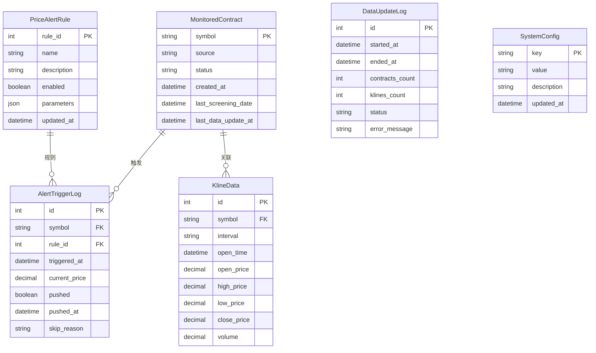

# Data Model Design: 价格触发预警监控系统

**Date**: 2025-12-08
**Feature**: 001-price-alert-monitor
**Prerequisite**: [research.md](./research.md) - Technical Research Report

## Overview

本文档定义价格触发预警监控系统的完整数据模型设计。系统包含**6个核心实体**，其中1个复用现有模型(KlineData)，5个新增模型。所有新增模型将添加到`grid_trading/django_models.py`中，遵循项目现有的Django ORM模式。

**设计原则**:
1. **复用优先**: 直接复用现有的`KlineData`模型存储K线数据
2. **索引优化**: 为高频查询字段添加数据库索引，确保查询性能<10ms
3. **状态完整**: 记录所有关键状态变更，便于审计和调试
4. **防重复机制**: 通过复合索引实现快速防重复查询

---

## Entity Relationship Diagram



---

## Model Definitions

### 1. MonitoredContract (监控合约) - 新增

**用途**: 存储所有被监控的合约标的，支持手动添加和自动同步两种来源

**Django Model**:

```python
class MonitoredContract(models.Model):
    """监控合约模型"""

    SOURCE_CHOICES = [
        ('manual', '手动添加'),
        ('auto', '自动筛选'),
    ]

    STATUS_CHOICES = [
        ('enabled', '启用'),
        ('disabled', '禁用'),
        ('expired', '已过期'),
    ]

    symbol = models.CharField(
        '合约代码',
        max_length=20,
        primary_key=True,
        help_text='如BTCUSDT'
    )

    source = models.CharField(
        '来源',
        max_length=10,
        choices=SOURCE_CHOICES,
        default='manual',
        db_index=True
    )

    status = models.CharField(
        '监控状态',
        max_length=10,
        choices=STATUS_CHOICES,
        default='enabled',
        db_index=True
    )

    created_at = models.DateTimeField(
        '添加时间',
        auto_now_add=True
    )

    last_screening_date = models.DateField(
        '最后筛选出现日期',
        null=True,
        blank=True,
        help_text='仅自动添加的合约有此字段'
    )

    last_data_update_at = models.DateTimeField(
        '最后数据更新时间',
        null=True,
        blank=True
    )

    class Meta:
        db_table = 'monitored_contract'
        verbose_name = '监控合约'
        verbose_name_plural = '监控合约'
        indexes = [
            models.Index(fields=['source', 'status']),  # 查询启用的自动合约
            models.Index(fields=['-last_screening_date']),  # 查询最近筛选日期
        ]

    def __str__(self):
        return f"{self.symbol} ({self.get_source_display()})"
```

**关键字段说明**:
- `symbol`: 主键，合约代码(如BTCUSDT)，唯一标识
- `source`: 来源类型，区分手动添加和自动同步
- `status`: 监控状态，支持启用/禁用/已过期三种状态
- `last_screening_date`: 仅自动合约有值，用于判断是否需要标记为过期

**查询场景**:
```python
# 查询所有启用状态的合约
active_contracts = MonitoredContract.objects.filter(status='enabled')

# 查询需要检查过期的自动合约(7天未出现在筛选结果)
from datetime import timedelta
from django.utils import timezone

expired_threshold = timezone.now().date() - timedelta(days=7)
expired_contracts = MonitoredContract.objects.filter(
    source='auto',
    status='enabled',
    last_screening_date__lt=expired_threshold
)
```

---

### 2. KlineData (K线数据) - 复用现有模型

**用途**: 存储所有监控合约的K线数据(1m/15m/4h三个周期)

**现有Model定义** (位于`grid_trading/django_models.py`):

```python
class KlineData(models.Model):
    """K线数据模型 (已存在)"""
    symbol = models.CharField('合约代码', max_length=20, db_index=True)
    interval = models.CharField('K线周期', max_length=5, db_index=True)
    open_time = models.DateTimeField('开盘时间', db_index=True)
    open_price = models.DecimalField('开盘价', max_digits=20, decimal_places=8)
    high_price = models.DecimalField('最高价', max_digits=20, decimal_places=8)
    low_price = models.DecimalField('最低价', max_digits=20, decimal_places=8)
    close_price = models.DecimalField('收盘价', max_digits=20, decimal_places=8)
    volume = models.DecimalField('成交量', max_digits=30, decimal_places=8)

    class Meta:
        db_table = 'kline_data'
        unique_together = [['symbol', 'interval', 'open_time']]  # 防止重复
        indexes = [
            models.Index(fields=['symbol', 'interval', '-open_time']),  # 查询最新K线
        ]
```

**复用决策**:
- ✅ 无需修改现有模型，字段完全满足需求
- ✅ 已有`unique_together`约束防止重复数据
- ✅ 已有索引优化查询性能
- ✅ 直接使用`KlineCache.get_klines()`方法获取和更新数据

**查询场景**:
```python
# 获取某合约最近7天的4h K线(通过KlineCache)
from grid_trading.services.kline_cache import KlineCache

cache = KlineCache(api_client=client)
klines_4h = cache.get_klines(
    symbol='BTCUSDT',
    interval='4h',
    limit=42,  # 7天×6根/天=42根
    use_cache=True
)
```

---

### 3. PriceAlertRule (价格触发规则) - 新增

**用途**: 存储5种预设的价格触发规则配置，支持启用/禁用和参数调整

**Django Model**:

```python
class PriceAlertRule(models.Model):
    """价格触发规则模型"""

    RULE_CHOICES = [
        (1, '7天价格新高(4h)'),
        (2, '7天价格新低(4h)'),
        (3, '价格触及MA20'),
        (4, '价格触及MA99'),
        (5, '价格达到分布区间90%极值'),
    ]

    rule_id = models.IntegerField(
        '规则ID',
        primary_key=True,
        choices=RULE_CHOICES,
        help_text='1-5对应5种预设规则'
    )

    name = models.CharField(
        '规则名称',
        max_length=50
    )

    description = models.TextField(
        '规则描述',
        help_text='规则的技术说明和判定逻辑'
    )

    enabled = models.BooleanField(
        '启用状态',
        default=True,
        db_index=True
    )

    parameters = models.JSONField(
        '规则参数',
        default=dict,
        help_text='JSON格式的参数配置,如{"ma_threshold": 0.5, "percentile": 90}'
    )

    updated_at = models.DateTimeField(
        '更新时间',
        auto_now=True
    )

    class Meta:
        db_table = 'price_alert_rule'
        verbose_name = '价格触发规则'
        verbose_name_plural = '价格触发规则'

    def __str__(self):
        return f"规则{self.rule_id}: {self.name}"
```

**初始数据** (通过Django migration或数据夹具加载):

```python
# 在migration中创建初始规则
from django.db import migrations

def create_initial_rules(apps, schema_editor):
    PriceAlertRule = apps.get_model('grid_trading', 'PriceAlertRule')

    rules = [
        {
            'rule_id': 1,
            'name': '7天价格新高(4h)',
            'description': '当前价格超过过去7天4h K线的最高价',
            'enabled': True,
            'parameters': {}
        },
        {
            'rule_id': 2,
            'name': '7天价格新低(4h)',
            'description': '当前价格低于过去7天4h K线的最低价',
            'enabled': True,
            'parameters': {}
        },
        {
            'rule_id': 3,
            'name': '价格触及MA20',
            'description': '当前价格在4h MA20的±0.5%范围内',
            'enabled': True,
            'parameters': {'ma_threshold': 0.5}  # ±0.5%
        },
        {
            'rule_id': 4,
            'name': '价格触及MA99',
            'description': '当前价格在4h MA99的±0.5%范围内',
            'enabled': True,
            'parameters': {'ma_threshold': 0.5}
        },
        {
            'rule_id': 5,
            'name': '价格达到分布区间90%极值',
            'description': '当前价格超过或低于过去7天4h K线价格分布的90%分位上限/下限',
            'enabled': True,
            'parameters': {'percentile': 90}
        },
    ]

    for rule in rules:
        PriceAlertRule.objects.create(**rule)

class Migration(migrations.Migration):
    dependencies = [
        ('grid_trading', 'XXXX_previous_migration'),
    ]

    operations = [
        migrations.RunPython(create_initial_rules),
    ]
```

**查询场景**:
```python
# 获取所有启用的规则
enabled_rules = PriceAlertRule.objects.filter(enabled=True)

# 获取特定规则的参数
rule3 = PriceAlertRule.objects.get(rule_id=3)
ma_threshold = rule3.parameters.get('ma_threshold', 0.5)
```

---

### 4. AlertTriggerLog (触发日志) - 新增

**用途**: 记录每次规则触发的详细日志，实现防重复推送和历史审计

**Django Model**:

```python
class AlertTriggerLog(models.Model):
    """触发日志模型"""

    symbol = models.CharField(
        '合约代码',
        max_length=20,
        db_index=True
    )

    rule_id = models.IntegerField(
        '规则ID',
        db_index=True,
        help_text='关联PriceAlertRule.rule_id'
    )

    triggered_at = models.DateTimeField(
        '触发时间',
        auto_now_add=True,
        db_index=True
    )

    current_price = models.DecimalField(
        '当前价格',
        max_digits=20,
        decimal_places=8
    )

    pushed = models.BooleanField(
        '是否已推送',
        default=False,
        db_index=True
    )

    pushed_at = models.DateTimeField(
        '推送时间',
        null=True,
        blank=True
    )

    skip_reason = models.CharField(
        '跳过原因',
        max_length=100,
        blank=True,
        help_text='如"防重复"、"推送失败"等'
    )

    extra_info = models.JSONField(
        '额外信息',
        default=dict,
        help_text='存储MA值、7天最高/最低等上下文信息'
    )

    class Meta:
        db_table = 'alert_trigger_log'
        verbose_name = '触发日志'
        verbose_name_plural = '触发日志'
        indexes = [
            # 核心索引: 查询某合约某规则的最近推送时间(防重复查询)
            models.Index(fields=['symbol', 'rule_id', '-pushed_at']),
            # 查询最近的触发记录
            models.Index(fields=['-triggered_at']),
            # 查询失败的推送(用于补偿重试)
            models.Index(fields=['pushed', 'skip_reason', '-triggered_at']),
        ]

    def __str__(self):
        return f"{self.symbol} 规则{self.rule_id} - {self.triggered_at}"
```

**查询场景**:
```python
# 防重复查询: 检查某合约某规则最近1小时内是否已推送
from datetime import timedelta
from django.utils import timezone

suppress_minutes = 60
threshold_time = timezone.now() - timedelta(minutes=suppress_minutes)

last_push = AlertTriggerLog.objects.filter(
    symbol='BTCUSDT',
    rule_id=1,
    pushed=True,
    pushed_at__gte=threshold_time
).first()

should_push = (last_push is None)

# 查询最近1小时失败的推送(补偿重试)
failed_logs = AlertTriggerLog.objects.filter(
    pushed=False,
    skip_reason='推送失败',
    triggered_at__gte=timezone.now() - timedelta(hours=1)
)
```

**性能估算**:
- 复合索引`(symbol, rule_id, -pushed_at)`确保防重复查询<10ms
- 100个合约×5条规则×每小时1次查询=500次查询/小时≈0.14次/秒，负载很低

---

### 5. DataUpdateLog (数据更新日志) - 新增

**用途**: 记录每次数据更新脚本的执行情况，便于监控和故障排查

**Django Model**:

```python
class DataUpdateLog(models.Model):
    """数据更新日志模型"""

    STATUS_CHOICES = [
        ('running', '执行中'),
        ('success', '成功'),
        ('failed', '失败'),
        ('timeout', '超时'),
    ]

    started_at = models.DateTimeField(
        '执行开始时间',
        auto_now_add=True,
        db_index=True
    )

    ended_at = models.DateTimeField(
        '执行结束时间',
        null=True,
        blank=True
    )

    contracts_count = models.IntegerField(
        '更新合约数量',
        default=0
    )

    klines_count = models.IntegerField(
        '获取K线总数',
        default=0,
        help_text='所有合约×所有周期的K线总数'
    )

    status = models.CharField(
        '执行状态',
        max_length=10,
        choices=STATUS_CHOICES,
        default='running',
        db_index=True
    )

    error_message = models.TextField(
        '错误信息',
        blank=True
    )

    execution_seconds = models.IntegerField(
        '执行耗时(秒)',
        null=True,
        blank=True
    )

    class Meta:
        db_table = 'data_update_log'
        verbose_name = '数据更新日志'
        verbose_name_plural = '数据更新日志'
        ordering = ['-started_at']

    def __str__(self):
        return f"数据更新 {self.started_at} - {self.status}"

    def complete(self, status='success', error_message=''):
        """标记执行完成"""
        self.ended_at = timezone.now()
        self.status = status
        self.error_message = error_message
        if self.ended_at and self.started_at:
            self.execution_seconds = int((self.ended_at - self.started_at).total_seconds())
        self.save()
```

**使用示例**:
```python
# 在数据更新脚本中使用
log = DataUpdateLog.objects.create()

try:
    # 执行数据更新逻辑
    contracts = MonitoredContract.objects.filter(status='enabled')
    log.contracts_count = contracts.count()

    total_klines = 0
    for contract in contracts:
        klines = update_contract_klines(contract.symbol)
        total_klines += len(klines)

    log.klines_count = total_klines
    log.complete(status='success')

except Exception as e:
    log.complete(status='failed', error_message=str(e))
    raise
```

**查询场景**:
```python
# 查询最近10次执行记录
recent_logs = DataUpdateLog.objects.all()[:10]

# 查询今日失败的执行
today_failed = DataUpdateLog.objects.filter(
    started_at__date=timezone.now().date(),
    status='failed'
)

# 查询平均执行时长(用于性能监控)
from django.db.models import Avg

avg_execution = DataUpdateLog.objects.filter(
    status='success'
).aggregate(Avg('execution_seconds'))
```

---

### 6. SystemConfig (系统配置) - 新增

**用途**: 存储系统级配置参数，支持动态修改无需重启服务

**Django Model**:

```python
class SystemConfig(models.Model):
    """系统配置模型"""

    key = models.CharField(
        '配置键',
        max_length=50,
        primary_key=True
    )

    value = models.TextField(
        '配置值',
        help_text='支持字符串、数字、JSON等格式'
    )

    description = models.CharField(
        '配置说明',
        max_length=200,
        blank=True
    )

    updated_at = models.DateTimeField(
        '更新时间',
        auto_now=True
    )

    class Meta:
        db_table = 'system_config'
        verbose_name = '系统配置'
        verbose_name_plural = '系统配置'

    def __str__(self):
        return f"{self.key} = {self.value}"

    @classmethod
    def get_value(cls, key, default=None):
        """获取配置值"""
        try:
            config = cls.objects.get(key=key)
            return config.value
        except cls.DoesNotExist:
            return default

    @classmethod
    def set_value(cls, key, value, description=''):
        """设置配置值"""
        config, created = cls.objects.update_or_create(
            key=key,
            defaults={'value': str(value), 'description': description}
        )
        return config
```

**初始配置** (通过migration或管理后台):

```python
# 在migration中创建初始配置
def create_initial_configs(apps, schema_editor):
    SystemConfig = apps.get_model('grid_trading', 'SystemConfig')

    configs = [
        {
            'key': 'duplicate_suppress_minutes',
            'value': '60',
            'description': '防重复推送间隔(分钟),默认60分钟'
        },
        {
            'key': 'data_update_interval_minutes',
            'value': '5',
            'description': '数据更新脚本执行间隔(分钟),默认5分钟'
        },
        {
            'key': 'sync_schedule_time',
            'value': '10:30',
            'description': '自动同步任务执行时间(HH:MM格式)'
        },
        {
            'key': 'huicheng_push_token',
            'value': '6020867bc6334c609d4f348c22f90f14',
            'description': '汇成推送接口Token'
        },
        {
            'key': 'huicheng_push_channel',
            'value': 'price_monitor',
            'description': '汇成推送渠道名称'
        },
        {
            'key': 'max_monitored_contracts',
            'value': '500',
            'description': '最大监控合约数量限制'
        },
    ]

    for config in configs:
        SystemConfig.objects.create(**config)
```

**使用示例**:
```python
# 获取防重复间隔
suppress_minutes = int(SystemConfig.get_value('duplicate_suppress_minutes', 60))

# 动态更新配置
SystemConfig.set_value('duplicate_suppress_minutes', 30, '修改为30分钟')

# 在规则检测中使用
def should_push_alert(symbol, rule_id):
    suppress_minutes = int(SystemConfig.get_value('duplicate_suppress_minutes', 60))
    threshold_time = timezone.now() - timedelta(minutes=suppress_minutes)

    last_push = AlertTriggerLog.objects.filter(
        symbol=symbol,
        rule_id=rule_id,
        pushed=True,
        pushed_at__gte=threshold_time
    ).first()

    return last_push is None
```

---

## Additional Model: ScriptLock (脚本锁) - 新增

**用途**: 实现脚本互斥机制，避免定时任务并发执行

**Django Model**:

```python
class ScriptLock(models.Model):
    """脚本锁模型"""

    lock_name = models.CharField(
        '锁名称',
        max_length=50,
        unique=True,
        primary_key=True
    )

    acquired_at = models.DateTimeField(
        '获取时间',
        auto_now=True
    )

    expires_at = models.DateTimeField(
        '过期时间'
    )

    class Meta:
        db_table = 'script_lock'
        verbose_name = '脚本锁'
        verbose_name_plural = '脚本锁'

    def __str__(self):
        return f"Lock: {self.lock_name}"
```

**使用方法** (已在research.md中详细说明):

```python
from django.db import transaction
from django.utils import timezone
from datetime import timedelta

def acquire_lock(lock_name: str, timeout_minutes: int = 10) -> bool:
    """获取脚本锁"""
    try:
        with transaction.atomic():
            lock, created = ScriptLock.objects.get_or_create(
                lock_name=lock_name,
                defaults={
                    'expires_at': timezone.now() + timedelta(minutes=timeout_minutes)
                }
            )

            if not created:
                if lock.expires_at < timezone.now():
                    lock.expires_at = timezone.now() + timedelta(minutes=timeout_minutes)
                    lock.save()
                    return True
                else:
                    return False

            return True
    except Exception as e:
        logger.error(f"获取锁失败: {e}")
        return False

def release_lock(lock_name: str):
    """释放脚本锁"""
    ScriptLock.objects.filter(lock_name=lock_name).delete()
```

---

## Database Migration Strategy

### Migration 顺序

**Migration 1: 创建新表**
```python
# grid_trading/migrations/0XXX_create_price_monitor_models.py

operations = [
    # 1. MonitoredContract
    migrations.CreateModel(
        name='MonitoredContract',
        fields=[...],
    ),

    # 2. PriceAlertRule
    migrations.CreateModel(
        name='PriceAlertRule',
        fields=[...],
    ),

    # 3. AlertTriggerLog
    migrations.CreateModel(
        name='AlertTriggerLog',
        fields=[...],
    ),

    # 4. DataUpdateLog
    migrations.CreateModel(
        name='DataUpdateLog',
        fields=[...],
    ),

    # 5. SystemConfig
    migrations.CreateModel(
        name='SystemConfig',
        fields=[...],
    ),

    # 6. ScriptLock
    migrations.CreateModel(
        name='ScriptLock',
        fields=[...],
    ),
]
```

**Migration 2: 添加索引**
```python
# grid_trading/migrations/0XXX_add_price_monitor_indexes.py

operations = [
    # MonitoredContract索引
    migrations.AddIndex(
        model_name='monitoredcontract',
        index=models.Index(fields=['source', 'status'], name='mc_source_status_idx'),
    ),

    # AlertTriggerLog复合索引(防重复查询优化)
    migrations.AddIndex(
        model_name='alerttriggerlog',
        index=models.Index(
            fields=['symbol', 'rule_id', '-pushed_at'],
            name='atl_dedup_idx'
        ),
    ),

    # ... 其他索引
]
```

**Migration 3: 初始化数据**
```python
# grid_trading/migrations/0XXX_initialize_price_monitor_data.py

operations = [
    migrations.RunPython(create_initial_rules),      # 创建5条规则
    migrations.RunPython(create_initial_configs),    # 创建初始配置
]
```

---

## Performance Considerations

### 查询性能优化

| 查询场景 | 索引 | 预计性能 |
|---------|------|---------|
| 查询启用的监控合约 | `status` | <5ms (100条记录) |
| 防重复推送检查 | `(symbol, rule_id, -pushed_at)` | <10ms |
| 查询最近触发记录 | `-triggered_at` | <10ms (前100条) |
| 查询执行日志 | `-started_at` | <5ms (前50条) |

### 数据增长预估

**假设监控100个合约**:

| 表 | 记录数 | 增长速度 | 6个月数据量 |
|----|--------|---------|------------|
| MonitoredContract | 100 | 稳定 | 100条 |
| KlineData | 210,000 | 每日新增600条 | 约108,000条(仅新增) |
| AlertTriggerLog | 43,200 | 每小时10条×24×180天 | 43,200条 |
| DataUpdateLog | 25,920 | 每5分钟1条×24×180天 | 25,920条 |
| SystemConfig | 6 | 稳定 | 6条 |

**总数据量**: 约27万条记录，SQLite单表可轻松支持，PostgreSQL性能更优

### 清理策略

建议定期清理历史数据:

```python
# 清理6个月前的触发日志
from datetime import timedelta
from django.utils import timezone

threshold = timezone.now() - timedelta(days=180)
AlertTriggerLog.objects.filter(triggered_at__lt=threshold).delete()

# 清理3个月前的数据更新日志
threshold = timezone.now() - timedelta(days=90)
DataUpdateLog.objects.filter(started_at__lt=threshold).delete()
```

---

## Testing Strategy

### Model测试

```python
# tests/unit/test_models.py

def test_monitored_contract_creation():
    """测试监控合约创建"""
    contract = MonitoredContract.objects.create(
        symbol='BTCUSDT',
        source='manual',
        status='enabled'
    )
    assert contract.symbol == 'BTCUSDT'
    assert contract.source == 'manual'

def test_alert_trigger_log_dedup_query():
    """测试防重复查询性能"""
    import time

    # 创建1000条日志
    for i in range(1000):
        AlertTriggerLog.objects.create(
            symbol='BTCUSDT',
            rule_id=1,
            current_price=40000 + i,
            pushed=True,
            pushed_at=timezone.now()
        )

    # 测试查询性能
    start = time.time()
    last_push = AlertTriggerLog.objects.filter(
        symbol='BTCUSDT',
        rule_id=1,
        pushed=True
    ).order_by('-pushed_at').first()
    elapsed = time.time() - start

    assert elapsed < 0.01  # <10ms
    assert last_push is not None
```

---

## Next Steps

1. ✅ 数据模型设计完成(`data-model.md` - 本文件)
2. ⏳ 创建API契约定义(`contracts/api.yaml`)
3. ⏳ 编写快速开始指南(`quickstart.md`)
4. ⏳ 更新agent context文件
5. ⏳ 执行数据库migrations
6. ⏳ 注册模型到Django Admin

---

**Document Status**: ✅ Completed
**Review Date**: 2025-12-08
**Approved By**: [Pending Review]
