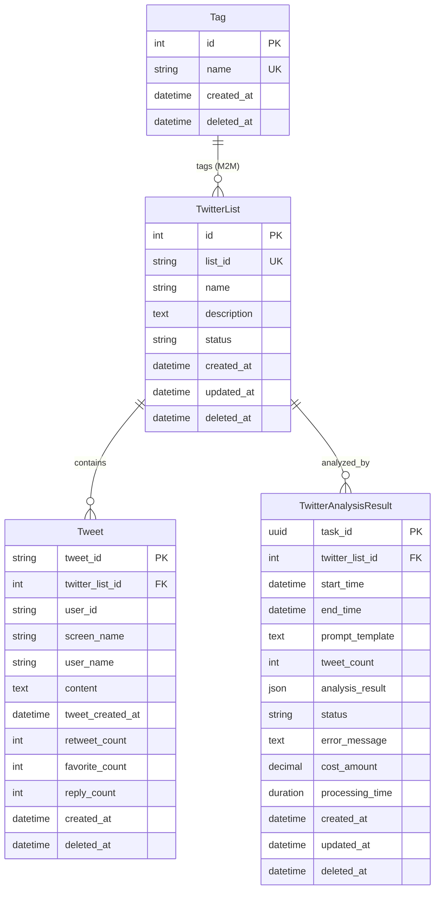

# 数据模型详细设计 (Data Model)

**Feature**: Twitter 应用集成与 AI 分析
**Version**: 1.0
**Last Updated**: 2025-11-13
**Status**: Design Phase

---

## 目录

- [概述](#概述)
- [数据库选择](#数据库选择)
- [模型清单](#模型清单)
- [详细设计](#详细设计)
  - [Tag (标签模型)](#tag-标签模型)
  - [TwitterList (Twitter List 模型)](#twitterlist-twitter-list-模型)
  - [Tweet (推文模型)](#tweet-推文模型)
  - [TwitterAnalysisResult (分析结果模型)](#twitteranalysisresult-分析结果模型)
  - [SoftDeleteModel (软删除基类)](#softdeletemodel-软删除基类)
- [数据关系图](#数据关系图)
- [索引策略](#索引策略)
- [数据迁移计划](#数据迁移计划)
- [性能考虑](#性能考虑)

---

## 概述

本文档定义了 Twitter 应用的核心数据模型，包括 4 个业务模型和 1 个基类模型。设计遵循以下原则：

1. **软删除优先**：所有模型继承 `SoftDeleteModel`，避免数据丢失
2. **去重保证**：使用唯一约束防止重复数据
3. **灵活存储**：使用 `JSONField` 存储非结构化的 AI 分析结果
4. **性能优化**：为高频查询字段创建索引
5. **审计友好**：记录创建时间、更新时间和成本信息

---

## 数据库选择

| 环境 | 数据库 | 理由 |
|------|--------|------|
| **开发/测试** | SQLite 3 | 零配置、轻量级、适合快速迭代 |
| **生产** | PostgreSQL 14+ | 支持 `JSONField` 高级查询、高并发、数据安全 |

**迁移兼容性**：所有字段类型均使用 Django ORM 抽象层，确保在 SQLite 和 PostgreSQL 之间无缝迁移。

---

## 模型清单

| 模型名称 | 数据库表名 | 用途 | 字段数 |
|---------|-----------|------|--------|
| `SoftDeleteModel` | (抽象基类) | 软删除功能基类 | 1 |
| `Tag` | `twitter_tags` | 标签分类管理 | 3 |
| `TwitterList` | `twitter_lists` | Twitter List 配置 | 7 |
| `Tweet` | `twitter_tweets` | 推文数据存储 | 11 |
| `TwitterAnalysisResult` | `twitter_analysis_results` | AI 分析任务和结果 | 14 |

---

## 详细设计

### SoftDeleteModel (软删除基类)

**设计理念**：为所有业务模型提供软删除能力，保留历史数据用于审计和数据恢复。

#### 字段定义

| 字段名 | 类型 | 约束 | 默认值 | 说明 |
|--------|------|------|--------|------|
| `deleted_at` | `DateTimeField` | `null=True, blank=True` | `None` | 软删除时间戳，`NULL` 表示未删除 |

#### 管理器

```python
# 默认管理器（只返回未删除记录）
objects = SoftDeleteManager()

# 包含已删除记录的管理器
all_objects = models.Manager()
```

#### 方法

```python
def delete(self):
    """软删除：标记为已删除，不从数据库物理删除"""
    self.deleted_at = timezone.now()
    self.save()

def hard_delete(self):
    """硬删除：真正从数据库删除"""
    super().delete()

def restore(self):
    """恢复已删除的记录"""
    self.deleted_at = None
    self.save()
```

#### 使用示例

```python
# 软删除
twitter_list.delete()  # 标记 deleted_at = now()

# 恢复
twitter_list.restore()  # 设置 deleted_at = None

# 硬删除（不可恢复）
twitter_list.hard_delete()

# 查询未删除记录
TwitterList.objects.all()  # 只返回 deleted_at IS NULL 的记录

# 查询所有记录（包括已删除）
TwitterList.all_objects.all()
```

---

### Tag (标签模型)

**用途**：为 Twitter List 和用户提供分类标签功能，便于管理和筛选。

#### 字段定义

| 字段名 | 类型 | Django 类型 | 约束 | 默认值 | 说明 |
|--------|------|------------|------|--------|------|
| `id` | Integer | `AutoField` | `primary_key=True` | 自增 | 主键 |
| `name` | String(100) | `CharField(max_length=100)` | `unique=True` | 必填 | 标签名称（唯一） |
| `created_at` | DateTime | `DateTimeField` | `auto_now_add=True` | 当前时间 | 创建时间 |
| `deleted_at` | DateTime | `DateTimeField` | `null=True, blank=True` | `None` | 软删除时间（继承） |

#### 索引

- **主键索引**：`id` (自动)
- **唯一索引**：`name` (unique=True)

#### Meta 配置

```python
class Meta:
    db_table = 'twitter_tags'
    ordering = ['name']
    verbose_name = '标签'
    verbose_name_plural = '标签'
```

#### 使用场景

```python
# 创建标签
crypto_tag = Tag.objects.create(name='Crypto')
defi_tag = Tag.objects.create(name='DeFi')

# 为 Twitter List 添加标签（多对多关系）
twitter_list.tags.add(crypto_tag, defi_tag)
```

---

### TwitterList (Twitter List 模型)

**用途**：存储 Twitter List 的配置信息，作为推文获取和分析的入口。

#### 字段定义

| 字段名 | 类型 | Django 类型 | 约束 | 默认值 | 说明 |
|--------|------|------------|------|--------|------|
| `id` | Integer | `AutoField` | `primary_key=True` | 自增 | 主键 |
| `list_id` | String(50) | `CharField(max_length=50)` | `unique=True` | 必填 | Twitter List ID（唯一） |
| `name` | String(255) | `CharField(max_length=255)` | 必填 | 必填 | List 名称 |
| `description` | Text | `TextField` | `blank=True` | `''` | List 描述 |
| `status` | String(20) | `CharField(max_length=20)` | `choices=STATUS_CHOICES` | `'active'` | 状态 |
| `tags` | ManyToMany | `ManyToManyField(Tag)` | `blank=True` | - | 关联的标签 |
| `created_at` | DateTime | `DateTimeField` | `auto_now_add=True` | 当前时间 | 创建时间 |
| `updated_at` | DateTime | `DateTimeField` | `auto_now=True` | 当前时间 | 更新时间 |
| `deleted_at` | DateTime | `DateTimeField` | `null=True, blank=True` | `None` | 软删除时间（继承） |

#### 状态枚举

```python
STATUS_CHOICES = [
    ('active', '活跃'),      # 正常使用中
    ('inactive', '不活跃'),  # 暂时停用
    ('archived', '已归档'),  # 归档保留
]
```

#### 索引

```python
indexes = [
    models.Index(fields=['list_id'], name='twitter_list_id_idx'),
    models.Index(fields=['status'], name='twitter_list_status_idx'),
    models.Index(fields=['created_at'], name='twitter_list_created_idx'),
]
```

#### 约束

- **唯一约束**：`list_id` (防止重复配置同一个 List)

#### 类方法

```python
@classmethod
def get_active_lists(cls):
    """获取所有活跃的 Lists"""
    return cls.objects.filter(status='active', deleted_at__isnull=True)

@classmethod
def create_or_update_list(cls, list_id: str, name: str, description: str = ''):
    """创建或更新 Twitter List"""
    twitter_list, created = cls.objects.update_or_create(
        list_id=list_id,
        defaults={'name': name, 'description': description, 'status': 'active'}
    )
    return twitter_list, created
```

#### Meta 配置

```python
class Meta:
    db_table = 'twitter_lists'
    ordering = ['-updated_at']
    verbose_name = 'Twitter List'
    verbose_name_plural = 'Twitter Lists'
```

---

### Tweet (推文模型)

**用途**：存储从 Twitter List 获取的推文数据，支持去重和关联查询。

#### 字段定义

| 字段名 | 类型 | Django 类型 | 约束 | 默认值 | 说明 |
|--------|------|------------|------|--------|------|
| `tweet_id` | String(50) | `CharField(max_length=50)` | `primary_key=True` | 必填 | 推文 ID（主键） |
| `twitter_list` | ForeignKey | `ForeignKey(TwitterList)` | `on_delete=CASCADE` | 必填 | 关联的 Twitter List |
| `user_id` | String(50) | `CharField(max_length=50)` | `db_index=True` | `''` | 作者的 Twitter 用户 ID |
| `screen_name` | String(100) | `CharField(max_length=100)` | `db_index=True` | `'unknown'` | 作者的用户名 |
| `user_name` | String(200) | `CharField(max_length=200)` | `blank=True` | `''` | 作者的显示名称 |
| `content` | Text | `TextField` | 必填 | 必填 | 推文内容（全文） |
| `tweet_created_at` | DateTime | `DateTimeField` | 必填 | 必填 | 推文发布时间 |
| `retweet_count` | Integer | `IntegerField` | 必填 | `0` | 转发数 |
| `favorite_count` | Integer | `IntegerField` | 必填 | `0` | 点赞数 |
| `reply_count` | Integer | `IntegerField` | 必填 | `0` | 回复数 |
| `created_at` | DateTime | `DateTimeField` | `auto_now_add=True` | 当前时间 | 入库时间 |
| `deleted_at` | DateTime | `DateTimeField` | `null=True, blank=True` | `None` | 软删除时间（继承） |

#### 索引

```python
indexes = [
    # 主键索引（自动）
    models.Index(fields=['tweet_id'], name='twitter_tweet_id_idx'),

    # 外键索引
    models.Index(fields=['twitter_list'], name='twitter_tweet_list_idx'),

    # 作者索引（支持按用户查询）
    models.Index(fields=['user_id'], name='twitter_tweet_user_id_idx'),
    models.Index(fields=['screen_name'], name='twitter_tweet_screen_name_idx'),

    # 时间索引（支持按时间范围查询）
    models.Index(fields=['tweet_created_at'], name='twitter_tweet_created_at_idx'),

    # 复合索引（优化常见查询）
    models.Index(fields=['twitter_list', 'tweet_created_at'], name='twitter_tweet_list_time_idx'),
]
```

#### 约束

- **主键约束**：`tweet_id` (使用 Twitter 的 tweet_id 作为主键，自动去重)
- **外键约束**：`twitter_list` (级联删除，删除 List 时同时删除相关推文)

#### 去重策略

```python
# 方式 1：使用 get_or_create
tweet, created = Tweet.objects.get_or_create(
    tweet_id=tweet_data['tweet_id'],
    defaults={
        'twitter_list': twitter_list,
        'content': tweet_data['content'],
        ...
    }
)

# 方式 2：使用 update_or_create（更新已存在的推文）
tweet, created = Tweet.objects.update_or_create(
    tweet_id=tweet_data['tweet_id'],
    defaults={
        'retweet_count': tweet_data['retweet_count'],
        'favorite_count': tweet_data['favorite_count'],
        ...
    }
)

# 方式 3：批量创建（自动忽略冲突）
Tweet.objects.bulk_create(
    tweet_objects,
    ignore_conflicts=True  # 忽略主键冲突
)
```

#### 类方法

```python
@classmethod
def get_tweets_in_range(cls, twitter_list, start_time, end_time):
    """获取指定时间范围内的推文"""
    return cls.objects.filter(
        twitter_list=twitter_list,
        tweet_created_at__gte=start_time,
        tweet_created_at__lte=end_time,
        deleted_at__isnull=True
    ).order_by('tweet_created_at')

@classmethod
def bulk_create_tweets(cls, tweet_data_list: List[Dict]) -> int:
    """批量创建推文，返回创建数量"""
    tweet_objects = [cls(**data) for data in tweet_data_list]
    result = cls.objects.bulk_create(tweet_objects, ignore_conflicts=True)
    return len(result)
```

#### Meta 配置

```python
class Meta:
    db_table = 'twitter_tweets'
    ordering = ['-tweet_created_at']
    verbose_name = '推文'
    verbose_name_plural = '推文'
```

---

### TwitterAnalysisResult (分析结果模型)

**用途**：存储 AI 分析任务的执行状态和分析结果，支持任务追踪和成本审计。

#### 字段定义

| 字段名 | 类型 | Django 类型 | 约束 | 默认值 | 说明 |
|--------|------|------------|------|--------|------|
| `task_id` | UUID | `UUIDField` | `unique=True, default=uuid4` | UUID | 任务唯一 ID（主键） |
| `twitter_list` | ForeignKey | `ForeignKey(TwitterList)` | `on_delete=CASCADE` | 必填 | 关联的 Twitter List |
| `start_time` | DateTime | `DateTimeField` | 必填 | 必填 | 分析时间范围开始 |
| `end_time` | DateTime | `DateTimeField` | 必填 | 必填 | 分析时间范围结束 |
| `prompt_template` | Text | `TextField` | 必填 | 必填 | 使用的提示词模板 |
| `tweet_count` | Integer | `IntegerField` | 必填 | `0` | 分析的推文数量 |
| `analysis_result` | JSON | `JSONField` | 必填 | `{}` | AI 分析结果（JSON） |
| `status` | String(20) | `CharField(max_length=20)` | `choices=STATUS_CHOICES` | `'pending'` | 任务状态 |
| `error_message` | Text | `TextField` | `blank=True` | `''` | 错误信息（失败时） |
| `cost_amount` | Decimal | `DecimalField(max_digits=10, decimal_places=4)` | 必填 | `0.0000` | API 调用成本（美元） |
| `processing_time` | Duration | `DurationField` | `null=True, blank=True` | `None` | 处理耗时 |
| `created_at` | DateTime | `DateTimeField` | `auto_now_add=True` | 当前时间 | 任务创建时间 |
| `updated_at` | DateTime | `DateTimeField` | `auto_now=True` | 当前时间 | 任务更新时间 |
| `deleted_at` | DateTime | `DateTimeField` | `null=True, blank=True` | `None` | 软删除时间（继承） |

#### 状态枚举

```python
STATUS_CHOICES = [
    ('pending', '待处理'),     # 任务已创建，等待执行
    ('running', '执行中'),     # 任务正在执行
    ('completed', '已完成'),   # 任务成功完成
    ('failed', '失败'),        # 任务执行失败
    ('cancelled', '已取消'),   # 任务被用户取消
]
```

#### 状态转换规则

```
pending → running → completed
pending → running → failed
pending → cancelled
running → cancelled
```

#### 索引

```python
indexes = [
    # 主键索引（自动）
    models.Index(fields=['task_id'], name='twitter_analysis_task_id_idx'),

    # 外键索引
    models.Index(fields=['twitter_list'], name='twitter_analysis_list_idx'),

    # 状态索引（支持按状态筛选）
    models.Index(fields=['status'], name='twitter_analysis_status_idx'),

    # 时间索引（支持按时间范围查询）
    models.Index(fields=['start_time', 'end_time'], name='twitter_analysis_time_range_idx'),
    models.Index(fields=['created_at'], name='twitter_analysis_created_idx'),

    # 复合索引（优化常见查询）
    models.Index(fields=['twitter_list', 'status'], name='twitter_analysis_list_status_idx'),
    models.Index(fields=['status', 'created_at'], name='twitter_analysis_status_time_idx'),
]
```

#### 约束

- **唯一约束**：`task_id` (UUID 保证全局唯一)
- **外键约束**：`twitter_list` (级联删除)

#### 分析结果 JSON 格式

```json
{
  "summary": "市场整体偏多头情绪，主要关注 BTC 和 ETH 走势",
  "sentiment": {
    "bullish": 65,
    "bearish": 20,
    "neutral": 15
  },
  "key_topics": [
    {
      "topic": "BTC 价格突破",
      "mentions": 120,
      "sentiment": "positive"
    },
    {
      "topic": "ETH 合并进展",
      "mentions": 85,
      "sentiment": "positive"
    }
  ],
  "trading_signals": [
    {
      "type": "buy",
      "asset": "BTC",
      "confidence": 0.75,
      "reasoning": "多个 KOL 提到突破关键阻力位"
    }
  ],
  "notable_tweets": [
    {
      "tweet_id": "1234567890",
      "author": "crypto_analyst",
      "content": "BTC 即将突破 50k...",
      "impact_score": 0.85
    }
  ],
  "metadata": {
    "model": "deepseek-chat",
    "tokens_used": 15000,
    "analysis_timestamp": "2025-11-13T10:30:00Z"
  }
}
```

#### 类方法

```python
@classmethod
def create_analysis_task(cls, twitter_list, start_time, end_time, prompt_template):
    """创建新的分析任务"""
    analysis = cls(
        twitter_list=twitter_list,
        start_time=start_time,
        end_time=end_time,
        prompt_template=prompt_template,
        status='pending'
    )
    analysis.full_clean()  # 验证数据
    analysis.save()
    return analysis

def mark_as_running(self):
    """标记任务为执行中"""
    self.status = 'running'
    self.save(update_fields=['status', 'updated_at'])

def mark_as_completed(self, analysis_result: dict, tweet_count: int,
                      cost_amount: Decimal, processing_time: timedelta):
    """标记任务为完成"""
    self.status = 'completed'
    self.analysis_result = analysis_result
    self.tweet_count = tweet_count
    self.cost_amount = Decimal(str(cost_amount))  # 确保是 Decimal 类型
    self.processing_time = processing_time
    self.save(update_fields=[
        'status', 'analysis_result', 'tweet_count',
        'cost_amount', 'processing_time', 'updated_at'
    ])

def mark_as_failed(self, error_message: str):
    """标记任务为失败"""
    self.status = 'failed'
    self.error_message = error_message
    self.save(update_fields=['status', 'error_message', 'updated_at'])

def mark_as_cancelled(self):
    """标记任务为已取消"""
    self.status = 'cancelled'
    self.save(update_fields=['status', 'updated_at'])

@classmethod
def get_pending_tasks(cls):
    """获取所有待处理的任务"""
    return cls.objects.filter(status='pending', deleted_at__isnull=True)

@classmethod
def get_running_tasks(cls):
    """获取所有执行中的任务"""
    return cls.objects.filter(status='running', deleted_at__isnull=True)
```

#### Meta 配置

```python
class Meta:
    db_table = 'twitter_analysis_results'
    ordering = ['-created_at']
    verbose_name = 'Twitter 分析结果'
    verbose_name_plural = 'Twitter 分析结果'
```

---

## 数据关系图



---

## 索引策略

### 索引优先级

| 优先级 | 索引类型 | 适用场景 | 示例 |
|--------|---------|---------|------|
| **P0** | 主键索引 | 所有表（自动） | `tweet_id`, `task_id` |
| **P1** | 唯一索引 | 防止重复数据 | `list_id`, `name` (Tag) |
| **P2** | 外键索引 | JOIN 查询优化 | `twitter_list_id` |
| **P3** | 时间范围索引 | 按时间筛选 | `tweet_created_at`, `start_time/end_time` |
| **P4** | 复合索引 | 常见组合查询 | `(twitter_list, tweet_created_at)` |

### 索引维护建议

1. **定期分析索引使用情况**（PostgreSQL）：
   ```sql
   SELECT * FROM pg_stat_user_indexes WHERE schemaname = 'public';
   ```

2. **监控索引膨胀**：
   - 软删除可能导致索引包含大量已删除记录
   - 定期运行 `VACUUM ANALYZE` (PostgreSQL)

3. **避免过度索引**：
   - SQLite 每个表最多 64 个索引
   - 每个索引都会增加写入开销

---

## 数据迁移计划

### Phase 1: 创建基础表（优先级：P0）

```bash
# 创建迁移文件
python manage.py makemigrations twitter

# 执行迁移
python manage.py migrate twitter
```

**包含表**：
- `twitter_tags`
- `twitter_lists`
- `twitter_tweets`
- `twitter_analysis_results`
- `twitter_lists_tags` (M2M 中间表)

### Phase 2: 初始化数据（优先级：P1）

```python
# management/commands/init_twitter_data.py
from django.core.management.base import BaseCommand
from twitter.models import Tag, TwitterList

class Command(BaseCommand):
    def handle(self, *args, **options):
        # 创建默认标签
        Tag.objects.get_or_create(name='Crypto')
        Tag.objects.get_or_create(name='DeFi')
        Tag.objects.get_or_create(name='NFT')

        self.stdout.write(self.style.SUCCESS('初始化数据完成'))
```

### Phase 3: 数据验证（优先级：P2）

```python
# 验证约束
assert Tweet.objects.filter(tweet_id='').count() == 0, "tweet_id 不能为空"

# 验证软删除
assert TwitterList.objects.count() <= TwitterList.all_objects.count(), "软删除失效"

# 验证 JSON 格式
for result in TwitterAnalysisResult.objects.filter(status='completed'):
    assert isinstance(result.analysis_result, dict), f"task {result.task_id} JSON 格式错误"
```

### Phase 4: 数据迁移脚本（从旧系统迁移，可选）

```python
# management/commands/migrate_from_old_system.py
def migrate_tweets(old_db, new_db):
    """从旧系统迁移推文数据"""
    for old_tweet in old_db.tweets.all():
        Tweet.objects.get_or_create(
            tweet_id=old_tweet.id,
            defaults={
                'content': old_tweet.text,
                'tweet_created_at': old_tweet.created_at,
                ...
            }
        )
```

---

## 性能考虑

### 写入性能优化

1. **批量插入推文**：
   ```python
   # 使用 bulk_create，每批 500 条
   batch_size = 500
   for i in range(0, len(tweets), batch_size):
       batch = tweets[i:i+batch_size]
       Tweet.objects.bulk_create(batch, ignore_conflicts=True)
   ```

2. **延迟更新索引**（仅在大批量导入时）：
   ```sql
   -- PostgreSQL
   DROP INDEX CONCURRENTLY twitter_tweet_created_at_idx;
   -- 导入数据...
   CREATE INDEX CONCURRENTLY twitter_tweet_created_at_idx ON twitter_tweets(tweet_created_at);
   ```

### 查询性能优化

1. **使用 `select_related` 减少 JOIN 查询**：
   ```python
   # 优化前（N+1 查询）
   for tweet in Tweet.objects.all():
       print(tweet.twitter_list.name)  # 每次都查询数据库

   # 优化后（单次 JOIN 查询）
   for tweet in Tweet.objects.select_related('twitter_list'):
       print(tweet.twitter_list.name)
   ```

2. **使用 `prefetch_related` 优化多对多查询**：
   ```python
   # 优化标签查询
   lists = TwitterList.objects.prefetch_related('tags').all()
   for lst in lists:
       print(lst.tags.all())  # 不再查询数据库
   ```

3. **使用 `only()` 减少字段查询**：
   ```python
   # 只查询需要的字段
   tweets = Tweet.objects.only('tweet_id', 'content', 'tweet_created_at')
   ```

### JSON 字段查询优化（PostgreSQL）

1. **使用 JSON 索引**（PostgreSQL 特性）：
   ```python
   # 在 models.py 中添加 GIN 索引
   indexes = [
       GinIndex(fields=['analysis_result'], name='twitter_analysis_result_gin_idx')
   ]
   ```

2. **JSON 查询示例**：
   ```python
   # 查询多头情绪占比 > 60% 的分析结果
   results = TwitterAnalysisResult.objects.filter(
       analysis_result__sentiment__bullish__gt=60
   )
   ```

### 软删除性能影响

1. **定期清理已删除数据**（建议每月执行）：
   ```python
   # 硬删除 90 天前的已删除记录
   cutoff_date = timezone.now() - timedelta(days=90)
   TwitterAnalysisResult.all_objects.filter(
       deleted_at__lt=cutoff_date
   ).delete()  # 硬删除
   ```

2. **使用部分索引**（PostgreSQL）：
   ```sql
   -- 只为未删除的记录创建索引
   CREATE INDEX twitter_tweet_active_created_at_idx
   ON twitter_tweets(tweet_created_at)
   WHERE deleted_at IS NULL;
   ```

---

## 总结

本数据模型设计遵循以下核心原则：

1. **灵活性**：使用 `JSONField` 存储非结构化数据，适应 AI 输出的多样性
2. **可靠性**：软删除机制保留历史数据，支持数据恢复和审计
3. **性能**：精心设计的索引策略确保高频查询的高效执行
4. **可扩展性**：标签系统和状态机设计支持未来功能扩展
5. **一致性**：遵循 Django ORM 最佳实践，与项目现有模型风格一致

**下一步**：基于本数据模型设计，实现 Django models 和数据库迁移脚本。
