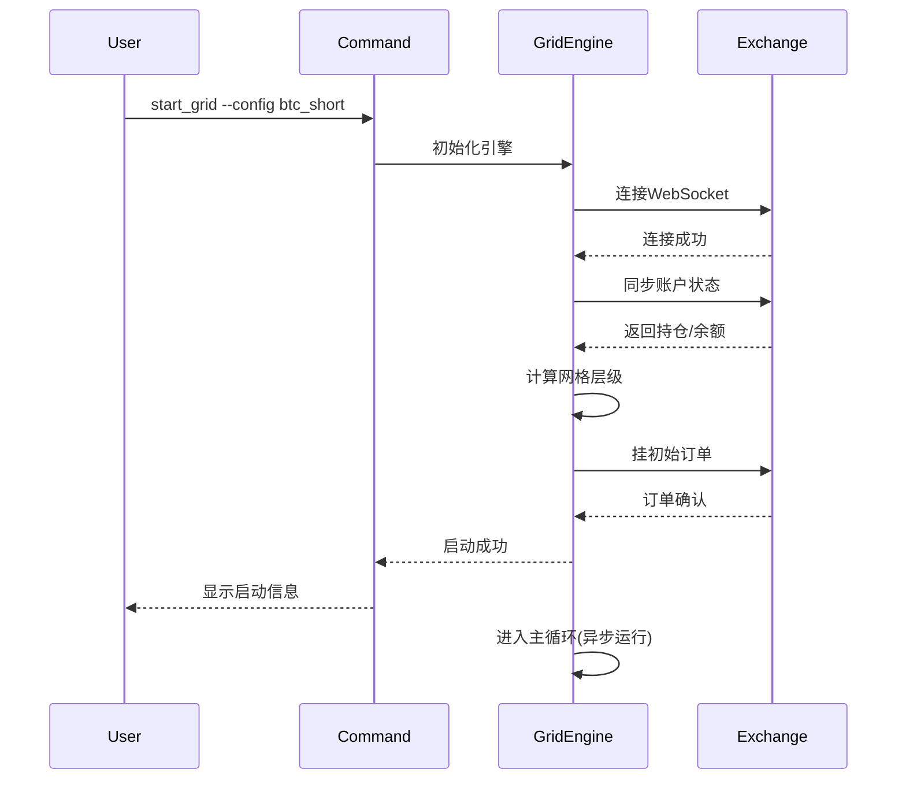
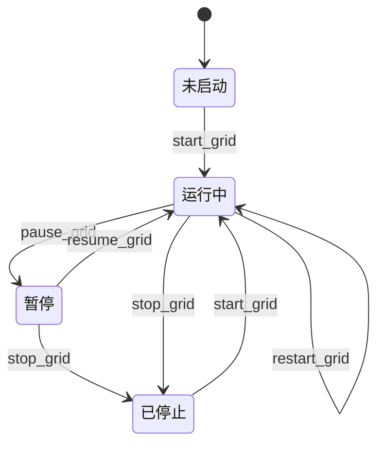

# Management Command API: 网格生命周期控制

**说明**: 本文档定义网格策略的启动、停止、暂停、恢复、状态查询等生命周期管理命令。

---

## 1. 启动网格策略

### 命令
```bash
python manage.py start_grid --config <配置名称>
```

### 参数

| 参数名 | 类型 | 必填 | 说明 |
|--------|------|------|------|
| `--config` | string | 是 | 网格配置名称 |

### 前置条件
- ✅ 配置存在且未运行
- ✅ 配置参数有效
- ✅ 交易所API Key已配置
- ✅ 账户余额充足

### 执行流程



### 示例

```bash
python manage.py start_grid --config btc_short_grid
```

### 输出

**启动中**:
```
🚀 正在启动网格策略: btc_short_grid

[1/6] 加载配置...                    ✅ 完成
[2/6] 连接币安WebSocket...           ✅ 完成
[3/6] 同步账户状态...                 ✅ 完成
      当前余额: 1,250.50 USDT
      当前持仓: 0.00 BTC
[4/6] 计算网格层级...                 ✅ 完成
      网格中心: 62,500 USDT
      生成层级: 20层 (-10 ~ +10)
[5/6] 挂初始订单...                   ✅ 完成 (8/8)
      开仓卖单: 8个 (价格 62,625 ~ 65,000)
[6/6] 启动主循环...                   ✅ 完成

✅ 网格策略已启动
进程PID: 12345
日志文件: /var/log/grid/btc_short_grid.log
监控命令: python manage.py grid_status --config btc_short_grid
停止命令: python manage.py stop_grid --config btc_short_grid

按 Ctrl+C 退出日志查看(策略将继续后台运行)
```

**实时日志输出**:
```
[2025-12-05 14:30:15] INFO  网格策略运行中...
[2025-12-05 14:30:16] ORDER 创建卖单: 价格=62,625, 数量=0.01, ID=btc_short_ENTRY_SELL_1_a3f2
[2025-12-05 14:30:17] ORDER 创建卖单: 价格=62,875, 数量=0.01, ID=btc_short_ENTRY_SELL_2_b4e1
...
[2025-12-05 14:32:45] FILL  订单成交: ID=123456, 价格=62,625, 数量=0.01
[2025-12-05 14:32:46] ORDER 创建买单: 价格=62,375, 数量=0.01, ID=btc_short_EXIT_BUY_1_c5d3
```

**失败 - 配置不存在**:
```
❌ 错误: 配置 'btc_short_grid' 不存在
使用 list_grid_configs 查看所有配置
```

**失败 - 配置已运行**:
```
❌ 错误: 配置 'btc_short_grid' 已在运行
PID: 12345, 运行时长: 2小时30分钟
使用 grid_status --config btc_short_grid 查看状态
```

**失败 - WebSocket连接失败**:
```
❌ 错误: WebSocket连接失败
详细信息: Connection refused (Binance Futures API)
建议:
  1. 检查网络连接
  2. 检查API Key配置是否正确
  3. 确认币安服务是否正常
```

---

## 2. 停止网格策略

### 命令
```bash
python manage.py stop_grid --config <配置名称> [--no-close-position]
```

### 参数

| 参数名 | 类型 | 必填 | 说明 |
|--------|------|------|------|
| `--config` | string | 是 | 网格配置名称 |
| `--no-close-position` | flag | 否 | 不平仓,仅撤单和停止策略 |

### 执行操作
1. ✅ 撤销所有未成交挂单
2. ✅ 市价平仓所有持仓(除非使用--no-close-position)
3. ✅ 清空网格状态
4. ✅ 断开WebSocket连接
5. ✅ 保存统计数据
6. ✅ 标记配置为is_active=False

### 示例

```bash
# 停止策略并平仓
python manage.py stop_grid --config btc_short_grid

# 停止策略但保留持仓
python manage.py stop_grid --config btc_short_grid --no-close-position
```

### 输出

**正常停止**:
```
⏹️  正在停止网格策略: btc_short_grid

[1/5] 撤销挂单...                     ✅ 完成 (12个订单已撤销)
[2/5] 市价平仓...                     ✅ 完成
      平仓数量: 0.08 BTC
      平仓价格: 62,450 USDT (平均)
      滑点: 0.12%
      已实现盈亏: +12.50 USDT
[3/5] 清空网格状态...                 ✅ 完成
[4/5] 断开WebSocket...                ✅ 完成
[5/5] 保存统计数据...                 ✅ 完成

✅ 网格策略已停止
运行时长: 3小时45分钟
总交易次数: 156次
已实现盈亏: +45.80 USDT
未实现盈亏: 0.00 USDT (已全部平仓)
最大回撤: 1.8%

查看完整报告: python manage.py grid_report --config btc_short_grid
```

**保留持仓模式**:
```
⏹️  正在停止网格策略: btc_short_grid (保留持仓模式)

[1/4] 撤销挂单...                     ✅ 完成 (12个订单已撤销)
[2/4] 清空网格状态...                 ✅ 完成
[3/4] 断开WebSocket...                ✅ 完成
[4/4] 保存统计数据...                 ✅ 完成

⚠️  注意: 未平仓持仓
当前持仓: -0.08 BTC (空头)
未实现盈亏: -5.20 USDT
请手动管理持仓或重新启动网格策略

✅ 网格策略已停止(持仓保留)
```

**失败 - 策略未运行**:
```
❌ 错误: 配置 'btc_short_grid' 未运行
使用 start_grid --config btc_short_grid 启动策略
```

---

## 3. 暂停网格策略

### 命令
```bash
python manage.py pause_grid --config <配置名称>
```

### 说明
暂停后:
- ✅ 停止轮询和新订单创建
- ✅ 保留现有挂单和持仓
- ✅ WebSocket保持连接(监听成交)
- ✅ 可以使用resume_grid恢复

### 示例

```bash
python manage.py pause_grid --config btc_short_grid
```

### 输出

```
⏸️  正在暂停网格策略: btc_short_grid

[1/2] 停止轮询...                     ✅ 完成
[2/2] 保存当前状态...                 ✅ 完成

✅ 网格策略已暂停
当前挂单: 12个 (保留)
当前持仓: -0.08 BTC (保留)
WebSocket: 保持连接(监听成交)

恢复命令: python manage.py resume_grid --config btc_short_grid
停止命令: python manage.py stop_grid --config btc_short_grid
```

---

## 4. 恢复网格策略

### 命令
```bash
python manage.py resume_grid --config <配置名称>
```

### 说明
从暂停状态恢复:
- ✅ 恢复轮询
- ✅ 从现有持仓和挂单状态继续运行
- ✅ 不重新初始化网格(保持原有状态)

### 示例

```bash
python manage.py resume_grid --config btc_short_grid
```

### 输出

```
▶️  正在恢复网格策略: btc_short_grid

[1/3] 同步账户状态...                 ✅ 完成
      当前持仓: -0.08 BTC
      当前挂单: 12个
[2/3] 验证网格状态...                 ✅ 完成
[3/3] 启动轮询...                     ✅ 完成

✅ 网格策略已恢复
进程PID: 12678
暂停时长: 15分钟

策略将从现有状态继续运行,不会重新初始化网格
```

---

## 5. 查询网格状态

### 命令
```bash
python manage.py grid_status --config <配置名称> [--watch]
```

### 参数

| 参数名 | 类型 | 必填 | 说明 |
|--------|------|------|------|
| `--config` | string | 是 | 网格配置名称 |
| `--watch` | flag | 否 | 持续监控(每5秒刷新) |

### 示例

```bash
# 查询一次
python manage.py grid_status --config btc_short_grid

# 持续监控
python manage.py grid_status --config btc_short_grid --watch
```

### 输出

```
📊 网格策略状态: btc_short_grid

运行信息:
  状态: ✅ 运行中
  PID: 12345
  运行时长: 3小时45分钟
  最后同步: 2秒前

市场信息:
  当前价格: 62,450 USDT
  24h涨跌: -2.3%
  价格位置: 网格中部 (49%)

仓位信息:
  当前持仓: -0.08 BTC (空头)
  持仓占比: 40% / 最大 0.2 BTC
  平均开仓价: 62,625 USDT
  未实现盈亏: +14.00 USDT (+0.22%)

订单信息:
  挂单数量: 12个 (开仓 6个, 平仓 6个)
  最近成交: 5分钟前 (卖单 @ 62,625)

网格覆盖:
  ┌──────────────────────────────┐
  │ 65,000 ████████░░░░░░░░░░░░ 上界
  │ 64,500 ████████░░░░░░░░░░░░
  │ 64,000 ████████░░░░░░░░░░░░
  │ 63,500 ████████░░░░░░░░░░░░
  │ 63,000 ████████████░░░░░░░░ <- 挂单
  │ 62,500 ████████████████████ <- 当前价
  │ 62,000 ████████████████████ <- 持仓
  │ 61,500 ████████████████████
  │ 61,000 ████████░░░░░░░░░░░░
  │ 60,500 ████████░░░░░░░░░░░░
  │ 60,000 ████████░░░░░░░░░░░░ 下界
  └──────────────────────────────┘

统计数据 (最近24小时):
  总交易次数: 156次
  成交率: 92%
  已实现盈亏: +45.80 USDT
  网格收益率: 1.5% / 天
  最大回撤: 1.8%

止损状态:
  止损触发线: 59,700 USDT (下) / 65,325 USDT (上)
  距离止损: -4.4% / +4.6%
  触发次数: 0次

WebSocket状态:
  连接状态: ✅ 已连接
  订阅流: 账户数据, 订单更新, 市场行情
  最后心跳: 1秒前
```

**监控模式 (--watch)**:
```
📊 网格策略状态: btc_short_grid (自动刷新 - 每5秒)

[实时更新的状态信息...]

最后更新: 2025-12-05 14:45:23
按 Ctrl+C 退出监控
```

**策略未运行**:
```
📊 网格策略状态: btc_short_grid

运行信息:
  状态: ⏹️ 已停止
  最后运行: 2025-12-05 10:30 ~ 14:15 (3小时45分钟)

最后持仓:
  持仓数量: 0.00 BTC (已全部平仓)
  最终盈亏: +45.80 USDT

统计摘要:
  总交易次数: 156次
  成交率: 92%
  网格收益率: 1.5% / 天

启动命令: python manage.py start_grid --config btc_short_grid
```

---

## 6. 强制重启策略

### 命令
```bash
python manage.py restart_grid --config <配置名称> [--force]
```

### 说明
相当于执行: `stop_grid` + `start_grid`

### 参数

| 参数名 | 类型 | 必填 | 说明 |
|--------|------|------|------|
| `--config` | string | 是 | 网格配置名称 |
| `--force` | flag | 否 | 强制重启(即使策略未运行) |

### 示例

```bash
python manage.py restart_grid --config btc_short_grid
```

### 输出

```
🔄 正在重启网格策略: btc_short_grid

第一步: 停止策略
  ⏹️  撤销挂单...                     ✅ 完成 (12个)
  ⏹️  市价平仓...                     ✅ 完成 (0.08 BTC)
  ⏹️  清空状态...                     ✅ 完成

等待5秒...

第二步: 启动策略
  🚀 连接WebSocket...                ✅ 完成
  🚀 同步账户...                     ✅ 完成
  🚀 初始化网格...                   ✅ 完成
  🚀 挂初始订单...                   ✅ 完成 (8/8)

✅ 网格策略已重启
新进程PID: 12890
```

---

## 生命周期状态转换图



---

## 常见问题

### Q: start_grid命令执行后是否会阻塞?
A: 不会。启动成功后,策略在后台运行(独立进程),命令会立即返回。可以使用`grid_status --watch`持续监控。

### Q: 如何查看策略日志?
A: 日志路径: `/var/log/grid/{config_name}.log` (可配置)
使用`tail -f`实时查看: `tail -f /var/log/grid/btc_short_grid.log`

### Q: stop_grid平仓时的滑点如何控制?
A: 使用市价单平仓,滑点取决于市场深度。建议在流动性充足时停止策略。

### Q: pause_grid和stop_grid的区别?
A:
- `pause_grid`: 暂停订单同步,保留挂单和持仓,WebSocket保持连接
- `stop_grid`: 完全停止策略,撤单并平仓(或保留持仓),断开连接

### Q: 重启服务器后策略会自动恢复吗?
A: 不会。需要手动重启或配置Supervisor自动启动。

### Q: 如何批量管理多个策略?
A: 可以编写Shell脚本:
```bash
#!/bin/bash
for config in btc_short eth_neutral sol_long; do
    python manage.py start_grid --config "$config"
done
```
