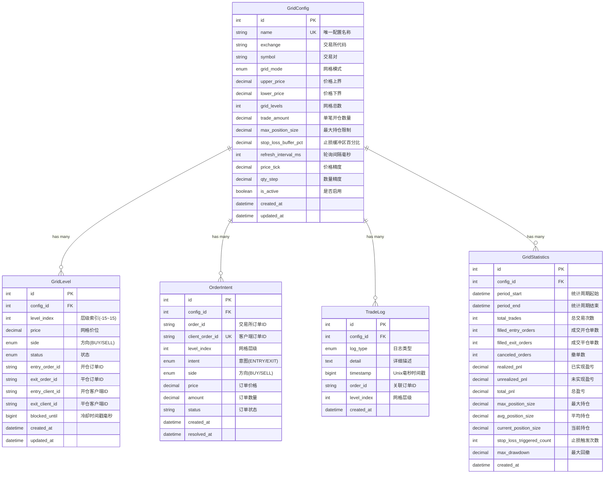

# 数据模型设计: 自动化网格交易系统

**日期**: 2025-12-05
**来源**: spec.md - Key Entities章节
**技术栈**: Django ORM + PostgreSQL

---

## 实体关系图 (ER Diagram)



---

## 1. GridConfig (网格配置)

### 用途
存储网格策略的所有配置参数,用户通过Django Admin或Management Command创建和管理。

### 字段定义

| 字段名 | 类型 | 约束 | 说明 |
|--------|------|------|------|
| `id` | Integer | PK, Auto | 主键 |
| `name` | String(100) | Unique, Not Null | 配置名称,唯一标识(如"btc_short_grid") |
| `exchange` | String(50) | Not Null | 交易所代码(binance/okx/bybit) |
| `symbol` | String(20) | Not Null | 交易对(BTCUSDT) |
| `grid_mode` | Enum | Not Null | 网格模式: SHORT/NEUTRAL/LONG |
| `upper_price` | Decimal(20,8) | Not Null, > 0 | 价格上界 |
| `lower_price` | Decimal(20,8) | Not Null, > 0 | 价格下界 |
| `grid_levels` | Integer | Not Null, >= 5 | 网格总数 |
| `trade_amount` | Decimal(20,8) | Not Null, > 0 | 单笔开仓数量(BTC/ETH等) |
| `max_position_size` | Decimal(20,8) | Not Null, > 0 | 最大持仓限制 |
| `stop_loss_buffer_pct` | Decimal(6,4) | Not Null, Default 0.005 | 止损缓冲区百分比(0.5%) |
| `refresh_interval_ms` | Integer | Not Null, Default 1000 | 轮询间隔毫秒(默认1秒) |
| `price_tick` | Decimal(20,8) | Not Null | 价格精度(如0.01) |
| `qty_step` | Decimal(20,8) | Not Null | 数量精度(如0.001) |
| `is_active` | Boolean | Not Null, Default False | 是否启用 |
| `created_at` | DateTime | Auto | 创建时间 |
| `updated_at` | DateTime | Auto | 更新时间 |

### 验证规则 (Django Model Clean)

```python
def clean(self):
    if self.lower_price >= self.upper_price:
        raise ValidationError("下界价格必须小于上界价格")

    if self.grid_levels < 5:
        raise ValidationError("网格数量至少为5")

    if self.max_position_size <= 0:
        raise ValidationError("最大持仓限制必须大于0")

    if self.trade_amount <= 0:
        raise ValidationError("单笔金额必须大于0")
```

### 索引

```python
class Meta:
    indexes = [
        models.Index(fields=['name']),  # 唯一名称查询
        models.Index(fields=['exchange', 'symbol']),  # 交易对查询
        models.Index(fields=['is_active']),  # 活跃策略查询
    ]
```

---

## 2. GridLevel (网格层级)

### 用途
记录单个网格价位的状态信息,包括该层级的订单ID和状态机状态。

### 字段定义

| 字段名 | 类型 | 约束 | 说明 |
|--------|------|------|------|
| `id` | Integer | PK, Auto | 主键 |
| `config_id` | ForeignKey | Not Null | 关联GridConfig |
| `level_index` | Integer | Not Null | 层级索引(-15~15,0为中心) |
| `price` | Decimal(20,8) | Not Null | 网格价位 |
| `side` | Enum | Not Null | 方向: BUY/SELL |
| `status` | Enum | Not Null | 状态: idle/entry_working/position_open/exit_working |
| `entry_order_id` | String(50) | Nullable | 开仓订单交易所ID |
| `exit_order_id` | String(50) | Nullable | 平仓订单交易所ID |
| `entry_client_id` | String(100) | Nullable | 开仓订单客户端ID |
| `exit_client_id` | String(100) | Nullable | 平仓订单客户端ID |
| `blocked_until` | BigInteger | Nullable | 冷却时间戳(Unix毫秒),为NULL表示不冷却 |
| `created_at` | DateTime | Auto | 创建时间 |
| `updated_at` | DateTime | Auto | 更新时间 |

### 状态机 (State Machine)


**状态说明**:
- `idle`: 空闲,未挂单
- `entry_working`: 开仓单已挂单,等待成交
- `position_open`: 持仓中,需要挂平仓单
- `exit_working`: 平仓单已挂单,等待成交

### 索引

```python
class Meta:
    indexes = [
        models.Index(fields=['config_id', 'level_index']),  # 查询特定层级
        models.Index(fields=['config_id', 'status']),  # 查询特定状态的层级
    ]
    unique_together = [['config_id', 'level_index']]  # 同一配置的层级索引唯一
```

---

## 3. OrderIntent (订单意图)

### 用途
追踪订单的业务意图,用于状态同步和幂等性保证。记录订单的四元组标识`(intent, side, price, level)`,与交易所订单ID映射。

### 字段定义

| 字段名 | 类型 | 约束 | 说明 |
|--------|------|------|------|
| `id` | Integer | PK, Auto | 主键 |
| `config_id` | ForeignKey | Not Null | 关联GridConfig |
| `order_id` | String(50) | Nullable | 交易所订单ID(创建后填充) |
| `client_order_id` | String(100) | Unique, Not Null | 客户端订单ID(业务唯一标识) |
| `level_index` | Integer | Not Null | 网格层级 |
| `intent` | Enum | Not Null | 意图: ENTRY(开仓)/EXIT(平仓) |
| `side` | Enum | Not Null | 方向: BUY/SELL |
| `price` | Decimal(20,8) | Not Null | 订单价格 |
| `amount` | Decimal(20,8) | Not Null | 订单数量 |
| `status` | String(20) | Not Null | 订单状态: NEW/PARTIALLY_FILLED/FILLED/CANCELED |
| `created_at` | DateTime | Auto | 创建时间 |
| `resolved_at` | DateTime | Nullable | 完结时间(成交或撤销) |

### client_order_id格式

```python
def generate_client_order_id(config_name: str, intent: str, side: str, level: int, price: Decimal) -> str:
    """
    格式: {config}_{intent}_{side}_{level}_{price_hash}
    例如: btc_short_ENTRY_SELL_5_a3f2
    """
    price_hash = hashlib.md5(str(price).encode()).hexdigest()[:4]
    return f"{config_name}_{intent}_{side}_{level}_{price_hash}"
```

### 索引

```python
class Meta:
    indexes = [
        models.Index(fields=['config_id', 'status']),  # 查询未成交订单
        models.Index(fields=['order_id']),  # 通过交易所ID查询
        models.Index(fields=['client_order_id']),  # 幂等性查询
    ]
```

---

## 4. TradeLog (交易日志)

### 用途
记录所有交易事件,用于审计、调试和问题排查。使用环形缓冲区结构,内存保留最近200条,数据库保留全部。

### 字段定义

| 字段名 | 类型 | 约束 | 说明 |
|--------|------|------|------|
| `id` | Integer | PK, Auto | 主键 |
| `config_id` | ForeignKey | Not Null | 关联GridConfig |
| `log_type` | Enum | Not Null | 日志类型: info/warn/error/order/fill |
| `detail` | Text | Not Null | 详细描述(JSON格式) |
| `timestamp` | BigInteger | Not Null | Unix毫秒时间戳 |
| `order_id` | String(50) | Nullable | 关联订单ID(如适用) |
| `level_index` | Integer | Nullable | 网格层级(如适用) |
| `created_at` | DateTime | Auto | 数据库写入时间 |

### 日志类型说明

- `info`: 信息日志(网格初始化、订单创建)
- `warn`: 警告日志(持仓限制触发、冷却期跳过)
- `error`: 错误日志(API错误、WebSocket断线)
- `order`: 订单操作(创建/撤销订单)
- `fill`: 成交事件(订单完全/部分成交)

### detail字段JSON结构示例

```json
{
  "event": "ORDER_FILLED",
  "order_id": "123456789",
  "client_order_id": "btc_short_ENTRY_SELL_5_a3f2",
  "side": "SELL",
  "price": "65000.00",
  "qty": "0.01",
  "commission": "0.65",
  "realized_pnl": "10.50"
}
```

### 索引

```python
class Meta:
    indexes = [
        models.Index(fields=['config_id', '-timestamp']),  # 时间倒序查询
        models.Index(fields=['log_type']),  # 按类型过滤
        models.Index(fields=['order_id']),  # 订单日志查询
    ]
```

### 数据保留策略

```python
# 定期清理旧日志(保留最近30天)
TradeLog.objects.filter(
    created_at__lt=timezone.now() - timedelta(days=30)
).delete()
```

---

## 5. GridStatistics (网格统计)

### 用途
存储网格策略的统计分析数据,支持不同时间周期的性能评估(1小时/1天/7天/30天/全部)。

### 字段定义

| 字段名 | 类型 | 约束 | 说明 |
|--------|------|------|------|
| `id` | Integer | PK, Auto | 主键 |
| `config_id` | ForeignKey | Not Null | 关联GridConfig |
| `period_start` | DateTime | Not Null | 统计周期起始时间 |
| `period_end` | DateTime | Not Null | 统计周期结束时间 |
| `total_trades` | Integer | Default 0 | 总交易次数 |
| `filled_entry_orders` | Integer | Default 0 | 成交开仓单数 |
| `filled_exit_orders` | Integer | Default 0 | 成交平仓单数 |
| `canceled_orders` | Integer | Default 0 | 撤单数 |
| `realized_pnl` | Decimal(20,8) | Default 0 | 已实现盈亏 |
| `unrealized_pnl` | Decimal(20,8) | Default 0 | 未实现盈亏 |
| `total_pnl` | Decimal(20,8) | Default 0 | 总盈亏(realized + unrealized) |
| `max_position_size` | Decimal(20,8) | Default 0 | 最大持仓 |
| `avg_position_size` | Decimal(20,8) | Default 0 | 平均持仓 |
| `current_position_size` | Decimal(20,8) | Default 0 | 当前持仓 |
| `stop_loss_triggered_count` | Integer | Default 0 | 止损触发次数 |
| `max_drawdown` | Decimal(10,4) | Default 0 | 最大回撤百分比 |
| `created_at` | DateTime | Auto | 创建时间 |

### 计算逻辑示例

```python
def calculate_statistics(config_id: int, period_start: datetime, period_end: datetime) -> dict:
    """
    计算指定周期的统计数据
    """
    # 查询该周期的所有成交订单
    filled_orders = OrderIntent.objects.filter(
        config_id=config_id,
        status__in=['FILLED', 'PARTIALLY_FILLED'],
        resolved_at__gte=period_start,
        resolved_at__lte=period_end
    )

    # 已实现盈亏 = 平仓单的盈利
    realized_pnl = sum(
        order.calculate_pnl()
        for order in filled_orders
        if order.intent == 'EXIT'
    )

    # 成交率 = 成交订单数 / 总挂单数
    total_orders = OrderIntent.objects.filter(
        config_id=config_id,
        created_at__gte=period_start,
        created_at__lte=period_end
    ).count()

    fill_rate = filled_orders.count() / total_orders if total_orders > 0 else 0

    return {
        'realized_pnl': realized_pnl,
        'total_trades': filled_orders.count(),
        'fill_rate': fill_rate,
        # ... 其他指标
    }
```

### 索引

```python
class Meta:
    indexes = [
        models.Index(fields=['config_id', '-period_end']),  # 时间倒序查询
    ]
```

---

## 数据库迁移顺序

1. **创建GridConfig表** (无外键依赖)
2. **创建GridLevel表** (依赖GridConfig)
3. **创建OrderIntent表** (依赖GridConfig)
4. **创建TradeLog表** (依赖GridConfig)
5. **创建GridStatistics表** (依赖GridConfig)

---

## 性能优化建议

### 1. 索引优化
- 所有外键自动创建索引
- 高频查询字段(`status`, `timestamp`)添加组合索引
- 避免在`detail`(TEXT)字段上创建索引

### 2. 查询优化
```python
# 使用select_related减少查询次数
grid_levels = GridLevel.objects.filter(config_id=1).select_related('config')

# 使用bulk_update批量更新
GridLevel.objects.bulk_update(grid_levels, ['status', 'updated_at'], batch_size=100)
```

### 3. 分区表(未来优化)
```sql
-- TradeLog按月分区(PostgreSQL示例)
CREATE TABLE trade_log_y2025m01 PARTITION OF trade_log
FOR VALUES FROM ('2025-01-01') TO ('2025-02-01');
```

---

## 数据完整性约束

### 级联删除规则

```python
class GridLevel(models.Model):
    config = models.ForeignKey(
        GridConfig,
        on_delete=models.CASCADE,  # 删除GridConfig时级联删除GridLevel
        related_name='levels'
    )

class TradeLog(models.Model):
    config = models.ForeignKey(
        GridConfig,
        on_delete=models.CASCADE,  # 删除GridConfig时级联删除日志
        related_name='logs'
    )
```

### 业务规则约束

```python
# GridConfig不允许删除正在运行的策略
def delete(self, *args, **kwargs):
    if self.is_active:
        raise ValidationError("无法删除运行中的网格策略,请先停止")
    super().delete(*args, **kwargs)
```

---

## 测试数据 Fixtures

```python
# grid_trading/fixtures/test_grid_config.json
[
  {
    "model": "grid_trading.gridconfig",
    "pk": 1,
    "fields": {
      "name": "test_btc_short",
      "exchange": "binance",
      "symbol": "BTCUSDT",
      "grid_mode": "SHORT",
      "upper_price": "65000.00",
      "lower_price": "60000.00",
      "grid_levels": 20,
      "trade_amount": "0.01",
      "max_position_size": "0.20",
      "stop_loss_buffer_pct": "0.0050",
      "price_tick": "0.01",
      "qty_step": "0.001",
      "is_active": false
    }
  }
]
```

---

## 下一步

✅ **data-model.md已完成**

接下来:
1. 生成API契约定义(contracts/)
2. 生成快速开始指南(quickstart.md)
3. 使用`/speckit.tasks`生成任务分解(tasks.md)
