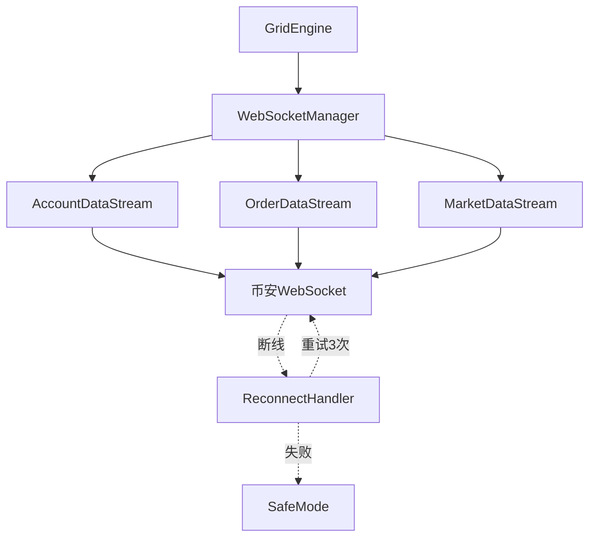

# 技术研究: 自动化网格交易系统

**日期**: 2025-12-05
**参考项目**: ritmex-bot
**参考文档**: docs/GRID_TRADING_REPLICATION_SPEC.md

---

## 1. 币安SDK选择

### Decision (决策)

**使用python-binance官方SDK**

### Rationale (理由)

1. **官方维护**: python-binance是币安官方推荐的Python SDK,更新及时,API覆盖全面
2. **WebSocket支持**: 内置完善的WebSocket管理器(BinanceSocketManager),支持账户、订单、深度、K线等多数据流订阅
3. **永续合约专用**: 提供`Client`(现货)和`UMFuturesClient`(U本位合约)两个独立客户端,API映射清晰
4. **异步支持**: 提供`AsyncClient`,与asyncio/aiohttp完美集成
5. **社区活跃**: GitHub 6.5k+ stars,问题响应快,文档完善

### Alternatives Considered (替代方案)

**方案A: CCXT统一接口**
- 优点: 支持100+交易所,统一API接口,便于未来扩展
- 缺点:
  - WebSocket支持有限,部分交易所需自行实现
  - 抽象层过厚,性能略低
  - 永续合约API覆盖度不如专用SDK
- **为何拒绝**: MVP阶段只需支持Binance,CCXT的抽象层增加了不必要的复杂性

**方案B: 直接使用websockets + requests**
- 优点: 完全控制,无第三方依赖
- 缺点: 需要自行实现认证、签名、重连等底层逻辑,开发成本高
- **为何拒绝**: 违反"借鉴现有代码"原则,重复造轮子

### Implementation Notes (实现要点)

```python
from binance.um_futures import UMFutures
from binance.websocket.um_futures.websocket_client import UMFuturesWebsocketClient

# REST API客户端
client = UMFutures(key='...', secret='...')

# WebSocket客户端 (用于实时数据订阅)
ws_client = UMFuturesWebsocketClient()
ws_client.user_data(
    listen_key=listen_key,
    callback=on_account_update,
    id=1
)
```

---

## 2. WebSocket实现方案

### Decision (决策)

**使用python-binance内置WebSocket + 自定义重连管理器**

### Rationale (理由)

1. **内置订阅管理**: `UMFuturesWebsocketClient`封装了币安WebSocket协议,支持多数据流订阅
2. **Listen Key机制**: 自动处理账户数据流的认证和续期(30分钟续期一次)
3. **自定义重连**: python-binance提供基础WebSocket,我们在上层实现业务级重连逻辑
4. **参考ritmex-bot**: 参考项目使用类似方案,验证过可行性

### Architecture (架构设计)



### Reconnection Strategy (重连策略)

```python
class ReconnectHandler:
    MAX_RETRIES = 3
    BACKOFF_DELAYS = [5, 10, 15]  # 秒

    async def reconnect_with_backoff(self, stream_type: str):
        for attempt in range(self.MAX_RETRIES):
            try:
                await asyncio.sleep(self.BACKOFF_DELAYS[attempt])
                await self._reconnect_stream(stream_type)
                logger.info(f"WebSocket重连成功: {stream_type}, 尝试次数: {attempt+1}")
                return True
            except Exception as e:
                logger.error(f"WebSocket重连失败: {stream_type}, 尝试 {attempt+1}/{self.MAX_RETRIES}: {e}")

        # 3次重连失败,进入安全模式
        await self._enter_safe_mode()
        return False
```

### Safe Mode Behavior (安全模式行为)

- 撤销所有挂单
- 停止新订单创建
- 记录异常日志
- 发送告警通知(后续实现)

---

## 3. 异步执行架构

### Decision (决策)

**Django Management Command + asyncio.run() (MVP阶段)**

后续可升级为: **Supervisor进程管理 + asyncio长运行服务**

### Rationale (理由)

1. **MVP简单性**: Management command与Django集成良好,无需额外依赖
2. **进程隔离**: 每个网格策略独立进程,崩溃不相互影响
3. **手动控制**: 通过命令行启动/停止,适合初期调试
4. **asyncio原生**: Python 3.8+原生支持asyncio,无需引入Celery等重量级框架

### Alternatives Considered (替代方案)

**方案A: Celery + Redis**
- 优点: 成熟的分布式任务队列,支持定时任务、任务调度
- 缺点:
  - 需要Redis依赖,增加运维复杂度
  - Celery与长运行WebSocket不匹配(Celery适合短任务)
  - 过度设计,MVP阶段不需要
- **为何拒绝**: 违反"简单至上"原则,Celery适合短任务调度,不适合长运行WebSocket服务

**方案B: Django Channels**
- 优点: Django官方异步方案,ASGI支持
- 缺点: 主要用于WebSocket服务器(推送给客户端),不适合WebSocket客户端
- **为何拒绝**: 用途不匹配

### Implementation Pattern (实现模式)

```python
# grid_trading/management/commands/start_grid.py
from django.core.management.base import BaseCommand
import asyncio

class Command(BaseCommand):
    help = '启动网格策略'

    def add_arguments(self, parser):
        parser.add_argument('--config', type=str, required=True)

    def handle(self, *args, **options):
        config_name = options['config']
        asyncio.run(self.run_grid(config_name))

    async def run_grid(self, config_name):
        grid_engine = GridEngine(config_name)
        await grid_engine.initialize()
        await grid_engine.run()  # 长运行循环
```

### Process Management (进程管理)

**MVP阶段**: 手动启动
```bash
python manage.py start_grid --config my_short_grid &
```

**生产环境(后续)**: Supervisor配置
```ini
[program:grid-btc-short]
command=python manage.py start_grid --config btc_short
directory=/path/to/project
autostart=true
autorestart=true
stderr_logfile=/var/log/grid/btc_short.err.log
stdout_logfile=/var/log/grid/btc_short.out.log
```

---

## 4. 订单幂等性实现

### Decision (决策)

**四元组唯一标识 + client_order_id + 状态对比机制**

### Rationale (理由)

1. **参考ritmex-bot**: 参考项目使用四元组`(intent, side, price, level)`作为订单业务标识
2. **client_order_id**: 币安API支持自定义订单ID,确保订单唯一性
3. **状态同步**: 每次轮询时对比"理想订单列表"与"实际挂单列表",实现幂等性

### Four-Tuple Identifier (四元组标识)

```python
@dataclass
class OrderIdentifier:
    intent: str    # "ENTRY" | "EXIT"
    side: str      # "BUY" | "SELL"
    price: Decimal
    level: int     # 网格层级索引

    def to_client_order_id(self, config_name: str) -> str:
        """
        生成client_order_id: {config}_{intent}_{side}_{level}_{price_hash}
        例如: btc_short_ENTRY_SELL_5_a3f2
        """
        price_hash = hashlib.md5(str(self.price).encode()).hexdigest()[:4]
        return f"{config_name}_{self.intent}_{self.side}_{self.level}_{price_hash}"
```

### Idempotent Sync Algorithm (幂等同步算法)

```python
async def sync_orders_idempotent(self):
    """
    幂等订单同步算法 - 参考ritmex-bot的reconcileOpenOrders逻辑
    """
    # 1. 获取当前实际挂单
    actual_orders = await self.exchange.fetch_open_orders(self.symbol)

    # 2. 计算理想挂单列表(基于当前网格状态)
    ideal_orders = self._calculate_ideal_orders()

    # 3. 对比并分类
    actual_ids = {order['clientOrderId'] for order in actual_orders}
    ideal_ids = {self._to_client_order_id(order) for order in ideal_orders}

    # 4. 需要撤销的订单(多余订单)
    to_cancel = actual_ids - ideal_ids

    # 5. 需要创建的订单(缺失订单)
    to_create = ideal_ids - actual_ids

    # 6. 执行操作(幂等性保证)
    for client_order_id in to_cancel:
        await self._cancel_order_safe(client_order_id)

    for order in ideal_orders:
        if self._to_client_order_id(order) in to_create:
            await self._create_order_safe(order)
```

### Collision Handling (冲突处理)

- **订单已存在**: 币安API返回错误`Order would immediately match and take`,忽略该错误
- **订单不存在**: 撤单时返回`Unknown order`,忽略该错误
- **网络超时**: 使用`queryOrder` API查询订单实际状态

---

## 5. 精度处理

### Decision (决策)

**使用Python Decimal + 交易所精度元数据**

### Rationale (理由)

1. **财务计算标准**: Decimal避免浮点数精度问题(`0.1 + 0.2 != 0.3`)
2. **交易所要求**: 币安对价格和数量有严格的精度要求(tickSize, stepSize)
3. **参考ritmex-bot**: 参考项目使用`toNotional`等精度处理函数

### Precision Metadata (精度元数据)

```python
# 从交易所获取精度信息
exchange_info = client.exchange_info()
for symbol_info in exchange_info['symbols']:
    if symbol_info['symbol'] == 'BTCUSDT':
        price_filter = next(f for f in symbol_info['filters'] if f['filterType'] == 'PRICE_FILTER')
        lot_filter = next(f for f in symbol_info['filters'] if f['filterType'] == 'LOT_SIZE')

        tick_size = Decimal(price_filter['tickSize'])  # 价格精度 0.01
        step_size = Decimal(lot_filter['stepSize'])    # 数量精度 0.001
```

### Rounding Strategy (舍入策略)

```python
from decimal import Decimal, ROUND_DOWN, ROUND_UP

def round_price(price: Decimal, tick_size: Decimal, direction: str) -> Decimal:
    """
    价格舍入
    - 买单(BUY): 向下舍入,避免超出预算
    - 卖单(SELL): 向上舍入,避免低于最低价
    """
    if direction == "BUY":
        return (price / tick_size).quantize(Decimal('1'), rounding=ROUND_DOWN) * tick_size
    else:
        return (price / tick_size).quantize(Decimal('1'), rounding=ROUND_UP) * tick_size

def round_quantity(qty: Decimal, step_size: Decimal) -> Decimal:
    """
    数量舍入 - 总是向下舍入,避免超出持仓限制
    """
    return (qty / step_size).quantize(Decimal('1'), rounding=ROUND_DOWN) * step_size
```

### Database Storage (数据库存储)

```python
# Django model字段类型
class GridConfig(models.Model):
    upper_price = models.DecimalField(max_digits=20, decimal_places=8)
    lower_price = models.DecimalField(max_digits=20, decimal_places=8)
    trade_amount = models.DecimalField(max_digits=20, decimal_places=8)
    # max_digits=20: 支持最大价格1万亿
    # decimal_places=8: 币安最高精度(部分币种如SHIB需要8位小数)
```

---

## 6. 状态持久化策略

### Decision (决策)

**MVP阶段: PostgreSQL直接写入 + 内存缓存**
**后续优化: Redis缓存 + 异步批量写入**

### Rationale (理由)

1. **MVP简单性**: 直接使用Django ORM,无需引入Redis
2. **写入频率**: 网格状态更新频率中等(每秒1次轮询),PostgreSQL足够支持
3. **数据一致性**: 直接写入数据库,避免缓存同步问题
4. **内存缓存**: 网格层级状态(GridLevel)常驻内存,减少数据库查询

### Write Strategy (写入策略)

**高频数据(每秒更新)**:
- 网格层级状态(GridLevel): 内存字典 + 定期持久化(每10秒)
- 当前持仓: 内存变量 + WebSocket更新时持久化

**中频数据(订单事件)**:
- 订单创建/成交/撤销: 立即写入数据库(单条INSERT)
- 交易日志(TradeLog): 同步写入数据库

**低频数据(统计)**:
- 统计数据(GridStatistics): 每60秒计算一次并更新

### In-Memory State (内存状态)

```python
class GridEngine:
    def __init__(self, config_name: str):
        self.config = GridConfig.objects.get(name=config_name)

        # 内存状态
        self.grid_levels: Dict[int, GridLevelState] = {}
        self.current_position = Decimal('0')
        self.last_persist_time = time.time()

    async def persist_state_if_needed(self):
        """定期持久化(每10秒)"""
        if time.time() - self.last_persist_time > 10:
            await self._persist_grid_levels()
            self.last_persist_time = time.time()
```

### Trade Log Buffering (交易日志缓冲)

```python
from collections import deque

class RingBuffer:
    """
    环形缓冲区 - 参考ritmex-bot的RingBuffer实现
    """
    def __init__(self, capacity: int = 200):
        self.buffer = deque(maxlen=capacity)

    def append(self, log_entry: dict):
        self.buffer.append(log_entry)
        # 同时异步写入数据库
        TradeLog.objects.create(**log_entry)
```

### Database Query Optimization (查询优化)

```python
# 避免N+1查询
grid_levels = GridLevel.objects.filter(config=config).select_related('config')

# 使用批量操作
GridLevel.objects.bulk_update(grid_levels, ['status', 'updated_at'])
```

---

## 7. 错误处理最佳实践

### Decision (决策)

**分层错误处理 + 优雅降级**

### Error Categories (错误分类)

1. **可恢复错误**: WebSocket断线、API限流、网络超时
   - 策略: 自动重试 + 指数退避

2. **业务错误**: 余额不足、订单精度错误、持仓限制
   - 策略: 记录日志 + 跳过该操作 + 继续运行

3. **严重错误**: 数据库连接失败、配置错误、未捕获异常
   - 策略: 进入安全模式 + 发送告警

### Implementation Pattern (实现模式)

```python
class GridEngine:
    async def safe_create_order(self, order: dict) -> bool:
        """
        安全订单创建 - 带完整错误处理
        """
        try:
            response = await self.exchange.create_order(**order)
            logger.info(f"订单创建成功: {response['orderId']}")
            return True

        except BinanceAPIException as e:
            if e.code == -4131:  # 持仓方向错误
                logger.warning(f"持仓方向冲突,跳过订单: {e.message}")
                return False
            elif e.code == -1111:  # 精度错误
                logger.error(f"订单精度错误: {e.message}, 订单: {order}")
                return False
            elif e.code == -2010:  # 余额不足
                logger.error(f"余额不足,停止创建新开仓单: {e.message}")
                self.insufficient_balance = True
                return False
            else:
                logger.error(f"未知API错误: {e.code} - {e.message}")
                raise

        except Exception as e:
            logger.error(f"订单创建异常: {e}", exc_info=True)
            raise
```

---

## 总结: 关键技术选型

| 技术决策 | 选择方案 | 关键理由 |
|---------|---------|---------|
| 币安SDK | python-binance | 官方维护,WebSocket支持完善,永续合约专用API |
| WebSocket | python-binance内置 + 自定义重连 | 封装良好,自行实现业务级重连逻辑 |
| 异步执行 | Django Command + asyncio.run() | MVP简单性,无需引入Celery等重框架 |
| 订单幂等 | 四元组标识 + client_order_id | 参考ritmex-bot验证方案,状态对比机制 |
| 精度处理 | Python Decimal + 交易所元数据 | 避免浮点误差,符合财务计算标准 |
| 状态持久化 | PostgreSQL直接写入 + 内存缓存 | MVP简单性,写入频率中等,后续可优化 |
| 错误处理 | 分层处理 + 优雅降级 | 可恢复/业务/严重错误分类,安全模式保护 |

## 下一步行动

1. ✅ **research.md已完成**
2. 📝 **Phase 1**: 生成data-model.md(数据模型设计)
3. 📝 **Phase 1**: 生成contracts/(API契约定义)
4. 📝 **Phase 1**: 生成quickstart.md(快速开始指南)
5. 📝 **Phase 2**: 使用`/speckit.tasks`生成tasks.md(任务分解)

---

**参考资料**:
- ritmex-bot: `/Users/chenchiyuan/projects/crypto_exchange_news_crawler/references/ritmex-bot`
- 技术分析文档: `docs/GRID_TRADING_REPLICATION_SPEC.md`
- python-binance文档: https://github.com/sammchardy/python-binance
- 币安Futures API: https://binance-docs.github.io/apidocs/futures/en/
